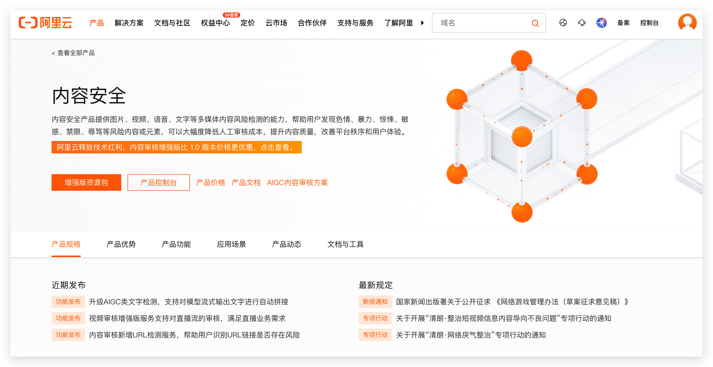
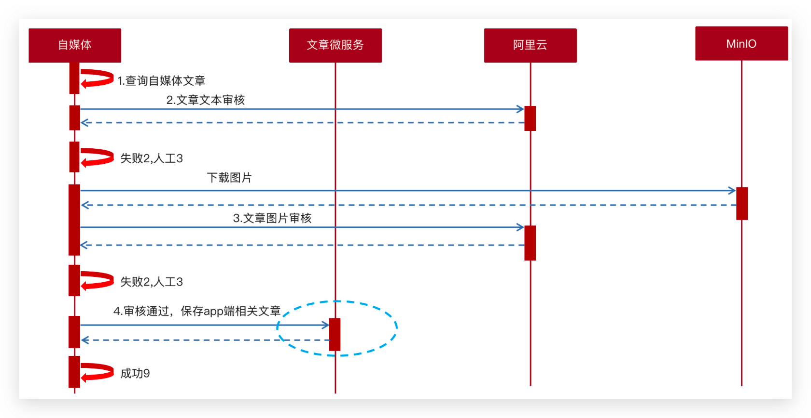

Day04-文章审核
====================

[[toc]]

## 审核流程

**数据流向**


<br/>

**审核方式**

- 自动审核：文章发布之后，系统自动审核。
  - 方案一：主要是通过第三方接口对文章文本和图片进行审核（成功、失败、人工审核）
  - 方案二：通过DFA算法实现自管理敏感词，通过Tess4j实现图片文字识别对图片进行审核
- 人工审核：文章，系统不确定是否违规
  - 待自动审核返回不确定信息时，转到人工审核，由平台管理员进行审核。

<br/>

**审核流程**

1. 自媒体端发布文章后，开始审核文章
2. 审核的主要是审核文章的内容（文本内容和图片）
3. 借助第三方提供的接口审核文本
4. 借助第三方提供的接口审核图片，由于图片存储到minIO中，需要先下载才能审核
5. 如果审核失败，则需要修改自媒体文章的状态。status: 2  审核失败    status:3  转到人工审核
6. 如果审核成功，则需要在文章微服务中创建app端需要的文章


## 内容安全

内容安全是识别服务，支持对图片、视频、文本、语音等对象进行多样化场景检测，有效降低内容违规风险。

目前很多平台都支持内容检测，如阿里云、腾讯云、百度AI、网易云等国内大型互联网公司都对外提供了API。

按照性能和收费来看，黑马头条项目使用的就是阿里云的内容安全接口，使用到了图片和文本的审核。

阿里云收费标准：[价格计算器 (aliyun.com)](https://www.aliyun.com/price/product/?spm=a2c4g.11186623.2.10.4146401eg5oeu8#/commodity/vm)

<br/>

### 准备工作

您在使用内容检测API之前，需要先注册阿里云账号，添加Access Key并签约云盾内容安全。

**操作步骤**

1. 前往[阿里云官网](https://www.aliyun.com/)注册账号。如果已有注册账号，请跳过此步骤。

   进入阿里云首页后，如果没有阿里云的账户需要先进行注册，才可以进行登录。由于注册较为简单，课程和讲义不在进行体现（注册可以使用多种方式，如淘宝账号、支付宝账号、微博账号等...）。需要实名认证和活体认证。

2. 打开[云盾内容安全产品试用页面](https://promotion.aliyun.com/ntms/act/lvwangdemo.html)，单击**立即开通**，正式开通服务。

   

   内容安全控制台

   

3. 在[AccessKey管理页面](https://ram.console.aliyun.com/manage/ak)管理您的AccessKeyID和AccessKeySecret。

   

   管理自己的AccessKey,可以新建和删除AccessKey

   

   查看自己的AccessKey

   AccessKey默认是隐藏的，只有第一次申请的时候可以保存AccessKey，妥善保管。

   

<br/>

### 文本检测

文本垃圾内容检测：[如何调用文本检测接口进行文本内容审核_内容安全(Content Moderation)-阿里云帮助中心 (aliyun.com)](https://help.aliyun.com/document_detail/70439.html?spm=a2c4g.11186623.6.659.35ac3db3l0wV5k)


文本垃圾内容Java SDK: [如何使用JavaSDK文本反垃圾接口_内容安全(Content Moderation)-阿里云帮助中心 (aliyun.com)](https://help.aliyun.com/document_detail/53427.html?spm=a2c4g.11186623.6.717.466d7544QbU8Lr)


<br/>

### 图片检测

图片垃圾内容检测：[调用图片同步检测接口/green/image/scan审核图片内容_内容安全(Content Moderation)-阿里云帮助中心 (aliyun.com)](https://help.aliyun.com/document_detail/70292.html?spm=a2c4g.11186623.6.616.5d7d1e7f9vDRz4)


图片垃圾内容Java SDK: [如何使用JavaSDK接口检测图片是否包含风险内容_内容安全(Content Moderation)-阿里云帮助中心 (aliyun.com)](https://help.aliyun.com/document_detail/53424.html?spm=a2c4g.11186623.6.715.c8f69b12ey35j4)


<br/>

### 项目集成

::: tip 💡 项目集成阿里云内容安全接口流程

- 导入对应的依赖信息，参考接口 SDK 说明
- 添加以及对应的工具类到 common 模块中并添加自动配置
- 在 bootstrap.yml 中添加阿里云的 AK
- 在自媒体微服务中测试类中注入审核文本和图片进行测试

:::

<br/>

拷贝资料文件夹中的类到 common 模块下面，并添加到自动配置


包括了GreenImageScan和GreenTextScan及对应的工具类

```properties
org.springframework.boot.autoconfigure.EnableAutoConfiguration=\
  com.heima.common.exception.ExceptionCatch,\
  com.heima.common.knife4j.Swagger2Configuration, \
  com.heima.common.swagger.SwaggerConfiguration, \
  com.heima.common.aliyun.GreenImageScan, \
  com.heima.common.aliyun.GreenTextScan
```

<br/>

阿里云申请 AccessKeyId 和 Secret（需自己申请）

在 nacos 配置中心添加以下配置：shared-aliyun.yaml

```yaml
aliyun:
  accessKeyId: LTAI5tCWHCcfvqQzu8k2oKmX
  secret: auoKUFsghimbfVQHpy7gtRyBkoR4vc
  #aliyun.scenes=porn,terrorism,ad,qrcode,live,logo
  scenes: terrorism
```

在 wemedia 服务的 bootstrap.yml 中添加 shared 配置

```yaml {15}
server:
  port: 51803
spring:
  profiles:
    active: dev
  application:
    name: leadnews-wemedia
  cloud:
    nacos:
      config:
        file-extension: yaml
        shared-configs:
          - data-id: shared-mybatis.yaml
          - data-id: shared-minio.yaml
          - data-id: shared-aliyun.yaml 
```

<br/>

在自媒体微服务中测试类中注入审核文本和图片的bean进行测试

```java
package com.heima.wemedia;

import com.heima.common.aliyun.GreenImageScan;
import com.heima.common.aliyun.GreenTextScan;
import com.heima.file.service.FileStorageService;
import org.junit.Test;
import org.junit.runner.RunWith;
import org.springframework.beans.factory.annotation.Autowired;
import org.springframework.boot.test.context.SpringBootTest;
import org.springframework.test.context.junit4.SpringRunner;

import java.util.Arrays;
import java.util.Map;

@SpringBootTest(classes = WeMediaApplication.class)
@RunWith(SpringRunner.class)
public class AliyunTest {

    @Autowired
    private GreenTextScan greenTextScan;

    @Autowired
    private GreenImageScan greenImageScan;

    @Autowired
    private FileStorageService fileStorageService;

    @Test
    public void testScanText() throws Exception {
        Map map = greenTextScan.greeTextScan("我是一个好人,冰毒");
        System.out.println(map);
    }

    @Test
    public void testScanImage() throws Exception {
        byte[] bytes = fileStorageService.downLoadFile("http://192.168.200.130:9000/leadnews/2021/04/26/ef3cbe458db249f7bd6fb4339e593e55.jpg");
        Map map = greenImageScan.imageScan(Arrays.asList(bytes));
        System.out.println(map);
    }
}
```


## 保存文章

保存文章是将自媒体的文章保存到到App端。

数据流向是将 wm_news 保存为 ap_article



<br/>

### 数据结构

文章基本信息表：**ap_article**  


文章配置表：**ap_article_config**  


文章内容表：**ap_article_content** 


三张表关系分析


<br/>

### 分布式ID

随着业务的增长，文章表可能要占用很大的物理存储空间，为了解决该问题，后期使用数据库分片技术。将一个数据库进行拆分，通过数据库中间件连接。如果数据库中该表选用ID自增策略，则可能产生重复的ID，此时应该使用分布式ID生成策略来生成ID。


<br/>

**技术选型**


<br/>

**雪花算法**

snowflake是Twitter开源的分布式ID生成算法，结果是一个long型的ID。其核心思想是：使用41bit作为毫秒数，10bit作为机器的ID（5个bit是数据中心，5个bit的机器ID），12bit作为毫秒内的流水号（意味着每个节点在每毫秒可以产生 4096 个 ID），最后还有一个符号位，永远是0


文章端相关的表都使用雪花算法生成ID，包括 ap_article、 ap_article_config、 ap_article_content

<br/>


Mybatis-Plus已经集成了雪花算法，完成以下两步即可在项目中集成雪花算法

第一：在实体类中的id上加入如下配置，指定类型为 ASSIGN_ID

```java
@TableId(value = "id",type = IdType.ASSIGN_ID)
private Long id;
```

第二：在 application.yml 文件中配置ID策略

```yaml
mybatis-plus:
  mapper-locations: classpath*:mapper/*.xml
  # 设置别名包扫描路径，通过该属性可以给包中的类注册别名
  type-aliases-package: com.heima.model.article.pojos
  global-config:
    id-type: assign_id # 默认的id策略是雪花算法id
```

<br/>

### 思路分析

:::tip 💡 在文章审核成功以后需要在用户端的 article 库中新增文章数据

- 保存文章信息 ap_article
- 保存文章配置信息 ap_article_config

- 保存文章内容 ap_article_content

:::

**流程图**


<br/>

### 接口说明

|          | **说明**             |
| -------- | -------------------- |
| 接口路径 | /api/v1/article/save |
| 请求方式 | POST                 |
| 参数     | ArticleDto           |
| 响应结果 | ResponseResult       |

ArticleDto

```java
package com.heima.model.article.dtos;

import com.heima.model.article.pojos.ApArticle;
import lombok.Data;

@Data
public class ArticleDto  extends ApArticle {
    /**
     * 文章内容
     */
    private String content;
}
```

成功：

```json
{
  "code": 200,
  "errorMessage" : "操作成功",
  "data":"1302864436297442242"
}
```

失败：

```json
{
  "code":501,
  "errorMessage":"参数失效",
}
```

```json
{
  "code":501,
  "errorMessage":"文章没有找到",
}
```

<br/>

### 功能实现

:::tip 🔖 实现步骤

- 在 heima-leadnews-feign-api 中定义接口
  - 导入 feign 远程调用依赖接口
  - 定义文章端的远程接口
- 在 heima-leadnews-article 实现 feign 接口
- 在 ApArticleService 中新增保存方法进行实现 
- Postman进行测试

:::

<br/>

①：在heima-leadnews-feign-api中新增接口

第一：导入feign的依赖

```xml
<dependency>
    <groupId>org.springframework.cloud</groupId>
    <artifactId>spring-cloud-starter-openfeign</artifactId>
</dependency>
```

第二：定义文章端的接口

```java
package com.heima.apis.article;

import com.heima.model.article.dtos.ArticleDto;
import com.heima.model.common.dtos.ResponseResult;
import org.springframework.cloud.openfeign.FeignClient;
import org.springframework.web.bind.annotation.PostMapping;
import org.springframework.web.bind.annotation.RequestBody;

import java.io.IOException;


@FeignClient(value = "leadnews-article")
public interface IArticleClient {

    @PostMapping("/api/v1/article/save")
    ResponseResult saveArticle(@RequestBody ArticleDto dto);
}
```

<br/>

②：在heima-leadnews-article中实现该方法

```java
package com.heima.article.client;

import com.heima.apis.article.IArticleClient;
import com.heima.article.service.IApArticleService;
import com.heima.model.article.dtos.ArticleDto;
import com.heima.model.common.dtos.ResponseResult;
import org.springframework.beans.factory.annotation.Autowired;
import org.springframework.web.bind.annotation.PostMapping;
import org.springframework.web.bind.annotation.RequestBody;
import org.springframework.web.bind.annotation.RestController;

@RestController
public class ArticleClient implements IArticleClient {

    @Autowired
    private IApArticleService apArticleService;

    @Override
    @PostMapping("/api/v1/article/save")
    public ResponseResult saveArticle(@RequestBody ArticleDto dto) {
        return apArticleService.saveArticle(dto);
    }

}
```

同时，修改ApArticleConfig类，添加如下构造函数

```java {26-32,34}
package com.heima.model.article.pojos;

import com.baomidou.mybatisplus.annotation.IdType;
import com.baomidou.mybatisplus.annotation.TableField;
import com.baomidou.mybatisplus.annotation.TableId;
import com.baomidou.mybatisplus.annotation.TableName;
import lombok.Data;
import lombok.NoArgsConstructor;

import java.io.Serializable;

/**
 * <p>
 * APP已发布文章配置表
 * </p>
 *
 * @author itheima
 */

@Data
@NoArgsConstructor
@TableName("ap_article_config")
public class ApArticleConfig implements Serializable {


    public ApArticleConfig(Long articleId){
        this.articleId = articleId;
        this.isComment = true;
        this.isForward = true;
        this.isDelete = false;
        this.isDown = false;
    }

    @TableId(value = "id",type = IdType.ID_WORKER)
    private Long id;

    /**
     * 文章id
     */
    @TableField("article_id")
    private Long articleId;

    /**
     * 是否可评论
     * true: 可以评论   1
     * false: 不可评论  0
     */
    @TableField("is_comment")
    private Boolean isComment;

    /**
     * 是否转发
     * true: 可以转发   1
     * false: 不可转发  0
     */
    @TableField("is_forward")
    private Boolean isForward;

    /**
     * 是否下架
     * true: 下架   1
     * false: 没有下架  0
     */
    @TableField("is_down")
    private Boolean isDown;

    /**
     * 是否已删除
     * true: 删除   1
     * false: 没有删除  0
     */
    @TableField("is_delete")
    private Boolean isDelete;
}
```

<br/>

④：在ApArticleService中新增方法

```java
/**
* 保存app端相关文章
* @param dto
* @return
*/
ResponseResult saveArticle(ArticleDto dto) ;
```

实现类：

```java
@Autowired
private ApArticleConfigMapper apArticleConfigMapper;

@Autowired
private ApArticleContentMapper apArticleContentMapper;

/**
 * 保存app端相关文章
 *
 * @param dto
 * @return
 */
@Override
public ResponseResult saveArticle(ArticleDto dto) {
    //1.检查参数
    if (dto == null) {
        return ResponseResult.errorResult(AppHttpCodeEnum.PARAM_INVALID);
    }

    ApArticle apArticle = new ApArticle();
    BeanUtils.copyProperties(dto, apArticle);

    //2.判断是否存在id
    if (dto.getId() == null) {
        //2.1 不存在id  保存  文章  文章配置  文章内容

        //保存文章
        save(apArticle);

        //保存配置
        ApArticleConfig apArticleConfig = new ApArticleConfig(apArticle.getId());
        apArticleConfigMapper.insert(apArticleConfig);

        //保存 文章内容
        ApArticleContent apArticleContent = new ApArticleContent();
        apArticleContent.setArticleId(apArticle.getId());
        apArticleContent.setContent(dto.getContent());
        apArticleContentMapper.insert(apArticleContent);

    } else {
        //2.2 存在id   修改  文章  文章内容

        //修改  文章
        updateById(apArticle);

        //修改文章内容
        ApArticleContent apArticleContent = apArticleContentMapper.selectOne(Wrappers.<ApArticleContent>lambdaQuery().eq(ApArticleContent::getArticleId, dto.getId()));
        apArticleContent.setContent(dto.getContent());
        apArticleContentMapper.updateById(apArticleContent);
    }


    //3.结果返回  文章的id
    return ResponseResult.okResult(apArticle.getId());
}
```

<br/>

### 功能测试

编写junit单元测试，或使用postman进行测试

```json
{
  "id":1390209114747047938,
  "title":"黑马头条项目背景22222222222222",
  "authoId":1102,
  "layout":1,
  "labels":"黑马头条",
  "publishTime":"2028-03-14T11:35:49.000Z",
  "images": "http://192.168.200.130:9000/leadnews/2021/04/26/5ddbdb5c68094ce393b08a47860da275.jpg",
  "content":"22222222222222222黑马头条项目背景,黑马头条项目背景,黑马头条项目背景,黑马头条项目背景，黑马头条项目背景"
}
```

<br/>

### Feign接口

远程接口调用方式


<br/>

:::tip 步骤：Feign远程接口调用方式

- wemedia 微服务依赖 feign-api
- wemedia 微服务的引导类中开启 feign 调用，并扫描包
- wemedia 中的 bean 中注入 IArticleClient 即可发起远程调用

:::

<br/>

在 `heima-leadnews-wemedia` 服务中已经依赖了 `heima-leadnews-feign-apis` 工程，只需要在自媒体的引导类中开启 Feign 的远程调用即可

注解为：`@EnableFeignClients(basePackages = "com.heima.apis")` 需要指向apis这个包

```java {5}
@Slf4j
@SpringBootApplication
@EnableDiscoveryClient
@MapperScan("com.heima.wemedia.mapper")
@EnableFeignClients(basePackages = "com.heima.apis")
public class WeMediaApplication {
    public static void main(String[] args) {
        SpringApplication.run(WeMediaApplication.class, args);
    }

    @Bean
    public MybatisPlusInterceptor mybatisPlusInterceptor() {
        MybatisPlusInterceptor interceptor = new MybatisPlusInterceptor();
        interceptor.addInnerInterceptor(new PaginationInnerInterceptor(DbType.MYSQL));
        return interceptor;
    }
}

```

<br/>

### 服务降级处理


- 服务降级是服务自我保护的一种方式，或者保护下游服务的一种方式，用于确保服务不会受请求突增影响变得不可用，确保服务不会崩溃

- 服务降级虽然会导致请求失败，但是不会导致阻塞。

<br/>

实现步骤

① 在 `heima-leadnews-feign-api` 编写降级逻辑

```java
package com.heima.apis.article.fallback;

import com.heima.apis.article.IArticleClient;
import com.heima.model.article.dtos.ArticleDto;
import com.heima.model.common.dtos.ResponseResult;
import com.heima.model.common.enums.AppHttpCodeEnum;
import org.springframework.stereotype.Component;

/**
 * feign失败配置
 * @author itheima
 */
@Component
public class IArticleClientFallback implements IArticleClient {
    @Override
    public ResponseResult saveArticle(ArticleDto dto)  {
        return ResponseResult.errorResult(AppHttpCodeEnum.SERVER_ERROR,"获取数据失败");
    }
}
```

在自媒体微服务  `heima-leadnews-wemedia `中添加类，扫描降级代码类的包

```java
package com.heima.wemedia.config;

import org.springframework.context.annotation.ComponentScan;
import org.springframework.context.annotation.Configuration;

@Configuration
@ComponentScan("com.heima.apis.article.fallback")
public class InitConfig {
}
```

<br/>

② 在 `heima-leadnews-fegin-api`  的远程接口中指向降级代码

```java {10}
package com.heima.apis.article;

import com.heima.apis.article.fallback.IArticleClientFallback;
import com.heima.model.article.dtos.ArticleDto;
import com.heima.model.common.dtos.ResponseResult;
import org.springframework.cloud.openfeign.FeignClient;
import org.springframework.web.bind.annotation.PostMapping;
import org.springframework.web.bind.annotation.RequestBody;

@FeignClient(value = "leadnews-article",fallback = IArticleClientFallback.class)
public interface IArticleClient {

    @PostMapping("/api/v1/article/save")
    public ResponseResult saveArticle(@RequestBody ArticleDto dto);
}
```

<br/>

③ 客户端开启降级 `heima-leadnews-wemedia`

在wemedia的nacos配置中心里添加如下内容，开启服务降级，也可以指定服务响应的超时的时间

```yaml
feign:
  # 开启feign对hystrix熔断降级的支持
  hystrix:
    enabled: true
  # 修改调用超时时间
  client:
    config:
      default:
        connectTimeout: 2000
        readTimeout: 2000
```

<br/>

④测试：在 ApArticleServiceImpl 类中 saveArticle 方法添加代码

```java
try {
    Thread.sleep(3000);
} catch (InterruptedException e) {
    e.printStackTrace();
}
```

在自媒体端进行审核测试，会出现服务降级的现象


## 自动审核

自动审核是自媒体文章在点击保存后对内容安全进行检测

### 数据结构

wm_news 自媒体文章表


Status：0 草稿  1 待审核  2 审核失败  3 人工审核  4 人工审核通过  8 审核通过（待发布） 9 已发布

<br/>

### 功能实现


在 heima-leadnews-wemedia 中的 service 新增接口

```java
package com.heima.wemedia.service;

public interface WmNewsAutoScanService {

    /**
     * 自媒体文章审核
     * @param id  自媒体文章id
     */
    public void autoScanWmNews(Integer id);
}
```

实现类：

```java
package com.heima.wemedia.service.impl;

import com.alibaba.fastjson.JSONArray;
import com.heima.apis.article.IArticleClient;
import com.heima.common.aliyun.GreenImageScan;
import com.heima.common.aliyun.GreenTextScan;
import com.heima.file.service.FileStorageService;
import com.heima.model.article.dtos.ArticleDto;
import com.heima.model.common.dtos.ResponseResult;
import com.heima.model.wemedia.pojos.WmChannel;
import com.heima.model.wemedia.pojos.WmNews;
import com.heima.model.wemedia.pojos.WmUser;
import com.heima.wemedia.mapper.WmChannelMapper;
import com.heima.wemedia.mapper.WmNewsMapper;
import com.heima.wemedia.mapper.WmUserMapper;
import com.heima.wemedia.service.WmNewsAutoScanService;
import io.swagger.models.auth.In;
import lombok.extern.slf4j.Slf4j;
import org.apache.commons.lang3.StringUtils;
import org.springframework.beans.BeanUtils;
import org.springframework.beans.factory.annotation.Autowired;
import org.springframework.stereotype.Service;
import org.springframework.transaction.annotation.Transactional;

import java.time.LocalDateTime;
import java.util.*;
import java.util.stream.Collectors;


@Service
@Slf4j
@Transactional
public class WmNewsAutoScanServiceImpl implements WmNewsAutoScanService {

    @Autowired
    private WmNewsMapper wmNewsMapper;

    /**
     * 自媒体文章审核
     *
     * @param id 自媒体文章id
     */
    @Override
    public void autoScanWmNews(Integer id) {
        //1.查询自媒体文章
        WmNews wmNews = wmNewsMapper.selectById(id);
        if (wmNews == null) {
            throw new RuntimeException("WmNewsAutoScanServiceImpl-文章不存在");
        }

        if (wmNews.getStatus().equals(WmNews.Status.SUBMIT.getCode())) {
            //从内容中提取纯文本内容和图片
            Map<String, Object> textAndImages = handleTextAndImages(wmNews);

            //2.审核文本内容  阿里云接口
            boolean isTextScan = handleTextScan((String) textAndImages.get("content"), wmNews);
            if (!isTextScan) return;

            //3.审核图片  阿里云接口
            boolean isImageScan = handleImageScan((List<String>) textAndImages.get("images"), wmNews);
            if (!isImageScan) return;

            //4.审核成功，保存app端的相关的文章数据
            ResponseResult responseResult = saveAppArticle(wmNews);
            if (!responseResult.getCode().equals(200)) {
                throw new RuntimeException("WmNewsAutoScanServiceImpl-文章审核，保存app端相关文章数据失败");
            }
            //回填article_id
            wmNews.setArticleId((Long) responseResult.getData());
            updateWmNews(wmNews, 9, "审核成功");

        }
    }

    @Autowired
    private IArticleClient articleClient;

    @Autowired
    private WmChannelMapper wmChannelMapper;

    @Autowired
    private WmUserMapper wmUserMapper;

    /**
     * 保存app端相关的文章数据
     *
     * @param wmNews
     */
    private ResponseResult saveAppArticle(WmNews wmNews) {

        ArticleDto dto = new ArticleDto();
        //属性的拷贝
        BeanUtils.copyProperties(wmNews, dto);
        //文章的布局
        dto.setLayout(wmNews.getType());
        //频道
        WmChannel wmChannel = wmChannelMapper.selectById(wmNews.getChannelId());
        if (wmChannel != null) {
            dto.setChannelName(wmChannel.getName());
        }

        //作者
        dto.setAuthorId(wmNews.getUserId());
        WmUser wmUser = wmUserMapper.selectById(wmNews.getUserId());
        if (wmUser != null) {
            dto.setAuthorName(wmUser.getName());
        }

        //设置文章id
        if (wmNews.getArticleId() != null) {
            dto.setId(wmNews.getArticleId());
        }
        dto.setCreatedTime(LocalDateTime.now());

        ResponseResult responseResult = articleClient.saveArticle(dto);
        return responseResult;

    }


    @Autowired
    private FileStorageService fileStorageService;

    @Autowired
    private GreenImageScan greenImageScan;

    /**
     * 审核图片
     *
     * @param images
     * @param wmNews
     * @return
     */
    private boolean handleImageScan(List<String> images, WmNews wmNews) {

        boolean flag = true;

        if (images == null || images.size() == 0) {
            return flag;
        }

        //下载图片 minIO
        //图片去重
        images = images.stream().distinct().collect(Collectors.toList());

        List<byte[]> imageList = new ArrayList<>();

        for (String image : images) {
            byte[] bytes = fileStorageService.downLoadFile(image);
            imageList.add(bytes);
        }


        //审核图片
        try {
            Map map = greenImageScan.imageScan(imageList);
            if (map != null) {
                //审核失败
                if (map.get("suggestion").equals("block")) {
                    flag = false;
                    updateWmNews(wmNews, 2, "当前文章中存在违规内容");
                }

                //不确定信息  需要人工审核
                if (map.get("suggestion").equals("review")) {
                    flag = false;
                    updateWmNews(wmNews, 3, "当前文章中存在不确定内容");
                }
            }

        } catch (Exception e) {
            flag = false;
            e.printStackTrace();
        }
        return flag;
    }

    @Autowired
    private GreenTextScan greenTextScan;

    /**
     * 审核纯文本内容
     *
     * @param content
     * @param wmNews
     * @return
     */
    private boolean handleTextScan(String content, WmNews wmNews) {

        boolean flag = true;

        if ((wmNews.getTitle() + "-" + content).length() == 0) {
            return flag;
        }

        try {
            Map map = greenTextScan.greeTextScan((wmNews.getTitle() + "-" + content));
            if (map != null) {
                //审核失败
                if (map.get("suggestion").equals("block")) {
                    flag = false;
                    updateWmNews(wmNews, 2, "当前文章中存在违规内容");
                }

                //不确定信息  需要人工审核
                if (map.get("suggestion").equals("review")) {
                    flag = false;
                    updateWmNews(wmNews, 3, "当前文章中存在不确定内容");
                }
            }
        } catch (Exception e) {
            flag = false;
            e.printStackTrace();
        }

        return flag;

    }

    /**
     * 修改文章内容
     *
     * @param wmNews
     * @param status
     * @param reason
     */
    private void updateWmNews(WmNews wmNews, Integer status, String reason) {
        wmNews.setStatus(status);
        wmNews.setReason(reason);
        wmNewsMapper.updateById(wmNews);
    }

    /**
     * 1.从自媒体文章的内容中提取文本和图片
     * 2.提取文章的封面图片
     *
     * @param wmNews
     * @return
     */
    private Map<String, Object> handleTextAndImages(WmNews wmNews) {

        //存储纯文本内容
        StringBuilder stringBuilder = new StringBuilder();

        List<String> images = new ArrayList<>();

        //1.从自媒体文章的内容中提取文本和图片
        if (StringUtils.isNotBlank(wmNews.getContent())) {
            List<Map> maps = JSONArray.parseArray(wmNews.getContent(), Map.class);
            for (Map map : maps) {
                if (map.get("type").equals("text")) {
                    stringBuilder.append(map.get("value"));
                }

                if (map.get("type").equals("image")) {
                    images.add((String) map.get("value"));
                }
            }
        }
        //2.提取文章的封面图片
        if (StringUtils.isNotBlank(wmNews.getImages())) {
            String[] split = wmNews.getImages().split(",");
            images.addAll(Arrays.asList(split));
        }

        Map<String, Object> resultMap = new HashMap<>();
        resultMap.put("content", stringBuilder.toString());
        resultMap.put("images", images);
        return resultMap;

    }
}
```

<br/>

### 单元测试

```java
package com.heima.wemedia.service;

import com.heima.wemedia.WeMediaApplication;
import org.junit.Test;
import org.junit.runner.RunWith;
import org.springframework.beans.factory.annotation.Autowired;
import org.springframework.boot.test.context.SpringBootTest;
import org.springframework.test.context.junit4.SpringRunner;


@SpringBootTest(classes = WeMediaApplication.class)
@RunWith(SpringRunner.class)
public class WmNewsAutoScanServiceTest {

    @Autowired
    private WmNewsAutoScanService wmNewsAutoScanService;

    @Test
    public void autoScanWmNews() {
        wmNewsAutoScanService.autoScanWmNews(6238);
    }
}
```

<br/>

### 审核集成

> 思考：同步调用与异步调用的区别

同步：就是在发出一个调用时，在没有得到结果之前， 该调用就不返回（实时处理）

异步：调用在发出之后，这个调用就直接返回了，没有返回结果（分时处理）


<br/>

:::tip 💡集成异步线程调用实现步骤

- 在自动审核的方法上加 `@Async` 注解，标明要异步调用
- 在文章发布成功后调用审核地方方法
- 在自媒体引导类中使用 `@EnableAsync` 注解开启异步调用

:::

<br/>

在自动审核的方法上加上@Async注解（标明要异步调用）

```java {2}
@Override
@Async  //标明当前方法是一个异步方法
public void autoScanWmNews(Integer id) {
	//代码略
}
```

<br/>

在文章发布成功后调用审核的方法

```java {16}
@Service
@Slf4j
@Transactional
public class WmNewsServiceImpl extends ServiceImpl<WmNewsMapper, WmNews> implements IWmNewsService {


    @Autowired
    private WmNewsAutoScanService wmNewsAutoScanService;
  
    @Override
    public ResponseResult submitNews(WmNewsDto dto) {

       //部分代码省略

        //4.不是草稿，保存文章封面图片与素材的关系，如果当前布局是自动，需要匹配封面图片
        saveRelativeInfoForCover(dto, wmNews, materials);

        //5.审核文章
        wmNewsAutoScanService.autoScanWmNews(wmNews.getId());

        return ResponseResult.okResult(AppHttpCodeEnum.SUCCESS);
    }
}
```

<br/>

在自媒体引导类中使用@EnableAsync注解开启异步调用

```java {5}
@SpringBootApplication
@EnableDiscoveryClient
@MapperScan("com.heima.wemedia.mapper")
@EnableFeignClients(basePackages = "com.heima.apis")
@EnableAsync  //开启异步调用
public class WemediaApplication {

    public static void main(String[] args) {
        SpringApplication.run(WemediaApplication.class,args);
    }

    @Bean
    public MybatisPlusInterceptor mybatisPlusInterceptor() {
        MybatisPlusInterceptor interceptor = new MybatisPlusInterceptor();
        interceptor.addInnerInterceptor(new PaginationInnerInterceptor(DbType.MYSQL));
        return interceptor;
    }
}
```

<br/>

### 综合测试

#### 服务启动列表

- nacos服务端
- article微服务
- wemedia微服务
- 启动wemedia网关微服务
- 启动前端系统wemedia

<br/>

#### 测试情况列表

- 自媒体前端发布一篇正常的文章
  - 审核成功后，app端的article相关数据是否可以正常保存，自媒体文章状态和app端文章id是否回显

- 自媒体前端发布一篇包含敏感词的文章
  - 正常是审核失败， wm_news表中的状态是否改变，成功和失败原因正常保存

- 自媒体前端发布一篇包含敏感图片的文章
  - 正常是审核失败， wm_news表中的状态是否改变，成功和失败原因正常保存


## 自管理敏感词

### 需求分析

文章审核功能已经交付了，文章也能正常发布审核。突然，产品经理过来说要开会。

<br/>

会议的内容核心有以下内容：

- 文章审核不能过滤一些敏感词：

  私人侦探、针孔摄象、信用卡提现、广告代理、代开发票、刻章办、出售答案、小额贷款…

<br/>

需要完成的功能：

- 需要自己维护一套敏感词，在文章审核的时候，需要验证文章是否包含这些敏感词

<br/>

**敏感词过滤技术选型**


<br/>

### DFA实现原理

DFA全称为：Deterministic Finite Automaton，即确定有穷自动机。

存储：一次性的把所有的敏感词存储到了多个map中，就是下图表示这种结构

敏感词：冰毒、大麻、大坏蛋


<br/>

**检索的过程**


<br/>

### 功能集成

自管理敏感词集成到文章审核中

创建敏感词表，导入资料中wm_sensitive到leadnews_wemedia库中


<br/>

在文章审核的代码中添加自管理敏感词审核

第一：在 WmNewsAutoScanServiceImpl 中的 autoScanWmNews 方法上添加如下代码

```java {27-29,51-79}
@Service
@Slf4j
@Transactional
public class WmNewsAutoScanServiceImpl implements WmNewsAutoScanService {

    @Autowired
    private WmNewsMapper wmNewsMapper;

    /**
     * 自媒体文章审核
     *
     * @param id 自媒体文章id
     */
    @Override
    @Async
    public void autoScanWmNews(Integer id) {
        //1.查询自媒体文章
        WmNews wmNews = wmNewsMapper.selectById(id);
        if (wmNews == null) {
            throw new RuntimeException("WmNewsAutoScanServiceImpl-文章不存在");
        }

        if (wmNews.getStatus().equals(WmNews.Status.SUBMIT.getCode())) {
            //从内容中提取纯文本内容和图片
            Map<String, Object> textAndImages = handleTextAndImages(wmNews);

            // 自管理的敏感词过滤
            boolean isSensitive = handleSensitiveScan((String) textAndImages.get("content"), wmNews);
            if(!isSensitive) return;
            
            //2.审核文本内容  阿里云接口
            boolean isTextScan = handleTextScan((String) textAndImages.get("content"), wmNews);
            if (!isTextScan) return;

            //3.审核图片  阿里云接口
            boolean isImageScan = handleImageScan((List<String>) textAndImages.get("images"), wmNews);
            if (!isImageScan) return;

            //4.审核成功，保存app端的相关的文章数据
            ResponseResult responseResult = saveAppArticle(wmNews);
            if (!responseResult.getCode().equals(200)) {
                throw new RuntimeException("WmNewsAutoScanServiceImpl-文章审核，保存app端相关文章数据失败");
            }
            //回填article_id
            wmNews.setArticleId((Long) responseResult.getData());
            updateWmNews(wmNews, 9, "审核成功");

        }
    }

    @Autowired
    private WmSensitiveMapper wmSensitiveMapper;

    /**
     * 自管理的敏感词审核
     * @param content
     * @param wmNews
     * @return
     */
    private boolean handleSensitiveScan(String content, WmNews wmNews) {

        boolean flag = true;

        //获取所有的敏感词
        List<WmSensitive> wmSensitives = wmSensitiveMapper.selectList(Wrappers.<WmSensitive>lambdaQuery().select(WmSensitive::getSensitives));
        List<String> sensitiveList = wmSensitives.stream().map(WmSensitive::getSensitives).collect(Collectors.toList());

        //初始化敏感词库
        SensitiveWordUtil.initMap(sensitiveList);

        //查看文章中是否包含敏感词
        Map<String, Integer> map = SensitiveWordUtil.matchWords(content);
        if(map.size() >0){
            updateWmNews(wmNews,2,"当前文章中存在违规内容"+map);
            flag = false;
        }

        return flag;
    }
}
```


## 图片识别文字

### 需求分析

产品经理召集开会，文章审核功能已经交付了，文章也能正常发布审核。对于上次提出的自管理敏感词也很满意，这次会议核心的内容如下：

- 文章中包含的图片要识别文字，过滤掉图片文字的敏感词


<br/>

### 图片文字识别

> 思考：什么是OCR?
>

OCR （Optical Character Recognition，光学字符识别）是指电子设备（例如扫描仪或数码相机）检查纸上打印的字符，通过检测暗、亮的模式确定其形状，然后用字符识别方法将形状翻译成计算机文字的过程。


Tesseract-OCR 特点：

- Tesseract支持UTF-8编码格式，并且可以“开箱即用”地识别100多种语言。
- Tesseract支持多种输出格式：纯文本，hOCR（HTML），PDF等
- 官方建议，为了获得更好的OCR结果，最好提供给高质量的图像。
- Tesseract进行识别其他语言的训练具体的训练方式
  - 请参考官方提供的文档：https://tesseract-ocr.github.io/tessdoc/


<br/>

### Tess4j案例

①创建项目导入tess4j对应的依赖

[1. MacOS安装使用Tesseract-OCR进行图文识别 - 知乎 (zhihu.com)](https://zhuanlan.zhihu.com/p/146044810)

```xml
<dependency>
    <groupId>net.sourceforge.tess4j</groupId>
    <artifactId>tess4j</artifactId>
    <version>4.3.0</version>
</dependency>
```

<br/>

②导入中文字体库， 把资料中的tessdata文件夹拷贝到自己的工作空间下

```sh
chi_sim.traineddata
```

<br/>

③编写测试类进行测试

```java
package com.heima.tess4j;

import net.sourceforge.tess4j.ITesseract;
import net.sourceforge.tess4j.Tesseract;

import java.io.File;

public class Application {

    public static void main(String[] args) {
        try {
            //获取本地图片
            File file = new File("D:\\26.png");
            //创建Tesseract对象
            ITesseract tesseract = new Tesseract();
            //设置字体库路径
            tesseract.setDatapath("D:\\workspace\\tessdata");
            //中文识别
            tesseract.setLanguage("chi_sim");
            //执行ocr识别
            String result = tesseract.doOCR(file);
            //替换回车和tal键  使结果为一行
            result = result.replaceAll("\\r|\\n","-").replaceAll(" ","");
            System.out.println("识别的结果为："+result);
        } catch (Exception e) {
            e.printStackTrace();
        }
    }
}
```

<br/>

### 功能集成

管理敏感词和图片文字识别集成到文章审核

<br/>

①在 heima-leadnews-common 中创建工具类，简单封装一下 tess4j

需要先导入pom

```xml
<dependency>
    <groupId>net.sourceforge.tess4j</groupId>
    <artifactId>tess4j</artifactId>
    <version>4.1.1</version>
</dependency>
```

工具类

```java
package com.heima.common.tess4j;

import lombok.Getter;
import lombok.Setter;
import net.sourceforge.tess4j.ITesseract;
import net.sourceforge.tess4j.Tesseract;
import net.sourceforge.tess4j.TesseractException;
import org.springframework.boot.context.properties.ConfigurationProperties;
import org.springframework.stereotype.Component;

import java.awt.image.BufferedImage;

@Getter
@Setter
@Component
@ConfigurationProperties(prefix = "tess4j")
public class Tess4jClient {

    private String dataPath;
    private String language;

    public String doOCR(BufferedImage image) throws TesseractException {
        //创建Tesseract对象
        ITesseract tesseract = new Tesseract();
        //设置字体库路径
        tesseract.setDatapath(dataPath);
        //中文识别
        tesseract.setLanguage(language);
        //执行ocr识别
        String result = tesseract.doOCR(image);
        //替换回车和tal键  使结果为一行
        result = result.replaceAll("\\r|\\n", "-").replaceAll(" ", "");
        return result;
    }

}
```

在spring.factories配置中添加该类,完整如下：

```properties
org.springframework.boot.autoconfigure.EnableAutoConfiguration=\
  com.heima.common.exception.ExceptionCatch,\
  com.heima.common.swagger.SwaggerConfiguration,\
  com.heima.common.swagger.Swagger2Configuration,\
  com.heima.common.aliyun.GreenTextScan,\
  com.heima.common.aliyun.GreenImageScan,\
  com.heima.common.tess4j.Tess4jClient
```

<br/>

②在 `heima-leadnews-wemedia` 中的配置中添加两个属性

```yaml
tess4j:
  data-path: D:\workspace\tessdata
  language: chi_sim
```

<br/>

③在 WmNewsAutoScanServiceImpl 中的 handleImageScan 方法上添加如下代码

```java
try {
    for (String image : images) {
        byte[] bytes = fileStorageService.downLoadFile(image);

        //图片识别文字审核---begin-----

        //从byte[]转换为butteredImage
        ByteArrayInputStream in = new ByteArrayInputStream(bytes);
        BufferedImage imageFile = ImageIO.read(in);
        //识别图片的文字
        String result = tess4jClient.doOCR(imageFile);

        //审核是否包含自管理的敏感词
        boolean isSensitive = handleSensitiveScan(result, wmNews);
        if(!isSensitive){
            return isSensitive;
        }

        //图片识别文字审核---end-----


        imageList.add(bytes);

    } 
}catch (Exception e){
    e.printStackTrace();
}
```

最后附上文章审核的完整代码如下：

```java
package com.heima.wemedia.service.impl;

import com.alibaba.fastjson.JSONArray;
import com.baomidou.mybatisplus.core.toolkit.Wrappers;
import com.heima.apis.article.IArticleClient;
import com.heima.common.aliyun.GreenImageScan;
import com.heima.common.aliyun.GreenTextScan;
import com.heima.common.tess4j.Tess4jClient;
import com.heima.file.service.FileStorageService;
import com.heima.model.article.dtos.ArticleDto;
import com.heima.model.common.dtos.ResponseResult;
import com.heima.model.wemedia.pojos.WmChannel;
import com.heima.model.wemedia.pojos.WmNews;
import com.heima.model.wemedia.pojos.WmSensitive;
import com.heima.model.wemedia.pojos.WmUser;
import com.heima.utils.common.SensitiveWordUtil;
import com.heima.wemedia.mapper.WmChannelMapper;
import com.heima.wemedia.mapper.WmNewsMapper;
import com.heima.wemedia.mapper.WmSensitiveMapper;
import com.heima.wemedia.mapper.WmUserMapper;
import com.heima.wemedia.service.WmNewsAutoScanService;
import lombok.extern.slf4j.Slf4j;
import org.apache.commons.lang3.StringUtils;
import org.springframework.beans.BeanUtils;
import org.springframework.beans.factory.annotation.Autowired;
import org.springframework.scheduling.annotation.Async;
import org.springframework.stereotype.Service;
import org.springframework.transaction.annotation.Transactional;

import javax.imageio.ImageIO;
import java.awt.image.BufferedImage;
import java.io.ByteArrayInputStream;
import java.util.*;
import java.util.stream.Collectors;


@Service
@Slf4j
@Transactional
public class WmNewsAutoScanServiceImpl implements WmNewsAutoScanService {

    @Autowired
    private WmNewsMapper wmNewsMapper;

    /**
     * 自媒体文章审核
     *
     * @param id 自媒体文章id
     */
    @Override
    @Async  //标明当前方法是一个异步方法
    public void autoScanWmNews(Integer id) {

//        int a = 1/0;

        //1.查询自媒体文章
        WmNews wmNews = wmNewsMapper.selectById(id);
        if (wmNews == null) {
            throw new RuntimeException("WmNewsAutoScanServiceImpl-文章不存在");
        }

        if (wmNews.getStatus().equals(WmNews.Status.SUBMIT.getCode())) {
            //从内容中提取纯文本内容和图片
            Map<String, Object> textAndImages = handleTextAndImages(wmNews);

            //自管理的敏感词过滤
            boolean isSensitive = handleSensitiveScan((String) textAndImages.get("content"), wmNews);
            if(!isSensitive) return;

            //2.审核文本内容  阿里云接口
            boolean isTextScan = handleTextScan((String) textAndImages.get("content"), wmNews);
            if (!isTextScan) return;

            //3.审核图片  阿里云接口
            boolean isImageScan = handleImageScan((List<String>) textAndImages.get("images"), wmNews);
            if (!isImageScan) return;

            //4.审核成功，保存app端的相关的文章数据
            ResponseResult responseResult = saveAppArticle(wmNews);
            if (!responseResult.getCode().equals(200)) {
                throw new RuntimeException("WmNewsAutoScanServiceImpl-文章审核，保存app端相关文章数据失败");
            }
            //回填article_id
            wmNews.setArticleId((Long) responseResult.getData());
            updateWmNews(wmNews, (short) 9, "审核成功");

        }
    }

    @Autowired
    private WmSensitiveMapper wmSensitiveMapper;

    /**
     * 自管理的敏感词审核
     * @param content
     * @param wmNews
     * @return
     */
    private boolean handleSensitiveScan(String content, WmNews wmNews) {

        boolean flag = true;

        //获取所有的敏感词
        List<WmSensitive> wmSensitives = wmSensitiveMapper.selectList(Wrappers.<WmSensitive>lambdaQuery().select(WmSensitive::getSensitives));
        List<String> sensitiveList = wmSensitives.stream().map(WmSensitive::getSensitives).collect(Collectors.toList());

        //初始化敏感词库
        SensitiveWordUtil.initMap(sensitiveList);

        //查看文章中是否包含敏感词
        Map<String, Integer> map = SensitiveWordUtil.matchWords(content);
        if(map.size() >0){
            updateWmNews(wmNews,(short) 2,"当前文章中存在违规内容"+map);
            flag = false;
        }

        return flag;
    }

    @Autowired
    private IArticleClient articleClient;

    @Autowired
    private WmChannelMapper wmChannelMapper;

    @Autowired
    private WmUserMapper wmUserMapper;

    /**
     * 保存app端相关的文章数据
     *
     * @param wmNews
     */
    private ResponseResult saveAppArticle(WmNews wmNews) {

        ArticleDto dto = new ArticleDto();
        //属性的拷贝
        BeanUtils.copyProperties(wmNews, dto);
        //文章的布局
        dto.setLayout(wmNews.getType());
        //频道
        WmChannel wmChannel = wmChannelMapper.selectById(wmNews.getChannelId());
        if (wmChannel != null) {
            dto.setChannelName(wmChannel.getName());
        }

        //作者
        dto.setAuthorId(wmNews.getUserId().longValue());
        WmUser wmUser = wmUserMapper.selectById(wmNews.getUserId());
        if (wmUser != null) {
            dto.setAuthorName(wmUser.getName());
        }

        //设置文章id
        if (wmNews.getArticleId() != null) {
            dto.setId(wmNews.getArticleId());
        }
        dto.setCreatedTime(new Date());

        ResponseResult responseResult = articleClient.saveArticle(dto);
        return responseResult;

    }


    @Autowired
    private FileStorageService fileStorageService;

    @Autowired
    private GreenImageScan greenImageScan;

    @Autowired
    private Tess4jClient tess4jClient;

    /**
     * 审核图片
     *
     * @param images
     * @param wmNews
     * @return
     */
    private boolean handleImageScan(List<String> images, WmNews wmNews) {

        boolean flag = true;

        if (images == null || images.size() == 0) {
            return flag;
        }

        //下载图片 minIO
        //图片去重
        images = images.stream().distinct().collect(Collectors.toList());

        List<byte[]> imageList = new ArrayList<>();

        try {
            for (String image : images) {
                byte[] bytes = fileStorageService.downLoadFile(image);

                //图片识别文字审核---begin-----

                //从byte[]转换为butteredImage
                ByteArrayInputStream in = new ByteArrayInputStream(bytes);
                BufferedImage imageFile = ImageIO.read(in);
                //识别图片的文字
                String result = tess4jClient.doOCR(imageFile);

                //审核是否包含自管理的敏感词
                boolean isSensitive = handleSensitiveScan(result, wmNews);
                if(!isSensitive){
                    return isSensitive;
                }

                //图片识别文字审核---end-----


                imageList.add(bytes);

            }
        }catch (Exception e){
            e.printStackTrace();
        }


        //审核图片
        try {
            Map map = greenImageScan.imageScan(imageList);
            if (map != null) {
                //审核失败
                if (map.get("suggestion").equals("block")) {
                    flag = false;
                    updateWmNews(wmNews, (short) 2, "当前文章中存在违规内容");
                }

                //不确定信息  需要人工审核
                if (map.get("suggestion").equals("review")) {
                    flag = false;
                    updateWmNews(wmNews, (short) 3, "当前文章中存在不确定内容");
                }
            }

        } catch (Exception e) {
            flag = false;
            e.printStackTrace();
        }
        return flag;
    }

    @Autowired
    private GreenTextScan greenTextScan;

    /**
     * 审核纯文本内容
     *
     * @param content
     * @param wmNews
     * @return
     */
    private boolean handleTextScan(String content, WmNews wmNews) {

        boolean flag = true;

        if ((wmNews.getTitle() + "-" + content).length() == 0) {
            return flag;
        }
        try {
            Map map = greenTextScan.greeTextScan((wmNews.getTitle() + "-" + content));
            if (map != null) {
                //审核失败
                if (map.get("suggestion").equals("block")) {
                    flag = false;
                    updateWmNews(wmNews, (short) 2, "当前文章中存在违规内容");
                }

                //不确定信息  需要人工审核
                if (map.get("suggestion").equals("review")) {
                    flag = false;
                    updateWmNews(wmNews, (short) 3, "当前文章中存在不确定内容");
                }
            }
        } catch (Exception e) {
            flag = false;
            e.printStackTrace();
        }

        return flag;

    }

    /**
     * 修改文章内容
     *
     * @param wmNews
     * @param status
     * @param reason
     */
    private void updateWmNews(WmNews wmNews, short status, String reason) {
        wmNews.setStatus(status);
        wmNews.setReason(reason);
        wmNewsMapper.updateById(wmNews);
    }

    /**
     * 1。从自媒体文章的内容中提取文本和图片
     * 2.提取文章的封面图片
     *
     * @param wmNews
     * @return
     */
    private Map<String, Object> handleTextAndImages(WmNews wmNews) {

        //存储纯文本内容
        StringBuilder stringBuilder = new StringBuilder();

        List<String> images = new ArrayList<>();

        //1。从自媒体文章的内容中提取文本和图片
        if (StringUtils.isNotBlank(wmNews.getContent())) {
            List<Map> maps = JSONArray.parseArray(wmNews.getContent(), Map.class);
            for (Map map : maps) {
                if (map.get("type").equals("text")) {
                    stringBuilder.append(map.get("value"));
                }

                if (map.get("type").equals("image")) {
                    images.add((String) map.get("value"));
                }
            }
        }
        //2.提取文章的封面图片
        if (StringUtils.isNotBlank(wmNews.getImages())) {
            String[] split = wmNews.getImages().split(",");
            images.addAll(Arrays.asList(split));
        }

        Map<String, Object> resultMap = new HashMap<>();
        resultMap.put("content", stringBuilder.toString());
        resultMap.put("images", images);
        return resultMap;

    }
}
```


## 文章详情

### 思路分析

文章端创建app相关文章时，生成文章详情静态页上传到MinIO中


<br/>

### 实现步骤

1.新建 `ArticleFreemarkerService` 创建静态文件并上传到 `Minio`中

```java
package com.heima.article.service;

import com.heima.model.article.pojos.ApArticle;

public interface ArticleFreemarkerService {

    /**
     * 生成静态文件上传到minIO中
     * @param apArticle
     * @param content
     */
    public void buildArticleToMinIO(ApArticle apArticle,String content);
}
```

实现

```java
package com.heima.article.service.impl;

import com.alibaba.fastjson.JSONArray;
import com.baomidou.mybatisplus.core.toolkit.Wrappers;
import com.heima.article.mapper.ApArticleContentMapper;
import com.heima.article.service.ArticleFreemarkerService;
import com.heima.article.service.IApArticleService;
import com.heima.file.service.FileStorageService;
import com.heima.model.article.pojos.ApArticle;
import freemarker.template.Configuration;
import freemarker.template.Template;
import lombok.extern.slf4j.Slf4j;
import org.apache.commons.lang3.StringUtils;
import org.springframework.beans.factory.annotation.Autowired;
import org.springframework.scheduling.annotation.Async;
import org.springframework.stereotype.Service;
import org.springframework.transaction.annotation.Transactional;

import java.io.ByteArrayInputStream;
import java.io.InputStream;
import java.io.StringWriter;
import java.util.HashMap;
import java.util.Map;

@Service
@Slf4j
@Transactional
public class ArticleFreemarkerServiceImpl implements ArticleFreemarkerService {

    @Autowired
    private ApArticleContentMapper apArticleContentMapper;

    @Autowired
    private Configuration configuration;

    @Autowired
    private FileStorageService fileStorageService;

    @Autowired
    private IApArticleService apArticleService;

    /**
     * 生成静态文件上传到minIO中
     * @param apArticle
     * @param content
     */
    @Async
    @Override
    public void buildArticleToMinIO(ApArticle apArticle, String content) {
        //已知文章的id
        //4.1 获取文章内容
        if(StringUtils.isNotBlank(content)){
            //4.2 文章内容通过freemarker生成html文件
            Template template = null;
            StringWriter out = new StringWriter();
            try {
                template = configuration.getTemplate("article.ftl");
                //数据模型
                Map<String,Object> contentDataModel = new HashMap<>();
                contentDataModel.put("content", JSONArray.parseArray(content));
                //合成
                template.process(contentDataModel,out);
            } catch (Exception e) {
                e.printStackTrace();
            }

            //4.3 把html文件上传到minio中
            InputStream in = new ByteArrayInputStream(out.toString().getBytes());
            String path = fileStorageService.uploadHtmlFile("", apArticle.getId() + ".html", in);


            //4.4 修改ap_article表，保存static_url字段
            apArticleService.update(Wrappers.<ApArticle>lambdaUpdate().eq(ApArticle::getId,apArticle.getId())
                    .set(ApArticle::getStaticUrl,path));

        }
    }

}
```

<br/>

2.在 `ApArticleService` 的 `saveArticle` 实现方法中添加调用生成文件的方法

```java
/**
* 保存app端相关文章
* @param dto
* @return
*/
@Override
public ResponseResult saveArticle(ArticleDto dto) {

    //1.检查参数
    if(dto == null){
        return ResponseResult.errorResult(AppHttpCodeEnum.PARAM_INVALID);
    }

    ApArticle apArticle = new ApArticle();
    BeanUtils.copyProperties(dto,apArticle);

    //2.判断是否存在id
    if(dto.getId() == null){
        //2.1 不存在id  保存  文章  文章配置  文章内容

        //保存文章
        save(apArticle);

        //保存配置
        ApArticleConfig apArticleConfig = new ApArticleConfig(apArticle.getId());
        apArticleConfigMapper.insert(apArticleConfig);

        //保存 文章内容
        ApArticleContent apArticleContent = new ApArticleContent();
        apArticleContent.setArticleId(apArticle.getId());
        apArticleContent.setContent(dto.getContent());
        apArticleContentMapper.insert(apArticleContent);

    }else {
        //2.2 存在id   修改  文章  文章内容

        //修改  文章
        updateById(apArticle);

        //修改文章内容
        ApArticleContent apArticleContent = apArticleContentMapper.selectOne(Wrappers.<ApArticleContent>lambdaQuery().eq(ApArticleContent::getArticleId, dto.getId()));
        apArticleContent.setContent(dto.getContent());
        apArticleContentMapper.updateById(apArticleContent);
    }

    //异步调用 生成静态文件上传到minio中
    articleFreemarkerService.buildArticleToMinIO(apArticle,dto.getContent());


    //3.结果返回  文章的id
    return ResponseResult.okResult(apArticle.getId());
}
```

<br/>

3.文章微服务开启异步调用

```java {4}
@SpringBootApplication
@EnableDiscoveryClient
@MapperScan("com.heima.article.mapper")
@EnableAsync
public class ArticleApplication {

    public static void main(String[] args) {
        SpringApplication.run(ArticleApplication.class, args);
    }

}
```


今日作业
----------


今日作业：使用seata来解决审核过程中的分布式事物的问题

<br/>

### 微服务集成Seata

首先，我们需要在 `heima-leadnews-wemedia` 微服务中引入 `seata` 依赖：

```xml
<dependency>
    <groupId>com.alibaba.cloud</groupId>
    <artifactId>spring-cloud-starter-alibaba-seata</artifactId>
    <exclusions>
        <!--版本较低，1.3.0，因此排除-->
        <exclusion>
            <artifactId>seata-spring-boot-starter</artifactId>
            <groupId>io.seata</groupId>
        </exclusion>
    </exclusions>
</dependency>
<!--seata starter 采用1.5.1版本-->
<dependency>
    <groupId>io.seata</groupId>
    <artifactId>seata-spring-boot-starter</artifactId>
    <version>${seata.version}</version>
</dependency>
```

<br/>

**修改配置文件**

需要修改 `application.yml` 文件，添加一些配置：

```yaml
seata:
  registry: # TC服务注册中心的配置，微服务根据这些信息去注册中心获取tc服务地址
    # 参考tc服务自己的registry.conf中的配置
    type: nacos
    nacos: # tc
      server-addr: 192.168.150.102:8848
      namespace: "dbf4a6ae-0292-4e73-ae38-0df835b183c1"
      group: SEATA_GROUP
      application: seata-server # tc服务在nacos中的服务名称
      username: nacos
      password: nacos
  tx-service-group: leadnews-wemedia # 事务组，根据这个获取tc服务的cluster名称
  service:
    vgroup-mapping: # 事务组与TC服务cluster的映射关系
      leadnews-wemedia: "default"
```

<br/>

因为 Seata 默认是 AT 模式，所以就不需要修改配置信息了，但是需要在 WmNewsServiceImpl 的 submitNews 方法上添加 @GlobalTransactional 注解


### 综合测试


学习总结
--------

数据流向


审核流程


代码流程


- @Transactional 是否生效

  

Mybatis-plus如何实现的雪花算法

思考：文章发布时间是一个未来时间，该如何按照精确时间发布？     

例如：今天是1月1日写了一篇文章，设定发布时间是1月5日，那这个文章什么时候审核
