Day05-延迟发布
======================

[[toc]]

## 文章延迟发布

问题：不管文章的发布时间是什么时间段都会立马进行审核，然后生成 APP 端相关的数据


**定时任务**

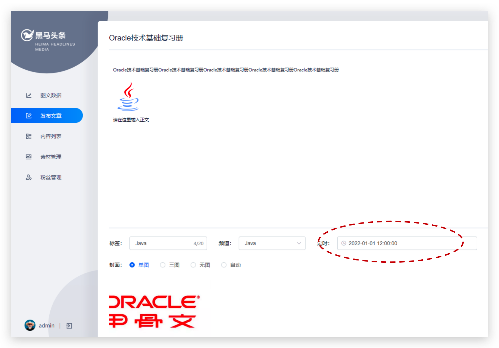

**延迟任务**

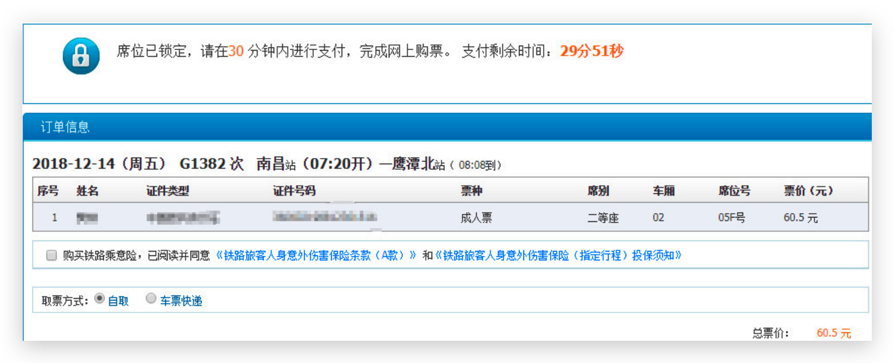

**今日内容**

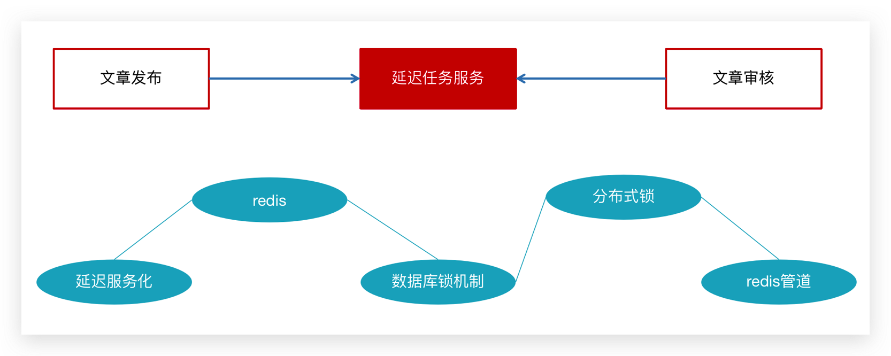


## 延迟任务概述

> 思考：什么是延迟任务

- 定时任务：有固定周期的，有明确的触发时间
- 延迟队列：没有固定的开始时间，它常常是由一个事件触发的，而在这个事件触发之后的一段时间内触发另一个事件，任务可以立即执行，也可以延迟

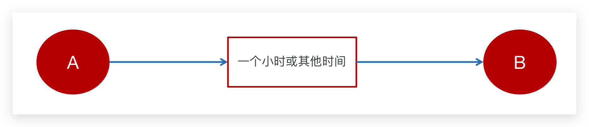

延迟队列应用场景：

- 场景一：订单下单之后30分钟后，如果用户没有付钱，则系统自动取消订单；如果期间下单成功，任务取消

- 场景二：接口对接出现网络问题，1分钟后重试，如果失败，2分钟重试，直到出现阈值终止


<br/>

### 技术对比

#### DelayQueue

JDK自带DelayQueue 是一个支持延时获取元素的阻塞队列， 内部采用优先队列 PriorityQueue 存储元素，同时元素必须实现 Delayed 接口；在创建元素时可以指定多久才可以从队列中获取当前元素，只有在延迟期满时才能从队列中提取元素

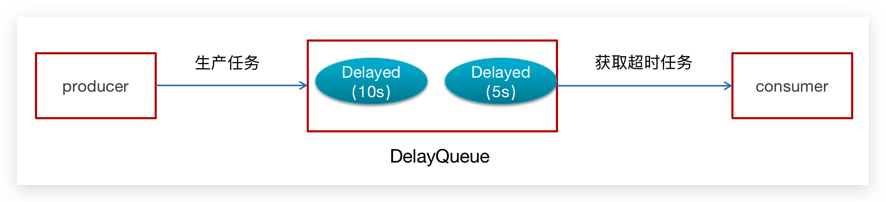

<br/>

DelayQueue属于排序队列，它的特殊之处在于队列的元素必须实现Delayed接口，该接口需要实现compareTo和getDelay方法

- getDelay()：获取元素在队列中的剩余时间，只有当剩余时间为0时元素才可以出队
- compareTo()：用于排序，确定元素出队列的顺序。

<br/>

**代码实现：**

1：在测试包jdk下创建延迟任务元素对象DelayedTask，实现compareTo和getDelay方法，

2：在main方法中创建DelayQueue并向延迟队列中添加三个延迟任务，

3：循环的从延迟队列中拉取任务

```java
public class DelayedTask  implements Delayed{
    
    // 任务的执行时间
    private int executeTime = 0;
    
    public DelayedTask(int delay){
        Calendar calendar = Calendar.getInstance();
        calendar.add(Calendar.SECOND,delay);
        this.executeTime = (int)(calendar.getTimeInMillis() /1000 );
    }

    /**
     * 元素在队列中的剩余时间
     * @param unit
     * @return
     */
    @Override
    public long getDelay(TimeUnit unit) {
        Calendar calendar = Calendar.getInstance();
        return executeTime - (calendar.getTimeInMillis()/1000);
    }

    /**
     * 元素排序
     * @param o
     * @return
     */
    @Override
    public int compareTo(Delayed o) {
        long val = this.getDelay(TimeUnit.NANOSECONDS) - o.getDelay(TimeUnit.NANOSECONDS);
        return val == 0 ? 0 : ( val < 0 ? -1: 1 );
    }


    public static void main(String[] args) {
        DelayQueue<DelayedTask> queue = new DelayQueue<DelayedTask>();
        
        queue.add(new DelayedTask(5));
        queue.add(new DelayedTask(10));
        queue.add(new DelayedTask(15));

        System.out.println(System.currentTimeMillis()/1000+" start consume ");
        while(queue.size() != 0){
            DelayedTask delayedTask = queue.poll();
            if(delayedTask !=null ){
                System.out.println(System.currentTimeMillis()/1000+" cosume task");
            }
            //每隔一秒消费一次
            try {
                Thread.sleep(1000);
            } catch (InterruptedException e) {
                e.printStackTrace();
            }
        }     
    }
}
```

::: warning DelayQueue实现完成之后思考一个问题：

使用线程池或者原生DelayQueue程序挂掉之后，任务都是放在内存，需要考虑未处理消息的丢失带来的影响，如何保证数据不丢失，需要持久化（磁盘）

:::

<br/>

#### RabbitMQ实现

- TTL：Time To Live (消息存活时间)

- 死信队列：Dead Letter Exchange(死信交换机)，当消息成为Dead message后，可以重新发送另一个交换机（死信交换机）

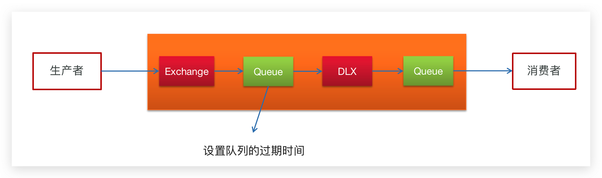

<br/>

#### Redis实现

Zset 数据类型的去重有序（分数排序）特点进行延迟。例如：时间戳作为score进行排序

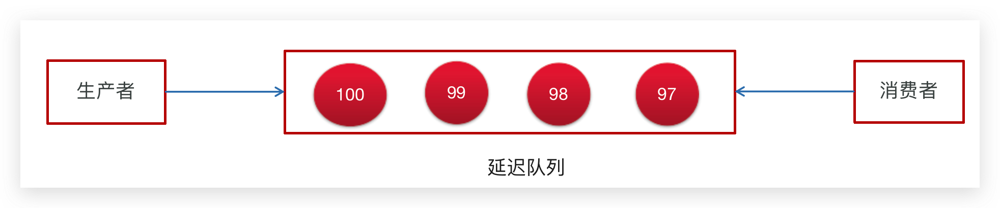

<br/>

todo RabbitMQ实现延迟队列和Redis实现延迟队列优劣


### Redis实现

**实现思路**

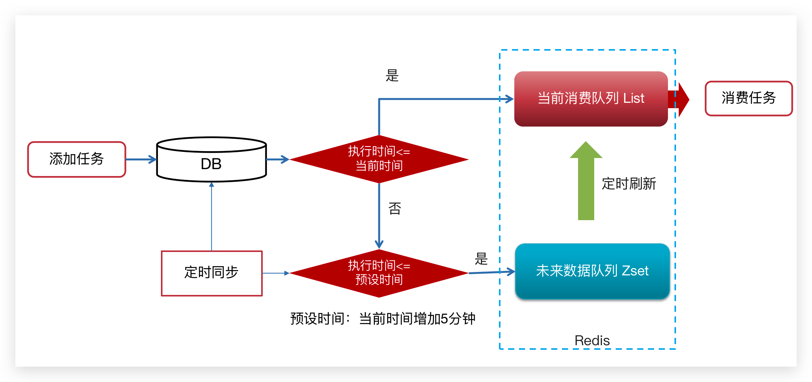

:::warning 💡 思考

**1.为什么任务需要存储在数据库中？**

- 延迟任务是一个通用的服务，任何需要延迟得任务都可以调用该服务，需要考虑数据持久化的问题，存储数据库中是一种数据安全的考虑。


<br/>

**2.为什么redis中使用两种数据类型，list和zset？**

- 原因一：list存储立即执行的任务，zset存储未来的数据

- 原因二：任务量过大以后，zset的性能会下降


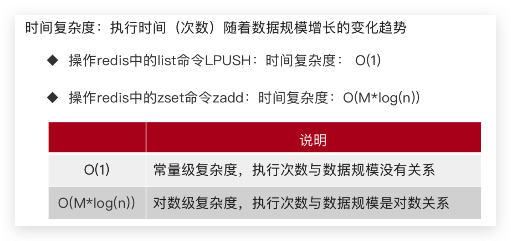

<br/>

**3.在添加 Zset 数据的时候，为什么不需要预加载？**

- 任务模块是一个通用的模块，项目中任何需要延迟队列的地方，都可以调用这个接口，要考虑到数据量的问题，如果数据量特别大，为了防止阻塞，只需要把未来几分钟要执行的数据存入缓存即可。

:::


## 延迟服务实现

### 环境搭建

`leadnews-schedule` 是一个通用的服务，单独创建模块来管理任何类型的延迟任务

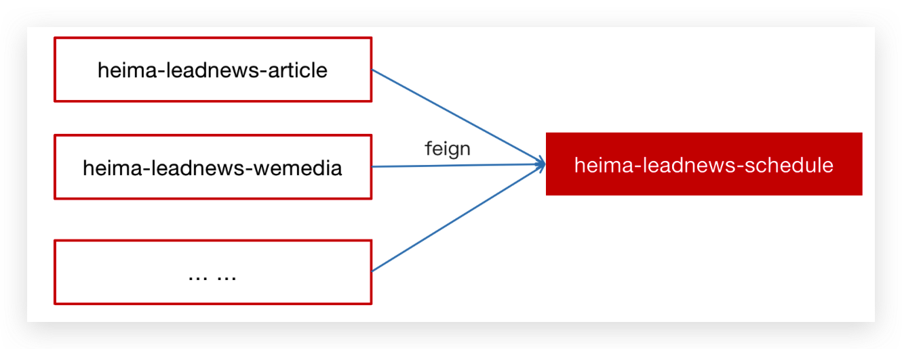

①  创建 `heima-leadnews-schedule` 模块

②  添加bootstrap.yml，bootstrap-dev.yml，bootstrap-local

```yaml
server:
  port: 51802
spring:
  profiles:
    active: de
  application:
    name: leadnews-article
  cloud:
    nacos:
      config:
        file-extension: yaml
        shared-configs:
          - data-id: shared-mybatis.yaml

hmtt:
  jdbc:
    database: leadnews_schedule

# 设置Mapper接口所对应的XML文件位置，如果你在Mapper接口中有自定义方法，需要进行该配置
mybatis-plus:
  mapper-locations: classpath*:mapper/*.xml
  # 设置别名包扫描路径，通过该属性可以给包中的类注册别名
  type-aliases-package: com.heima.model.schedule.pojos
```

<br/>

### 数据结构

任务表：taskinfo 


任务日志表：taskinfo_logs 


注意：MySQL中，BLOB是一个二进制大型对象，是一个可以存储大量数据的容器；LongBlob 最大存储 4G 

<br/>

**数据库自身解决并发的两种策略**

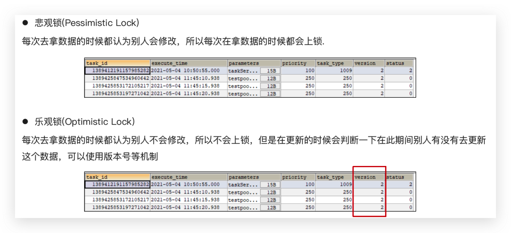

乐观锁支持：

```java
/**
* mybatis-plus乐观锁支持
* @return
*/
@Bean
public MybatisPlusInterceptor optimisticLockerInterceptor(){
    MybatisPlusInterceptor interceptor = new MybatisPlusInterceptor();
    interceptor.addInnerInterceptor(new OptimisticLockerInnerInterceptor());
    return interceptor;
}
```

:::details 导入资料中 leadnews_schedule 数据库

```sql
CREATE DATABASE IF NOT EXISTS leadnews_schedule DEFAULT CHARACTER SET utf8mb4 COLLATE utf8mb4_unicode_ci;
USE leadnews_schedule;
SET NAMES utf8;
/*
Navicat MySQL Data Transfer

Source Server         : localhost
Source Server Version : 50721
Source Host           : localhost:3306
Source Database       : leadnews_schedule

Target Server Type    : MYSQL
Target Server Version : 50721
File Encoding         : 65001

Date: 2021-05-14 16:17:48
*/

SET FOREIGN_KEY_CHECKS=0;

-- ----------------------------
-- Table structure for taskinfo
-- ----------------------------
DROP TABLE IF EXISTS `taskinfo`;
CREATE TABLE `taskinfo` (
  `task_id` bigint(20) NOT NULL COMMENT '任务id',
  `execute_time` datetime(3) NOT NULL COMMENT '执行时间',
  `parameters` longblob COMMENT '参数',
  `priority` int(11) NOT NULL COMMENT '优先级',
  `task_type` int(11) NOT NULL COMMENT '任务类型',
  PRIMARY KEY (`task_id`),
  KEY `index_taskinfo_time` (`task_type`,`priority`,`execute_time`)
) ENGINE=InnoDB DEFAULT CHARSET=utf8;

-- ----------------------------
-- Records of taskinfo
-- ----------------------------

-- ----------------------------
-- Table structure for taskinfo_logs
-- ----------------------------
DROP TABLE IF EXISTS `taskinfo_logs`;
CREATE TABLE `taskinfo_logs` (
  `task_id` bigint(20) NOT NULL COMMENT '任务id',
  `execute_time` datetime(3) NOT NULL COMMENT '执行时间',
  `parameters` longblob COMMENT '参数',
  `priority` int(11) NOT NULL COMMENT '优先级',
  `task_type` int(11) NOT NULL COMMENT '任务类型',
  `version` int(11) NOT NULL COMMENT '版本号,用乐观锁',
  `status` int(11) DEFAULT '0' COMMENT '状态 0=初始化状态 1=EXECUTED 2=CANCELLED',
  PRIMARY KEY (`task_id`)
) ENGINE=InnoDB DEFAULT CHARSET=utf8;

-- ----------------------------
-- Records of taskinfo_logs
-- ----------------------------

```

:::

<br/>

### 集成Redis

① 在项目导入redis相关依赖，已经完成

```xml
<dependencies>
    <dependency>
        <groupId>org.springframework.boot</groupId>
        <artifactId>spring-boot-starter-data-redis</artifactId>
    </dependency>
    <!-- redis依赖commons-pool 这个依赖一定要添加 -->
    <dependency>
        <groupId>org.apache.commons</groupId>
        <artifactId>commons-pool2</artifactId>
    </dependency>
</dependencies>
```

②  创建引导类并在在 `heima-leadnews-schedule` 中集成 redis ，添加以下 nacos 配置，链接上redis

```java
package com.heima.schedule;

import com.baomidou.mybatisplus.extension.plugins.MybatisPlusInterceptor;
import com.baomidou.mybatisplus.extension.plugins.inner.OptimisticLockerInnerInterceptor;
import org.mybatis.spring.annotation.MapperScan;
import org.springframework.boot.SpringApplication;
import org.springframework.boot.autoconfigure.SpringBootApplication;
import org.springframework.context.annotation.Bean;

/**
 * @author mousse 958860184@qq.com
 */
@SpringBootApplication
@MapperScan("com.heima.schedule.mapper")
public class ScheduleApplication {

    public static void main(String[] args) {
        SpringApplication.run(ScheduleApplication.class, args);
    }


    /**
     * mybatis-plus乐观锁支持
     *
     * @return
     */
    @Bean
    public MybatisPlusInterceptor optimisticLockerInterceptor() {
        MybatisPlusInterceptor interceptor = new MybatisPlusInterceptor();
        interceptor.addInnerInterceptor(new OptimisticLockerInnerInterceptor());
        return interceptor;
    }
}
```

设置 shared-redis.yaml

```yaml
spring:
  redis:
    host: ${hmtt.redis.host:192.168.150.102}
    password: ${hmtt.redis.password:leadnews}
    lettuce:
      pool:
        max-active: ${hm.redis.pool.max-active:8}
        max-idle: ${hm.redis.pool.max-idle:8}
        min-idle: ${hm.redis.pool.min-idle:1}
        max-wait: ${hm.redis.pool.max-wait:300}
```

③ 拷贝资料文件夹下的类：CacheService 到 `heima-leadnews-common` 模块下，并在`spring.factories `添加自动配置

```properties {8}
org.springframework.boot.autoconfigure.EnableAutoConfiguration=\
  com.heima.common.exception.ExceptionCatch,\
  com.heima.common.swagger.SwaggerConfiguration,\
  com.heima.common.swagger.Swagger2Configuration,\
  com.heima.common.aliyun.GreenTextScan,\
  com.heima.common.aliyun.GreenImageScan,\
  com.heima.common.tess4j.Tess4jClient,\
  com.heima.common.redis.CacheService
```

:::details CacheService

```java
package com.heima.common.redis;

import org.springframework.beans.factory.annotation.Autowired;
import org.springframework.cache.annotation.CachingConfigurerSupport;
import org.springframework.dao.DataAccessException;
import org.springframework.data.redis.connection.DataType;
import org.springframework.data.redis.connection.RedisConnection;
import org.springframework.data.redis.connection.StringRedisConnection;
import org.springframework.data.redis.core.Cursor;
import org.springframework.data.redis.core.RedisCallback;
import org.springframework.data.redis.core.ScanOptions;
import org.springframework.data.redis.core.StringRedisTemplate;
import org.springframework.data.redis.core.ZSetOperations.TypedTuple;
import org.springframework.lang.Nullable;
import org.springframework.stereotype.Component;

import java.io.IOException;
import java.util.*;
import java.util.concurrent.TimeUnit;

@Component
public class CacheService extends CachingConfigurerSupport {
    @Autowired
    private StringRedisTemplate stringRedisTemplate;

    public StringRedisTemplate getstringRedisTemplate() {
        return this.stringRedisTemplate;
    }

    /** -------------------key相关操作--------------------- */

    /**
     * 删除key
     *
     * @param key
     */
    public void delete(String key) {
        stringRedisTemplate.delete(key);
    }

    /**
     * 批量删除key
     *
     * @param keys
     */
    public void delete(Collection<String> keys) {
        stringRedisTemplate.delete(keys);
    }

    /**
     * 序列化key
     *
     * @param key
     * @return
     */
    public byte[] dump(String key) {
        return stringRedisTemplate.dump(key);
    }

    /**
     * 是否存在key
     *
     * @param key
     * @return
     */
    public Boolean exists(String key) {
        return stringRedisTemplate.hasKey(key);
    }

    /**
     * 设置过期时间
     *
     * @param key
     * @param timeout
     * @param unit
     * @return
     */
    public Boolean expire(String key, long timeout, TimeUnit unit) {
        return stringRedisTemplate.expire(key, timeout, unit);
    }

    /**
     * 设置过期时间
     *
     * @param key
     * @param date
     * @return
     */
    public Boolean expireAt(String key, Date date) {
        return stringRedisTemplate.expireAt(key, date);
    }

    /**
     * 查找匹配的key
     *
     * @param pattern
     * @return
     */
    public Set<String> keys(String pattern) {
        return stringRedisTemplate.keys(pattern);
    }

    /**
     * 将当前数据库的 key 移动到给定的数据库 db 当中
     *
     * @param key
     * @param dbIndex
     * @return
     */
    public Boolean move(String key, int dbIndex) {
        return stringRedisTemplate.move(key, dbIndex);
    }

    /**
     * 移除 key 的过期时间，key 将持久保持
     *
     * @param key
     * @return
     */
    public Boolean persist(String key) {
        return stringRedisTemplate.persist(key);
    }

    /**
     * 返回 key 的剩余的过期时间
     *
     * @param key
     * @param unit
     * @return
     */
    public Long getExpire(String key, TimeUnit unit) {
        return stringRedisTemplate.getExpire(key, unit);
    }

    /**
     * 返回 key 的剩余的过期时间
     *
     * @param key
     * @return
     */
    public Long getExpire(String key) {
        return stringRedisTemplate.getExpire(key);
    }

    /**
     * 从当前数据库中随机返回一个 key
     *
     * @return
     */
    public String randomKey() {
        return stringRedisTemplate.randomKey();
    }

    /**
     * 修改 key 的名称
     *
     * @param oldKey
     * @param newKey
     */
    public void rename(String oldKey, String newKey) {
        stringRedisTemplate.rename(oldKey, newKey);
    }

    /**
     * 仅当 newkey 不存在时，将 oldKey 改名为 newkey
     *
     * @param oldKey
     * @param newKey
     * @return
     */
    public Boolean renameIfAbsent(String oldKey, String newKey) {
        return stringRedisTemplate.renameIfAbsent(oldKey, newKey);
    }

    /**
     * 返回 key 所储存的值的类型
     *
     * @param key
     * @return
     */
    public DataType type(String key) {
        return stringRedisTemplate.type(key);
    }

    /** -------------------string相关操作--------------------- */

    /**
     * 设置指定 key 的值
     * @param key
     * @param value
     */
    public void set(String key, String value) {
        stringRedisTemplate.opsForValue().set(key, value);
    }

    /**
     * 获取指定 key 的值
     * @param key
     * @return
     */
    public String get(String key) {
        return stringRedisTemplate.opsForValue().get(key);
    }

    /**
     * 返回 key 中字符串值的子字符
     * @param key
     * @param start
     * @param end
     * @return
     */
    public String getRange(String key, long start, long end) {
        return stringRedisTemplate.opsForValue().get(key, start, end);
    }

    /**
     * 将给定 key 的值设为 value ，并返回 key 的旧值(old value)
     *
     * @param key
     * @param value
     * @return
     */
    public String getAndSet(String key, String value) {
        return stringRedisTemplate.opsForValue().getAndSet(key, value);
    }

    /**
     * 对 key 所储存的字符串值，获取指定偏移量上的位(bit)
     *
     * @param key
     * @param offset
     * @return
     */
    public Boolean getBit(String key, long offset) {
        return stringRedisTemplate.opsForValue().getBit(key, offset);
    }

    /**
     * 批量获取
     *
     * @param keys
     * @return
     */
    public List<String> multiGet(Collection<String> keys) {
        return stringRedisTemplate.opsForValue().multiGet(keys);
    }

    /**
     * 设置ASCII码, 字符串'a'的ASCII码是97, 转为二进制是'01100001', 此方法是将二进制第offset位值变为value
     *
     * @param key
     * @param
     * @param value
     *            值,true为1, false为0
     * @return
     */
    public boolean setBit(String key, long offset, boolean value) {
        return stringRedisTemplate.opsForValue().setBit(key, offset, value);
    }

    /**
     * 将值 value 关联到 key ，并将 key 的过期时间设为 timeout
     *
     * @param key
     * @param value
     * @param timeout
     *            过期时间
     * @param unit
     *            时间单位, 天:TimeUnit.DAYS 小时:TimeUnit.HOURS 分钟:TimeUnit.MINUTES
     *            秒:TimeUnit.SECONDS 毫秒:TimeUnit.MILLISECONDS
     */
    public void setEx(String key, String value, long timeout, TimeUnit unit) {
        stringRedisTemplate.opsForValue().set(key, value, timeout, unit);
    }

    /**
     * 只有在 key 不存在时设置 key 的值
     *
     * @param key
     * @param value
     * @return 之前已经存在返回false,不存在返回true
     */
    public boolean setIfAbsent(String key, String value) {
        return stringRedisTemplate.opsForValue().setIfAbsent(key, value);
    }

    /**
     * 用 value 参数覆写给定 key 所储存的字符串值，从偏移量 offset 开始
     *
     * @param key
     * @param value
     * @param offset
     *            从指定位置开始覆写
     */
    public void setRange(String key, String value, long offset) {
        stringRedisTemplate.opsForValue().set(key, value, offset);
    }

    /**
     * 获取字符串的长度
     *
     * @param key
     * @return
     */
    public Long size(String key) {
        return stringRedisTemplate.opsForValue().size(key);
    }

    /**
     * 批量添加
     *
     * @param maps
     */
    public void multiSet(Map<String, String> maps) {
        stringRedisTemplate.opsForValue().multiSet(maps);
    }

    /**
     * 同时设置一个或多个 key-value 对，当且仅当所有给定 key 都不存在
     *
     * @param maps
     * @return 之前已经存在返回false,不存在返回true
     */
    public boolean multiSetIfAbsent(Map<String, String> maps) {
        return stringRedisTemplate.opsForValue().multiSetIfAbsent(maps);
    }

    /**
     * 增加(自增长), 负数则为自减
     *
     * @param key
     * @param
     * @return
     */
    public Long incrBy(String key, long increment) {
        return stringRedisTemplate.opsForValue().increment(key, increment);
    }

    /**
     *
     * @param key
     * @param
     * @return
     */
    public Double incrByFloat(String key, double increment) {
        return stringRedisTemplate.opsForValue().increment(key, increment);
    }

    /**
     * 追加到末尾
     *
     * @param key
     * @param value
     * @return
     */
    public Integer append(String key, String value) {
        return stringRedisTemplate.opsForValue().append(key, value);
    }

    /** -------------------hash相关操作------------------------- */

    /**
     * 获取存储在哈希表中指定字段的值
     *
     * @param key
     * @param field
     * @return
     */
    public Object hGet(String key, String field) {
        return stringRedisTemplate.opsForHash().get(key, field);
    }

    /**
     * 获取所有给定字段的值
     *
     * @param key
     * @return
     */
    public Map<Object, Object> hGetAll(String key) {
        return stringRedisTemplate.opsForHash().entries(key);
    }

    /**
     * 获取所有给定字段的值
     *
     * @param key
     * @param fields
     * @return
     */
    public List<Object> hMultiGet(String key, Collection<Object> fields) {
        return stringRedisTemplate.opsForHash().multiGet(key, fields);
    }

    public void hPut(String key, String hashKey, String value) {
        stringRedisTemplate.opsForHash().put(key, hashKey, value);
    }

    public void hPutAll(String key, Map<String, String> maps) {
        stringRedisTemplate.opsForHash().putAll(key, maps);
    }

    /**
     * 仅当hashKey不存在时才设置
     *
     * @param key
     * @param hashKey
     * @param value
     * @return
     */
    public Boolean hPutIfAbsent(String key, String hashKey, String value) {
        return stringRedisTemplate.opsForHash().putIfAbsent(key, hashKey, value);
    }

    /**
     * 删除一个或多个哈希表字段
     *
     * @param key
     * @param fields
     * @return
     */
    public Long hDelete(String key, Object... fields) {
        return stringRedisTemplate.opsForHash().delete(key, fields);
    }

    /**
     * 查看哈希表 key 中，指定的字段是否存在
     *
     * @param key
     * @param field
     * @return
     */
    public boolean hExists(String key, String field) {
        return stringRedisTemplate.opsForHash().hasKey(key, field);
    }

    /**
     * 为哈希表 key 中的指定字段的整数值加上增量 increment
     *
     * @param key
     * @param field
     * @param increment
     * @return
     */
    public Long hIncrBy(String key, Object field, long increment) {
        return stringRedisTemplate.opsForHash().increment(key, field, increment);
    }

    /**
     * 为哈希表 key 中的指定字段的整数值加上增量 increment
     *
     * @param key
     * @param field
     * @param delta
     * @return
     */
    public Double hIncrByFloat(String key, Object field, double delta) {
        return stringRedisTemplate.opsForHash().increment(key, field, delta);
    }

    /**
     * 获取所有哈希表中的字段
     *
     * @param key
     * @return
     */
    public Set<Object> hKeys(String key) {
        return stringRedisTemplate.opsForHash().keys(key);
    }

    /**
     * 获取哈希表中字段的数量
     *
     * @param key
     * @return
     */
    public Long hSize(String key) {
        return stringRedisTemplate.opsForHash().size(key);
    }

    /**
     * 获取哈希表中所有值
     *
     * @param key
     * @return
     */
    public List<Object> hValues(String key) {
        return stringRedisTemplate.opsForHash().values(key);
    }

    /**
     * 迭代哈希表中的键值对
     *
     * @param key
     * @param options
     * @return
     */
    public Cursor<Map.Entry<Object, Object>> hScan(String key, ScanOptions options) {
        return stringRedisTemplate.opsForHash().scan(key, options);
    }

    /** ------------------------list相关操作---------------------------- */

    /**
     * 通过索引获取列表中的元素
     *
     * @param key
     * @param index
     * @return
     */
    public String lIndex(String key, long index) {
        return stringRedisTemplate.opsForList().index(key, index);
    }

    /**
     * 获取列表指定范围内的元素
     *
     * @param key
     * @param start
     *            开始位置, 0是开始位置
     * @param end
     *            结束位置, -1返回所有
     * @return
     */
    public List<String> lRange(String key, long start, long end) {
        return stringRedisTemplate.opsForList().range(key, start, end);
    }

    /**
     * 存储在list头部
     *
     * @param key
     * @param value
     * @return
     */
    public Long lLeftPush(String key, String value) {
        return stringRedisTemplate.opsForList().leftPush(key, value);
    }

    /**
     *
     * @param key
     * @param value
     * @return
     */
    public Long lLeftPushAll(String key, String... value) {
        return stringRedisTemplate.opsForList().leftPushAll(key, value);
    }

    /**
     *
     * @param key
     * @param value
     * @return
     */
    public Long lLeftPushAll(String key, Collection<String> value) {
        return stringRedisTemplate.opsForList().leftPushAll(key, value);
    }

    /**
     * 当list存在的时候才加入
     *
     * @param key
     * @param value
     * @return
     */
    public Long lLeftPushIfPresent(String key, String value) {
        return stringRedisTemplate.opsForList().leftPushIfPresent(key, value);
    }

    /**
     * 如果pivot存在,再pivot前面添加
     *
     * @param key
     * @param pivot
     * @param value
     * @return
     */
    public Long lLeftPush(String key, String pivot, String value) {
        return stringRedisTemplate.opsForList().leftPush(key, pivot, value);
    }

    /**
     *
     * @param key
     * @param value
     * @return
     */
    public Long lRightPush(String key, String value) {
        return stringRedisTemplate.opsForList().rightPush(key, value);
    }

    /**
     *
     * @param key
     * @param value
     * @return
     */
    public Long lRightPushAll(String key, String... value) {
        return stringRedisTemplate.opsForList().rightPushAll(key, value);
    }

    /**
     *
     * @param key
     * @param value
     * @return
     */
    public Long lRightPushAll(String key, Collection<String> value) {
        return stringRedisTemplate.opsForList().rightPushAll(key, value);
    }

    /**
     * 为已存在的列表添加值
     *
     * @param key
     * @param value
     * @return
     */
    public Long lRightPushIfPresent(String key, String value) {
        return stringRedisTemplate.opsForList().rightPushIfPresent(key, value);
    }

    /**
     * 在pivot元素的右边添加值
     *
     * @param key
     * @param pivot
     * @param value
     * @return
     */
    public Long lRightPush(String key, String pivot, String value) {
        return stringRedisTemplate.opsForList().rightPush(key, pivot, value);
    }

    /**
     * 通过索引设置列表元素的值
     *
     * @param key
     * @param index
     *            位置
     * @param value
     */
    public void lSet(String key, long index, String value) {
        stringRedisTemplate.opsForList().set(key, index, value);
    }

    /**
     * 移出并获取列表的第一个元素
     *
     * @param key
     * @return 删除的元素
     */
    public String lLeftPop(String key) {
        return stringRedisTemplate.opsForList().leftPop(key);
    }

    /**
     * 移出并获取列表的第一个元素， 如果列表没有元素会阻塞列表直到等待超时或发现可弹出元素为止
     *
     * @param key
     * @param timeout
     *            等待时间
     * @param unit
     *            时间单位
     * @return
     */
    public String lBLeftPop(String key, long timeout, TimeUnit unit) {
        return stringRedisTemplate.opsForList().leftPop(key, timeout, unit);
    }

    /**
     * 移除并获取列表最后一个元素
     *
     * @param key
     * @return 删除的元素
     */
    public String lRightPop(String key) {
        return stringRedisTemplate.opsForList().rightPop(key);
    }

    /**
     * 移出并获取列表的最后一个元素， 如果列表没有元素会阻塞列表直到等待超时或发现可弹出元素为止
     *
     * @param key
     * @param timeout
     *            等待时间
     * @param unit
     *            时间单位
     * @return
     */
    public String lBRightPop(String key, long timeout, TimeUnit unit) {
        return stringRedisTemplate.opsForList().rightPop(key, timeout, unit);
    }

    /**
     * 移除列表的最后一个元素，并将该元素添加到另一个列表并返回
     *
     * @param sourceKey
     * @param destinationKey
     * @return
     */
    public String lRightPopAndLeftPush(String sourceKey, String destinationKey) {
        return stringRedisTemplate.opsForList().rightPopAndLeftPush(sourceKey,
                destinationKey);
    }

    /**
     * 从列表中弹出一个值，将弹出的元素插入到另外一个列表中并返回它； 如果列表没有元素会阻塞列表直到等待超时或发现可弹出元素为止
     *
     * @param sourceKey
     * @param destinationKey
     * @param timeout
     * @param unit
     * @return
     */
    public String lBRightPopAndLeftPush(String sourceKey, String destinationKey,
                                        long timeout, TimeUnit unit) {
        return stringRedisTemplate.opsForList().rightPopAndLeftPush(sourceKey,
                destinationKey, timeout, unit);
    }
    
    /**
     * 删除集合中值等于value得元素
     *
     * @param key
     * @param index
     *            index=0, 删除所有值等于value的元素; index>0, 从头部开始删除第一个值等于value的元素;
     *            index<0, 从尾部开始删除第一个值等于value的元素;
     * @param value
     * @return
     */
    public Long lRemove(String key, long index, String value) {
        return stringRedisTemplate.opsForList().remove(key, index, value);
    }

    /**
     * 裁剪list
     *
     * @param key
     * @param start
     * @param end
     */
    public void lTrim(String key, long start, long end) {
        stringRedisTemplate.opsForList().trim(key, start, end);
    }

    /**
     * 获取列表长度
     *
     * @param key
     * @return
     */
    public Long lLen(String key) {
        return stringRedisTemplate.opsForList().size(key);
    }


    /** --------------------set相关操作-------------------------- */

    /**
     * set添加元素
     *
     * @param key
     * @param values
     * @return
     */
    public Long sAdd(String key, String... values) {
        return stringRedisTemplate.opsForSet().add(key, values);
    }

    /**
     * set移除元素
     *
     * @param key
     * @param values
     * @return
     */
    public Long sRemove(String key, Object... values) {
        return stringRedisTemplate.opsForSet().remove(key, values);
    }

    /**
     * 移除并返回集合的一个随机元素
     *
     * @param key
     * @return
     */
    public String sPop(String key) {
        return stringRedisTemplate.opsForSet().pop(key);
    }

    /**
     * 将元素value从一个集合移到另一个集合
     *
     * @param key
     * @param value
     * @param destKey
     * @return
     */
    public Boolean sMove(String key, String value, String destKey) {
        return stringRedisTemplate.opsForSet().move(key, value, destKey);
    }

    /**
     * 获取集合的大小
     *
     * @param key
     * @return
     */
    public Long sSize(String key) {
        return stringRedisTemplate.opsForSet().size(key);
    }

    /**
     * 判断集合是否包含value
     *
     * @param key
     * @param value
     * @return
     */
    public Boolean sIsMember(String key, Object value) {
        return stringRedisTemplate.opsForSet().isMember(key, value);
    }

    /**
     * 获取两个集合的交集
     *
     * @param key
     * @param otherKey
     * @return
     */
    public Set<String> sIntersect(String key, String otherKey) {
        return stringRedisTemplate.opsForSet().intersect(key, otherKey);
    }

    /**
     * 获取key集合与多个集合的交集
     *
     * @param key
     * @param otherKeys
     * @return
     */
    public Set<String> sIntersect(String key, Collection<String> otherKeys) {
        return stringRedisTemplate.opsForSet().intersect(key, otherKeys);
    }

    /**
     * key集合与otherKey集合的交集存储到destKey集合中
     *
     * @param key
     * @param otherKey
     * @param destKey
     * @return
     */
    public Long sIntersectAndStore(String key, String otherKey, String destKey) {
        return stringRedisTemplate.opsForSet().intersectAndStore(key, otherKey,
                destKey);
    }

    /**
     * key集合与多个集合的交集存储到destKey集合中
     *
     * @param key
     * @param otherKeys
     * @param destKey
     * @return
     */
    public Long sIntersectAndStore(String key, Collection<String> otherKeys,
                                   String destKey) {
        return stringRedisTemplate.opsForSet().intersectAndStore(key, otherKeys,
                destKey);
    }

    /**
     * 获取两个集合的并集
     *
     * @param key
     * @param otherKeys
     * @return
     */
    public Set<String> sUnion(String key, String otherKeys) {
        return stringRedisTemplate.opsForSet().union(key, otherKeys);
    }

    /**
     * 获取key集合与多个集合的并集
     *
     * @param key
     * @param otherKeys
     * @return
     */
    public Set<String> sUnion(String key, Collection<String> otherKeys) {
        return stringRedisTemplate.opsForSet().union(key, otherKeys);
    }

    /**
     * key集合与otherKey集合的并集存储到destKey中
     *
     * @param key
     * @param otherKey
     * @param destKey
     * @return
     */
    public Long sUnionAndStore(String key, String otherKey, String destKey) {
        return stringRedisTemplate.opsForSet().unionAndStore(key, otherKey, destKey);
    }

    /**
     * key集合与多个集合的并集存储到destKey中
     *
     * @param key
     * @param otherKeys
     * @param destKey
     * @return
     */
    public Long sUnionAndStore(String key, Collection<String> otherKeys,
                               String destKey) {
        return stringRedisTemplate.opsForSet().unionAndStore(key, otherKeys, destKey);
    }

    /**
     * 获取两个集合的差集
     *
     * @param key
     * @param otherKey
     * @return
     */
    public Set<String> sDifference(String key, String otherKey) {
        return stringRedisTemplate.opsForSet().difference(key, otherKey);
    }

    /**
     * 获取key集合与多个集合的差集
     *
     * @param key
     * @param otherKeys
     * @return
     */
    public Set<String> sDifference(String key, Collection<String> otherKeys) {
        return stringRedisTemplate.opsForSet().difference(key, otherKeys);
    }

    /**
     * key集合与otherKey集合的差集存储到destKey中
     *
     * @param key
     * @param otherKey
     * @param destKey
     * @return
     */
    public Long sDifference(String key, String otherKey, String destKey) {
        return stringRedisTemplate.opsForSet().differenceAndStore(key, otherKey,
                destKey);
    }

    /**
     * key集合与多个集合的差集存储到destKey中
     *
     * @param key
     * @param otherKeys
     * @param destKey
     * @return
     */
    public Long sDifference(String key, Collection<String> otherKeys,
                            String destKey) {
        return stringRedisTemplate.opsForSet().differenceAndStore(key, otherKeys,
                destKey);
    }

    /**
     * 获取集合所有元素
     *
     * @param key
     * @param
     * @param
     * @return
     */
    public Set<String> setMembers(String key) {
        return stringRedisTemplate.opsForSet().members(key);
    }

    /**
     * 随机获取集合中的一个元素
     *
     * @param key
     * @return
     */
    public String sRandomMember(String key) {
        return stringRedisTemplate.opsForSet().randomMember(key);
    }

    /**
     * 随机获取集合中count个元素
     *
     * @param key
     * @param count
     * @return
     */
    public List<String> sRandomMembers(String key, long count) {
        return stringRedisTemplate.opsForSet().randomMembers(key, count);
    }

    /**
     * 随机获取集合中count个元素并且去除重复的
     *
     * @param key
     * @param count
     * @return
     */
    public Set<String> sDistinctRandomMembers(String key, long count) {
        return stringRedisTemplate.opsForSet().distinctRandomMembers(key, count);
    }

    /**
     *
     * @param key
     * @param options
     * @return
     */
    public Cursor<String> sScan(String key, ScanOptions options) {
        return stringRedisTemplate.opsForSet().scan(key, options);
    }

    /**------------------zSet相关操作--------------------------------*/

    /**
     * 添加元素,有序集合是按照元素的score值由小到大排列
     *
     * @param key
     * @param value
     * @param score
     * @return
     */
    public Boolean zAdd(String key, String value, double score) {
        return stringRedisTemplate.opsForZSet().add(key, value, score);
    }

    /**
     *
     * @param key
     * @param values
     * @return
     */
    public Long zAdd(String key, Set<TypedTuple<String>> values) {
        return stringRedisTemplate.opsForZSet().add(key, values);
    }

    /**
     *
     * @param key
     * @param values
     * @return
     */
    public Long zRemove(String key, Object... values) {
        return stringRedisTemplate.opsForZSet().remove(key, values);
    }

    public Long zRemove(String key, Collection<String> values) {
        if(values!=null&&!values.isEmpty()){
            Object[] objs = values.toArray(new Object[values.size()]);
            return stringRedisTemplate.opsForZSet().remove(key, objs);
        }
       return 0L;
    }

    /**
     * 增加元素的score值，并返回增加后的值
     *
     * @param key
     * @param value
     * @param delta
     * @return
     */
    public Double zIncrementScore(String key, String value, double delta) {
        return stringRedisTemplate.opsForZSet().incrementScore(key, value, delta);
    }

    /**
     * 返回元素在集合的排名,有序集合是按照元素的score值由小到大排列
     *
     * @param key
     * @param value
     * @return 0表示第一位
     */
    public Long zRank(String key, Object value) {
        return stringRedisTemplate.opsForZSet().rank(key, value);
    }

    /**
     * 返回元素在集合的排名,按元素的score值由大到小排列
     *
     * @param key
     * @param value
     * @return
     */
    public Long zReverseRank(String key, Object value) {
        return stringRedisTemplate.opsForZSet().reverseRank(key, value);
    }

    /**
     * 获取集合的元素, 从小到大排序
     *
     * @param key
     * @param start
     *            开始位置
     * @param end
     *            结束位置, -1查询所有
     * @return
     */
    public Set<String> zRange(String key, long start, long end) {
        return stringRedisTemplate.opsForZSet().range(key, start, end);
    }
    
    /**
     * 获取zset集合的所有元素, 从小到大排序
     *
     */
    public Set<String> zRangeAll(String key) {
        return zRange(key,0,-1);
    }

    /**
     * 获取集合元素, 并且把score值也获取
     *
     * @param key
     * @param start
     * @param end
     * @return
     */
    public Set<TypedTuple<String>> zRangeWithScores(String key, long start,
                                                    long end) {
        return stringRedisTemplate.opsForZSet().rangeWithScores(key, start, end);
    }

    /**
     * 根据Score值查询集合元素
     *
     * @param key
     * @param min
     *            最小值
     * @param max
     *            最大值
     * @return
     */
    public Set<String> zRangeByScore(String key, double min, double max) {
        return stringRedisTemplate.opsForZSet().rangeByScore(key, min, max);
    }


    /**
     * 根据Score值查询集合元素, 从小到大排序
     *
     * @param key
     * @param min
     *            最小值
     * @param max
     *            最大值
     * @return
     */
    public Set<TypedTuple<String>> zRangeByScoreWithScores(String key,
                                                           double min, double max) {
        return stringRedisTemplate.opsForZSet().rangeByScoreWithScores(key, min, max);
    }

    /**
     *
     * @param key
     * @param min
     * @param max
     * @param start
     * @param end
     * @return
     */
    public Set<TypedTuple<String>> zRangeByScoreWithScores(String key,
                                                           double min, double max, long start, long end) {
        return stringRedisTemplate.opsForZSet().rangeByScoreWithScores(key, min, max,
                start, end);
    }

    /**
     * 获取集合的元素, 从大到小排序
     *
     * @param key
     * @param start
     * @param end
     * @return
     */
    public Set<String> zReverseRange(String key, long start, long end) {
        return stringRedisTemplate.opsForZSet().reverseRange(key, start, end);

    }

    public Set<String> zReverseRangeByScore(String key, long min, long max) {
        return stringRedisTemplate.opsForZSet().reverseRangeByScore(key, min, max);

    }

    /**
     * 获取集合的元素, 从大到小排序, 并返回score值
     *
     * @param key
     * @param start
     * @param end
     * @return
     */
    public Set<TypedTuple<String>> zReverseRangeWithScores(String key,
                                                           long start, long end) {
        return stringRedisTemplate.opsForZSet().reverseRangeWithScores(key, start,
                end);
    }

    /**
     * 根据Score值查询集合元素, 从大到小排序
     *
     * @param key
     * @param min
     * @param max
     * @return
     */
    public Set<String> zReverseRangeByScore(String key, double min,
                                            double max) {
        return stringRedisTemplate.opsForZSet().reverseRangeByScore(key, min, max);
    }

    /**
     * 根据Score值查询集合元素, 从大到小排序
     *
     * @param key
     * @param min
     * @param max
     * @return
     */
    public Set<TypedTuple<String>> zReverseRangeByScoreWithScores(
            String key, double min, double max) {
        return stringRedisTemplate.opsForZSet().reverseRangeByScoreWithScores(key,
                min, max);
    }

    /**
     *
     * @param key
     * @param min
     * @param max
     * @param start
     * @param end
     * @return
     */
    public Set<String> zReverseRangeByScore(String key, double min,
                                            double max, long start, long end) {
        return stringRedisTemplate.opsForZSet().reverseRangeByScore(key, min, max,
                start, end);
    }

    /**
     * 根据score值获取集合元素数量
     *
     * @param key
     * @param min
     * @param max
     * @return
     */
    public Long zCount(String key, double min, double max) {
        return stringRedisTemplate.opsForZSet().count(key, min, max);
    }

    /**
     * 获取集合大小
     *
     * @param key
     * @return
     */
    public Long zSize(String key) {
        return stringRedisTemplate.opsForZSet().size(key);
    }

    /**
     * 获取集合大小
     *
     * @param key
     * @return
     */
    public Long zZCard(String key) {
        return stringRedisTemplate.opsForZSet().zCard(key);
    }

    /**
     * 获取集合中value元素的score值
     *
     * @param key
     * @param value
     * @return
     */
    public Double zScore(String key, Object value) {
        return stringRedisTemplate.opsForZSet().score(key, value);
    }

    /**
     * 移除指定索引位置的成员
     *
     * @param key
     * @param start
     * @param end
     * @return
     */
    public Long zRemoveRange(String key, long start, long end) {
        return stringRedisTemplate.opsForZSet().removeRange(key, start, end);
    }

    /**
     * 根据指定的score值的范围来移除成员
     *
     * @param key
     * @param min
     * @param max
     * @return
     */
    public Long zRemoveRangeByScore(String key, double min, double max) {
        return stringRedisTemplate.opsForZSet().removeRangeByScore(key, min, max);
    }

    /**
     * 获取key和otherKey的并集并存储在destKey中
     *
     * @param key
     * @param otherKey
     * @param destKey
     * @return
     */
    public Long zUnionAndStore(String key, String otherKey, String destKey) {
        return stringRedisTemplate.opsForZSet().unionAndStore(key, otherKey, destKey);
    }

    /**
     *
     * @param key
     * @param otherKeys
     * @param destKey
     * @return
     */
    public Long zUnionAndStore(String key, Collection<String> otherKeys,
                               String destKey) {
        return stringRedisTemplate.opsForZSet()
                .unionAndStore(key, otherKeys, destKey);
    }

    /**
     * 交集
     *
     * @param key
     * @param otherKey
     * @param destKey
     * @return
     */
    public Long zIntersectAndStore(String key, String otherKey,
                                   String destKey) {
        return stringRedisTemplate.opsForZSet().intersectAndStore(key, otherKey,
                destKey);
    }

    /**
     * 交集
     *
     * @param key
     * @param otherKeys
     * @param destKey
     * @return
     */
    public Long zIntersectAndStore(String key, Collection<String> otherKeys,
                                   String destKey) {
        return stringRedisTemplate.opsForZSet().intersectAndStore(key, otherKeys,
                destKey);
    }

    /**
     *
     * @param key
     * @param options
     * @return
     */
    public Cursor<TypedTuple<String>> zScan(String key, ScanOptions options) {
        return stringRedisTemplate.opsForZSet().scan(key, options);
    }

    /**
     * 扫描主键，建议使用
     * @param patten
     * @return
     */
    public Set<String> scan(String patten){
        Set<String> keys = stringRedisTemplate.execute((RedisCallback<Set<String>>) connection -> {
            Set<String> result = new HashSet<>();
            try (Cursor<byte[]> cursor = connection.scan(new ScanOptions.ScanOptionsBuilder()
                    .match(patten).count(10000).build())) {
                while (cursor.hasNext()) {
                    result.add(new String(cursor.next()));
                }
            } catch (IOException e) {
                e.printStackTrace();
            }
            return result;
        });
        return  keys;
    }
    
    /**
     * 管道技术，提高性能
     * @param type
     * @param values
     * @return
     */
    public List<Object> lRightPushPipeline(String type,Collection<String> values){
        List<Object> results = stringRedisTemplate.executePipelined(new RedisCallback<Object>() {
                    public Object doInRedis(RedisConnection connection) throws DataAccessException {
                        StringRedisConnection stringRedisConn = (StringRedisConnection)connection;
                        //集合转换数组
                        String[] strings = values.toArray(new String[values.size()]);
                        //直接批量发送
                        stringRedisConn.rPush(type, strings);
                        return null;
                    }
                });
        return results;
    }

    public List<Object> refreshWithPipeline(String future_key,String topic_key,Collection<String> values){

        List<Object> objects = stringRedisTemplate.executePipelined(new RedisCallback<Object>() {
            @Nullable
            @Override
            public Object doInRedis(RedisConnection redisConnection) throws DataAccessException {
                StringRedisConnection stringRedisConnection = (StringRedisConnection)redisConnection;
                String[] strings = values.toArray(new String[values.size()]);
                stringRedisConnection.rPush(topic_key,strings);
                stringRedisConnection.zRem(future_key,strings);
                return null;
            }
        });
        return objects;
    }

}
```

:::

④ 测试

```java
package com.heima.schedule.test;


import com.heima.common.redis.CacheService;
import com.heima.schedule.ScheduleApplication;
import org.junit.Test;
import org.junit.runner.RunWith;
import org.springframework.beans.factory.annotation.Autowired;
import org.springframework.boot.test.context.SpringBootTest;
import org.springframework.test.context.junit4.SpringRunner;

import java.util.Set;


@SpringBootTest(classes = ScheduleApplication.class)
@RunWith(SpringRunner.class)
public class RedisTest {

    @Autowired
    private CacheService cacheService;

    @Test
    public void testList(){

        //在list的左边添加元素
//        cacheService.lLeftPush("list_001","hello,redis");

        //在list的右边获取元素，并删除
        String list_001 = cacheService.lRightPop("list_001");
        System.out.println(list_001);
    }

    @Test
    public void testZset(){
        //添加数据到zset中  分值
        /*cacheService.zAdd("zset_key_001","hello zset 001",1000);
        cacheService.zAdd("zset_key_001","hello zset 002",8888);
        cacheService.zAdd("zset_key_001","hello zset 003",7777);
        cacheService.zAdd("zset_key_001","hello zset 004",999999);*/

        //按照分值获取数据
        Set<String> zset_key_001 = cacheService.zRangeByScore("zset_key_001", 0, 8888);
        System.out.println(zset_key_001);

    }
}
```

<br/>

### 服务方法

#### 添加任务

:::tip 🔖 实现步骤

- 对代码进行生成，并将实体类移动到 model 模块中
- 修改 TaskService，添加任务到 Redis
  - 如果任务的执行时间小于等于当前时间则存入 List
  - 如果任务的执行时间大于当前时间，小于等于预设时间（未来五分钟）则存入 Zset 中


:::

<br/>

① 创建TaskService

```java
package com.heima.schedule.service;

import com.heima.model.schedule.pojos.Taskinfo;
import com.baomidou.mybatisplus.extension.service.IService;

/**
 * <p>
 *  服务类
 * </p>
 *
 * @author mousse
 * @since 2024-03-07
 */
public interface ITaskinfoService extends IService<Taskinfo> {

    /**
     * 添加任务
     * @param task   任务对象
     * @return       任务id
     */
    public long addTask(Taskinfo task) ;
}
```

实现：

```java
package com.heima.schedule.service.impl;

import com.alibaba.fastjson.JSON;
import com.heima.common.constants.ScheduleConstants;
import com.heima.common.redis.CacheService;
import com.heima.model.schedule.pojos.Taskinfo;
import com.heima.model.schedule.pojos.TaskinfoLogs;
import com.heima.schedule.mapper.TaskinfoLogsMapper;
import com.heima.schedule.mapper.TaskinfoMapper;
import com.heima.schedule.service.ITaskinfoService;
import com.baomidou.mybatisplus.extension.service.impl.ServiceImpl;
import lombok.extern.slf4j.Slf4j;
import org.springframework.beans.BeanUtils;
import org.springframework.beans.factory.annotation.Autowired;
import org.springframework.stereotype.Service;
import org.springframework.transaction.annotation.Transactional;

import java.time.LocalDateTime;
import java.time.ZoneOffset;
import java.util.Calendar;
import java.util.Date;

/**
 * <p>
 * 服务实现类
 * </p>
 *
 * @author mousse
 * @since 2024-03-07
 */
@Service
@Transactional
@Slf4j
public class TaskinfoServiceImpl extends ServiceImpl<TaskinfoMapper, Taskinfo> implements ITaskinfoService {


    @Override
    public long addTask(Taskinfo task) {
        //1.添加任务到数据库中
        boolean success = addTaskToDB(task);

        if (success) {
            //2.添加任务到redis
            addTaskToCache(task);
        }


        return task.getTaskId();
    }

    @Autowired
    private CacheService cacheService;

    private void addTaskToCache(Taskinfo task) {
        String key = task.getTaskType() + "_" + task.getPriority();

        //获取5分钟之后的时间  毫秒值
        LocalDateTime now = LocalDateTime.now();
        LocalDateTime nextTime = now.plusMinutes(5);

        //2.1 如果任务的执行时间小于等于当前时间，存入list
        if (task.getExecuteTime().compareTo(now) <= 0) {
            cacheService.lLeftPush(ScheduleConstants.TOPIC + key, JSON.toJSONString(task));
        } else if (task.getExecuteTime().compareTo(nextTime) <= 0) {
            //2.2 如果任务的执行时间大于当前时间 && 小于等于预设时间（未来5分钟） 存入zset中
            cacheService.zAdd(ScheduleConstants.FUTURE + key, JSON.toJSONString(task),
                    task.getExecuteTime().toEpochSecond(ZoneOffset.UTC));
        }

    }

    @Autowired
    private TaskinfoMapper taskinfoMapper;

    @Autowired
    private TaskinfoLogsMapper taskinfoLogsMapper;

    /**
     * 添加任务到数据库中
     *
     * @param task
     * @return
     */
    private boolean addTaskToDB(Taskinfo task) {

        boolean flag = false;

        try {
            //保存任务表
            Taskinfo taskinfo = new Taskinfo();
            BeanUtils.copyProperties(task, taskinfo);
            taskinfo.setExecuteTime(task.getExecuteTime());
            taskinfoMapper.insert(taskinfo);

            //设置taskID
            task.setTaskId(taskinfo.getTaskId());

            //保存任务日志数据
            TaskinfoLogs taskinfoLogs = new TaskinfoLogs();
            BeanUtils.copyProperties(taskinfo, taskinfoLogs);
            taskinfoLogs.setVersion(1);
            taskinfoLogs.setStatus(ScheduleConstants.SCHEDULED);
            taskinfoLogsMapper.insert(taskinfoLogs);

            flag = true;
        } catch (Exception e) {
            e.printStackTrace();
        }

        return flag;
    }
}
```

ScheduleConstants 常量类

```java
package com.heima.common.constants;

public class ScheduleConstants {

    //task状态
    public static final int SCHEDULED = 0;   //初始化状态

    public static final int EXECUTED = 1;    //已执行状态

    public static final int CANCELLED = 2;   //已取消状态

    public static String FUTURE = "future_";   //未来数据key前缀

    public static String TOPIC = "topic_";     //当前数据key前缀
}
```

<br/>

②  **TaskinfoMapper**

```java
package com.heima.schedule.mapper;

import com.baomidou.mybatisplus.core.mapper.BaseMapper;
import com.heima.model.schedule.pojos.Taskinfo;
import org.apache.ibatis.annotations.Mapper;
import org.apache.ibatis.annotations.Param;
import org.apache.ibatis.annotations.Select;

import java.util.Date;
import java.util.List;

/**
 * <p>
 *  Mapper 接口
 * </p>
 *
 * @author itheima
 */
@Mapper
public interface TaskinfoMapper extends BaseMapper<Taskinfo> {

    public List<Taskinfo> queryFutureTime(@Param("taskType")int type, @Param("priority")int priority, @Param("future")Date future);
}

```

**TaskinfoMapper.xml**

```xml
<?xml version="1.0" encoding="UTF-8"?>
<!DOCTYPE mapper PUBLIC "-//mybatis.org//DTD Mapper 3.0//EN" "http://mybatis.org/dtd/mybatis-3-mapper.dtd">
<mapper namespace="com.heima.schedule.mapper.TaskinfoMapper">

    <select id="queryFutureTime" resultType="com.heima.model.schedule.pojos.Taskinfo">
        select *
        from taskinfo
        where task_type = #{taskType}
          and priority = #{priority}
          and execute_time <![CDATA[<]]> #{future,javaType=java.util.Date}
    </select>

</mapper>
```

③ 测试

<br/>

#### 取消任务

场景：第三接口网络不通，使用延迟任务进行重试，当达到阈值以后，取消任务。

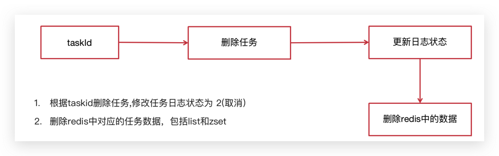

在TaskService中添加方法

```java
/**
* 取消任务
* @param taskId        任务id
* @return              取消结果
*/
public boolean cancelTask(long taskId);
```

实现

```java
/**
 * 取消任务
 * @param taskId
 * @return
 */
@Override
public boolean cancelTask(long taskId) {

    boolean flag = false;

    //删除任务，更新日志
    Taskinfo task = updateDB(taskId,ScheduleConstants.EXECUTED);

    //删除redis的数据
    if(task != null){
        removeTaskFromCache(task);
        flag = true;
    }

    return false;
}

/**
 * 删除redis中的任务数据
 * @param task
 */
private void removeTaskFromCache(Taskinfo task) {

    String key = task.getTaskType()+"_"+task.getPriority();

    if(task.getExecuteTime().compareTo(LocalDateTime.now()) <= 0){
        cacheService.lRemove(ScheduleConstants.TOPIC+key,0,JSON.toJSONString(task));
    }else {
        cacheService.zRemove(ScheduleConstants.FUTURE+key, JSON.toJSONString(task));
    }
}

/**
 * 删除任务，更新任务日志状态
 * @param taskId
 * @param status
 * @return
 */
private Taskinfo updateDB(long taskId, int status) {
    Taskinfo task = null;
    try {
        //删除任务
        taskinfoMapper.deleteById(taskId);

        TaskinfoLogs taskinfoLogs = taskinfoLogsMapper.selectById(taskId);
        taskinfoLogs.setStatus(status);
        taskinfoLogsMapper.updateById(taskinfoLogs);

        task = new Taskinfo();
        BeanUtils.copyProperties(taskinfoLogs,task);
        task.setExecuteTime(taskinfoLogs.getExecuteTime());
    }catch (Exception e){
        log.error("task cancel exception taskid={}",taskId);
    }

    return task;

}
```

<br/>

#### 消费任务

实现步骤

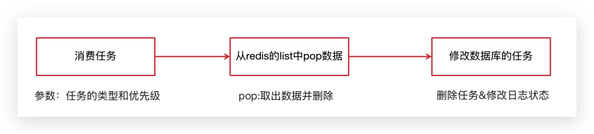

在TaskService中添加方法

```java
/**
 * 按照类型和优先级来拉取任务
 * @param type
 * @param priority
 * @return
 */
public Taskinfo poll(int type,int priority);
```

实现

```java
/**
 * 按照类型和优先级拉取任务
 *
 * @return
 */
@Override
public Taskinfo poll(int type, int priority) {
    Taskinfo task = null;
    try {
        String key = type + "_" + priority;
        String task_json = cacheService.lRightPop(ScheduleConstants.TOPIC + key);
        if (StringUtils.isNotBlank(task_json)) {
            task = JSON.parseObject(task_json, Taskinfo.class);
            //更新数据库信息
            updateDB(task.getTaskId(), ScheduleConstants.EXECUTED);
        }
    } catch (Exception e) {
        e.printStackTrace();
        log.error("poll task exception");
    }

    return task;
}
```

<br/>

#### 定时刷新

> 💡思考：定时刷新有两个问题。如何大量获取未来数据队列的 Key 值。如何将未来数据队列的数据高效率的定时刷新到当前消费队列中。

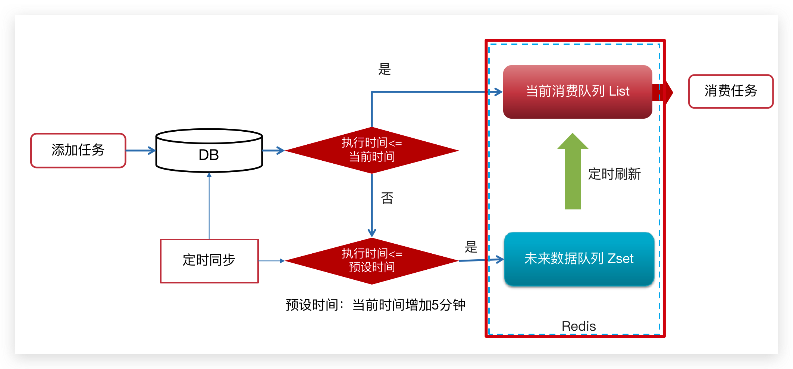

<br/>

##### Key值匹配

**方案1：keys 模糊匹配**

keys的模糊匹配功能很方便也很强大，但是在生产环境需要慎用！开发中使用keys的模糊匹配却发现redis的CPU使用率极高，所以公司的redis生产环境将keys命令禁用了！redis是单线程，会被堵塞

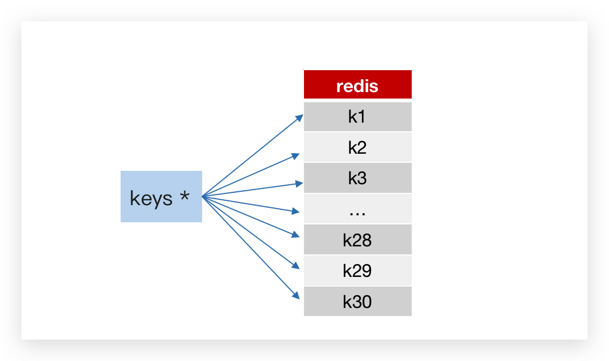

**方案2：scan** 

SCAN 命令是一个基于游标的迭代器，SCAN命令每次被调用之后， 都会向用户返回一个新的游标， 用户在下次迭代时需要使用这个新游标作为SCAN命令的游标参数， 以此来延续之前的迭代过程。

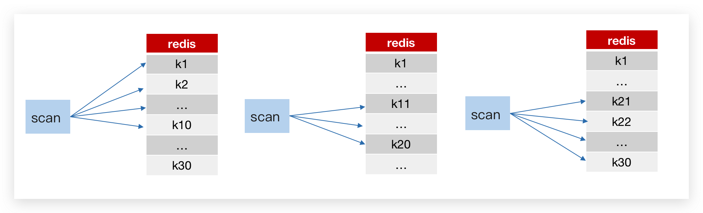

代码案例：

```java
@Test
public void testKeys(){
    Set<String> keys = cacheService.keys("future_*");
    System.out.println(keys);

    Set<String> scan = cacheService.scan("future_*");
    System.out.println(scan);
}
```

<br/>

##### Reids管道

普通redis客户端和服务器交互模式

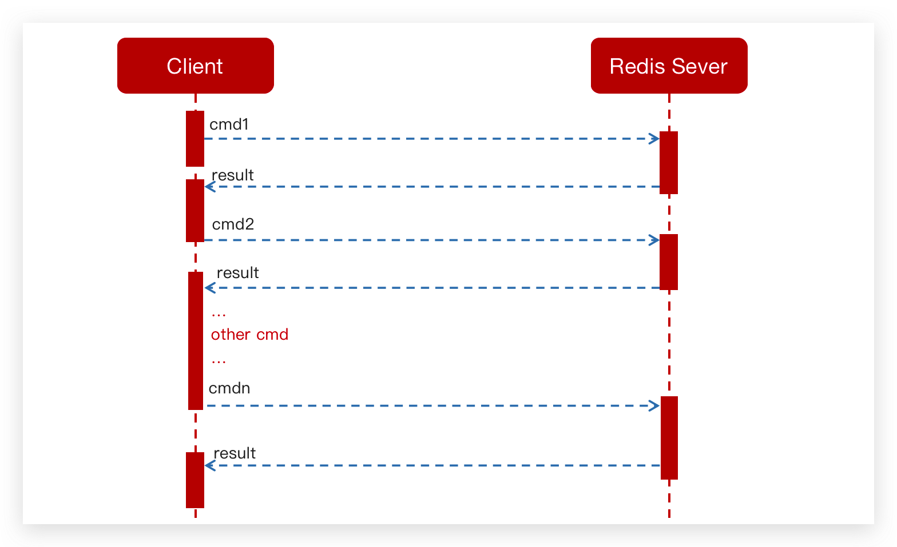

Pipeline请求模型

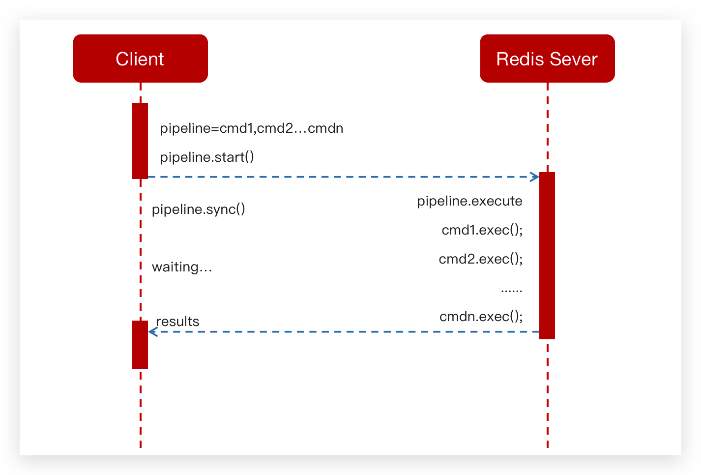

<br/>

测试案例对比：

```java
//耗时6151
@Test
public  void testPiple1(){
    long start =System.currentTimeMillis();
    for (int i = 0; i <10000 ; i++) {
        Task task = new Task();
        task.setTaskType(1001);
        task.setPriority(1);
        task.setExecuteTime(new Date().getTime());
        cacheService.lLeftPush("1001_1", JSON.toJSONString(task));
    }
    System.out.println("耗时"+(System.currentTimeMillis()- start));
}


@Test
public void testPiple2(){
    long start  = System.currentTimeMillis();
    //使用管道技术
    List<Object> objectList = cacheService.getstringRedisTemplate().executePipelined(new RedisCallback<Object>() {
        @Nullable
        @Override
        public Object doInRedis(RedisConnection redisConnection) throws DataAccessException {
            for (int i = 0; i <10000 ; i++) {
                Task task = new Task();
                task.setTaskType(1001);
                task.setPriority(1);
                task.setExecuteTime(new Date().getTime());
                redisConnection.lPush("1001_1".getBytes(), JSON.toJSONString(task).getBytes());
            }
            return null;
        }
    });
    System.out.println("使用管道技术执行10000次自增操作共耗时:"+(System.currentTimeMillis()-start)+"毫秒");
}
```

<br/>

##### 实现步骤

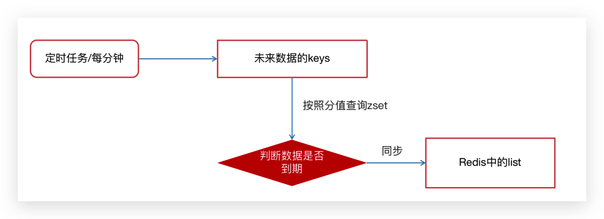

在 TaskServiceImpl 中添加方法

```java
@Scheduled(cron = "0 */1 * * * ?")
public void refresh() {
    
    log.debug( "执行定时任务的时间:{}",System.currentTimeMillis() / 1000);

    // 获取所有未来数据集合的key值
    Set<String> futureKeys = cacheService.scan(ScheduleConstants.FUTURE + "*");// future_*
    for (String futureKey : futureKeys) { // future_250_250

        String topicKey = ScheduleConstants.TOPIC + futureKey.split(ScheduleConstants.FUTURE)[1];
        //获取该组key下当前需要消费的任务数据
        Set<String> tasks = cacheService.zRangeByScore(futureKey, 0, System.currentTimeMillis());
        if (!tasks.isEmpty()) {
            //将这些任务数据添加到消费者队列中
            cacheService.refreshWithPipeline(futureKey, topicKey, tasks);
            log.debug("成功的将:{}下的当前需要执行的任务数据刷新到:{}下", futureKey, topicKey);
        }
    }
}
```

在引导类中添加开启任务调度注解：`@EnableScheduling`


<br/>

#### 分布式问题

分布式锁解决集群下的方法抢占执行

> 问题描述：启动两台 `heima-leadnews-schedule` 服务，每台服务都会去执行refresh定时任务方法

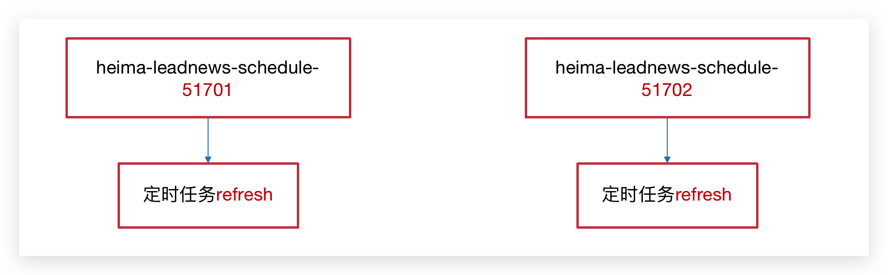

<br/>

##### 分布式锁

控制分布式系统有序的去对共享资源进行操作，通过互斥来保证数据的一致性。

解决方案：

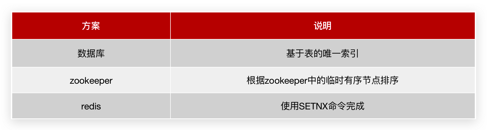

<br/>

##### Redis实现分布式锁

sexnx （SET if Not eXists） 命令在指定的 key 不存在时，为 key 设置指定的值。

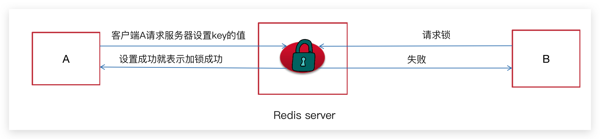

这种加锁的思路是，如果 key 不存在则为 key 设置 value，如果 key 已存在则 SETNX 命令不做任何操作

- 客户端A请求服务器设置key的值，如果设置成功就表示加锁成功
- 客户端B也去请求服务器设置key的值，如果返回失败，那么就代表加锁失败
- 客户端A执行代码完成，删除锁
- 客户端B在等待一段时间后再去请求设置key的值，设置成功
- 客户端B执行代码完成，删除锁

<br/>

**在工具类CacheService中添加方法**

```java
/**
 * 加锁
 *
 * @param name
 * @param expire
 * @return
 */
public String tryLock(String name, long expire) {
    name = name + "_lock";
    String token = UUID.randomUUID().toString();
    RedisConnectionFactory factory = stringRedisTemplate.getConnectionFactory();
    RedisConnection conn = factory.getConnection();
    try {

        //参考redis命令：
        //set key value [EX seconds] [PX milliseconds] [NX|XX]
        Boolean result = conn.set(
                name.getBytes(),
                token.getBytes(),
                Expiration.from(expire, TimeUnit.MILLISECONDS),
                RedisStringCommands.SetOption.SET_IF_ABSENT //NX
        );
        if (result != null && result)
            return token;
    } finally {
        RedisConnectionUtils.releaseConnection(conn, factory,false);
    }
    return null;
}
```

修改未来数据定时刷新的方法，如下：

```java
/**
 * 将Redis中的ZSET数据定时同步到List中，每分钟执行一次
 */
@Scheduled(cron = "0 */1 * * * ?")
public void refresh() {
    // 锁自动释放
    String token = cacheService.tryLock("FUTURE_TASK_SYNC", 1000 * 30);

    if (StringUtils.isBlank(token)) {
        return;
    }

    log.debug( "执行定时任务的时间:{}",System.currentTimeMillis() / 1000);

    // 获取所有未来数据集合的key值
    Set<String> futureKeys = cacheService.scan(ScheduleConstants.FUTURE + "*");// future_*
    for (String futureKey : futureKeys) { // future_250_250

        String topicKey = ScheduleConstants.TOPIC + futureKey.split(ScheduleConstants.FUTURE)[1];
        //获取该组key下当前需要消费的任务数据
        Set<String> tasks = cacheService.zRangeByScore(futureKey, 0, System.currentTimeMillis());
        if (!tasks.isEmpty()) {
            //将这些任务数据添加到消费者队列中
            cacheService.refreshWithPipeline(futureKey, topicKey, tasks);
            log.debug("成功的将:{}下的当前需要执行的任务数据刷新到:{}下", futureKey, topicKey);
        }
    }
}
```

<br/>


#### 定时同步

数据库的数据定时同步到Redis

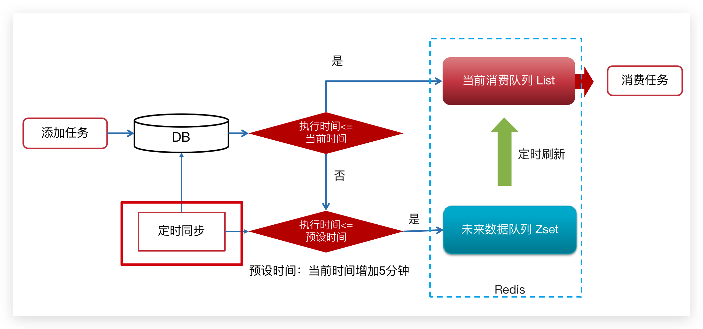

```java
/**
 * 定时将数据库的数据同步到缓存中，每五分钟执行一次
 */
@Scheduled(cron = "0 */5 * * * ?")
@PostConstruct
public void reloadData() {
    clearCache();

    log.info("数据库数据同步到缓存");
    Calendar calendar = Calendar.getInstance();
    calendar.add(Calendar.MINUTE, 5);

    //查看小于未来5分钟的所有任务
    List<Taskinfo> allTasks = taskinfoMapper.selectList(Wrappers.<Taskinfo>lambdaQuery()
            .lt(Taskinfo::getExecuteTime, calendar.getTime()));
    if (allTasks != null && allTasks.size() > 0) {
        for (Taskinfo taskinfo : allTasks) {
            Taskinfo task = new Taskinfo();
            BeanUtils.copyProperties(taskinfo, task);
            task.setExecuteTime(taskinfo.getExecuteTime());
            addTaskToCache(task);
        }
    }
}

private void clearCache() {
    // 删除缓存中未来数据集合和当前消费者队列的所有key
    Set<String> futurekeys = cacheService.scan(ScheduleConstants.FUTURE + "*");// future_
    Set<String> topickeys = cacheService.scan(ScheduleConstants.TOPIC + "*");// topic_
    cacheService.delete(futurekeys);
    cacheService.delete(topickeys);
}
```

<br/>

::: details TaskinfoServiceImpl 完整类

```java
package com.heima.schedule.service.impl;

import com.alibaba.fastjson.JSON;
import com.baomidou.mybatisplus.core.toolkit.Wrappers;
import com.heima.common.constants.ScheduleConstants;
import com.heima.common.redis.CacheService;
import com.heima.model.schedule.pojos.Taskinfo;
import com.heima.model.schedule.pojos.TaskinfoLogs;
import com.heima.schedule.mapper.TaskinfoLogsMapper;
import com.heima.schedule.mapper.TaskinfoMapper;
import com.heima.schedule.service.ITaskinfoService;
import com.baomidou.mybatisplus.extension.service.impl.ServiceImpl;
import lombok.extern.slf4j.Slf4j;
import org.apache.commons.lang3.StringUtils;
import org.springframework.beans.BeanUtils;
import org.springframework.beans.factory.annotation.Autowired;
import org.springframework.scheduling.annotation.Scheduled;
import org.springframework.stereotype.Service;
import org.springframework.transaction.annotation.Transactional;

import javax.annotation.PostConstruct;
import java.time.LocalDateTime;
import java.time.ZoneOffset;
import java.util.Calendar;
import java.util.Date;
import java.util.List;
import java.util.Set;

/**
 * <p>
 * 服务实现类
 * </p>
 *
 * @author mousse
 * @since 2024-03-07
 */
@Service
@Transactional
@Slf4j
public class TaskinfoServiceImpl extends ServiceImpl<TaskinfoMapper, Taskinfo> implements ITaskinfoService {

    /**
     * 定时将数据库的数据同步到缓存中，每五分钟执行一次
     */
    @Scheduled(cron = "0 */5 * * * ?")
    @PostConstruct
    public void reloadData() {
        clearCache();

        log.info("数据库数据同步到缓存");
        Calendar calendar = Calendar.getInstance();
        calendar.add(Calendar.MINUTE, 5);

        //查看小于未来5分钟的所有任务
        List<Taskinfo> allTasks = taskinfoMapper.selectList(Wrappers.<Taskinfo>lambdaQuery()
                .lt(Taskinfo::getExecuteTime, calendar.getTime()));
        if (allTasks != null && allTasks.size() > 0) {
            for (Taskinfo taskinfo : allTasks) {
                Taskinfo task = new Taskinfo();
                BeanUtils.copyProperties(taskinfo, task);
                task.setExecuteTime(taskinfo.getExecuteTime());
                addTaskToCache(task);
            }
        }
    }

    private void clearCache() {
        // 删除缓存中未来数据集合和当前消费者队列的所有key
        Set<String> futurekeys = cacheService.scan(ScheduleConstants.FUTURE + "*");// future_
        Set<String> topickeys = cacheService.scan(ScheduleConstants.TOPIC + "*");// topic_
        cacheService.delete(futurekeys);
        cacheService.delete(topickeys);
    }

    /**
     * 将Redis中的ZSET数据定时同步到List中
     */
    @Scheduled(cron = "0 */1 * * * ?")
    public void refresh() {
        String token = cacheService.tryLock("FUTURE_TASK_SYNC", 1000 * 30);

        if (StringUtils.isBlank(token)) {
            return;
        }

        log.debug("执行定时任务的时间:{}", System.currentTimeMillis() / 1000);

        // 获取所有未来数据集合的key值
        Set<String> futureKeys = cacheService.scan(ScheduleConstants.FUTURE + "*");// future_*
        for (String futureKey : futureKeys) { // future_250_250

            String topicKey = ScheduleConstants.TOPIC + futureKey.split(ScheduleConstants.FUTURE)[1];
            //获取该组key下当前需要消费的任务数据
            Set<String> tasks = cacheService.zRangeByScore(futureKey, 0, System.currentTimeMillis());
            if (!tasks.isEmpty()) {
                //将这些任务数据添加到消费者队列中
                cacheService.refreshWithPipeline(futureKey, topicKey, tasks);
                log.debug("成功的将:{}下的当前需要执行的任务数据刷新到:{}下", futureKey, topicKey);
            }
        }
    }

    @Override
    public long addTask(Taskinfo task) {
        //1.添加任务到数据库中
        boolean success = addTaskToDB(task);

        if (success) {
            //2.添加任务到redis
            addTaskToCache(task);
        }


        return task.getTaskId();
    }

    /**
     * 取消任务
     *
     * @param taskId
     * @return
     */
    @Override
    public boolean cancelTask(long taskId) {

        boolean flag = false;

        //删除任务，更新日志
        Taskinfo task = updateDB(taskId, ScheduleConstants.EXECUTED);

        //删除redis的数据
        if (task != null) {
            removeTaskFromCache(task);
            flag = true;
        }

        return false;
    }

    /**
     * 按照类型和优先级拉取任务
     *
     * @return
     */
    @Override
    public Taskinfo poll(int type, int priority) {
        Taskinfo task = null;
        try {
            String key = type + "_" + priority;
            String task_json = cacheService.lRightPop(ScheduleConstants.TOPIC + key);
            if (StringUtils.isNotBlank(task_json)) {
                task = JSON.parseObject(task_json, Taskinfo.class);
                //更新数据库信息
                updateDB(task.getTaskId(), ScheduleConstants.EXECUTED);
            }
        } catch (Exception e) {
            e.printStackTrace();
            log.error("poll task exception");
        }

        return task;
    }

    /**
     * 删除redis中的任务数据
     *
     * @param task
     */
    private void removeTaskFromCache(Taskinfo task) {

        String key = task.getTaskType() + "_" + task.getPriority();

        if (task.getExecuteTime().compareTo(LocalDateTime.now()) <= 0) {
            cacheService.lRemove(ScheduleConstants.TOPIC + key, 0, JSON.toJSONString(task));
        } else {
            cacheService.zRemove(ScheduleConstants.FUTURE + key, JSON.toJSONString(task));
        }
    }

    /**
     * 删除任务，更新任务日志状态
     *
     * @param taskId
     * @param status
     * @return
     */
    private Taskinfo updateDB(long taskId, int status) {
        Taskinfo task = null;
        try {
            //删除任务
            taskinfoMapper.deleteById(taskId);

            TaskinfoLogs taskinfoLogs = taskinfoLogsMapper.selectById(taskId);
            taskinfoLogs.setStatus(status);
            taskinfoLogsMapper.updateById(taskinfoLogs);

            task = new Taskinfo();
            BeanUtils.copyProperties(taskinfoLogs, task);
            task.setExecuteTime(taskinfoLogs.getExecuteTime());
        } catch (Exception e) {
            log.error("task cancel exception taskid={}", taskId);
        }

        return task;

    }

    @Autowired
    private CacheService cacheService;

    private void addTaskToCache(Taskinfo task) {
        String key = task.getTaskType() + "_" + task.getPriority();

        //获取5分钟之后的时间  毫秒值
        LocalDateTime now = LocalDateTime.now();
        LocalDateTime nextTime = now.plusMinutes(5);

        //2.1 如果任务的执行时间小于等于当前时间，存入list
        if (task.getExecuteTime().compareTo(now) <= 0) {
            cacheService.lLeftPush(ScheduleConstants.TOPIC + key, JSON.toJSONString(task));
        } else if (task.getExecuteTime().compareTo(nextTime) <= 0) {
            //2.2 如果任务的执行时间大于当前时间 && 小于等于预设时间（未来5分钟） 存入zset中
            cacheService.zAdd(ScheduleConstants.FUTURE + key, JSON.toJSONString(task),
                    task.getExecuteTime().toEpochSecond(ZoneOffset.UTC));
        }

    }

    @Autowired
    private TaskinfoMapper taskinfoMapper;

    @Autowired
    private TaskinfoLogsMapper taskinfoLogsMapper;

    /**
     * 添加任务到数据库中
     *
     * @param task
     * @return
     */
    private boolean addTaskToDB(Taskinfo task) {

        boolean flag = false;

        try {
            //保存任务表
            Taskinfo taskinfo = new Taskinfo();
            BeanUtils.copyProperties(task, taskinfo);
            taskinfo.setExecuteTime(task.getExecuteTime());
            taskinfoMapper.insert(taskinfo);

            //设置taskID
            task.setTaskId(taskinfo.getTaskId());

            //保存任务日志数据
            TaskinfoLogs taskinfoLogs = new TaskinfoLogs();
            BeanUtils.copyProperties(taskinfo, taskinfoLogs);
            taskinfoLogs.setVersion(1);
            taskinfoLogs.setStatus(ScheduleConstants.SCHEDULED);
            taskinfoLogsMapper.insert(taskinfoLogs);

            flag = true;
        } catch (Exception e) {
            e.printStackTrace();
        }

        return flag;
    }


}

```

:::

<br/>

### 文章延迟发布

::: tip 🔖实现步骤

- 将封装的延迟队列服务提供对外接口，供自媒体服务使用
- 自媒体服务的发布文章功能将审核文章功能添加到延迟队列接口中
- 自媒体服务添加定时任务定时执行消费审核文章的接口

:::

**延迟队列服务提供对外接口**

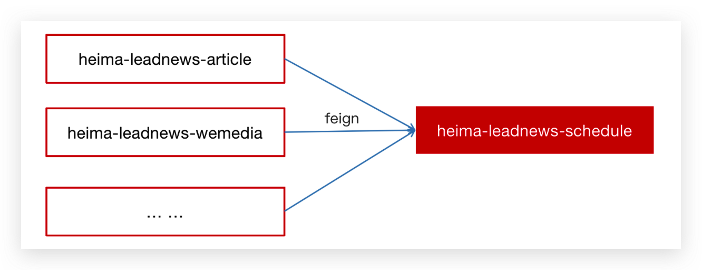

```xml
<dependency>
        <groupId>org.springframework.cloud</groupId>
        <artifactId>spring-cloud-openfeign-core</artifactId>
        <version>2.2.7.RELEASE</version>
</dependency>
```

提供远程的feign接口，在`heima-leadnews-feign-api` 编写类如下：

```java
package com.heima.apis.schedule;

import com.heima.model.common.dtos.ResponseResult;
import com.heima.model.schedule.pojos.Taskinfo;
import org.springframework.cloud.openfeign.FeignClient;
import org.springframework.web.bind.annotation.GetMapping;
import org.springframework.web.bind.annotation.PathVariable;
import org.springframework.web.bind.annotation.PostMapping;
import org.springframework.web.bind.annotation.RequestBody;

@FeignClient("leadnews-schedule")
public interface IScheduleClient {

    /**
     * 添加任务
     * @param task   任务对象
     * @return       任务id
     */
    @PostMapping("/api/v1/task/add")
    public ResponseResult  addTask(@RequestBody Taskinfo task);

    /**
     * 取消任务
     * @param taskId        任务id
     * @return              取消结果
     */
    @GetMapping("/api/v1/task/cancel/{taskId}")
    public ResponseResult cancelTask(@PathVariable("taskId") long taskId);

    /**
     * 按照类型和优先级来拉取任务
     * @param type
     * @param priority
     * @return
     */
    @GetMapping("/api/v1/task/poll/{type}/{priority}")
    public ResponseResult poll(@PathVariable("type") int type,@PathVariable("priority")  int priority);
}
```

在 `heima-leadnews-schedule` 微服务下提供对应的实现

```java
package com.heima.schedule.client;

import com.heima.apis.schedule.IScheduleClient;
import com.heima.model.common.dtos.ResponseResult;
import com.heima.model.schedule.pojos.Taskinfo;
import com.heima.schedule.service.ITaskinfoService;
import org.springframework.beans.factory.annotation.Autowired;
import org.springframework.web.bind.annotation.*;


@RestController
public class ScheduleClient implements IScheduleClient {

    @Autowired
    private ITaskinfoService taskService;

    /**
     * 添加任务
     *
     * @param task 任务对象
     * @return 任务id
     */
    @PostMapping("/api/v1/task/add")
    @Override
    public ResponseResult addTask(@RequestBody Taskinfo task) {
        return ResponseResult.okResult(taskService.addTask(task));
    }

    /**
     * 取消任务
     *
     * @param taskId 任务id
     * @return 取消结果
     */
    @GetMapping("/api/v1/task/cancel/{taskId}")
    @Override
    public ResponseResult cancelTask(@PathVariable("taskId") long taskId) {
        return ResponseResult.okResult(taskService.cancelTask(taskId));
    }

    /**
     * 按照类型和优先级来拉取任务
     *
     * @param type
     * @param priority
     * @return
     */
    @GetMapping("/api/v1/task/poll/{type}/{priority}")
    @Override
    public ResponseResult poll(@PathVariable("type") int type, @PathVariable("priority") int priority) {
        return ResponseResult.okResult(taskService.poll(type, priority));
    }
}
```

<br/>

**发布文章集成添加延迟队列接口**

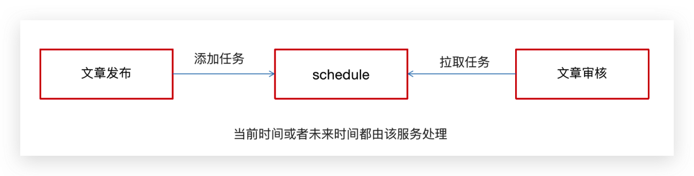

在创建WmNewsTaskService

```java
package com.heima.wemedia.service;

import java.util.Date;


public interface WmNewsTaskService {

    /**
     * 添加任务到延迟队列中
     * @param id  文章的id
     * @param publishTime  发布的时间  可以做为任务的执行时间
     */
    public void addNewsToTask(Integer id, Date publishTime);

}
```

实现：

```java
package com.heima.wemedia.service.impl;

import com.heima.apis.schedule.IScheduleClient;
import com.heima.common.enums.TaskTypeEnum;
import com.heima.model.schedule.pojos.Taskinfo;
import com.heima.model.wemedia.pojos.WmNews;
import com.heima.utils.common.ProtostuffUtil;
import com.heima.wemedia.service.WmNewsTaskService;
import lombok.extern.slf4j.Slf4j;
import org.springframework.beans.factory.annotation.Autowired;
import org.springframework.scheduling.annotation.Async;
import org.springframework.stereotype.Service;

import java.time.LocalDateTime;
import java.util.Date;


@Service
@Slf4j
public class WmNewsTaskServiceImpl  implements WmNewsTaskService {


    @Autowired
    private IScheduleClient scheduleClient;

    /**
     * 添加任务到延迟队列中
     * @param id          文章的id
     * @param publishTime 发布的时间  可以做为任务的执行时间
     */
    @Override
    @Async
    public void addNewsToTask(Integer id, LocalDateTime publishTime) {

        log.info("添加任务到延迟服务中----begin");

        Taskinfo task = new Taskinfo();
        task.setExecuteTime(publishTime);
        task.setTaskType(TaskTypeEnum.NEWS_SCAN_TIME.getTaskType());
        task.setPriority(TaskTypeEnum.NEWS_SCAN_TIME.getPriority());
        WmNews wmNews = new WmNews();
        wmNews.setId(id);
        task.setParameters(ProtostuffUtil.serialize(wmNews));

        scheduleClient.addTask(task);

        log.info("添加任务到延迟服务中----end");

    }
    
}
```

<br/>

枚举类：

```java
package com.heima.model.common.enums;

import lombok.AllArgsConstructor;
import lombok.Getter;

@Getter
@AllArgsConstructor
public enum TaskTypeEnum {

    NEWS_SCAN_TIME(1001, 1,"文章定时审核"),
    REMOTEERROR(1002, 2,"第三方接口调用失败，重试");
    private final int taskType; //对应具体业务
    private final int priority; //业务不同级别
    private final String desc; //描述信息
}
```

<br/>

修改 Taskinfo 字段

```java {40}
package com.heima.model.schedule.pojos;

import com.baomidou.mybatisplus.annotation.TableName;
import com.baomidou.mybatisplus.annotation.IdType;
import java.time.LocalDateTime;
import com.baomidou.mybatisplus.annotation.TableId;
import java.sql.Blob;
import java.io.Serializable;
import io.swagger.annotations.ApiModel;
import io.swagger.annotations.ApiModelProperty;
import lombok.Data;
import lombok.EqualsAndHashCode;
import lombok.experimental.Accessors;

/**
 * <p>
 * 
 * </p>
 *
 * @author mousse
 * @since 2024-03-07
 */
@Data
@EqualsAndHashCode(callSuper = false)
@Accessors(chain = true)
@TableName("taskinfo")
@ApiModel(value="Taskinfo对象", description="")
public class Taskinfo implements Serializable {

    private static final long serialVersionUID = 1L;

    @ApiModelProperty(value = "任务id")
    @TableId(value = "task_id", type = IdType.ASSIGN_ID)
    private Long taskId;

    @ApiModelProperty(value = "执行时间")
    private LocalDateTime executeTime;

    @ApiModelProperty(value = "参数")
    private byte[] parameters;

    @ApiModelProperty(value = "优先级")
    private Integer priority;

    @ApiModelProperty(value = "任务类型")
    private Integer taskType;
    
}
```

<br/>

序列化工具对比

- JdkSerialize：Java 内置的序列化能将实现了 Serilazable 接口的对象进行序列化和反序列化， ObjectOutputStream 的 writeObject() 方法可序列化对象生成字节数组

  :::details JdkSerialize

  ```java
  package com.heima.utils.common;
  
  import java.io.ByteArrayInputStream;
  import java.io.ByteArrayOutputStream;
  import java.io.ObjectInputStream;
  import java.io.ObjectOutputStream;
  
  /**
   * jdk序列化
   */
  public class JdkSerializeUtil {
  
      /**
       * 序列化
       * @param obj
       * @param <T>
       * @return
       */
      public static <T> byte[] serialize(T obj) {
  
          if (obj  == null){
              throw new NullPointerException();
          }
  
          ByteArrayOutputStream bos = new ByteArrayOutputStream();
          try {
              ObjectOutputStream oos = new ObjectOutputStream(bos);
  
              oos.writeObject(obj);
              return bos.toByteArray();
          } catch (Exception ex) {
              ex.printStackTrace();
          }
          return new byte[0];
      }
  
      /**
       * 反序列化
       * @param data
       * @param clazz
       * @param <T>
       * @return
       */
      public static <T> T deserialize(byte[] data, Class<T> clazz) {
          ByteArrayInputStream bis = new ByteArrayInputStream(data);
  
          try {
              ObjectInputStream ois = new ObjectInputStream(bis);
              T obj = (T)ois.readObject();
              return obj;
          } catch (Exception ex) {
              ex.printStackTrace();
          }
  
          return  null;
      }
  }
  ```

  :::

- Protostuff：google 开源的 protostuff 采用更为紧凑的二进制数组，表现更加优异，然后使用protostuff 的编译工具生成pojo类

  :::details Protostuff

  ```java
  package com.heima.utils.common;
  
  
  import com.heima.model.wemedia.pojos.WmNews;
  import io.protostuff.LinkedBuffer;
  import io.protostuff.ProtostuffIOUtil;
  import io.protostuff.Schema;
  import io.protostuff.runtime.RuntimeSchema;
  
  public class ProtostuffUtil {
  
      /**
       * 序列化
       * @param t
       * @param <T>
       * @return
       */
      public static <T> byte[] serialize(T t){
          Schema schema = RuntimeSchema.getSchema(t.getClass());
          return ProtostuffIOUtil.toByteArray(t,schema,
                  LinkedBuffer.allocate(LinkedBuffer.DEFAULT_BUFFER_SIZE));
   
      }
  
      /**
       * 反序列化
       * @param bytes
       * @param c
       * @param <T>
       * @return
       */
      public static <T> T deserialize(byte []bytes,Class<T> c) {
          T t = null;
          try {
              t = c.newInstance();
              Schema schema = RuntimeSchema.getSchema(t.getClass());
               ProtostuffIOUtil.mergeFrom(bytes,t,schema);
          } catch (InstantiationException e) {
              e.printStackTrace();
          } catch (IllegalAccessException e) {
              e.printStackTrace();
          }
          return t;
      }
  
      /**
       * jdk序列化与protostuff序列化对比
       * @param args
       */
      public static void main(String[] args) {
          long start =System.currentTimeMillis();
          for (int i = 0; i <1000000 ; i++) {
              WmNews wmNews =new WmNews();
              JdkSerializeUtil.serialize(wmNews);
          }
          System.out.println(" jdk 花费 "+(System.currentTimeMillis()-start));
  
          start =System.currentTimeMillis();
          for (int i = 0; i <1000000 ; i++) {
              WmNews wmNews =new WmNews();
              ProtostuffUtil.serialize(wmNews);
          }
          System.out.println(" protostuff 花费 "+(System.currentTimeMillis()-start));
      }
  
   
   
  }
  ```

  :::

<br/>

拷贝资料中的两个类到 `heima-leadnews-utils`下

Protostuff 需要引导依赖：

```xml
<dependency>
    <groupId>io.protostuff</groupId>
    <artifactId>protostuff-core</artifactId>
    <version>1.6.0</version>
</dependency>

<dependency>
    <groupId>io.protostuff</groupId>
    <artifactId>protostuff-runtime</artifactId>
    <version>1.6.0</version>
</dependency>
```

<br/>

修改发布文章代码：

把之前 WmNewsServiceImpl 的 submitNews方法 异步调用修改为调用延迟任务

```java
@Autowired
private WmNewsTaskService wmNewsTaskService;

/**
 * 发布修改文章或保存为草稿
 * @param dto
 * @return
 */
@Override
@GlobalTransactional // [!code --]
public ResponseResult submitNews(WmNewsDto dto) {

    //0.条件判断
    if (dto == null || dto.getContent() == null) {
        return ResponseResult.errorResult(AppHttpCodeEnum.PARAM_INVALID);
    }

    //1.保存或修改文章
    WmNews wmNews = new WmNews();
    //属性拷贝 属性名词和类型相同才能拷贝
    BeanUtils.copyProperties(dto, wmNews);
    //封面图片  list---> string
    if (dto.getImages() != null && dto.getImages().size() > 0) {
        //[1dddfsd.jpg,sdlfjldk.jpg]-->   1dddfsd.jpg,sdlfjldk.jpg
        String imageStr = StringUtils.join(dto.getImages(), ",");
        wmNews.setImages(imageStr);
    }
    //如果当前封面类型为自动 -1
    if (dto.getType().equals(WeMediaConstants.WM_NEWS_TYPE_AUTO)) {
        wmNews.setType(null);
    }

    saveOrUpdateWmNews(wmNews);

    //2.判断是否为草稿  如果为草稿结束当前方法
    if (dto.getStatus().equals(WmNews.Status.NORMAL.getCode())) {
        return ResponseResult.okResult(AppHttpCodeEnum.SUCCESS);
    }

    //3.不是草稿，保存文章内容图片与素材的关系
    //获取到文章内容中的图片信息
    List<String> materials = ectractUrlInfo(dto.getContent());
    saveRelativeInfoForContent(materials, wmNews.getId());

    //4.不是草稿，保存文章封面图片与素材的关系，如果当前布局是自动，需要匹配封面图片
    saveRelativeInfoForCover(dto, wmNews, materials);

    //5.审核文章
    wmNewsAutoScanService.autoScanWmNews(wmNews.getId()); // [!code --]
    wmNewsTaskService.addNewsToTask(wmNews.getId(),wmNews.getPublishTime());  // [!code ++]

    return ResponseResult.okResult(AppHttpCodeEnum.SUCCESS);
}
```

::: warning 💡思考：Seata 管理的 @GlobalTransactional 为什么可以注解掉

- 因为文章通过延迟队列接口，将文章的发布功能和文章的审核功能进行了解藕。通过消息队列的方式实现了分布式事务。

:::

<br/>

**消费任务进行审核文章**

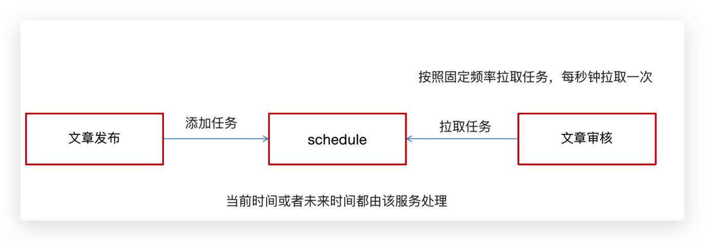

WmNewsTaskService 添加方法

```java
/**
 * 通过消费延迟队列执行文章审核
 */
public void scanNewsByTask();
```

WmNewsTaskServiceImpl 实现

```java
/**
 * 消费延迟队列数据
 */
@Scheduled(fixedRate = 1000)
@Override
@SneakyThrows
public void scanNewsByTask() {

    log.info("文章审核---消费任务执行---begin---");

    ResponseResult responseResult = scheduleClient.poll(TaskTypeEnum.NEWS_SCAN_TIME.getTaskType(), TaskTypeEnum.NEWS_SCAN_TIME.getPriority());
    if(responseResult.getCode().equals(200) && responseResult.getData() != null){
        String json_str = JSON.toJSONString(responseResult.getData());
        Taskinfo task = JSON.parseObject(json_str, Taskinfo.class);
        byte[] parameters = task.getParameters();
        WmNews wmNews = ProtostuffUtil.deserialize(parameters, WmNews.class);
        System.out.println(wmNews.getId()+"-----------");
        wmNewsAutoScanService.autoScanWmNews(wmNews.getId());
    }
    log.info("文章审核---消费任务执行---end---");
}
```

<br/>

在WemediaApplication自媒体的引导类中添加开启任务调度注解`@EnableScheduling`

```java {21}
package com.heima.wemedia;

import com.baomidou.mybatisplus.annotation.DbType;
import com.baomidou.mybatisplus.extension.plugins.MybatisPlusInterceptor;
import com.baomidou.mybatisplus.extension.plugins.inner.PaginationInnerInterceptor;
import lombok.extern.slf4j.Slf4j;
import org.mybatis.spring.annotation.MapperScan;
import org.springframework.boot.SpringApplication;
import org.springframework.boot.autoconfigure.SpringBootApplication;
import org.springframework.cloud.client.discovery.EnableDiscoveryClient;
import org.springframework.cloud.openfeign.EnableFeignClients;
import org.springframework.context.annotation.Bean;
import org.springframework.scheduling.annotation.EnableScheduling;


@Slf4j
@SpringBootApplication
@EnableDiscoveryClient
@MapperScan("com.heima.wemedia.mapper")
@EnableFeignClients(basePackages = "com.heima.apis")
@EnableScheduling
public class WeMediaApplication {
    public static void main(String[] args) {
        SpringApplication.run(WeMediaApplication.class, args);
    }

    @Bean
    public MybatisPlusInterceptor mybatisPlusInterceptor() {
        MybatisPlusInterceptor interceptor = new MybatisPlusInterceptor();
        interceptor.addInnerInterceptor(new PaginationInnerInterceptor(DbType.MYSQL));
        return interceptor;
    }
}
```


学习总结
--------
