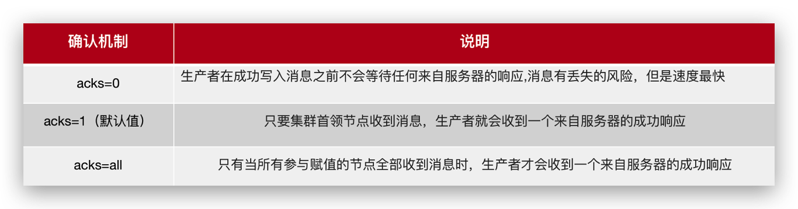

Day06-异步通知文章上下架
========================

[[toc]]

## 今日内容

自媒体文章上下架需求分析


服务调用关系图


流量削峰，点赞和不喜欢


今日内容


Kafka入门
-----------

### kafka概述

消息中间件对比


**选择建议**


**kafka介绍**

Kafka 是一个分布式流媒体平台,类似于消息队列或企业消息传递系统。

kafka官网：http://kafka.apache.org/  


**名词解释**


- producer：发布消息的对象称之为主题生产者（Kafka topic producer）

- topic：Kafka将消息分门别类，每一类的消息称之为一个主题（Topic）

- consumer：订阅消息并处理发布的消息的对象称之为主题消费者（consumers）

- broker：已发布的消息保存在一组服务器中，称之为Kafka集群。集群中的每一个服务器都是一个代理（Broker）。 消费者可以订阅一个或多个主题（topic），并从Broker拉数据，从而消费这些已发布的消息。


### kafka安装

参考资料：[安装Kafka](00-自定义服务#安装Kafka)


### kafka快速入门


- 案例一：生产者发送消息，多个消费者只能有一个消费者接收到消息
- 案例二：生产者发送消息，多个消费者都可以接收到消息


#### 入门案例

##### 1.生产者发送消息

生产者发送消息步骤


（1）创建kafka-demo项目，导入依赖

```xml
<dependency>
    <groupId>org.apache.kafka</groupId>
    <artifactId>kafka-clients</artifactId>
</dependency>
```

（2）生产者发送消息

```java
package com.heima.kafka.sample;

import org.apache.kafka.clients.producer.KafkaProducer;
import org.apache.kafka.clients.producer.ProducerConfig;
import org.apache.kafka.clients.producer.ProducerRecord;

import java.util.Properties;

/**
 * 生产者
 */
public class ProducerQuickStart {

    public static void main(String[] args) {
        //1.kafka的配置信息
        Properties properties = new Properties();
        //kafka的连接地址
        properties.put(ProducerConfig.BOOTSTRAP_SERVERS_CONFIG,"47.108.90.242:9092");
        //发送失败，失败的重试次数
        properties.put(ProducerConfig.RETRIES_CONFIG,5);
        //消息key的序列化器
        properties.put(ProducerConfig.KEY_SERIALIZER_CLASS_CONFIG,"org.apache.kafka.common.serialization.StringSerializer");
        //消息value的序列化器
        properties.put(ProducerConfig.VALUE_SERIALIZER_CLASS_CONFIG,"org.apache.kafka.common.serialization.StringSerializer");

        //2.生产者对象
        KafkaProducer<String,String> producer = new KafkaProducer<String, String>(properties);

        //封装发送的消息
        ProducerRecord<String,String> record = new ProducerRecord<String, String>("itheima-topic","100001","hello kafka");

        //3.发送消息
        producer.send(record);

        //4.关闭消息通道，必须关闭，否则消息发送不成功
        producer.close();
    }

}
```


##### 2.消费者接收消息

消费者接收消息步骤


消费者接收消息

```java
package com.heima.kafka.sample;

import org.apache.kafka.clients.consumer.ConsumerConfig;
import org.apache.kafka.clients.consumer.ConsumerRecord;
import org.apache.kafka.clients.consumer.ConsumerRecords;
import org.apache.kafka.clients.consumer.KafkaConsumer;

import java.time.Duration;
import java.util.Collections;
import java.util.Properties;

/**
 * 消费者
 */
public class ConsumerQuickStart {

    public static void main(String[] args) {
        //1.添加kafka的配置信息
        Properties properties = new Properties();
        //kafka的连接地址
        properties.put(ConsumerConfig.BOOTSTRAP_SERVERS_CONFIG, "47.108.90.242:9092");
        //消费者组
        properties.put(ConsumerConfig.GROUP_ID_CONFIG, "group2");
        //消息的反序列化器
        properties.put(ConsumerConfig.KEY_DESERIALIZER_CLASS_CONFIG, "org.apache.kafka.common.serialization.StringDeserializer");
        properties.put(ConsumerConfig.VALUE_DESERIALIZER_CLASS_CONFIG, "org.apache.kafka.common.serialization.StringDeserializer");

        //2.消费者对象
        KafkaConsumer<String, String> consumer = new KafkaConsumer<String, String>(properties);

        //3.订阅主题
        consumer.subscribe(Collections.singletonList("itheima-topic"));

        //当前线程一直处于监听状态
        while (true) {
            //4.获取消息
            ConsumerRecords<String, String> consumerRecords = consumer.poll(Duration.ofMillis(1000));
            for (ConsumerRecord<String, String> consumerRecord : consumerRecords) {
                System.out.println(consumerRecord.key());
                System.out.println(consumerRecord.value());
            }
        }

    }

}
```


总结

- 生产者发送消息，多个消费者订阅同一个主题，只能有一个消费者收到消息（一对一）


- 生产者发送消息，多个消费者订阅同一个主题，所有消费者都能收到消息（一对多）


#### 分区机制

Kafka 中的分区机制指的是将每个主题划分成多个分区（Partition）可以处理更多的消息，不受单台服务器的限制，可以不受限的处理更多的数据


Topic解析

每一个分区都是一个顺序的、不可变的消息队列， 并且可以持续的添加。分区中的消息都被分了一个序列号，称之为偏移量(offset)，在每个分区中此偏移量都是唯一的。


分区策略


### kafka高可用设计

#### 集群


- Kafka 的服务器端由被称为 Broker 的服务进程构成，即一个 Kafka 集群由多个 Broker 组成

- 这样如果集群中某一台机器宕机，其他机器上的 Broker 也依然能够对外提供服务。这其实就是 Kafka 提供高可用的手段之一


#### 备份机制


Kafka 中消息的备份又叫做 副本（Replica）

Kafka 定义了两类副本：

- 领导者副本（Leader Replica）

- 追随者副本（Follower Replica）


**同步方式**


ISR（in-sync replica）需要同步复制保存的follower


如果leader失效后，需要选出新的leader，选举的原则如下：

第一：选举时优先从ISR中选定，因为这个列表中follower的数据是与leader同步的

第二：如果ISR列表中的follower都不行了，就只能从其他follower中选取


极端情况，就是所有副本都失效了，这时有两种方案

第一：等待ISR中的一个活过来，选为Leader，数据可靠，但活过来的时间不确定

第二：选择第一个活过来的Replication，不一定是ISR中的，选为leader，以最快速度恢复可用性，但数据不一定完整


### kafka生产者详解 

#### 发送类型

- 同步发送

   使用send()方法发送，它会返回一个Future对象，调用get()方法进行等待，就可以知道消息是否发送成功

```java
RecordMetadata recordMetadata = producer.send(kvProducerRecord).get();
System.out.println(recordMetadata.offset());
```

- 异步发送

   调用send()方法，并指定一个回调函数，服务器在返回响应时调用函数

```java
//异步消息发送
producer.send(kvProducerRecord, new Callback() {
    @Override
    public void onCompletion(RecordMetadata recordMetadata, Exception e) {
        if(e != null){
            System.out.println("记录异常信息到日志表中");
        }
        System.out.println(recordMetadata.offset());
    }
});
```


#### 参数详解

##### 1.参数详解（ack）

- ack


代码的配置方式：

```java
//ack配置  消息确认机制
prop.put(ProducerConfig.ACKS_CONFIG,"all");
```

参数的选择说明



##### 2.参数详解（retries）

- retries


生产者从服务器收到的错误有可能是临时性错误，在这种情况下，retries参数的值决定了生产者可以重发消息的次数，如果达到这个次数，生产者会放弃重试返回错误，默认情况下，生产者会在每次重试之间等待100ms

代码中配置方式：

```java
//重试次数
prop.put(ProducerConfig.RETRIES_CONFIG,10);
```


##### 3.参数详解-压缩参数

- 消息压缩

默认情况下， 消息发送时不会被压缩。

代码中配置方式：

```java
//数据压缩
prop.put(ProducerConfig.COMPRESSION_TYPE_CONFIG,"lz4");
```

压缩算法


使用压缩可以降低网络传输开销和存储开销，而这往往是向 Kafka 发送消息的瓶颈所在。

### kafka消费者详解

#### 消费者组


- 消费者组（Consumer Group） ：指的就是由一个或多个消费者组成的群体

- 一个发布在Topic上消息被分发给此消费者组中的一个消费者

  - 所有的消费者都在一个组中，那么这就变成了queue模型

  - 所有的消费者都在不同的组中，那么就完全变成了发布-订阅模型


#### 消息有序性

应用场景：

- 即时消息中的单对单聊天和群聊，保证发送方消息发送顺序与接收方的顺序一致

- 充值转账两个渠道在同一个时间进行余额变更，短信通知必须要有顺序


topic分区中消息只能由消费者组中的唯一一个消费者处理，所以消息肯定是按照先后顺序进行处理的。但是它也仅仅是保证Topic的一个分区顺序处理，不能保证跨分区的消息先后处理顺序。 所以，如果你想要顺序的处理Topic的所有消息，那就只提供一个分区。


#### 提交和偏移量

kafka不会像其他JMS队列那样需要得到消费者的确认，消费者可以使用kafka来追踪消息在分区的位置（偏移量）

消费者会往一个叫做_consumer_offset的特殊主题发送消息，消息里包含了每个分区的偏移量。如果消费者发生崩溃或有新的消费者加入群组，就会触发再均衡


正常的情况


如果消费者2挂掉以后，会发生再均衡，消费者2负责的分区会被其他消费者进行消费

再均衡后不可避免会出现一些问题

问题一：


如果提交偏移量小于客户端处理的最后一个消息的偏移量，那么处于两个偏移量之间的消息就会被重复处理。


问题二：


如果提交的偏移量大于客户端的最后一个消息的偏移量，那么处于两个偏移量之间的消息将会丢失。


如果想要解决这些问题，还要知道目前kafka提交偏移量的方式：

提交偏移量的方式有两种，分别是自动提交偏移量和手动提交

- 自动提交偏移量

当enable.auto.commit被设置为true，提交方式就是让消费者自动提交偏移量，每隔5秒消费者会自动把从poll()方法接收的最大偏移量提交上去

- 手动提交 ，当enable.auto.commit被设置为false可以有以下三种提交方式

  - 提交当前偏移量（同步提交）

  - 异步提交

  - 同步和异步组合提交


1.提交当前偏移量（同步提交）

把`enable.auto.commit`设置为false,让应用程序决定何时提交偏移量。使用commitSync()提交偏移量，commitSync()将会提交poll返回的最新的偏移量，所以在处理完所有记录后要确保调用了commitSync()方法。否则还是会有消息丢失的风险。

只要没有发生不可恢复的错误，commitSync()方法会一直尝试直至提交成功，如果提交失败也可以记录到错误日志里。

```java
while (true){
    ConsumerRecords<String, String> records = consumer.poll(Duration.ofMillis(1000));
    for (ConsumerRecord<String, String> record : records) {
        System.out.println(record.value());
        System.out.println(record.key());
        try {
            consumer.commitSync();//同步提交当前最新的偏移量
        }catch (CommitFailedException e){
            System.out.println("记录提交失败的异常："+e);
        }

    }
}
```

2.异步提交

手动提交有一个缺点，那就是当发起提交调用时应用会阻塞。当然我们可以减少手动提交的频率，但这个会增加消息重复的概率（和自动提交一样）。另外一个解决办法是，使用异步提交的API。

```java
while (true){
    ConsumerRecords<String, String> records = consumer.poll(Duration.ofMillis(1000));
    for (ConsumerRecord<String, String> record : records) {
        System.out.println(record.value());
        System.out.println(record.key());
    }
    consumer.commitAsync(new OffsetCommitCallback() {
        @Override
        public void onComplete(Map<TopicPartition, OffsetAndMetadata> map, Exception e) {
            if(e!=null){
                System.out.println("记录错误的提交偏移量："+ map+",异常信息"+e);
            }
        }
    });
}
```

3.同步和异步组合提交

异步提交也有个缺点，那就是如果服务器返回提交失败，异步提交不会进行重试。相比较起来，同步提交会进行重试直到成功或者最后抛出异常给应用。异步提交没有实现重试是因为，如果同时存在多个异步提交，进行重试可能会导致位移覆盖。

```java
try {
    while (true){
        ConsumerRecords<String, String> records = consumer.poll(Duration.ofMillis(1000));
        for (ConsumerRecord<String, String> record : records) {
            System.out.println(record.value());
            System.out.println(record.key());
        }
        consumer.commitAsync();
    }
}catch (Exception e){+
    e.printStackTrace();
    System.out.println("记录错误信息："+e);
}finally {
    try {
        consumer.commitSync();
    }finally {
        consumer.close();
    }
}
```


### Springboot集成Kafka

#### 入门

1.导入spring-kafka依赖信息

```xml
<dependencies>
    <dependency>
        <groupId>org.springframework.boot</groupId>
        <artifactId>spring-boot-starter-web</artifactId>
    </dependency>
    <!-- kafkfa -->
    <dependency>
        <groupId>org.springframework.kafka</groupId>
        <artifactId>spring-kafka</artifactId>
        <exclusions>
            <exclusion>
                <groupId>org.apache.kafka</groupId>
                <artifactId>kafka-clients</artifactId>
            </exclusion>
        </exclusions>
    </dependency>
    <dependency>
        <groupId>org.apache.kafka</groupId>
        <artifactId>kafka-clients</artifactId>
    </dependency>
    <dependency>
        <groupId>com.alibaba</groupId>
        <artifactId>fastjson</artifactId>
    </dependency>
</dependencies>
```

2.在resources下创建文件application.yml

```yaml
server:
  port: 9991
spring:
  application:
    name: kafka-demo
  kafka:
    bootstrap-servers: 47.108.90.242:9092
    producer:
      retries: 10
      key-serializer: org.apache.kafka.common.serialization.StringSerializer
      value-serializer: org.apache.kafka.common.serialization.StringSerializer
    consumer:
      group-id: ${spring.application.name}-test
      key-deserializer: org.apache.kafka.common.serialization.StringDeserializer
      value-deserializer: org.apache.kafka.common.serialization.StringDeserializer
```

3.消息生产者

```java
package com.heima.kafka.controller;

import org.springframework.beans.factory.annotation.Autowired;
import org.springframework.kafka.core.KafkaTemplate;
import org.springframework.web.bind.annotation.GetMapping;
import org.springframework.web.bind.annotation.RestController;

@RestController
public class HelloController {

    @Autowired
    private KafkaTemplate<String,String> kafkaTemplate;

    @GetMapping("/hello")
    public String hello(){
        kafkaTemplate.send("itcast-topic","黑马程序员");
        return "ok";
    }
}
```

4.消息消费者

```java
package com.heima.kafka.listener;

import org.springframework.kafka.annotation.KafkaListener;
import org.springframework.stereotype.Component;
import org.springframework.util.StringUtils;

@Component
public class HelloListener {

    @KafkaListener(topics = "itcast-topic")
    public void onMessage(String message){
        if(!StringUtils.isEmpty(message)){
            System.out.println(message);
        }

    }
}
```


#### 传递消息为对象

目前springboot整合后的kafka，因为序列化器是StringSerializer，这个时候如果需要传递对象可以有两种方式

方式一：可以自定义序列化器，对象类型众多，这种方式通用性不强，本章节不介绍

方式二：可以把要传递的对象进行转json字符串，接收消息后再转为对象即可，本项目采用这种方式

- 发送消息

```java
@GetMapping("/hello")
public String hello(){
    User user = new User();
    user.setUsername("xiaowang");
    user.setAge(18);

    kafkaTemplate.send("user-topic", JSON.toJSONString(user));

    return "ok";
}
```

- 接收消息

```java
package com.heima.kafka.listener;

import com.alibaba.fastjson.JSON;
import com.heima.kafka.pojo.User;
import org.springframework.kafka.annotation.KafkaListener;
import org.springframework.stereotype.Component;
import org.springframework.util.StringUtils;

@Component
public class HelloListener {

    @KafkaListener(topics = "user-topic")
    public void onMessage(String message){
        if(!StringUtils.isEmpty(message)){
            User user = JSON.parseObject(message, User.class);
            System.out.println(user);
        }

    }
}
```


## 文章上下架

### 需求分析


- 已发表且已上架的文章可以下架

- 已发表且已下架的文章可以上架


### 流程说明


### 接口定义

|          | **说明**                |
| -------- | ----------------------- |
| 接口路径 | /api/v1/news/down_or_up |
| 请求方式 | POST                    |
| 参数     | DTO                     |
| 响应结果 | ResponseResult          |

 DTO  

```java
@Data
public class WmNewsDto {
    
    private Integer id;
    /**
    * 是否上架  0 下架  1 上架
    */
    private Short enable;
                       
}
```

ResponseResult  


### 自媒体文章上下架-功能实现

接口定义

在heima-leadnews-wemedia工程下的WmNewsController新增方法

```java
@PostMapping("/down_or_up")
public ResponseResult downOrUp(@RequestBody WmNewsDto dto){
    return null;
}
```

在WmNewsDto中新增enable属性 ，完整的代码如下：

```java
package com.heima.model.wemedia.dtos;

import lombok.Data;

import java.util.Date;
import java.util.List;

@Data
public class WmNewsDto {
    
    private Integer id;
     /**
     * 标题
     */
    private String title;
     /**
     * 频道id
     */
    private Integer channelId;
     /**
     * 标签
     */
    private String labels;
     /**
     * 发布时间
     */
    private Date publishTime;
     /**
     * 文章内容
     */
    private String content;
     /**
     * 文章封面类型  0 无图 1 单图 3 多图 -1 自动
     */
    private Short type;
     /**
     * 提交时间
     */
    private Date submitedTime; 
     /**
     * 状态 提交为1  草稿为0
     */
    private Short status;
     
     /**
     * 封面图片列表 多张图以逗号隔开
     */
    private List<String> images;

    /**
     * 上下架 0 下架  1 上架
     */
    private Short enable;
}
```

9.4.2)业务层编写

在WmNewsService新增方法

```java
/**
 * 文章的上下架
 * @param dto
 * @return
 */
public ResponseResult downOrUp(WmNewsDto dto);
```

实现方法

```java
/**
 * 文章的上下架
 * @param dto
 * @return
 */
@Override
public ResponseResult downOrUp(WmNewsDto dto) {
    //1.检查参数
    if(dto.getId() == null){
        return ResponseResult.errorResult(AppHttpCodeEnum.PARAM_INVALID);
    }

    //2.查询文章
    WmNews wmNews = getById(dto.getId());
    if(wmNews == null){
        return ResponseResult.errorResult(AppHttpCodeEnum.DATA_NOT_EXIST,"文章不存在");
    }

    //3.判断文章是否已发布
    if(!wmNews.getStatus().equals(WmNews.Status.PUBLISHED.getCode())){
        return ResponseResult.errorResult(AppHttpCodeEnum.PARAM_INVALID,"当前文章不是发布状态，不能上下架");
    }

    //4.修改文章enable
    if(dto.getEnable() != null && dto.getEnable() > -1 && dto.getEnable() < 2){
        update(Wrappers.<WmNews>lambdaUpdate().set(WmNews::getEnable,dto.getEnable())
                .eq(WmNews::getId,wmNews.getId()));
    }
    return ResponseResult.okResult(AppHttpCodeEnum.SUCCESS);
}
```

控制器

```java
@PostMapping("/down_or_up")
public ResponseResult downOrUp(@RequestBody WmNewsDto dto){
    return wmNewsService.downOrUp(dto);
}
```

测试


### 消息通知article端文章上下架

在heima-leadnews-common模块下导入kafka依赖

```xml
<!-- kafkfa -->
<dependency>
    <groupId>org.springframework.kafka</groupId>
    <artifactId>spring-kafka</artifactId>
</dependency>
<dependency>
    <groupId>org.apache.kafka</groupId>
    <artifactId>kafka-clients</artifactId>
</dependency>
```

在自媒体端的nacos配置中心配置kafka的生产者

```yaml
spring:
  kafka:
    bootstrap-servers: 47.108.90.242:9092
    producer:
      retries: 10
      key-serializer: org.apache.kafka.common.serialization.StringSerializer
      value-serializer: org.apache.kafka.common.serialization.StringSerializer
```

在自媒体端文章上下架后发送消息

```java
//发送消息，通知article端修改文章配置
if(wmNews.getArticleId() != null){
    Map<String,Object> map = new HashMap<>();
    map.put("articleId",wmNews.getArticleId());
    map.put("enable",dto.getEnable());
    kafkaTemplate.send(WmNewsMessageConstants.WM_NEWS_UP_OR_DOWN_TOPIC,JSON.toJSONString(map));
}
```

常量类：

```java
public class WmNewsMessageConstants {

    public static final String WM_NEWS_UP_OR_DOWN_TOPIC="wm.news.up.or.down.topic";
}
```

在article端的nacos配置中心配置kafka的消费者

```yaml
spring:
  kafka:
    bootstrap-servers: 47.108.90.242:9092
    consumer:
      group-id: ${spring.application.name}
      key-deserializer: org.apache.kafka.common.serialization.StringDeserializer
      value-deserializer: org.apache.kafka.common.serialization.StringDeserializer
```

在article端编写监听，接收数据，修改 ap_article_config 表的数据

```java
package com.heima.article.listener;

import com.alibaba.fastjson.JSON;
import com.heima.article.service.ApArticleConfigService;
import com.heima.common.constants.WmNewsMessageConstants;
import lombok.extern.slf4j.Slf4j;
import org.apache.commons.lang.StringUtils;
import org.springframework.beans.factory.annotation.Autowired;
import org.springframework.kafka.annotation.KafkaListener;
import org.springframework.stereotype.Component;

import java.util.Map;

@Component
@Slf4j
public class ArticleIsDownListener {

    @Autowired
    private ApArticleConfigService apArticleConfigService;

    @KafkaListener(topics = WmNewsMessageConstants.WM_NEWS_UP_OR_DOWN_TOPIC)
    public void onMessage(String message){
        if(StringUtils.isNotBlank(message)){
            Map map = JSON.parseObject(message, Map.class);
            apArticleConfigService.updateByMap(map);
            log.info("article端文章配置修改，articleId={}",map.get("articleId"));
        }
    }
}

```

新建ApArticleConfigService

```java
package com.heima.article.service;

import com.baomidou.mybatisplus.extension.service.IService;
import com.heima.model.article.pojos.ApArticleConfig;

import java.util.Map;

public interface ApArticleConfigService extends IService<ApArticleConfig> {

    /**
     * 修改文章配置
     * @param map
     */
    public void updateByMap(Map map);
}
```

实现类：

```java
package com.heima.article.service.impl;

import com.baomidou.mybatisplus.core.toolkit.Wrappers;
import com.baomidou.mybatisplus.extension.service.impl.ServiceImpl;
import com.heima.article.mapper.ApArticleConfigMapper;
import com.heima.article.service.ApArticleConfigService;
import com.heima.model.article.pojos.ApArticleConfig;
import lombok.extern.slf4j.Slf4j;
import org.springframework.stereotype.Service;
import org.springframework.transaction.annotation.Transactional;

import java.util.Map;

@Service
@Slf4j
@Transactional
public class ApArticleConfigServiceImpl extends ServiceImpl<ApArticleConfigMapper, ApArticleConfig> implements ApArticleConfigService {


    /**
     * 修改文章配置
     * @param map
     */
    @Override
    public void updateByMap(Map map) {
        //0 下架 1 上架
        Object enable = map.get("enable");
        boolean isDown = true;
        if(enable.equals(1)){
            isDown = false;
        }
        //修改文章配置
        update(Wrappers.<ApArticleConfig>lambdaUpdate().eq(ApArticleConfig::getArticleId,map.get("articleId")).set(ApArticleConfig::getIsDown,isDown));

    }
}
```


Kafka配置信息
---------------

### 生产者配置

| NAME                                     | DESCRIPTION                                                  | TYPE     | DEFAULT                                                      | VALID VALUES       | IMPORTANCE |
| ---------------------------------------- | ------------------------------------------------------------ | -------- | ------------------------------------------------------------ | ------------------ | ---------- |
| bootstrap.servers                        | host/port列表，用于初始化建立和Kafka集群的连接。列表格式为host1:port1,host2:port2,....，无需添加所有的集群地址，kafka会根据提供的地址发现其他的地址（你可以多提供几个，以防提供的服务器关闭） | list     |                                                              |                    | high       |
| key.serializer                           | 实现 org.apache.kafka.common.serialization.Serializer 接口的 key 的 Serializer  类。 | class    |                                                              |                    | high       |
| value.serializer                         | 实现 org.apache.kafka.common.serialization.Serializer 接口的value 的 Serializer  类。 | class    |                                                              |                    | high       |
| acks                                     | 生产者需要leader确认请求完成之前接收的应答数。此配置控制了发送消息的耐用性，支持以下配置： | string   | 1                                                            | [all, -1, 0, 1]    | high       |
|                                          | acks=0  如果设置为0，那么生产者将不等待任何消息确认。消息将立刻添加到socket缓冲区并考虑发送。在这种情况下不能保障消息被服务器接收到。并且重试机制不会生效（因为客户端不知道故障了没有）。每个消息返回的offset始终设置为-1。 |          |                                                              |                    |            |
|                                          | acks=1，这意味着leader写入消息到本地日志就立即响应，而不等待所有follower应答。在这种情况下，如果响应消息之后但follower还未复制之前leader立即故障，那么消息将会丢失。 |          |                                                              |                    |            |
|                                          | acks=all  这意味着leader将等待所有副本同步后应答消息。此配置保障消息不会丢失（只要至少有一个同步的副本或者）。这是最强壮的可用性保障。等价于acks=-1。 |          |                                                              |                    |            |
| buffer.memory                            | 生产者用来缓存等待发送到服务器的消息的内存总字节数。如果消息发送比可传递到服务器的快，生产者将阻塞max.block.ms之后，抛出异常。 | long     | 33554432                                                     | [0,...]            | high       |
|                                          | 此设置应该大致的对应生产者将要使用的总内存，但不是硬约束，因为生产者所使用的所有内存都用于缓冲。一些额外的内存将用于压缩（如果启动压缩），以及用于保持发送中的请求。 |          |                                                              |                    |            |
| compression.type                         | 数据压缩的类型。默认为空（就是不压缩）。有效的值有 none，gzip，snappy, 或  lz4。压缩全部的数据批，因此批的效果也将影响压缩的比率（更多的批次意味着更好的压缩）。 | string   | none                                                         |                    | high       |
| retries                                  | 设置一个比零大的值，客户端如果发送失败则会重新发送。注意，这个重试功能和客户端在接到错误之后重新发送没什么不同。如果max.in.flight.requests.per.connection没有设置为1，有可能改变消息发送的顺序，因为如果2个批次发送到一个分区中，并第一个失败了并重试，但是第二个成功了，那么第二个批次将超过第一个。 | int      | 0                                                            | [0,...,2147483647] | high       |
| ssl.key.password                         | 密钥仓库文件中的私钥的密码。                                 | password | null                                                         |                    | high       |
| ssl.keystore.location                    | 密钥仓库文件的位置。可用于客户端的双向认证。                 | string   | null                                                         |                    | high       |
| ssl.keystore.password                    | 密钥仓库文件的仓库密码。只有配置了ssl.keystore.location时才需要。 | password | null                                                         |                    | high       |
| ssl.truststore.location                  | 信任仓库的位置                                               | string   | null                                                         |                    | high       |
| ssl.truststore.password                  | 信任仓库文件的密码                                           | password | null                                                         |                    | high       |
| batch.size                               | 当多个消息要发送到相同分区的时，生产者尝试将消息批量打包在一起，以减少请求交互。这样有助于客户端和服务端的性能提升。该配置的默认批次大小（以字节为单位）： | int      | 16384                                                        | [0,...]            | medium     |
|                                          | 不会打包大于此配置大小的消息。                               |          |                                                              |                    |            |
|                                          | 发送到broker的请求将包含多个批次，每个分区一个，用于发送数据。 |          |                                                              |                    |            |
|                                          | 较小的批次大小有可能降低吞吐量（批次大小为0则完全禁用批处理）。一个非常大的批次大小可能更浪费内存。因为我们会预先分配这个资源。 |          |                                                              |                    |            |
| client.id                                | 当发出请求时传递给服务器的id字符串。这样做的目的是允许服务器请求记录记录这个【逻辑应用名】，这样能够追踪请求的源，而不仅仅只是ip/prot。 | string   | ""                                                           |                    | medium     |
| connections.max.idle.ms                  | 多少毫秒之后关闭闲置的连接。                                 | long     | 540000                                                       |                    | medium     |
| linger.ms                                | 生产者组将发送的消息组合成单个批量请求。正常情况下，只有消息到达的速度比发送速度快的情况下才会出现。但是，在某些情况下，即使在适度的负载下，客户端也可能希望减少请求数量。此设置通过添加少量人为延迟来实现。-  也就是说，不是立即发出一个消息，生产者将等待一个给定的延迟，以便和其他的消息可以组合成一个批次。这类似于Nagle在TCP中的算法。此设置给出批量延迟的上限：一旦我们达到分区的batch.size值的记录，将立即发送，不管这个设置如何，但是，如果比这个小，我们将在指定的“linger”时间内等待更多的消息加入。此设置默认为0（即无延迟）。假设，设置  linger.ms=5，将达到减少发送的请求数量的效果，但对于在没有负载情况，将增加5ms的延迟。 | long     | 0                                                            | [0,...]            | medium     |
| max.block.ms                             | 该配置控制 KafkaProducer.send() 和 KafkaProducer.partitionsFor()  将阻塞多长时间。此外这些方法被阻止，也可能是因为缓冲区已满或元数据不可用。在用户提供的序列化程序或分区器中的锁定不会计入此超时。 | long     | 60000                                                        | [0,...]            | medium     |
| max.request.size                         | 请求的最大大小（以字节为单位）。此设置将限制生产者的单个请求中发送的消息批次数，以避免发送过大的请求。这也是最大消息批量大小的上限。请注意，服务器拥有自己的批量大小，可能与此不同。 | int      | 1048576                                                      | [0,...]            | medium     |
| partitioner.class                        | 实现Partitioner接口的的Partitioner类。                       | class    | org.apache.kafka.clients.producer.internals.DefaultPartitioner |                    | medium     |
| receive.buffer.bytes                     | 读取数据时使用的TCP接收缓冲区(SO_RCVBUF)的大小。如果值为-1，则将使用OS默认值。 | int      | 32768                                                        | [-1,...]           | medium     |
| request.timeout.ms                       | 该配置控制客户端等待请求响应的最长时间。如果在超时之前未收到响应，客户端将在必要时重新发送请求，如果重试耗尽，则该请求将失败。  这应该大于replica.lag.time.max.ms，以减少由于不必要的生产者重试引起的消息重复的可能性。 | int      | 30000                                                        | [0,...]            | medium     |
| sasl.jaas.config                         | JAAS配置文件使用的格式的SASL连接的JAAS登录上下文参数。这里描述JAAS配置文件格式。该值的格式为：'（=）*;' | password | null                                                         |                    | medium     |
| sasl.kerberos.service.name               | Kafka运行的Kerberos主体名称。可以在Kafka的JAAS配置或Kafka的配置中定义。 | string   | null                                                         |                    | medium     |
| sasl.mechanism                           | SASL机制用于客户端连接。这是安全提供者可用与任何机制。GSSAPI是默认机制。 | string   | GSSAPI                                                       |                    | medium     |
| security.protocol                        | 用于与broker通讯的协议。 有效值为：PLAINTEXT，SSL，SASL_PLAINTEXT，SASL_SSL。 | string   | PLAINTEXT                                                    |                    | medium     |
| send.buffer.bytes                        | 发送数据时，用于TCP发送缓存（SO_SNDBUF）的大小。如果值为 -1，将默认使用系统的。 | int      | 131072                                                       | [-1,...]           | medium     |
| ssl.enabled.protocols                    | 启用SSL连接的协议列表。                                      | list     | TLSv1.2,TLSv1.1,TLSv1                                        |                    | medium     |
| ssl.keystore.type                        | 密钥存储文件的文件格式。对于客户端是可选的。                 | string   | JKS                                                          |                    | medium     |
| ssl.protocol                             | 最近的JVM中允许的值是TLS，TLSv1.1和TLSv1.2。  较旧的JVM可能支持SSL，SSLv2和SSLv3，但由于已知的安全漏洞，不建议使用SSL。 | string   | TLS                                                          |                    | medium     |
| ssl.provider                             | 用于SSL连接的安全提供程序的名称。默认值是JVM的默认安全提供程序。 | string   | null                                                         |                    | medium     |
| ssl.truststore.type                      | 信任仓库文件的文件格式。                                     | string   | JKS                                                          |                    | medium     |
| enable.idempotence                       | 当设置为‘true’，生产者将确保每个消息正好一次复制写入到stream。如果‘false’，由于broker故障，生产者重试。即，可以在流中写入重试的消息。此设置默认是‘false’。请注意，启用幂等式需要将max.in.flight.requests.per.connection设置为1，重试次数不能为零。另外acks必须设置为“全部”。如果这些值保持默认值，我们将覆盖默认值。  如果这些值设置为与幂等生成器不兼容的值，则将抛出一个ConfigException异常。如果这些值设置为与幂等生成器不兼容的值，则将抛出一个ConfigException异常。 | boolean  | FALSE                                                        |                    | low        |
| interceptor.classes                      | 实现ProducerInterceptor接口，你可以在生产者发布到Kafka群集之前拦截（也可变更）生产者收到的消息。默认情况下没有拦截器。 | list     | null                                                         |                    | low        |
| max.in.flight.requests.per.connection    | 阻塞之前，客户端单个连接上发送的未应答请求的最大数量。注意，如果此设置设置大于1且发送失败，则会由于重试（如果启用了重试）会导致消息重新排序的风险。 | int      | 5                                                            | [1,...]            | low        |
| metadata.max.age.ms                      | 在一段时间段之后（以毫秒为单位），强制更新元数据，即使我们没有看到任何分区leader的变化，也会主动去发现新的broker或分区。 | long     | 300000                                                       | [0,...]            | low        |
| metric.reporters                         | 用作metrics reporters（指标记录员）的类的列表。实现MetricReporter接口，将受到新增加的度量标准创建类插入的通知。  JmxReporter始终包含在注册JMX统计信息中。 | list     | ""                                                           |                    | low        |
| metrics.num.samples                      | 维护用于计算度量的样例数量。                                 | int      | 2                                                            | [1,...]            | low        |
| metrics.recording.level                  | 指标的最高记录级别。                                         | string   | INFO                                                         | [INFO, DEBUG]      | low        |
| metrics.sample.window.ms                 | 度量样例计算上                                               | long     | 30000                                                        | [0,...]            | low        |
| reconnect.backoff.max.ms                 | 重新连接到重复无法连接的代理程序时等待的最大时间（毫秒）。 如果提供，每个主机的回退将会连续增加，直到达到最大值。  计算后退增加后，增加20％的随机抖动以避免连接风暴。 | long     | 1000                                                         | [0,...]            | low        |
| reconnect.backoff.ms                     | 尝试重新连接到给定主机之前等待的基本时间量。这避免了在循环中高频率的重复连接到主机。这种回退适应于客户端对broker的所有连接尝试。 | long     | 50                                                           | [0,...]            | low        |
| retry.backoff.ms                         | 尝试重试指定topic分区的失败请求之前等待的时间。这样可以避免在某些故障情况下高频次的重复发送请求。 | long     | 100                                                          | [0,...]            | low        |
| sasl.kerberos.kinit.cmd                  | Kerberos kinit 命令路径。                                    | string   | /usr/bin/kinit                                               |                    | low        |
| sasl.kerberos.min.time.before.relogin    | Login线程刷新尝试之间的休眠时间。                            | long     | 60000                                                        |                    | low        |
| sasl.kerberos.ticket.renew.jitter        | 添加更新时间的随机抖动百分比。                               | double   | 0.05                                                         |                    | low        |
| sasl.kerberos.ticket.renew.window.factor | 登录线程将睡眠，直到从上次刷新ticket到期时间的指定窗口因子为止，此时将尝试续订ticket。 | double   | 0.8                                                          |                    | low        |
| ssl.cipher.suites                        | 密码套件列表。这是使用TLS或SSL网络协议来协商用于网络连接的安全设置的认证，加密，MAC和密钥交换算法的命名组合。默认情况下，支持所有可用的密码套件。 | list     | null                                                         |                    | low        |
| ssl.endpoint.identification.algorithm    | 使用服务器证书验证服务器主机名的端点识别算法。               | string   | null                                                         |                    | low        |
| ssl.keymanager.algorithm                 | 用于SSL连接的密钥管理因子算法。默认值是为Java虚拟机配置的密钥管理器工厂算法。 | string   | SunX509                                                      |                    | low        |
| ssl.secure.random.implementation         | 用于SSL加密操作的SecureRandom PRNG实现。                     | string   | null                                                         |                    | low        |
| ssl.trustmanager.algorithm               | 用于SSL连接的信任管理因子算法。默认值是JAVA虚拟机配置的信任管理工厂算法。 | string   | PKIX                                                         |                    | low        |
| transaction.timeout.ms                   | 生产者在主动中止正在进行的交易之前，交易协调器等待事务状态更新的最大时间（以ms为单位）。如果此值大于broker中的max.transaction.timeout.ms设置，则请求将失败，并报“InvalidTransactionTimeout”错误。 | int      | 60000                                                        |                    | low        |
| transactional.id                         | 用于事务传递的TransactionalId。这样可以跨多个生产者会话的可靠性语义，因为它允许客户端保证在开始任何新事务之前使用相同的TransactionalId的事务已经完成。如果没有提供TransactionalId，则生产者被限制为幂等传递。请注意，如果配置了TransactionalId，则必须启用enable.idempotence。  默认值为空，这意味着无法使用事务。 | string   | null                                                         | non-empty string   | low        |

### 消费者配置

| NAME                                                   | DESCRIPTION                                                  | TYPE     | DEFAULT                 | VALID VALUES             | IMPORTANCE |
| ------------------------------------------------------ | ------------------------------------------------------------ | -------- | ----------------------- | ------------------------ | ---------- |
| bootstrap.servers                                      | host/port,用于和kafka集群建立初始化连接。因为这些服务器地址仅用于初始化连接，并通过现有配置的来发现全部的kafka集群成员（集群随时会变化），所以此列表不需要包含完整的集群地址（但尽量多配置几个，以防止配置的服务器宕机）。 | list     |                         |                          | high       |
| key.deserializer                                       | key的解析序列化接口实现类（Deserializer）。                  | class    |                         |                          | high       |
| value.deserializer                                     | value的解析序列化接口实现类（Deserializer）                  | class    |                         |                          | high       |
| fetch.min.bytes                                        | 服务器哦拉取请求返回的最小数据量，如果数据不足，请求将等待数据积累。默认设置为1字节，表示只要单个字节的数据可用或者读取等待请求超时，就会应答读取请求。将此值设置的越大将导致服务器等待数据累积的越长，这可能以一些额外延迟为代价提高服务器吞吐量。 | int      | 1                       | [0,...]                  | high       |
| group.id                                               | 此消费者所属消费者组的唯一标识。如果消费者用于订阅或offset管理策略的组管理功能，则此属性是必须的。 | string   | ""                      |                          | high       |
| heartbeat.interval.ms                                  | 当使用Kafka的分组管理功能时，心跳到消费者协调器之间的预计时间。心跳用于确保消费者的会话保持活动状态，并当有新消费者加入或离开组时方便重新平衡。该值必须必比session.timeout.ms小，通常不高于1/3。它可以调整的更低，以控制正常重新平衡的预期时间。 | int      | 3000                    |                          | high       |
| max.partition.fetch.bytes                              | 服务器将返回每个分区的最大数据量。如果拉取的第一个非空分区中第一个消息大于此限制，则仍然会返回消息，以确保消费者可以正常的工作。broker接受的最大消息大小通过message.max.bytes（broker config）或max.message.bytes (topic  config)定义。参阅fetch.max.bytes以限制消费者请求大小。 | int      | 1048576                 | [0,...]                  | high       |
| session.timeout.ms                                     | 用于发现消费者故障的超时时间。消费者周期性的发送心跳到broker，表示其还活着。如果会话超时期满之前没有收到心跳，那么broker将从分组中移除消费者，并启动重新平衡。请注意，该值必须在broker配置的group.min.session.timeout.ms和group.max.session.timeout.ms允许的范围内。 | int      | 10000                   |                          | high       |
| ssl.key.password                                       | 密钥存储文件中的私钥的密码。  客户端可选                     | password | null                    |                          | high       |
| ssl.keystore.location                                  | 密钥存储文件的位置，  这对于客户端是可选的，并且可以用于客户端的双向认证。 | string   | null                    |                          | high       |
| ssl.keystore.password                                  | 密钥仓库文件的仓库密码。客户端可选，只有ssl.keystore.location配置了才需要。 | password | null                    |                          | high       |
| ssl.truststore.location                                | 信任仓库文件的位置                                           | string   | null                    |                          | high       |
| ssl.truststore.password                                | 信任仓库文件的密码                                           | password | null                    |                          | high       |
| auto.offset.reset                                      | 当Kafka中没有初始offset或如果当前的offset不存在时（例如，该数据被删除了），该怎么办。 | string   | latest                  | [latest, earliest, none] | medium     |
| 最早：自动将偏移重置为最早的偏移                       |                                                              |          |                         |                          |            |
| 最新：自动将偏移重置为最新偏移                         |                                                              |          |                         |                          |            |
| none：如果消费者组找到之前的offset，则向消费者抛出异常 |                                                              |          |                         |                          |            |
| 其他：抛出异常给消费者。                               |                                                              |          |                         |                          |            |
| connections.max.idle.ms                                | 指定在多少毫秒之后关闭闲置的连接                             | long     | 540000                  |                          | medium     |
| enable.auto.commit                                     | 如果为true，消费者的offset将在后台周期性的提交               | boolean  | TRUE                    |                          | medium     |
| exclude.internal.topics                                | 内部topic的记录（如偏移量）是否应向消费者公开。如果设置为true，则从内部topic接受记录的唯一方法是订阅它。 | boolean  | TRUE                    |                          | medium     |
| fetch.max.bytes                                        | 服务器为拉取请求返回的最大数据值。这不是绝对的最大值，如果在第一次非空分区拉取的第一条消息大于该值，该消息将仍然返回，以确保消费者继续工作。接收的最大消息大小通过message.max.bytes  (broker config) 或 max.message.bytes (topic config)定义。注意，消费者是并行执行多个提取的。 | int      | 52428800                | [0,...]                  | medium     |
| max.poll.interval.ms                                   | 使用消费者组管理时poll()调用之间的最大延迟。消费者在获取更多记录之前可以空闲的时间量的上限。如果此超时时间期满之前poll()没有调用，则消费者被视为失败，并且分组将重新平衡，以便将分区重新分配给别的成员。 | int      | 300000                  | [1,...]                  | medium     |
| max.poll.records                                       | 在单次调用poll()中返回的最大记录数。                         | int      | 500                     | [1,...]                  | medium     |
| partition.assignment.strategy                          | 当使用组管理时，客户端将使用分区分配策略的类名来分配消费者实例之间的分区所有权 | list     | class  org.apache.kafka |                          | medium     |
| .clients.consumer                                      |                                                              |          |                         |                          |            |
| .RangeAssignor                                         |                                                              |          |                         |                          |            |
| receive.buffer.bytes                                   | 读取数据时使用的TCP接收缓冲区（SO_RCVBUF）的大小。  如果值为-1，则将使用OS默认值。 | int      | 65536                   | [-1,...]                 | medium     |
| request.timeout.ms                                     | 配置控制客户端等待请求响应的最长时间。  如果在超时之前未收到响应，客户端将在必要时重新发送请求，如果重试耗尽则客户端将重新发送请求。 | int      | 305000                  | [0,...]                  | medium     |
| sasl.jaas.config                                       | JAAS配置文件中SASL连接登录上下文参数。  这里描述JAAS配置文件格式。 该值的格式为： '(=)*;' | password | null                    |                          | medium     |
| sasl.kerberos.service.name                             | Kafka运行Kerberos  principal名。可以在Kafka的JAAS配置文件或在Kafka的配置文件中定义。 | string   | null                    |                          | medium     |
| sasl.mechanism                                         | 用于客户端连接的SASL机制。安全提供者可用的机制。GSSAPI是默认机制。 | string   | GSSAPI                  |                          | medium     |
| security.protocol                                      | 用于与broker通讯的协议。  有效值为：PLAINTEXT，SSL，SASL_PLAINTEXT，SASL_SSL。 | string   | PLAINTEXT               |                          | medium     |
| send.buffer.bytes                                      | 发送数据时要使用的TCP发送缓冲区（SO_SNDBUF）的大小。  如果值为-1，则将使用OS默认值。 | int      | 131072                  | [-1,...]                 | medium     |
| ssl.enabled.protocols                                  | 启用SSL连接的协议列表。                                      | list     | TLSv1.2,TLSv1.1,TLSv1   |                          | medium     |
| ssl.keystore.type                                      | key仓库文件的文件格式，客户端可选。                          | string   | JKS                     |                          | medium     |
| ssl.protocol                                           | 用于生成SSLContext的SSL协议。  默认设置是TLS，这对大多数情况都是适用的。 最新的JVM中的允许值为TLS，TLSv1.1和TLSv1.2。  较旧的JVM可能支持SSL，SSLv2和SSLv3，但由于已知的安全漏洞，不建议使用SSL。 | string   | TLS                     |                          | medium     |
| ssl.provider                                           | 用于SSL连接的安全提供程序的名称。  默认值是JVM的默认安全提供程序。 | string   | null                    |                          | medium     |
| ssl.truststore.type                                    | 信任存储文件的文件格式。                                     | string   | JKS                     |                          | medium     |
| auto.commit.interval.ms                                | 如果enable.auto.commit设置为true，则消费者偏移量自动提交给Kafka的频率（以毫秒为单位）。 | int      | 5000                    | [0,...]                  | low        |
| check.crcs                                             | 自动检查CRC32记录的消耗。  这样可以确保消息发生时不会在线或磁盘损坏。 此检查增加了一些开销，因此在寻求极致性能的情况下可能会被禁用。 | boolean  | TRUE                    |                          | low        |
| client.id                                              | 在发出请求时传递给服务器的id字符串。  这样做的目的是通过允许将逻辑应用程序名称包含在服务器端请求日志记录中，来跟踪ip/port的请求源。 | string   | ""                      |                          | low        |
| fetch.max.wait.ms                                      | 如果没有足够的数据满足fetch.min.bytes，服务器将在接收到提取请求之前阻止的最大时间。 | int      | 500                     | [0,...]                  | low        |
| interceptor.classes                                    | 用作拦截器的类的列表。  你可实现ConsumerInterceptor接口以允许拦截（也可能变化）消费者接收的记录。 默认情况下，没有拦截器。 | list     | null                    |                          | low        |
| metadata.max.age.ms                                    | 在一定时间段之后（以毫秒为单位的），强制更新元数据，即使没有任何分区领导变化，任何新的broker或分区。 | long     | 300000                  | [0,...]                  | low        |
| metric.reporters                                       | 用作度量记录员类的列表。实现MetricReporter接口以允许插入通知新的度量创建的类。JmxReporter始终包含在注册JMX统计信息中。 | list     | ""                      |                          | low        |
| metrics.num.samples                                    | 保持的样本数以计算度量。                                     | int      | 2                       | [1,...]                  | low        |
| metrics.recording.level                                | 最高的记录级别。                                             | string   | INFO                    | [INFO,  DEBUG]           | low        |
| metrics.sample.window.ms                               | The  window of time a metrics sample is computed over.       | long     | 30000                   | [0,...]                  | low        |
| reconnect.backoff.ms                                   | 尝试重新连接指定主机之前等待的时间，避免频繁的连接主机，这种机制适用于消费者向broker发送的所有请求。 | long     | 50                      | [0,...]                  | low        |
| retry.backoff.ms                                       | 尝试重新发送失败的请求到指定topic分区之前的等待时间。避免在某些故障情况下，频繁的重复发送。 | long     | 100                     | [0,...]                  | low        |
| sasl.kerberos.kinit.cmd Kerberos                       | kinit命令路径。                                              | string   | /usr/bin/kinit          |                          | low        |
| sasl.kerberos.min.time.before.relogin                  | 尝试/恢复之间的登录线程的休眠时间。                          | long     | 60000                   |                          | low        |
| sasl.kerberos.ticket.renew.jitter                      | 添加到更新时间的随机抖动百分比。                             | double   | 0.05                    |                          | low        |
| sasl.kerberos.ticket.renew.window.factor               | 登录线程将休眠，直到从上次刷新到ticket的指定的时间窗口因子到期，此时将尝试续订ticket。 | double   | 0.8                     |                          | low        |
| ssl.cipher.suites                                      | 密码套件列表，用于TLS或SSL网络协议的安全设置，认证，加密，MAC和密钥交换算法的明明组合。默认情况下，支持所有可用的密码套件。 | list     | null                    |                          | low        |
| ssl.endpoint.identification.algorithm                  | 使用服务器证书验证服务器主机名的端点识别算法。               | string   | null                    |                          | low        |
| ssl.keymanager.algorithm                               | 密钥管理器工厂用于SSL连接的算法。  默认值是为Java虚拟机配置的密钥管理器工厂算法。 | string   | SunX509                 |                          | low        |
| ssl.secure.random.implementation                       | 用于SSL加密操作的SecureRandom  PRNG实现。                    | string   | null                    |                          | low        |
| ssl.trustmanager.algorithm                             | 信任管理器工厂用于SSL连接的算法。  默认值是为Java虚拟机配置的信任管理器工厂算法。 | string   | PKIX                    |                          | low        |
