Day12-持续集成
==============

## 今日内容介绍

### 什么是持续集成

持续集成（ Continuous integration ， 简称 CI ）指的是，频繁地（一天多次）将代码集成到主干


**持续集成的组成要素**

一个自动构建过程， 从检出代码、 编译构建、 运行测试、 结果记录、 测试统计等都是自动完成的， 无需人工干预。

一个代码存储库，即需要版本控制软件来保障代码的可维护性，同时作为构建过程的素材库，一般使用SVN或Git。

一个持续集成服务器， Jenkins 就是一个配置简单和使用方便的持续集成服务器。


### 持续集成的好处

1. 降低风险，由于持续集成不断去构建，编译和测试，可以很早期发现问题，所以修复的代价就少；
2. 对系统健康持续检查，减少发布风险带来的问题；
3. 减少重复性工作；
4. 持续部署，提供可部署单元包；
5. 持续交付可供使用的版本；
6. 增强团队信心；


### 今日内容

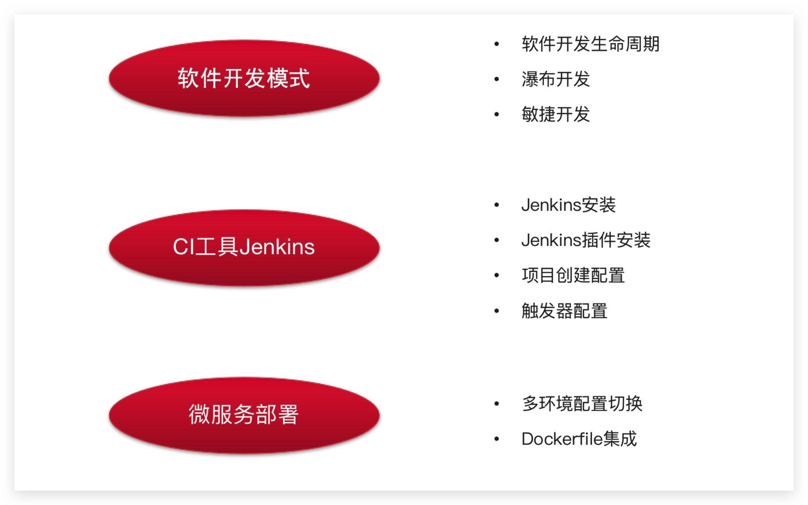


## 软件开发模式

### 软件开发生命周期

软件开发生命周期又叫做SDLC（Software Development Life Cycle），它是集合了计划、开发、测试和部署过程的集合。如下图所示 ：


- 需求分析

  这是生命周期的第一阶段，根据项目需求，团队执行一个可行性计划的分析。项目需求可能是公司内部或者客户提出的。这阶段主要是对信息的收集，也有可能是对现有项目的改善和重新做一个新的项目。还要分析项目的预算多长，可以从哪方面受益及布局，这也是项目创建的目标。

- 设计

  第二阶段就是设计阶段，系统架构和满意状态（就是要做成什么样子，有什么功能），和创建一个项目计划。计划可以使用图表，布局设计或者文字的方式呈现。

- 实现

  第三阶段就是实现阶段，项目经理创建和分配工作给开者，开发者根据任务和在设计阶段定义的目标进行开发代码。依据项目的大小和复杂程度，可以需要数月或更长时间才能完成。

- 测试

  测试人员进行代码测试 ，包括功能测试、代码测试、压力测试等。

- 进化

  最后进阶段就是对产品不断的进化改进和维护阶段，根据用户的使用情况，可能需要对某功能进行修改，bug修复，功能增加等。


### 软件开发瀑布模型

瀑布模型是最著名和最常使用的软件开发模型。瀑布模型就是一系列的软件开发过程。它是由制造业繁衍出来的。一个高度化的结构流程在一个方向上流动，有点像生产线一样。在瀑布模型创建之初，没有其它开发的模型，有很多东西全靠开发人员去猜测，去开发。这样的模型仅适用于那些简单的软件开发， 但是已经不适合现在的开发了。

下图对软件开发模型的一个阐述。


| 优势                                       | 劣势                                                         |
| ------------------------------------------ | ------------------------------------------------------------ |
| 简单易用和理解                             | 各个阶段的划分完全固定，阶段之间产生大量的文档，极大地增加了工作量。 |
| 当前一阶段完成后，您只需要去关注后续阶段。 | 由于开发模型是线性的，用户只有等到整个过程的末期才能见到开发成果，从而增加了开发风险。 |
| 为项目提供了按阶段划分的检查节点           | 瀑布模型的突出缺点是不适应用户需求的变化。                   |


### 软件的敏捷开发

- 什么是敏捷开发？

  敏捷开发（Agile Development） 的核心是迭代开发（Iterative Development） 与 增量开发（Incremental Development）。

- 何为迭代开发？

  对于大型软件项目，传统的开发方式是采用一个大周期（比如一年）进行开发，整个过程就是一次"大开发"；迭代开发的方式则不一样，它将开发过程拆分成多个小周期，即一次"大开发"变成多次"小开发"，每次小开发都是同样的流程，所以看上去就好像重复在做同样的步骤。

  举例来说，SpaceX 公司想造一个大推力火箭，将人类送到火星。但是，它不是一开始就造大火箭，而是先造一个最简陋的小火箭 Falcon 1。结果，第一次发射就爆炸了，直到第四次发射，才成功进入轨道。然后，开发了中型火箭 Falcon 9，九年中发射了70次。最后，才开发 Falcon 重型火箭。如果SpaceX 不采用迭代开发，它可能直到现在还无法上天。

- 何为增量开发？

  软件的每个版本，都会新增一个用户可以感知的完整功能。也就是说，按照新增功能来划分迭代。

  举例来说，房产公司开发一个10栋楼的小区。如果采用增量开发的模式，该公司第一个迭代就是交付一号楼，第二个迭代交付二号楼......每个迭代都是完成一栋完整的楼。而不是第一个迭代挖好10栋楼的地基，第二个迭代建好每栋楼的骨架，第三个迭代架设屋顶......

- 敏捷开发如何迭代？

  虽然敏捷开发将软件开发分成多个迭代，但是也要求，每次迭代都是一个完整的软件开发周期，必须按照软件工程的方法论，进行正规的流程管理。


- 敏捷开发有什么好处？

  - 早期交付

    敏捷开发的第一个好处，就是早期交付，从而大大降低成本。 还是以上一节的房产公司为例，如果按照传统的"瀑布开发模式"，先挖10栋楼的地基、再盖骨架、然后架设屋顶，每个阶段都等到前一个阶段完成后开始，可能需要两年才能一次性交付10栋楼。也就是说，如果不考虑预售，该项目必须等到两年后才能回款。 敏捷开发是六个月后交付一号楼，后面每两个月交付一栋楼。因此，半年就能回款10%，后面每个月都会有现金流，资金压力就大大减轻了。

  - 降低风险

    敏捷开发的第二个好处是，及时了解市场需求，降低产品不适用的风险。 请想一想，哪一种情况损失比较小：10栋楼都造好以后，才发现卖不出去，还是造好第一栋楼，就发现卖不出去，从而改进或停建后面9栋楼？


## Jenkins安装配置

### Jenkins介绍


Jenkins  是一款流行的开源持续集成（Continuous Integration）工具，广泛用于项目开发，具有自动化构建、测试和部署等功能。

官网：  http://jenkins-ci.org/。


Jenkins的特征：

- 开源的 Java语言开发持续集成工具，支持持续集成，持续部署。
- 易于安装部署配置：可通过 yum安装,或下载war包以及通过docker容器等快速实现安装部署，可方便web界面配置管理。
- 消息通知及测试报告：集成 RSS/E-mail通过RSS发布构建结果或当构建完成时通过e-mail通知，生成JUnit/TestNG测试报告。
- 分布式构建：支持 Jenkins能够让多台计算机一起构建/测试。
- 文件识别： Jenkins能够跟踪哪次构建生成哪些jar，哪次构建使用哪个版本的jar等。
- 丰富的插件支持：支持扩展插件，你可以开发适合自己团队使用的工具，如 git，svn，maven，docker等。


Jenkins安装和持续集成环境配置


1. 首先，开发人员每天进行代码提交，提交到Git仓库
2. 然后，Jenkins作为持续集成工具，使用Git工具到Git仓库拉取代码到集成服务器，再配合JDK，Maven等软件完成代码编译，代码测试与审查，测试，打包等工作，在这个过程中每一步出错，都重新再执行一次整个流程。

3. 最后，Jenkins把生成的jar或war包分发到测试服务器或者生产服务器，测试人员或用户就可以访问应用。


### Jenkins环境搭建

#### Jenkins安装配置

删除Jenkins

```shell
yum  -y remove jenkins
```

安装Java11

```bash
yum install java-11-openjdk.x86_64 -y
```

查看Java11下载位置

```bash
ls -rl $(which java)
```

可以导入资料中的镜像：

```java
服务器用户名：root   密码：itcast

jenkins  用户名：itcast   密码：itcast
```

1. 采用YUM方式安装

   加入Jenkins安装源：

   ```sh
   sudo wget -O /etc/yum.repos.d/jenkins.repo https://pkg.jenkins.io/redhat-stable/jenkins.repo --no-check-certificate
   
   sudo rpm --import https://pkg.jenkins.io/redhat-stable/jenkins.io.key
   ```

   执行yum命令安装：

   ```sh
   yum -y install jenkins
   ```

2. 采用RPM安装包方式

   [Jenkins安装包下载地址](https://pkg.jenkins.io/redhat-stable/)

   ```sh
   wget https://pkg.jenkins.io/redhat-stable/jenkins-2.190.1-1.1.noarch.rpm
   wget https://mirrors.tuna.tsinghua.edu.cn/jenkins/redhat-stable/jenkins-2.361.1-1.1.noarch.rpm
   ```

   执行安装：

   ```sh
   rpm -ivh jenkins-2.190.1-1.1.noarch.rpm
   ```

3. 配置：

   修改配置文件：

   ```sh
   vi /etc/sysconfig/jenkins
   ```

   修改内容：

   ```sh
   # 修改为对应的目标用户， 这里使用的是root
   $JENKINS_USER="root"
   # 服务监听端口
   JENKINS_PORT="16060"
   ```

   目录权限：

   ```sh
   chown -R root:root /var/lib/jenkins
   chown -R root:root /var/cache/jenkins
   chown -R root:root /var/log/jenkins
   ```

   重启：

   ```sh
   systemctl restart jenkins
   ```

   如果启动失败， 出现错误信息：

   ```sh
   Starting Jenkins bash: /usr/bin/java: No such file or directory
   ```

   创建JAVA环境的软链接：

   ```shell
   ln -s /usr/local/jdk/bin/java /usr/bin/java
   ```

   

   查看Java路径

   ```shell
   [root@alicloud ~]# whereis java
   java: /usr/bin/java /usr/share/java /usr/local/jdk1.8.0_251/bin/java
   ```

   设置jenkins配置文件

   ```
   [root@alicloud ~]#vim /etc/init.d/jenkins
   /etc/alternatives/java
   /usr/local/jdk1.8.0_251/bin/java
   /usr/lib/jvm/java-1.8.0/bin/java
   /usr/lib/jvm/jre-1.8.0/bin/java
   /usr/lib/jvm/java-11.0/bin/java
   /usr/lib/jvm/jre-11.0/bin/java
   /usr/lib/jvm/java
   ```

   

   

4. 管理后台初始化设置

   http://192.168.200.100:16060/

   需要输入管理密码， 在以下位置查看：

   ```sh
   cat /var/lib/jenkins/secrets/initialAdminPassword
   ```

   

   按默认设置，把建议的插件都安装上

   

   这一步等待时间较长， 安装完成之后， 创建管理员用户：

   

配置访问地址：


配置完成之后， 会进行重启， 之后可以看到管理后台：


**Jenkins插件安装**

在实现持续集成之前， 需要确保以下插件安装成功。

- Maven Integration plugin： Maven 集成管理插件。
- Docker plugin： Docker集成插件。
- GitLab Plugin： GitLab集成插件。
- Publish Over SSH：远程文件发布插件。
- SSH: 远程脚本执行插件。

安装方法：

1. 进入【系统管理】-【插件管理】

2. 点击标签页的【可选插件】

   在过滤框中搜索插件名称

   

3. 勾选插件， 点击直接安装即可。

>注意，如果没有安装按钮，需要更改配置
>
>在安装插件的高级配置中，修改升级站点的连接为：http://updates.jenkins.io/update-center.json   保存
>
>或者https://mirrors.tuna.tsinghua.edu.cn/jenkins/updates/update-center.json
>
>
>
>


#### Git安装配置1

1. yum 安装方式

   ```sh
   yum -y install git
   ```

2. 采用源码包方式安装

   - 安装依赖包

     ```sh
     yum -y install curl-devel expat-devel gettext-devel openssl-devel zlib-devel
     yum -y install gcc perl-ExtUtils-MakeMaker
     ```

   - 如果之前有安装旧版本， 先做卸载， 没有安装则忽略

     ```sh
     yum remove git
     ```

   - 下载源码包

     ```sh
     cd /usr/local
     wget https://mirrors.edge.kernel.org/pub/software/scm/git/git-1.8.3.1.tar.gz
     tar -xvf git-1.8.3.1.tar.gz
     ```

     也可以安装其他版本， 地址：https://mirrors.edge.kernel.org/pub/software/scm/git/

   - 编译安装

     ```sh
     cd git-1.8.3.1
     make prefix=/usr/local/git all
     make prefix=/usr/local/git install
     echo "export PATH=$PATH:/usr/local/git/bin" >> /etc/bashrc
     source /etc/bashrc
     ```

3. 检查git版本

   ```sh
   [root@localhost jenkins]# git version
   git version 1.8.3.1
   ```


#### Maven安装配置

1. 下载安装包

   下载地址： https://maven.apache.org/download.cgi

2. 解压安装包

   ```sh
   cd /usr/local
   unzip -o apache-maven-3.6.1.zip 
   ```

   上传本地仓库并解压

   

3. 配置

   环境变量配置

   ```sh
   vi /etc/profile
   ```

   增加：

   ```sh
   export MAVEN_HOME=/usr/local/apache-maven-3.6.1
   export PATH=$PATH:$MAVEN_HOME/bin
   ```

   如果权限不够，则需要增加当前目录的权限

   ```shell
   chmod 777 /usr/local/apache-maven-3.6.1/bin/mvn
   ```

   

   修改镜像仓库配置：

   ```sh
   vi /usr/local/apache-maven-3.6.1/conf/settings.xml
   ```

   需要把本机的仓库打包上传到服务器上（不上传会自动下载）

   然后指定上传后的仓库配置

   


#### Docker安装配置

1. 更新软件包版本

   ```sh
   yum -y update
   ```

2. 卸载旧版本

   ```sh
   yum -y remove docker  docker-common docker-selinux docker-engine
   ```

3. 安装软件依赖包

   ```sh
   yum install -y yum-utils device-mapper-persistent-data lvm2
   ```

4. 设置yum源为阿里云

   ```sh
   sudo yum-config-manager --add-repo http://mirrors.aliyun.com/docker-ce/linux/centos/docker-ce.repo
   ```

5. 安装后查看docker版本

   ```sh
   docker -v
   ```
   
6. 启动

   设置开机启动：

   ```sh
   systemctl enable docker
   ```

   启动docker

   ```sh
   systemctl start docker
   ```


#### 私有仓库安装配置


###  Jenkins工具配置

1. 进入【系统管理】--> 【全局工具配置】

   

2. MAVEN配置全局设置

   

3. 指定JDK配置

   

4. 指定MAVEN 目录

   

5. 指定DOCKER目录

   

   如果不清楚docker的安装的目录，可以使用`whereis docker` 命令查看docker的安装的目录


## 后端项目部署

### 多环境切换

在项目开发部署的过程中，一般都会有三套项目环境

- Development ：开发环境

- Production ：生产环境

- Test ：测试环境

例如：开发环境的mysql连接的是本地，生产环境需要连接线上的mysql环境


### 微服务中多环境配置

1.在微服务中的bootstrap.yml中新增配置

```yaml
server:
  port: 51801
spring:
  application:
    name: leadnews-user
  cloud:
    nacos:
      discovery:
        server-addr: 192.168.200.130:8848
      config:
        server-addr: 192.168.200.130:8848
        file-extension: yml
  profiles:
    active: dev
```

2.在nacos的配置中心中新增各个环境的配置文件，例如user微服务中新增

修改bootstrap.yml 添加内容

```properties
spring:
  profiles:
    active: dev
```

创建对应的nacos的多环境配置：


注意事项：

其中DataID属性命名有规范：

- prefix，默认使用${spring.application.name}，也可以通过spring.cloud.nacos.config.prefix来配置。
- spring.profile.active，即为当前环境对应的 profile，详情可以参考 Spring Boot文档。 注意：当 spring.profile.active 为空时，对应的连接符 - 也将不存在，dataId 的拼接格式变成 ${prefix}.${file-extension}
- file-exetension，为配置内容的数据格式，可以通过配置项 spring.cloud.nacos.config.file-extension 来配置。目前只支持 properties 和 yaml 类型。


### 整体思路

目标：把黑马头条的app端相关的微服务部署到192.168.200.100这台服务器上

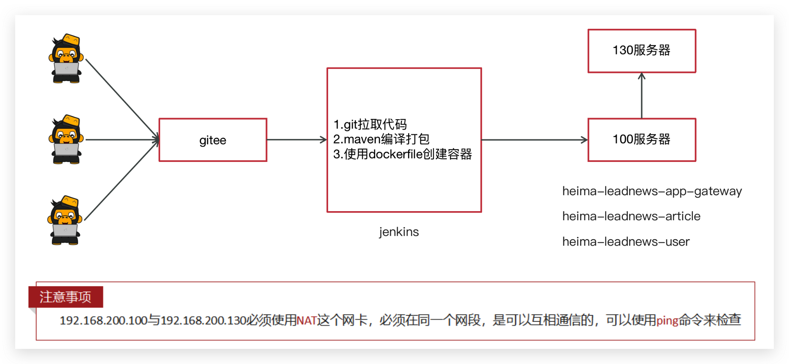


### 服务集成Docker配置

目标：部署的每一个微服务都是先创建docker镜像后创建对应容器启动

方式一：本地微服务打包以后上传到服务器，编写Dockerfile文件完成。

方式二：使用dockerfile-maven-plugin插件，可以直接把微服务创建为镜像使用（更省事）


**服务集成Docker配置**


每个微服务都引入该依赖,以heima-leadnews-user微服务为例

```xml
<?xml version="1.0" encoding="UTF-8"?>
<project xmlns="http://maven.apache.org/POM/4.0.0"
         xmlns:xsi="http://www.w3.org/2001/XMLSchema-instance"
         xsi:schemaLocation="http://maven.apache.org/POM/4.0.0 http://maven.apache.org/xsd/maven-4.0.0.xsd">
    <parent>
        <artifactId>heima-leadnews-service</artifactId>
        <groupId>com.heima</groupId>
        <version>1.0-SNAPSHOT</version>
    </parent>
    <modelVersion>4.0.0</modelVersion>

    <artifactId>heima-leadnews-user</artifactId>

    <properties>
        <maven.compiler.source>8</maven.compiler.source>
        <maven.compiler.target>8</maven.compiler.target>
        <docker.image>docker_storage</docker.image>
    </properties>

    <build>
        <finalName>heima-leadnews-user</finalName>
        <plugins>
            <plugin>
                <groupId>org.springframework.boot</groupId>
                <artifactId>spring-boot-maven-plugin</artifactId>
                <executions>
                    <execution>
                        <goals>
                            <goal>repackage</goal>
                        </goals>
                    </execution>
                </executions>
            </plugin>
            <plugin>
                <groupId>org.apache.maven.plugins</groupId>
                <artifactId>maven-compiler-plugin</artifactId>
                <version>3.7.0</version>
                <configuration>
                    <source>${java.version}</source>
                    <target>${java.version}</target>
                </configuration>
            </plugin>
            <plugin>
                <groupId>com.spotify</groupId>
                <artifactId>dockerfile-maven-plugin</artifactId>
                <version>1.3.6</version>
                <configuration>
                    <repository>${docker.image}/${project.artifactId}</repository>
                    <buildArgs>
                        <JAR_FILE>target/${project.build.finalName}.jar</JAR_FILE>
                    </buildArgs>
                </configuration>
            </plugin>
        </plugins>
    </build>

</project>
```

**服务集成Dockerfile文件**

```dockerfile
# 设置JAVA版本
FROM java:8
# 指定存储卷, 任何向/tmp写入的信息都不会记录到容器存储层
VOLUME /tmp
# 拷贝运行JAR包
ARG JAR_FILE
COPY ${JAR_FILE} app.jar
# 设置JVM运行参数， 这里限定下内存大小，减少开销
ENV JAVA_OPTS="\
-server \
-Xms256m \
-Xmx512m \
-XX:MetaspaceSize=256m \
-XX:MaxMetaspaceSize=512m"
#空参数，方便创建容器时传参
ENV PARAMS=""
# 入口点， 执行JAVA运行命令
ENTRYPOINT ["sh","-c","java -jar $JAVA_OPTS /app.jar $PARAMS"]
```


### Jenkins基础依赖打包配置

在微服务运行之前需要在本地仓库中先去install所依赖的jar包，所以第一步应该是从git中拉取代码，并且把基础的依赖部分安装到仓库中

1，父工程heima-leadnews


2，找到自己指定的git仓库，设置用户名和密码


3，把基础依赖信息安装到服务器上的本地仓库


```shell
clean install -Dmaven.test.skip=true
```

4，执行

执行日志，部分截图，下面是从git中拉取代码


执行日志，部分截图，编译打包


执行日志，部分截图，执行成功


### Jenkins微服务打包配置

所有微服务打包的方式类似，以heima-leadnews-user微服务为例

1，新建任务


2，找到自己指定的git仓库，设置用户名和密码


3，执行maven命令


```java
clean install -Dmaven.test.skip=true  dockerfile:build -f heima-leadnews/heima-leadnews-service/heima-leadnews-user/pom.xml
```

<font color='red'>注意：根据自己的实际代码路径配置</font>

-Dmaven.test.skip=true  跳过测试

dockerfile:build 启动dockerfile插件构建容器

-f heima-leadnews-user/pom.xml 指定需要构建的文件（必须是pom）

4，并执行shell脚本


```java
if [ -n  "$(docker ps -a -f  name=$JOB_NAME  --format '{{.ID}}' )" ]
 then
 #删除之前的容器
 docker rm -f $(docker ps -a -f  name=$JOB_NAME  --format '{{.ID}}' )
fi
 # 清理镜像
docker image prune -f 
 # 启动docker服务
docker run -d --net=host -e PARAMS="--spring.profiles.active=prod"  --name $JOB_NAME docker_storage/$JOB_NAME
```

5，执行日志

拉取代码


编译打包


构建镜像


清理容器，创建新的容器


### 部署服务到远程服务器上

目标：使用jenkins（192.168.200.100）把微服务打包部署到192.168.200.130服务器上


#### 安装配置私有仓库

对于持续集成环境的配置，Jenkins会发布大量的微服务， 要与多台机器进行交互， 可以采用docker镜像的保存与导出功能结合SSH实现， 但这样交互繁琐，稳定性差， 而且不便管理， 这里我们通过搭建Docker的私有仓库来实现， 这个有点类似GIT仓库， 集中统一管理资源， 由客户端拉取或更新。

1. 下载最新Registry镜像

   ```sh
   docker pull registry:latest
   ```

2. 启动Registry镜像服务

   ```sh
   docker run -d -p 5000:5000 --name registry -v /usr/local/docker/registry:/var/lib/registry registry:latest
   ```

   映射5000端口； -v是将Registry内的镜像数据卷与本地文件关联， 便于管理和维护Registry内的数据。

3. 查看仓库资源

   访问地址：http://192.168.200.100:5000/v2/_catalog

   启动正常， 可以看到返回：

   ```json
   {"repositories":[]}
   ```

   目前并没有上传镜像， 显示空数据。

   如果上传成功， 可以看到数据:
   

4. 配置Docker客户端

   正常生产环境中使用， 要配置HTTPS服务， 确保安全，内部开发或测试集成的局域网环境，可以采用简便的方式， 不做安全控制。

   先确保持续集成环境的机器已安装好Docker客户端， 然后做以下修改：

   ```sh
   vi /lib/systemd/system/docker.service
   ```

   修改内容：

   ```sh
   ExecStart=/usr/bin/dockerd --insecure-registry 192.168.200.100:5000
   ```

   指向安装Registry的服务IP与端口。

   重启生效：

   ```sh
   systemctl daemon-reolad
   systemctl restart docker.service
   ```


#### Jenkins中安装插件


#### Jenkins系统配置远程服务器链接

位置：Manage Jenkins-->Configure System


需要添加凭证

位置：Manage Jenkins-->Manage CreDentials


添加链接到130服务器的用户名和密码


#### Jenkins项目创建与其他微服务相同

创建项目参考之前创建过的用户微服务


#### 设置参数


#### 构建执行Execute shell


maven命令

```java
clean install -Dmaven.test.skip=true dockerfile:build -f heima-leadnews/heima-leadnews-service/heima-leadnews-article/pom.xml
```

shell脚本

```shell
image_tag=$docker_registry/docker_storage/$JOB_NAME
echo '================docker镜像清理================'
if [ -n  "$(docker ps -a -f  name=$JOB_NAME  --format '{{.ID}}' )" ]
 then
 #删除之前的容器
 docker rm -f $(docker ps -a -f  name=$JOB_NAME  --format '{{.ID}}' )
fi
 # 清理镜像
docker image prune -f 

# 创建TAG
docker tag docker_storage/$JOB_NAME $image_tag
echo '================docker镜像推送================'
# 推送镜像
docker push $image_tag
# 删除TAG
docker rmi $image_tag
echo '================docker tag 清理 ================'
```


#### 在远程服务器上执行脚本


远程服务器执行的shell脚本

```shell
echo '================拉取最新镜像================'
docker pull $docker_registry/docker_storage/$JOB_NAME

echo '================删除清理容器镜像================'
if [ -n  "$(docker ps -a -f  name=$JOB_NAME  --format '{{.ID}}' )" ]
 then
 #删除之前的容器
 docker rm -f $(docker ps -a -f  name=$JOB_NAME  --format '{{.ID}}' )
fi
 # 清理镜像
docker image prune -f 

echo '===============启动容器================'
docker run -d   --net=host -e PARAMS="--spring.profiles.active=prod" --name $JOB_NAME $docker_registry/docker_storage/$JOB_NAME
```


#### 查看相关容器

构建完成以后，可以登录130服务器，查看是否有相关的镜像和容器

镜像


容器


### 联调测试

1.参考jenkins中heima-leadnews-user微服务把app端网关部署起来

2.修改本地nginx中的配置反向代理地址为100这台服务器：heima-leadnews-app.conf

```html
upstream  heima-app-gateway{
	server 192.168.200.100:51601;
}
```

3.启动nginx，打开页面进行测试

## Jenkins触发器配置

### URL触发远程构建

触发远程构建，修改jenkins的配置，如下


触发构建url： http://192.168.200.100:16060/job/leadnews-admin/build?token=88888888


### 其他工程构建后触发

配置需要触发的工程


### 定时构建

定时构建（ Build periodically）


定时字符串从左往右分别为： 分 时 日 月 周


**定时构建-定时表达式**

定时字符串从左往右分别为： 分 时 日 月 周

| 组成部分 | 含义        | 取值范围                   |
| -------- | ----------- | -------------------------- |
| 第一部分 | minute (分) | 0~59                       |
| 第二部分 | hour(小时)  | 0~23                       |
| 第三部分 | day(天)     | 1~31                       |
| 第四部分 | month(月)   | 1~12                       |
| 第五部分 | week(周)    | 0~7，0 和 7 都是表示星期天 |

- 符号H 表示一个随机数

- 符号*  取值范围的任意值

案例：

- 每30分钟构建一次：H/30 * * * * 10:02 10:32

- 每2个小时构建一次: H H/2 * * *

- 每天的8点，12点，22点，一天构建3次： (多个时间点中间用逗号隔开) 0 8,12,22 * * *

- 每天中午12点定时构建一次 H 12 * * *

- 每天下午18点定时构建一次 H 18 * * *


### 轮询

轮询 SCM（Poll SCM）

轮询SCM，是指定时扫描本地代码仓库的代码是否有变更，如果代码有变更就触发项目构建。


Jenkins会定时扫描本地整个项目的代码，增大系统的开销，不建议使用。


## 链路追踪-SkyWalking

随着系统设计变得日趋复杂，越来越多的组件开始走向分布式化，如微服务、分布式数据库、分布式缓存等，使得后台服务构成了一种复杂的分布式网络。往往前端的一个请求需要经过多个微服务、跨越多个数据中心才能最终获取到结果，如下图

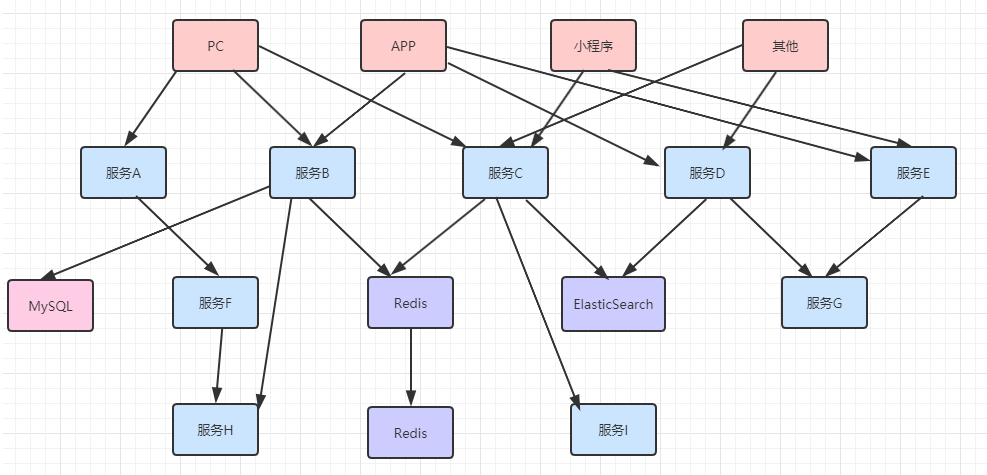

并且随着业务的不断扩张，服务之间互相调用会越来越复杂，这个庞大的分布式系统调用网络可能会变的如下图所示：


那随之而来的就是我们将会面临的诸多困扰：

- 问题定位：当某一个服务节点出现问题导致整个调用失败，无法快速清晰地定位问题服务。

- 性能分析：服务存在相互依赖调用的关系，当某一个服务接口耗时过长，会导致整个接口调用变的很慢，我们无法明确每一个接口的耗时。

- 服务拓扑图：随着需求迭代，系统之间调用关系变化频繁，靠人工很难梳理清楚系统之间的调用关系。 

- 服务告警：当服务出现问题，我们无法做到由系统自动通知相关人员。

  **为了解决这些问题，分布式链路追踪应运而生。它会将一次分布式请求还原成调用链路，将一次分布式请求的调用情况集中展示，比如各个服务节点上的耗时、请求具体到达哪台机器上、每个服务节点的请求状态、生成服务调用拓扑图等等。也就是说我们要设计并开发一些分布式追踪系统来帮助我们解决这些问题**


### Java探针技术-JavaAgent

Java Agent这个技术对大多数人来说都比较陌生，但是大家都都多多少少接触过一些，实际上我们平时用过的很多工具都是基于java Agent来实现的，例如：热部署工具JRebel，springboot的热部署插件，各种线上诊断工具（btrace, greys），阿里开源的arthas等等。

其实java Agent在JDK1.5以后，我们可以使用agent技术构建一个独立于应用程序的代理程序（即Agent），用来协助监测、运行甚至替换其他JVM上的程序。使用它可以实现虚拟机级别的AOP功能，并且这种方式一个典型的优势就是无代码侵入。

Agent分为两种，一种是在主程序之前运行的Agent，一种是在主程序之后运行的Agent（前者的升级版，1.6以后提供）。

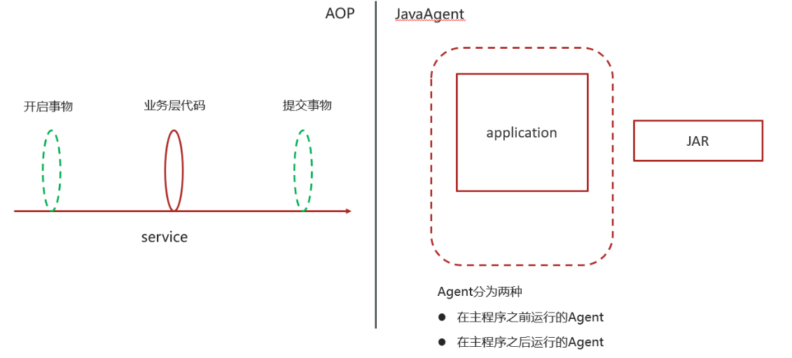


### SkyWalking


2015年由个人吴晟（华为开发者）主导开源，作者是华为开发云监控产品经理，主导监控产品的规划、技术路线及相关研发工作，也是OpenTracing分布式追踪标准组织成员 ，该项目 2017年加入Apache孵化器，是一个分布式系统的应用程序性能监控工具（APM），专为微服务、云原生架构和基于容器（Docker、K8s、Mesos）架构而设计。

官方站点：<http://skywalking.apache.org/>

GitHub项目地址：<https://github.com/apache/skywalking>

其核心功能要点如下：

- **指标分析**：服务，实例，端点指标分析
- **问题分析**：在运行时分析代码，找到问题的根本原因
- **服务拓扑**：提供服务的拓扑图分析
- **依赖分析**：服务实例和端点依赖性分析
- **服务检测**：检测慢速的服务和端点
- **性能优化**：根据服务监控的结果提供性能优化的思路
- **链路追踪**：分布式跟踪和上下文传播
- **数据库监控**：数据库访问指标监控统计，检测慢速数据库访问语句（包括SQL语句）
- **服务告警**：服务告警功能

> 名词解释：
>
> - 服务（service）：业务资源应用系统
> - 端点（endpoint）：应用系统对外暴露的功能接口
> - 实例（instance）：物理机
>
> 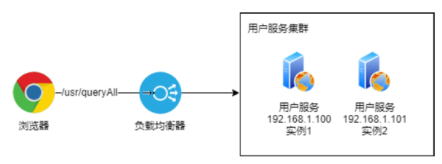


#### 架构设计

skyWalking的整体架构设计如下图所示：

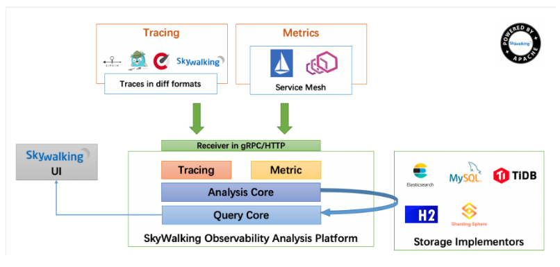

skyWalking整体可分为：客户端，服务端

客户端：agent组件

​	基于探针技术采集服务相关信息（包括跟踪数据和统计数据），然后将采集到的数据上报给skywalking的数据收集器

服务端：又分为OAP，Storage，WebUI

OAP：observability analysis platform可观测性分析平台，负责接收客户端上报的数据，对数据进行分析，聚合，计算后将数据进行存储，并且还会提供一些查询API进行数据的查询，这个模块其实就是我们所说的链路追踪系统的Collector收集器

Storage：skyWalking的存储介质，默认是采用H2，同时支持许多其他的存储介质，比如：ElastaticSearch，mysql等

WebUI：提供一些图形化界面展示对应的跟踪数据，指标数据等等


#### 环境搭建

**SkyWalking下载**

skyWalking可从官方站点下载：http://skywalking.apache.org/downloads/，本文中使用8.2.0版本

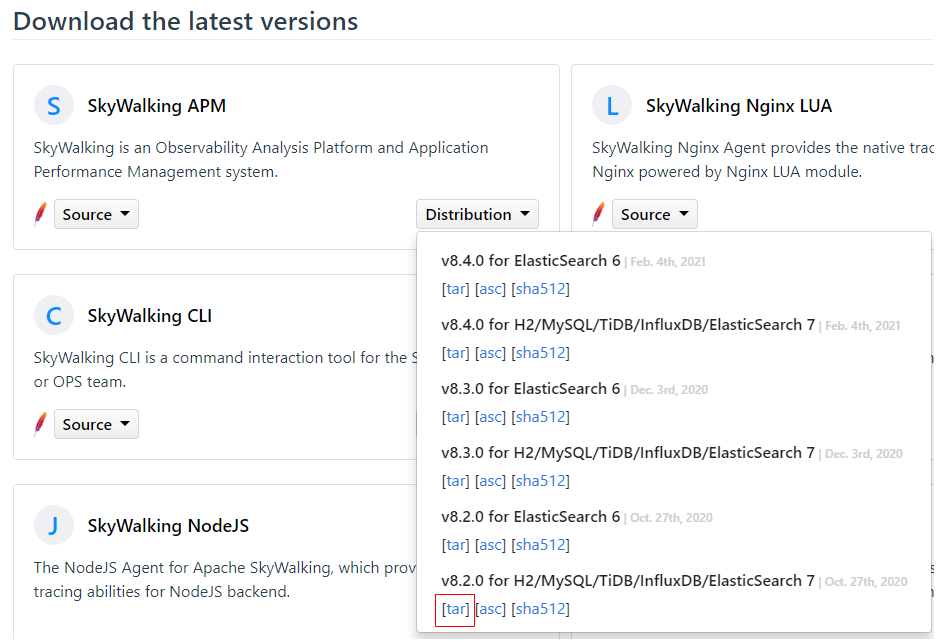


**Docker部署SkyWalking**

安装OAP，Docker拉取镜像，可以使用资料中提供好的文件加载为镜像

```shell
docker pull apache/skywalking-oap-server
```


**创建容器**

```shell
docker run --name skywalking -d -p 1234:1234 -p 11800:11800 -p 12800:12800 --restart always apache/skywalking-oap-server 
```

skyWalking默认使用H2进行信息存储，但H2一旦重启数据就会丢失，因此采用ES替换H2对skyWalking中数据信息存储，项目中已经安装了elasticsearch，可以直接使用，需要指定elasticsearch的地址

oap容器创建完成以后，进入容器中

```shell
docker exec -it fe372cdaece2 /bin/bash
```


**修改文件**

`/config/application.yml`，如下效果

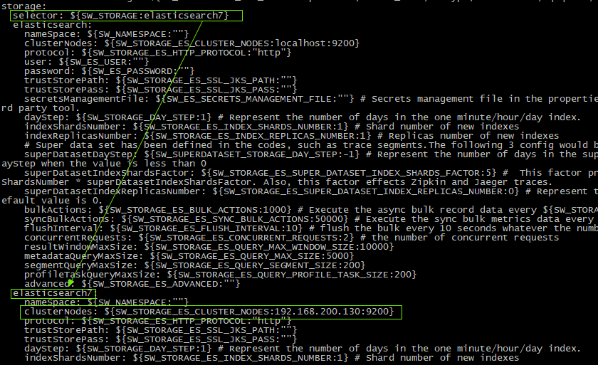

重启容器，保证130这台服务器上的elasticsearch已经启动


**安装UI**

拉取镜像，可以使用资料中提供好的文件加载为镜像

```shell
docker pull apache/skywalking-ui
```


**创建容器**

```shell
docker run --name skywalking-ui -d -p 8686:8080 --link skywalking:skywalking -e SW_OAP_ADDRESS=skywalking:12800 --restart always apache/skywalking-ui
```

启动成功后访问skywalking的webui页面：<http://192.168.200.100:8686/>

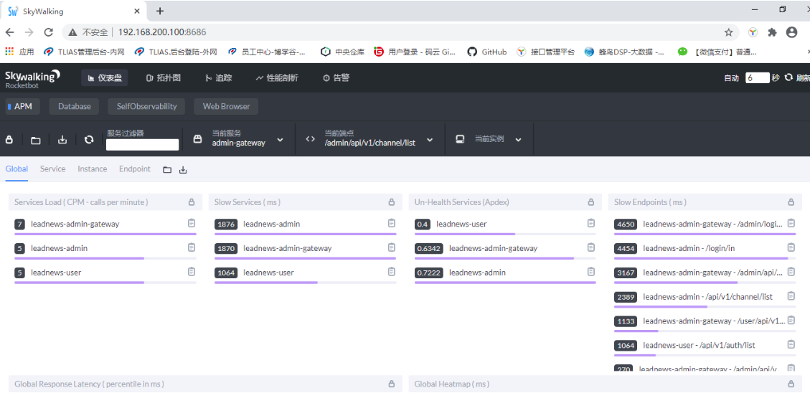


#### 应用程序接入

应用程序接入skywalking非常的简单，只需在应用程序启动时通过`-javaagent`来指定skyWalking的agent的组件

首先在下载好的skyWalking中找到agent组件：

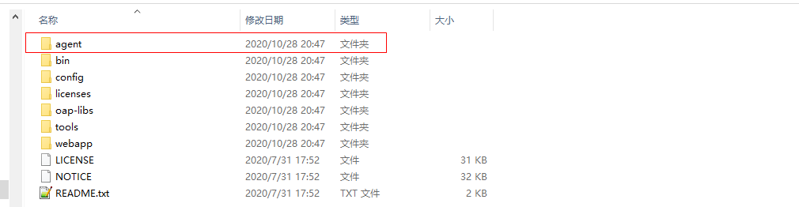

进入到agent目录：

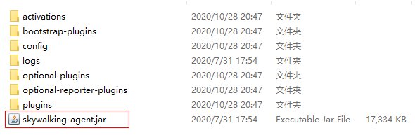

通过`-javaagent`来指定skywalking的agent组件的skywalking-agent.jar即可

另外：agent负责采集数据然后将数据提交到OAP（collector）中，因此我们需要在agent的配置文件中指定OAP的地址，当然默认是本地127.0.0.1

进入到config目录，找到：agent.config配置文件

未修改前如下：

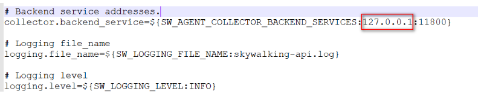

修改后如下：

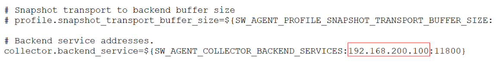

当前agent对于spring cloud gateway支持的不好，需要手动修改几个插件，从agent包下的optional-plugins包下的两个jar包，拷贝到agent/plugins包下即可

`apm-spring-cloud-gateway-2.1.x-plugin-8.2.0.jar`

`apm-spring-webflux-5.x-plugin-8.2.0.jar`  

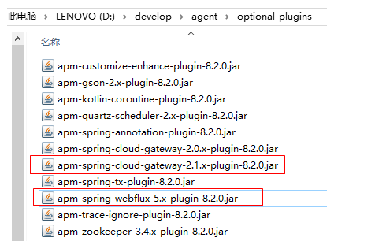

接下来我们依次启动应用程序，以黑马头条heima-leadnews-user中的heima-leadnews-app-gateway，heima-leadnews-article为例来启动，我们只需修改启动参数即可，

我们需要将启动参数修改如下(注意：要指向自己电脑中的agent存放的位置)

```properties
-javaagent:D:\develop\agent\skywalking-agent.jar -Dskywalking.agent.service_name=heima-leadnews-user
```

> 注意：如果一个服务作多节点部署，保证服务名称不一样

图示如下：

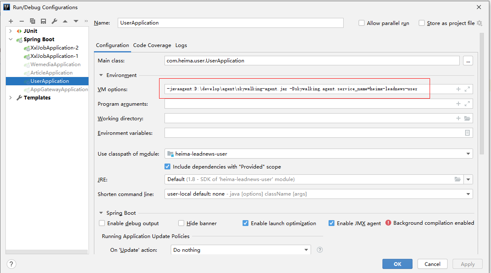

三个服务都要修改启动参数，然后启动项目

访问：http://192.168.200.100:8686查看skywalking的ui

**UI监控视角与指标介绍**

我们解读一下比较陌生的一些指标：

**用户满意度Apdex Score**

Apdex是基于设置的阈值的响应时间的度量。它测量了满意的响应时间与不满意的响应时间之比。从资产请求到完成交付回请求者的响应时间。

管理员，所有者或附加组件管理器定义响应时间阈值`T`。在`T`短时间内处理的所有响应都能使用户满意。

例如，如果`T`为1.2秒，并且响应在0.5秒内完成，则用户会感到满意。所有大于1.2秒的响应都使用户不满意。大于4.8秒的响应使用户感到沮丧。


**cpm 每分钟请求数**

cpm 全称 call per minutes，是吞吐量(Throughput)指标。

下图是拼接的全局、服务、实例和接口的吞吐量及平均吞吐量。

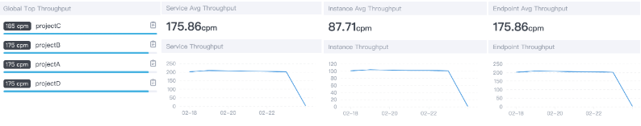

185cpm=185/60=3.08个请求/秒


**SLA 服务等级协议**

服务等级协议用来表示提供服务的水平，可以衡量平台的可用性，下面是N个9的计算

```markdown
1年 = 365天 = 8760小时
99     = 8760 * 1%     => 3.65天----------------》相当于全年有3.65天不可用，2个9就基本不可用了
99.9   = 8760 * 0.1%   => 8.76小时--------------》相当于全年有8.76小时不可用
99.99  = 8760 * 0.01%  => 52.6分钟
99.999 = 8760 * 0.001% => 5.26分钟
```

因此，全年只要发生一次较大规模宕机事故，4个9肯定没戏，一般平台3个9差不多。


**Percent Response 百分位数统计**

Skywalking 有 **“p50、p75、p90、p95、p99”** 一些列值，图中的 **“p99:390”** 表示 99% 请求的响应时间在390ms以内。

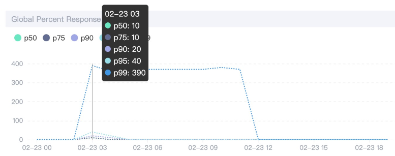


**Heatmap 热力图**

Heapmap 可译为热力图、热度图都可以，图中颜色越深，表示请求数越多，这和GitHub Contributions很像，commit越多，颜色越深。

纵坐标是响应时间，鼠标放上去，可以看到具体的数量。

通过热力图，一方面可以直观感受平台的整体流量，另一方面也可以感受整体性能。


#### 配置应用告警

SkyWalking 告警功能是在6.x版本新增的，其核心由一组规则驱动，这些规则定义在`config/alarm-settings.yml`文件中。 告警的定义分为两部分：

1. **告警规则**：它们定义了应该如何触发度量警报，应该考虑什么条件。
2. **Webhook（网络钩子）**：定义当警告触发时，哪些服务终端需要被告知


**告警规则**

SkyWalking 的发行版都会默认提供`config/alarm-settings.yml`文件，里面预先定义了一些常用的告警规则。如下：

```yaml
# Licensed to the Apache Software Foundation (ASF) under one
# or more contributor license agreements.  See the NOTICE file
# distributed with this work for additional information
# regarding copyright ownership.  The ASF licenses this file
# to you under the Apache License, Version 2.0 (the
# "License"); you may not use this file except in compliance
# with the License.  You may obtain a copy of the License at
#
#     http://www.apache.org/licenses/LICENSE-2.0
#
# Unless required by applicable law or agreed to in writing, software
# distributed under the License is distributed on an "AS IS" BASIS,
# WITHOUT WARRANTIES OR CONDITIONS OF ANY KIND, either express or implied.
# See the License for the specific language governing permissions and
# limitations under the License.

# Sample alarm rules.
rules:
  # Rule unique name, must be ended with `_rule`.
  service_resp_time_rule:
    metrics-name: service_resp_time
    op: ">"
    threshold: 1000
    period: 10
    count: 3
    silence-period: 5
    message: Response time of service {name} is more than 1000ms in 3 minutes of last 10 minutes.
  service_sla_rule:
    # Metrics value need to be long, double or int
    metrics-name: service_sla
    op: "<"
    threshold: 8000
    # The length of time to evaluate the metrics
    period: 10
    # How many times after the metrics match the condition, will trigger alarm
    count: 2
    # How many times of checks, the alarm keeps silence after alarm triggered, default as same as period.
    silence-period: 3
    message: Successful rate of service {name} is lower than 80% in 2 minutes of last 10 minutes
  service_resp_time_percentile_rule:
    # Metrics value need to be long, double or int
    metrics-name: service_percentile
    op: ">"
    threshold: 1000,1000,1000,1000,1000
    period: 10
    count: 3
    silence-period: 5
    message: Percentile response time of service {name} alarm in 3 minutes of last 10 minutes, due to more than one condition of p50 > 1000, p75 > 1000, p90 > 1000, p95 > 1000, p99 > 1000
  service_instance_resp_time_rule:
    metrics-name: service_instance_resp_time
    op: ">"
    threshold: 1000
    period: 10
    count: 2
    silence-period: 5
    message: Response time of service instance {name} is more than 1000ms in 2 minutes of last 10 minutes
#  Active endpoint related metrics alarm will cost more memory than service and service instance metrics alarm.
#  Because the number of endpoint is much more than service and instance.
#
#  endpoint_avg_rule:
#    metrics-name: endpoint_avg
#    op: ">"
#    threshold: 1000
#    period: 10
#    count: 2
#    silence-period: 5
#    message: Response time of endpoint {name} is more than 1000ms in 2 minutes of last 10 minutes

webhooks:
#  - http://127.0.0.1/notify/
#  - http://127.0.0.1/go-wechat/

```

告警规则配置项的说明：

- **Rule name：**规则名称，也是在告警信息中显示的唯一名称。必须以`_rule`结尾，前缀可自定义
- **Metrics name：**度量名称，取值为oal脚本中的度量名，目前只支持`long`、`double`和`int`类型。
- **Include names：**该规则作用于哪些实体名称，比如服务名，终端名（可选，默认为全部）
- **Exclude names：**该规则作不用于哪些实体名称，比如服务名，终端名（可选，默认为空）
- **Threshold：**阈值
- **OP：** 操作符，目前支持 `>`、`<`、`=`
- **Period：**多久告警规则需要被核实一下。这是一个时间窗口，与后端部署环境时间相匹配
- **Count：**在一个Period窗口中，如果values超过Threshold值（按op），达到Count值，需要发送警报
- **Silence period：**在时间N中触发报警后，在TN -> TN + period这个阶段不告警。 默认情况下，它和Period一样，这意味着相同的告警（在同一个Metrics name拥有相同的Id）在同一个Period内只会触发一次
- **message：**告警消息


**在配置文件中预先定义的告警规则总结如下：**

1. 在过去10分钟的3分钟内服务平均响应时间超过1秒达3次
2. 在过去10分钟内服务成功率低于80%达2次
3. 在过去10分钟内服务90%响应时间低于1秒达3次
4. 在过去10分钟内服务的响应时间超过1秒达2次
5. 在过去10分钟内端点的响应时间超过1秒达2次


##### 网络钩子

网络勾子（Webhook）可以简单理解为是一种Web层面的回调机制，通常由一些事件触发，与代码中的事件回调类似，只不过是Web层面的。由于是Web层面的，所以当事件发生时，回调的不再是代码中的方法或函数，而是服务接口。例如，在告警这个场景，告警就是一个事件。当该事件发生时，SkyWalking就会主动去调用一个配置好的接口，该接口就是所谓的Webhook。

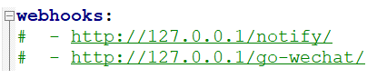


##### 邮件告警实践

根据以上两个小节的介绍，可以得知：SkyWalking是不支持直接向邮箱、短信等服务发送告警信息的，SkyWalking只会在发生告警时将告警信息发送至配置好的Webhook接口。

但我们总不能人工盯着该接口的日志信息来得知服务是否发生了告警，因此我们需要在该接口里来实现发送邮件或短信等功能，从而达到个性化的告警通知。

1：首先需要配置webhook接口，在`config/alarm-settings.yml`文件配置如下：

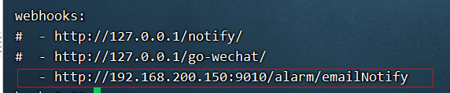

> 注：在192.168.200.100的OAP容器中配置
>
> 另外：Webhook接口不需要配置到所有服务上，我们只需要找一个服务添加该接口即可，并且找的这个服务尽可能的是那种比较“清闲”的服务。


2：新建模块：heima-leadnews-alarm

pom文件：

```xml
<?xml version="1.0" encoding="UTF-8"?>
<project xmlns="http://maven.apache.org/POM/4.0.0"
         xmlns:xsi="http://www.w3.org/2001/XMLSchema-instance"
         xsi:schemaLocation="http://maven.apache.org/POM/4.0.0 http://maven.apache.org/xsd/maven-4.0.0.xsd">
    <parent>
        <artifactId>heima-leadnews-service</artifactId>
        <groupId>com.heima</groupId>
        <version>1.0-SNAPSHOT</version>
    </parent>
    <modelVersion>4.0.0</modelVersion>

    <artifactId>heima-leadnews-alarm</artifactId>

    <properties>
        <maven.compiler.source>8</maven.compiler.source>
        <maven.compiler.target>8</maven.compiler.target>
    </properties>

    <dependencies>
        <!-- https://mvnrepository.com/artifact/org.springframework.boot/spring-boot-starter-mail -->
        <dependency>
            <groupId>org.springframework.boot</groupId>
            <artifactId>spring-boot-starter-mail</artifactId>
            <version>2.1.3.RELEASE</version>
        </dependency>
    </dependencies>

</project>
```

3：创建配置文件：bootstrap.yml，添加邮件发送相关需要的账号等信息

```yaml
server:
  port: 9010
spring:
  application:
    name: leadnews-alarm
  cloud:
    nacos:
      discovery:
        server-addr: 192.168.200.130:8848
      config:
        server-addr: 192.168.200.130:8848
        file-extension: yml
```

nacos配置

```yaml
spring:
  mail:
    #发件服务器地址
    host: smtp.163.com
    #发件账号
    username: itheim@163.com
    #对应账号的授权码
    password: xxxxxxxxxxxxxx
    protocol: smtp
    port: 25
    default-encoding: utf-8
    properties.mail.smtp.auth: true
    properties.mail.smtp.starttls.enable: true
    properties.mail.smtp.starttls.required: true
    properties.mail.smtp.ssl.enable: false
    properties.mail.smtp.timeout: 25000

  #配置邮件接收人
skywalking:
  alarm:
  	# 发送邮件的地址，和上面username一致
    from: itheim@163.com
    receiveEmails:
      - xx@itcast.cn
```

引导类：


同时需要编写一个配置类加载邮件接收人的配置：com.itheima.skywalking.alarm.AlarmEmailProperties

```java
package com.heima.alarm.config;

import lombok.Data;
import org.springframework.boot.context.properties.ConfigurationProperties;
import org.springframework.boot.context.properties.EnableConfigurationProperties;
import org.springframework.context.annotation.Configuration;

import java.util.List;

/**
 * Created by 传智播客*黑马程序员.
 */
@Data
@Configuration
@EnableConfigurationProperties
@ConfigurationProperties("skywalking.alarm")
public class AlarmEmailProperties {

    private String from;
    private List<String> receiveEmails;

}
```


4：skyWalking在告警事件发生后需要调用配置好的webhook接口（POST），同时会传递一些参数，是application/json格式的，如下：

```json
[{
    "scopeId": 1,
    "scope": "SERVICE",
    "name": "serviceA",
    "id0": 12,
    "id1": 0,
    "ruleName": "service_resp_time_rule",
    "alarmMessage": "alarmMessage xxxx",
    "startTime": 1560524171000
}, {
    "scopeId": 1,
    "scope": "SERVICE",
    "name": "serviceB",
    "id0": 23,
    "id1": 0,
    "ruleName": "service_resp_time_rule",
    "alarmMessage": "alarmMessage yyy",
    "startTime": 1560524171000
}]
```

因此我们可以在service1中定义一个DTO来接收数据：com.itheima.skywalking.dto.AlarmDTO

```java
package com.heima.alarm.model;

import lombok.Data;

/**
 * Created by 传智播客*黑马程序员.
 */
@Data
public class AlarmDTO {
    private Integer scopeId;
    private String scope;
    private String name;
    private String id0;
    private String id1;
    private String ruleName;
    private String alarmMessage;
    private Long startTime;

}
```

5：定义一个接口，接收SkyWalking的告警通知，并将数据发送至系统负责人的相关邮箱：com.itheima.skywalking.controller.AlarmController

```java
package com.heima.alarm.controller;

import com.heima.alarm.config.AlarmEmailProperties;
import com.heima.alarm.model.AlarmDTO;
import lombok.extern.slf4j.Slf4j;
import org.springframework.beans.factory.annotation.Autowired;
import org.springframework.mail.SimpleMailMessage;
import org.springframework.mail.javamail.JavaMailSender;
import org.springframework.web.bind.annotation.PostMapping;
import org.springframework.web.bind.annotation.RequestBody;
import org.springframework.web.bind.annotation.RequestMapping;
import org.springframework.web.bind.annotation.RestController;

import java.util.List;

@RestController
@RequestMapping("/alarm")
@Slf4j
public class AlarmController {

    @Autowired
    private JavaMailSender javaMailSender;

    @Autowired
    private AlarmEmailProperties alarmEamilProperties;

    @PostMapping("/emailNotify")
    public void emailAlarm(@RequestBody List<AlarmDTO> alarmDTOList){
        SimpleMailMessage mailMessage = new SimpleMailMessage();
        //从哪个邮箱发出
        mailMessage.setFrom(alarmEamilProperties.getFrom());
        //发送邮件
        mailMessage.setTo(alarmEamilProperties.getReceiveEmails().toArray(new String [] {}));
        //主题
        mailMessage.setSubject("skywalking告警邮件");
        //邮件内容
        mailMessage.setText(alarmDTOList.toString());
        javaMailSender.send(mailMessage);
        log.info("告警邮件已发送");
    }
}
```

6：因为skywalking默认有一个告警规则：10分钟内服务成功率低于80%超过2次，


