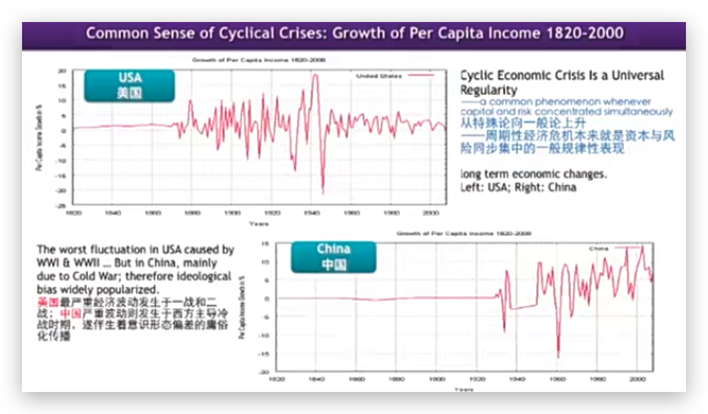

1949-1950年新民主主义资本主义的危机：新起点还是旧模式的延续？【概述】
=====================================================================

2.1 背景和问题
--------------

### 2.1.1 战后超级大国地缘政治的不确定性及其冷战特点

该视频主要讲述了中国经济发展所处的国际背景，特别是西方工业化大生产的历史背景，以及二战后国际政治格局对工业化进程的影响。视频分析了福特主义和斯大林主义大生产导致的生产过剩和社会购买力低下的问题，并指出二战后美国和苏联的国家主义对全球工业化进程的推动，尤其是通过马歇尔计划和类似计划，在东亚和欧洲形成了结构完整的工业化体系。这种工业化并非一般市场经济规律下的自然发展，而是地缘政治派生的结果。

**西方工业化大生产模式**

1.西方在推进工业化大生产过程中，形成了美国为首的福特主义和苏联的斯大林主义两种大生产模式。 

2.这两种模式都是大规模生产，同时造成了马克思主义所说的生产社会化与财富私人占有之间的矛盾。

3.这种矛盾导致了劳动者收入无法提高，社会购买力水平低下，最终造成了生产过剩。

马克思把这称为资本主义内在矛盾，具有普遍意义。这情况在整个西方资本主义世界同步爆发。这就是20世纪的大危机，大危机之后转化成大萧条，大危机和大萧条最终演化成了第二次世界大战。

**二战中的国家主义力量**

1.二战中，起决定作用的是一些国家主义为实质的国家。美国的罗斯福新政，被罗斯福认定为<mark>新国家主义</mark>。苏联的斯大林主义，被斯大林认定为国家资本为主导的<mark>国家资本主义</mark>、日本和希特勒的<mark>军国主义</mark>。

 2.这些国家都属于非自由市场经济国家，最终决定了二战的结局。

**双寡头地缘控制**

1.二战后，世界进入了双寡头地缘控制，由美国的新国家主义和苏联的国家资本主义主导。 

2.这两个国家主义的双寡头地缘控制分割了世界的势力范围。

**双寡头雁阵产业转移**

1.美国启动了马歇尔计划，将战争中形成的过剩工业产能转移到西欧，促进了西欧的再工业化。

2.苏联也将重工业和装备工业的生产转移到东欧，东欧和西欧同步进入工业化。

**朝鲜战争与东亚工业化**

1.朝鲜战争前，美国拒绝武装日本，但战争爆发后，美国向日本投入了大量资金，促进了日本的战后再工业化。

2.苏联为了朝鲜战争，向中国投入了大量资金用于军事工业生产，形成了完整的军事工业体系。

**工业化与地缘政治的关系**

1.战后其他发展中国家没有进入工业化的主要原因是没有得到完整的工业结构。 

2.只有东亚的中国和日本形成了结构完整的工业化，这是地缘政治的派生结果。

3.按照教科书上给定的，靠经济规律，先一般市场经济，发展轻工业、纺织工业，然后工农促进交换，逐步形成积累这种方式完成工业化的国家几乎没有。

**中国工业化的困难**

1.中国通过土地革命战争建立政权后，面临分散的小农经济，剩余过少，工业化困难重重。

 2.分散的小农经济使得交易成本极高，难以进行原始积累，因此早期工业化进程缓慢。

### 2.1.2 重新界定有普遍意义的主要概念

该视频主要讲述了对现代化、资本和政府等概念的重新解读和质疑。作者认为现代化是资本和风险同步向城市集中的阶段性过程，必然周期性爆发危机。资本作为异化物，控制人类和资源，导致资本主义的终结。政府也是由少数人控制的异化物，难以达到真正的公平公正。作者强调，这些分析并不意味着反对现代化或资本，而是希望人们能自觉反思并做出调整。同时，制度变迁受到主要利益集团的推动，旨在更多占有收益并转嫁风险。

**现代化的质疑**

1.现代化的概念在过去的100年中，无论政治体制和意识形态如何变化，现代化都被中国人普遍认同。 

2.现代化的本质是资本向城市集中，同时风险也向城市集中，导致周期性经济危机的爆发。

**资本的异化物性质**

1.资本是人类在资本主义阶段制造的，用于控制极少数人群并使其反自然的异化物。 

2.资本不仅把人类要异化为劳动力要素，还把资源异化为生产资料，以获取利润。 

3.只有当他完成这过程的时候，资本主义就终结了。马克思的原意，但这个过程很漫长，不等它自然终结，资本主义内部危机爆发，就会导致它走向灭亡。

**政府的异化物性质**

1.在资本主义阶段，政府是由极少数人控制的异化物。 

2.因为是少数人统治多数人，所以难以达到真正的公平和公正。

3.政府应该是守夜人和裁判员，但因其被极少数人控制，难以达到真正的公平和公正。

**对资本和政府的思考**

1.但是我们不是无政府主义。人们会永远对政府提出应该公平公正的要求，也要永远要求政府不断地做自我改造。

2.对资本这个异化物的分析也不意味着我们排斥资本。因为没有资本，我们进入不了工业化。

3.当我们提出现代化，但不是反现代化。我们只是研究现代化的一个实质过程。使得人们有自觉反思，并且做出调整的这种意识。

4.因为有这些问题，所以我们一直在追求制度变迁。总是希望能够约束政府、约束资本。同时对现代化做反思的时候，做出调整。这种变化本身受到制度变迁的影响。

**制度变迁的制约因素**

1.制度变迁是原来占有收益的集团为了更多占有收益并将风险和代价向外转嫁的文化现象。

2.原先占有利益的主要利益集团，它们推动的制度变迁也只是为了占有更多收益，更少的承担成本。

3.不能够顺利转嫁代价的就变成所谓强制性变迁；能够顺利转嫁代价的就被叫做诱导性变迁。

**经济波动的共性规律**

1.美国和中国的经济波动在农业时代是平稳的，进入工业化后出现剧烈波动。 

2.美国在一战和二战之间，中国在冷战和后冷战时期波动最为剧烈。

3.周期性经济危机是资本与风险同步集中的一般规律性表现，与意识形态无关。

中国爆发周期性问题，美国也爆发周期性问题，这是共性问题。我们把所有这些个别的经验升级到共性高度的时候，我们把特殊性认识上升到了普遍性。上升到普遍性，我们就找到了所谓形成规律解释的起点。

上升到普遍性，那你就找到了所谓。形成规律解释的那个起点，因此在我们啊有关的研究中，我们一向强调。你可以任意选择一个起点来建议建立你的解释逻辑。但是相对比较科学的、比较客观的解释逻辑一般都会把这个逻辑起点放在这个经验过程的起点上。如果你把这个经验过程任意截取其中一个点，然后你来构建逻辑解释，那很可能这个逻辑解释不够客观。

所以为什么我们说要从1949年算起？因为1949年是被叫做新中国的这个国家。或者被叫做共产主火炬，他建立这个政权的起点。所以我们说从1949年研究起使我们构建的解释逻辑的起点和经验起点相一致。当然，我们还要进一步研究，就得把我们现在关于周期性危机的研究和中国发生现代性的危机起点，比如说中国现代性危机的起点。可以上推到29-33大危机，对中国经济发展影响上升到这个点，上29-33点这个点上。也可以上升到1840年，西方因殖民化扩张到东亚。开始对对中国发动鸦片战争，从这个时候开始。甚至还可以再上推，上推到当中国大量向西方出口形成贸易顺差，而西方的贸易逆差就贸易赤字越来越严重，于是乎西方因贸易逆差而形成战争。我们可以把经验的起点更上推，上推到西方的殖民化前时，上升到东西方的经济贸易关系。

所以在在这些起点上建立起来的。解释逻辑可能越往上推，这个解释逻辑的这个解释能力可能就越会加强。所以我们希望大家注意呢，就是当我们谈到周期性危机的时候，我们是尽可能把特殊性上升到一般性。

2.2 1949-1950年新民主主义资本主义的危机：新起点还是旧模式的延续？【概述】
-------------------------------------------------------------------------

视频主要探讨了1949年至1950年中国面临的危机，特别是新民主主义资本主义的发展危机。内容包括新政权建立初期面临的恶性通胀挑战，对民国时期遗留的通胀问题的分析，以及随后对私人资本主义发展的探讨。重点阐述了苏共对中国革命的指导思想、中国革命的线性发展思维、土地改革在降低通胀和稳定新政权中的作用，以及国家资本在应对经济危机中的重要性。此外，还探讨了农村集体化如何节约交易成本并承载城市产业资本危机，以及在苏联撤资后中国如何依靠大规模劳动力投入维持工业化进程。整体上，视频分析了新中国成立初期的经济危机及其应对策略，强调了土地改革和国家资本的重要性。

**确认民族资本主义的发展路线**

1.以苏联为代表的共产党阵营认为。发展中国家的革命是落后的农民革命，是落后国家的一种民族主义革命。在完成农民革命后还需要相当一段时间进入资本主义，在形成社会化大生产之后才能推进社会主义革命。

2.中国共产党领导人毛泽东在1947年写的新民主主义论，其思路是参照马克思给的五个阶段论的线性思维，提出新政权在建立之后，在中国共产党领导之下先发展民族资本主义。

3.当我们在发展民族资本主义就是私人资本主义期间，遇到了延续着民国时期留下的恶性通货膨胀。

**产生恶性通货膨胀的原因**

**白银贸易**

1.16世纪中期，中国的海外贸易产生大量的顺差。对外输出商品，回流白银，中国不需要其他东西。

2.官方以足色白银作为税收的主要来源，财政税收的白银化，导致中国经济全面白银化。

3.中国不产白银，只能大量向外输出商品回流白银，这种所谓的白银贸易导致双输。

4.欧洲贸易逆差，向中国大量输出白银，引发白银战争，白银战争最终演化为殖民化，对外扩张去掠夺美洲的白银。

5.白银作为一个财富标识，被官方和富人大量储藏。储藏的结果回导致市面上的白银流通减少，造成通货紧缩，使国家实体经济收到巨大影响。

**放弃白银币制**

1.白银币值作为中国的货币一直延续到30年代，当西方放弃黄金本位并且遭遇大危机，导致中国不能自己控制银价波动，迫使民国政府放弃白银币值。

2.放弃白银币使用主权货币替换。通过国家政权向纸币赋权。但是使用纸币信用体系实在1935年，这时日本已经进入华北，受到了外部影响。

3.日本开始全面侵华，民国发行的法币从原先的通货紧缩进入到了通货膨胀，从1937年到1949年。

**金圆券改革的失败**

1.1948年放弃法币改成金圆券，顶层是美国人帮着做设计。

2.美国1944年战后建立布雷顿森林体系，美元承诺对黄金兑换。因为美国战争存储了世界上 60% 的黄金发行，发行全球 70% 的货币。贵金属储备和货币总量是相对应的。这时的美元称为美金。

3.中国政府从美国借了4800万美元，以美金为储备发行的货币叫金圆券。

4.由于以美金为储备进行发行，要求把中国所有的贵金属回收，但因为国民党是个官僚体制，与各个利益集团有非常复杂的利益绑定，做不到回收。

5.最后导致金圆券大幅度贬值，形成恶性通货膨胀。顶层设计的币值失败就意味着现代金融体系的崩溃，接着就是现代财政体系。

6.随着现代金融和现代财政的垮台，就是军事体系。因为国民党的军队通过大量的重装备来支持，没有财政和金融，就没有重装备，也没有军饷，于是军事体系也垮台。

7.国民党的解体，是从现代金融制度解体，最终导致国家解体。留下了严重的通胀。

**土地革命**

1.农民革命为什么能打下天下，除了农村包围城市以外，既没有现代财政金融，也没有现代化的军队。主要靠的就是土地革命。

2.土地革命就是让农民平均也是无偿的得到土地。因此对所有的农村人口有最广泛的动员作用。最广为流传的故事就是淮海战役，为什么解放军能打赢国民党百万大军。那是因为每个解放军前线士兵背后都有38个农民在向他做后勤。有烙饼的，缝衣服的，抬担架的。

3.这些农民做的事情没有财政开支，尝尝是通过打借条的方式向农民支付。所以不需要建立现代金融。并且土地革命完成了全民动员。农民占总人口的88%，最为重要的是把妇女也动员起来了。所以中国是妇女解放程度最高的国家。

4.又因为这是全民动员，所以这个国家的政治建设就是一个参与度最高的国家政治建设，英文叫做

state building

5.正因为是全民参与到国家建设中，所以我们才能在没有财政金融，没有经济支撑的情况下，在遇到经济危机的情况下仍然能够稳定。

**新政府成立之后的危机**

1.国民政府垮台的时候将旧政府的贵金属储备都带到了台湾。所以新政府的建立是完全没有任何储备的，所以新政府发行的货币有严重的通货膨胀。

2.由于前期走的是农村包围城市。但在拿下大城市后，就必须维持城市的正常运转，新的政府在建立财政以后发现都是财政赤字。财政赤字只能考增发货币来弥补，而增发货币又进一步恶化通胀。

3.在通胀的情况下又发展私人资本主义。在恶性通胀下，不管是什么主义，只要让私人资本投资，一定会投资到投机领域。因为在实体经济条件下是受不了恶性通胀的。

4.土地革命早期观点是生不增死不减，允许自由买卖。中国的早期革命都是被苏联所谓的线性的五个阶段论的马克思主义来加以指导的。在土改之后，要发展富农经济。我们打掉粉见的地主剥削关系就要鼓励农村的商品经济发展，促进等价交换，通过交换形成积累，并通过积累形成工商业。通过工商业进入资本主义，进入资本主义才能搞社会主义。

5.毛泽东早期推进土地革命的时候也是强调农民应该土地自由买卖，形成相对规模，然后产生收益，变成积累进入工商业。而这套政策主张，恰恰迎合了农民作为小生产者追求积累购入土地这样的动机。

6.**农村土地改革所产生的农民行为，导致大量增发的货币流入了农村**。

**土改红利与米棉大战**

建国初期，面对私人资本在贵金属和股票市场的投机行为，共产党通过军管直接干预，封停了投机交易。随后，私人资本转向生活必需品如粮食和棉纱布的投机，引发“白色大战”。共产党利用土改红利，调动农民生产积极性，大量增加农产品产量，并通过国家资本的力量，从解放区调运粮食和棉纱到城市，成功打击了私人资本的投机行为。这一过程中，国家资本在经济中占据了重要地位，帮助新政权稳定了物价，克服了民国遗留的投机危机，为后续的工业化进程奠定了基础。

**注**：通过革命所形成的政权，是能创造主权正外部性的，帝国主义在中国的资产被没收。通过和平的方式所形成的政权是负外部性的。是需要和宗主国谈判的，并且宗主国在发展中国家所形成的财产是不可以被没收的。

西方在中国的资产，原政府的官僚资本也被没收，形成了国家资本主义的资产。所以中华人民共和国在作为一个新的政权建立的时候，同步发生的是私人资本主义和国家资本主义，当私人资本投机被打败了，我们就使用了国家资本主义。

农民革命政权很难在大城市站住脚跟，人们可以找到很多这样的教训，他被西方意识形态给定名为“不同的罪恶”。但实际上是因为农民革命在农村可以打白条生存。但进入大城市就必须维持现代化的财政金融，但是农民革命没有财政收入，整个资本都是私人的。

**中国工业化与合作社的崛起**

中国通过合作社方式降低交易成本，推动工业化进程。合作社的成立使得政府能更有效地与农民打交道，降低了统购统销的复杂性。在苏联撤资后，中国面临零资本时代，但通过集体化方式，组织成规模的劳动力投入建设，如水利工程等，维持了工业化进程。集体化不仅节约了交易成本，还承载了城市产业资本的危机，通过大规模劳动力投入，中国解决了饥饿问题，并推动了农业灌溉系统的改造，增加了粮食产出。此外，集体化还通过意识形态动员和粮食供给制度，确保了劳动力的积极性，进一步推动了工业化的发展。

注：

旧中国的积累方式：地主是规模农业剩余的流通主体，地主跟租地的农民签订了租约，并且把土地租给中农和富农，因为他们生产效率高，产生的剩余多，有利于地主更多的获得农业剩余。

所以富农和中农是剩余的生产主体。地主通过剩余去城市交换，发展他在城市的工商业。推动城市工商业发展的一个力量就是工商业地主。

当通过土地革命将土地平均分给农民的时候，不论生产能力的好坏不利于规模剩余的产生。而任何一个工商业主体想进入农村都将面临四亿小农。提取剩余的交易成本很高，不利于工业化。

农业集体化：政府把农民组织起来变成一个生产队，获取农业规模剩余的交易成本就下降了。

合作化运动：当政府帮农民组建几百万个合作社的时候，政府就不必去和四亿农民打交道，直接和400万的合作社打交道。用合作社的组织方式化解了政府与分散农民之间的交易成本。

工业化是一个资本增密，排斥劳动的过程。正在工业化资本增密中，突然没资本了，一般都没法维持。所以发展中国家进入工业化都会对宗主国有依赖。当宗主国给你投资就能进入工业化，当宗主国不给你投资工业立刻垮掉。

50年代，苏联在中国投资规模很大，迅速进入工业化。但因为中国曾经被殖民了很长时间，所以我们要维护国家主权独立，因此必须表达不同声音。所以中苏发生矛盾和论战，就导致苏联停止了对中国的援助。

60年代就陷入了因为想维持住工业化而爆发财政赤字危机。财政赤字危机导致没有就业，城市青年劳动力没有就业就会爆发社会冲突，所以城市中过剩的青年劳动力被送到农村去参加劳动。城市中的工业危机的得到了软着落的条件。

当苏联撤走了全部技术援助后，中国通过成规模的集中劳动力代替零资本。国家通过集中劳动力参与大中型水利工程建设，带动重工业的发展，并且改造了中国农业的灌溉条件，增加了农业产出，基本解决了中国的饥饿问题，并且维持了国家工业的运行。

**六七十年代工业发展策略**

视频讲述了六七十年代中国工业发展的特殊策略。当时，国家通过集中劳动力参与大中型水利工程等大规模建设，以此带动重工业的发展。这些大型工程对重工业产品有着巨大需求，从而激活了重工业。这一循环过程需要国家直接出手，构建完整的组织制度体系来维系。在外资撤出、资本投资为零的条件下，劳动力被成规模地用来替代资本，维持国家工业的运行。视频呼吁对六七十年代的历史进行客观分析，理解其特殊背景下的工业发展策略。

2.3 中国60年4次引进外资演变为9次危机
------------------------------------

### 2.3.1 1958-1976：工业化初期的3次危机及其外资外债背景

视频讲述了中国工业化初期面临的三次危机及其外资外债背景。在六十年代，中国经历了因苏联投资形成的两次危机，导致工业结构难以维持。随后，中国通过乒乓外交恢复与西方的外交关系，并引进外资和技术，以调整工业结构。七十年代中国大量引入外资，但造成了严重的赤字危机。为应对危机，进行了上山下乡运动，同时引进外资的方案和调整也导致了一定的社会代价。整体而言，这段历史反映了中国工业化初期面临的挑战和调整过程。

**工业化原始积累与外资演变**

1.中国在60年的时间里，前30年完成了工业化的原始积累，这是一个不断追加资本的过程。

 2.50年代苏联向中国投资约50亿美元，主要用于军事工业和重工业。 

3.这种重工业投资没有轻工业和纺织工业的配套，导致工业产出品少，卖不出去就没有回报，维持工业化的成本极高。

4.50年代的苏联投资导致60年代爆发了两次经济危机，这两次危机都是为了维持重工业。

注：重工业又不能不维持，因为他是战争打出来的，并且周边地缘环境又比较紧张，所以我们就得用相对高成本来维持这种工业化。所以苏联撤资爆发的危机和珍宝岛爆发的危机都是因为重工业投资最后需要追加成本来维持。

三线建设本身就不产生收益，军重工业建设不产生收益，因为军重工业的产品是飞机，大炮，坦克，只有战争才会消耗。

- 发达国家可以通过发动战争，掠夺其他国家资源，占有人家资源。
- 发展中国家发展军工业没有能力向西方早期一样对外做殖民扩张，所以重工业建设就变成了成本。

所以50年代苏联的重工业投资形成的制度成本在60年代爆发了。

中苏关系与西方外交的恢复

1.60年代中苏发生战争冲突，珍宝岛战役导致核威胁。

2.中国通过乒乓外交恢复了对西方的外交关系，特别是与美国的关系。 

3.尼克松访华和解除对中国的封锁与禁运，为中国带来了第二次外资进入的条件。

4.战后西方生产过剩，开始向外转移产业，主要是劳动密集型产业，转移到亚洲的四小龙和四小虎。

5.第一次外资苏联到中国，是因为朝鲜战争，导致的战略性援助的话，那么第二次外资是中国为了调整自己的工业结构，

第二次外资引入与外债危机

1.70年代中国有选择地引入西方的设备和技术，改造偏重偏军的工业结构。 

2.毛泽东和周恩来制定了43亿美元的外资引入方案，结果两年内超过了这一数字。 

3.大量引入外资造成的外债直接转化成赤字。

4.1974年爆发赤字危机，毛泽东请邓小平回来抓管理，进行调整整顿。

第三次上山下乡运动

1.1974年的危机无法解决，再次动员城里的失业青年下乡。

2.中国共有三次上山下乡运动，每次都是危机派生出来的。

80年代末期的经济软着陆与第二次引进外资

1.76年开始城市危机软着陆，进入相对经济增长的阶段。

2.77年陈云等人开始第二次引进外资，但很快造成严重赤字。

3.毛泽东去世后，没有再能动员城里的事业青年下乡。 

4.大量失业和回城青年引发了大规模的待业青年问题。

待业青年问题与改革

1.80年代初期出现待业青年问题，承载了很多危机的代价。 

2.第二次引进外资造成的赤字转化成了大规模的不能就业问题。 

3.待业青年问题引发了一系列的改革。

### 2.3.2 改革以来3次内源性经济危机及其化解

本视频围绕中国自改革以来的三次内源性经济危机及其化解进行讲解。重点讲述了80年代初的经济危机，包括大量待业人口、社会犯罪增加、物资倒卖现象盛行等。政府为应对危机采取了一系列措施，如国有企业改革、市场化推进等。同时80年代中期，也涉及了引进外资、双轨制并轨等问题导致的经济混乱与通胀现象。然后是90年代初期，苏联解体后意识到货币化改革的重要性，开始推出了期货市场、证券市场和房地产市场。整体上，视频概述了中国自改革开放以来经济危机的发展历程及政府应对策略。

80年代初的经济危机

1.1979年和1980年的危机导致4000万人待业，社会犯罪增加，引发严厉打击经济犯罪和社会犯罪。 

2.年轻人失业导致街头贩卖活动猖獗，被称为“倒爷”，他们通过倒卖商品谋生。 

3.政府为应对危机，要求国有企业五个人的饭十个人吃，导致国企没有效率。

4.机关干部子弟通过创办三产解决就业问题，进一步加剧了社会混乱。

注：国家控制的物资是平价，但是物资什么都紧张，普通人买不到，所以市场价格提高，但是官方背景就会有物资，所以产生了官方倒卖物资

80年代中期的经济危机

1.双轨制导致通货膨胀加剧，市场秩序混乱，官倒现象愈发严重，导致严重通货膨胀。

2.为了应对官倒现象，政府提出了进一步市场化，全面深化改革，全面推进企业股份制。

3.这个政策比苏联东欧的沙塔林计划提出早得多，中国政府的顶层设计能力比任何国家都要强。

4.1988年的价格闯关改革引发严重通胀，导致社会失序，老百姓抢购生活必需品。 

5.1989年和1990年，中国陷入相对萧条，社会动荡不安。 

90年代初的经济危机

1.91年苏联解体后，中国人意识到货币化改革的重要性，开始推进货币化进程。

2.为了吸纳货币，中国推出了三大具有高投机性的市场，就是期货市场、证券市场和房地产市场。

3.经济泡沫和通货膨胀被三大市场吸收，所以90年代进入了高增长。80年代还有的政策限制在90年代以后就没有了。

4.国内的上游重工业，机械制造业因为不产生收益，没有拉动作用，导致大量的国企倒闭，工人下岗。

5.沿海地区发展的是三来一补的外向型紧急，带动中国加快了全球化的进程。

### 2.3.3 1997和2008年中国2次“输入型”危机的发生、应对及影响

主要讲诉了90年代后期的经济危机，包括生产过剩、内外需失衡等问题，以及政府通过国债投资拉动经济增长的措施。特别是2008年金融危机后，中国遭遇了第二轮生产过剩。通过与西方生产过剩历史的比较，分析中国如何通过借鉴罗斯福新政，采用国债投资缓解生产过剩危机，并成功维持了十五年较高的经济增长。此外，视频还强调了国债投资在缓解沿海与内地、城乡、贫富三大差别方面的积极作用。

东亚金融危机

1.当中国加速进入全球化，进出口大量增加，却因为东亚金融危机，遭遇到了输入性通缩，外需大幅度下降。

2.当中国遭遇了通货紧缩后，资产价格大幅下跌，物价指数腋下得，泡沫也挤出了投机性市场。

3.中国进入了用国债投资，以投资拉动增长的方式。推动了区域差别在平衡，大规模投资西部和东北。

世界金融危机

1.90年代中国因内需下降采取改革措施，加快了全球化进程，因为东亚金融危机导致外需下降，发生了生产过剩。 

2.2008年金融危机时，中国不仅遭遇外需下降，还引发了第二轮生产过剩。

生产过剩危机的历史背景

1.1929-1933年西方发生生产过剩危机，导致第二次世界大战。

 2.战后西方国家再工业化，发生了第二次生产过剩，并转移了产业，进入了金融资本阶段。 

3.中国在1997年和2008年也发生了生产过剩危机。

中国与西方生产过剩危机的区别

1.第一轮生产过剩是因东亚金融风暴导致外需下降。 

2.第二轮生产过剩是因2008年金融危机。 

3.中国借鉴罗斯福新政，通过政府干预缓解危机。

罗斯福新政在中国的影响

1.罗斯福新政通过国债投资缓解生产过剩危机。

2.中国在90年代后期到21世纪初，通过国债投资维持了高增长。 

3.国债投资缓解了区域差别和城乡差别。

国债投资的问题和挑战

1.国债投资导致国有企业和国有银行占用大量资金，对私人部门有挤出效应。

2.短期生产过剩通过大规模基本建设投资缓解，但长期生产过剩问题依然存在。 

3.金融流动性不足，央行不断增发货币，导致金融扩张和资本过剩。

### 2.3.4 现象归纳：60年4次引进外资各伴生2次危机

该图表详细揭示了中国经济发展中外资进入带来的周期性波动及相关的经济危机。自改革开放以来，四次外资进入伴随着经济的起伏。特别是苏联及西方资本的引入，均引发了不同程度的经济下滑与财政赤字危机。经济下滑期间，出现了如上山下乡、失业等社会问题，影响了社会稳定。随着时间推移，中央与地方财政占比的变化反映了经济体制的调整与改革。中央财政占比的提升有助于社会公共品的提供，减少社会不公现象。整个过程体现了中国经济发展中的挑战与变革，以及政府在应对经济波动中的策略调整。

四次外资进入与经济周期波动

1.四次外资进入：苏联投资、西方资本引入、80年代发展中国家引进外资、98年后投资拉动增长 

2.每次外资进入都带来经济周期性波动，其中两次较大程度的下跌

改革开放前的两次危机

1.苏联投资导致的60年代危机，大规模上山下乡和三线建设维持军重工业 

2.70年代引进西方资本导致的74年和78-79年财政赤字，伴随大规模失业

改革开放后的四次危机

1.邓小平接手时的经济下滑，通过吸收外资刺激增长，但引发1987和1988年赤字通胀危机 

2.赵紫阳接任时的经济下滑，江泽民接手时的经济下滑，朱镕基通过投资拉动实现连续上涨 

3.温家宝和胡锦涛接手时的投资拉动，习近平和李克强接手时的全球需求下降和经济下滑

财政体制与经济周期

1.中央财政占比高时：苏联投资时期，中央政府吸纳投资，占比达80%以上 

2.中央财政占比低时：地方占比高，中央占比低时引发财政赤字，如74年和93年 

3.分税制改革：94年分税制改革提升中央财政占比，超过50%，实现中央地方各占50% 

4.社会不公：中央财政占比低导致社会公共品提供不足，教育、医疗等失去公平性

### 2.3.5 全球化时代发达国家与发展中实体经济国家的关系

视频详细探讨了全球化时代发达国家与发展中实体经济国家的关系，重点分析了中国在全球经济中的地位和作用。内容涉及中国对发达国家的商品和资本双重输出，导致发达国家的经常项目逆差和资本项目顺差。同时，指出中国虽工业规模庞大，但非工业强国，受外资控制和技术研发外部化影响。视频还讨论了金融资本阶段实体经济的挑战、资源主权国家利用金融资本的机会，以及中国如何通过社会创新提升地位、应对挑战的策略。最后强调了避免意识形态分歧，注重客观努力提升国家地位的重要性。

全球化时代的发展中国家与发达国家关系

1.发达国家与发展中国家特别是发展中实体经济国家的关系图。 

2.中国作为世界最大的实体经济发展中国家，向发达国家出口形成经常项目逆差。 

3.中国拿回的外汇对发达国家进行再投资，形成资本项目顺差。 

4.发达国家的发达是靠发展中国家的双重输出实现的。 

5.发展中国家的实体经济和发达国家的资本经济构成新世纪的战略互动关系。

金融资本阶段的发展中国家与发达国家关系

1.在金融资本阶段，发达国家具有金融资本地位，实体经济国家处于不景气状态。

2.中国虽然是世界第一大工业国家，但工业产值虽大但不强。 

3.大量外资进入控制了中国工业门类的三分之二，技术研发也在国外控制。 

4.工业大国不是工业强国，处于微笑曲线的底部。 

5.拥有资源主权的国家搭便车，通过金融资本流入占有价格上涨的溢出效应。

中国在全球竞争中的地位提升

1.中国需要通过社会创新，与拥有资源主权的国家形成联合。 

2.保持住资源主权和货币主权，产生资源租和环境租。 

3.通过客观努力提升地位，而不是靠主观认同某个意识形态。

### 2.3.6 21世纪中国发展情况

该视频主要讲述了中国自1998年以来在经济发展、社会结构以及中产阶级崛起等方面的变化。首先，中国通过大量投资实现了区域和城乡发展的再平衡，经济结构呈现正金字塔型，实质资产大量增加。其次，中国的社会结构因土地改革而发生变化，底层社会成为小资产者，大多数能满足基本生活需求，但面临现金收入能力不足的问题。最后，中国中产阶级迅速崛起，其规模远超美欧，然而政府在引导中产阶级方面面临挑战，需构建良性的政中互动以构建良制。

21世纪中国发展情况

1.从1998年遭遇第一次生产过剩以来，中国投入了大量投资用于区域发展和城乡发展再平衡。 

2.中国在21世纪以来的发展选择与西方不同，强调贫困人口的减少和最终消灭贫困。

中国经济结构

1.中国经济结构仍为正金字塔结构，大规模投资基本建设导致实质资产大量增加，其中土地占主要部分。 

2.中国的金融资产仍可进一步扩张，债务资产也可扩张，依赖于中国的货币主权。 

3.中国开始在海外发债，并逐步开放人民币债务市场，这可能缓解庞大的债务压力，但也带来副作用。

社会结构与贫困问题

1.通过土地改革，中国下层社会变为小产者，大多数农民有基本的住房和土地，满足温饱需求。 

2.相对贫困主要由于现金收入能力不足，教育、医疗等公共支出增加导致贫困化。

3.中国中产阶级庞大，但缺乏自觉的阶级意识，舆论环境混乱，政府面临引导中产阶级的挑战。 

4.中国政府直接掌控政治化的大资本，这些资本基本被中央体制所掌控，用于逆周期调节。

劳动力过剩问题

1.中国面临大规模劳动力过剩问题，随着劳动力价格提高和工业化进程，沿海工业逐渐机器人化，资本增密排斥劳动。 

2.中国在2020年有约9.4亿劳动力，大部分在农村，过度城市化可能引发社会动乱。 

3.经济增长与社会稳定之间存在矛盾，需要平衡劳动力就业和城市化进程。

污染与绿色生产方式

1.中国经济高增长导致城乡污染严重，农业污染尤其严重，面源污染技术手段不可控，需要转变生产方式。 

2.中国提出转向绿色生产方式，这是合适的选择，也是世界各国的共同趋势。

一带一路战略意义

1.一带一路对中国发展具有长期战略意义，通过基本建设投资改善交通网络，提升沿线国家的经济增长品质和速度。 

2.第三路桥的建设是去殖民化的、追求发展中国家整合的战略，面临重大挑战。

经济危机的特征与挑战

1.发展中国家处在资本主义文明阶段，面临资本稀缺的挑战，采取轻资本政策。 

2.外部资本投资国试图通过制度变迁获取最大化收益，发展中国家需维护独立主权。 

3.内生性危机主要是资本原始积累时期的危机，外生性危机是全球化后的输入型危机。

创新性，利润率，危险性

民营经济：创新高，利润率低

国有经济

外资经济

