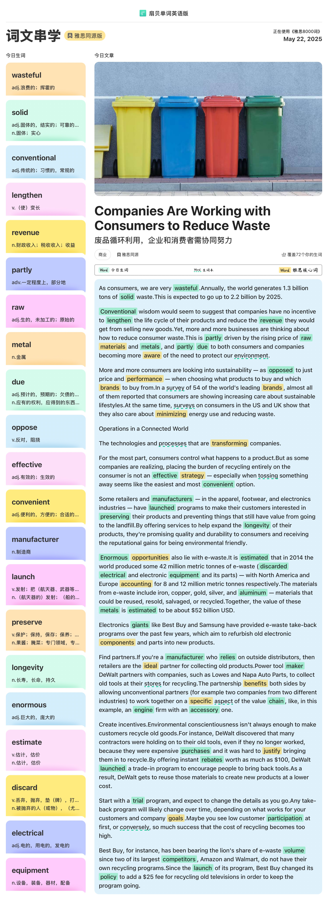

- conventional  adj.传统的；习惯的，常规的
  - conventional wisdom 公众意见；普遍看法
- wisdom n.智慧；才智；学问
- convenient adj.便利的，方便的；合适的；
- incentive n.动机；刺激，鼓励
- revenue n.财政收入；税收收入；收益
  - 和 income 的区别，revenue 一般代表收入，income 代表收益，扣除成本以后
  - budget n.预算 
- look into phrase.调查；朝里面看
- sustainabilty

