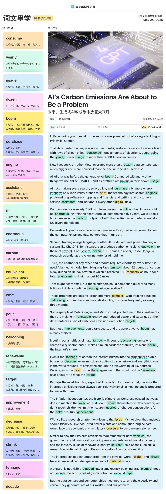

carbon emissions  碳排放

emit v.发出；排放   ion 抽象名词结尾

carbon footprint 碳足迹

racks of servers 服务器机架 rack n.支架

row upon row 鳞次栉比

outstrip v.超过

generative-AI 生成式 AI

brethren n.兄弟，同胞

intensive adj.密集的

compound n.复合物

compuounded adj.由...组成

equivalent adj.等价的  

several dozen 几十个

pour into 大量投入

ballooning exponentially 呈现指数型增长

spokespeople n.发言人

presenter n.主持人

every sector 各行各业

let alone shrink 更别说减少

for decades 几十年

optimistic  adj.乐观的

degress Celsius  摄氏度

an improbably optimistic scenario 不太可能的乐观估计

遥不可及：将仍然是没有地方足够靠近这个目标

would still be "nowhere near enough " to meet the target 

The Inflation Reduction Act 通胀削减法案

for the sake of future generations 为了下一代的利益

chatbot conversations 聊天机器人对话

the historic climate law 具有历史意义的法案

coal-fired power plant meihuofadian 燃煤发电厂

combustion-engine cars 内燃机汽车

emissions-free 零排放

impose standards  强制标准

appear untethered from the physical world 看起来不收物理世界束缚

instead adv.替代 phrase.而不是

instead of 而不是

material space 物质空间

an exhaust pipe 排气管

secrete the acrid smell of  分泌刺鼻的...味