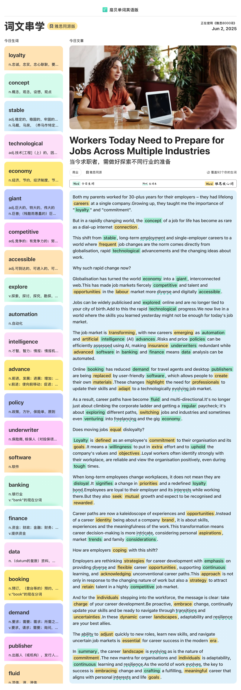

## 文章

## 笔记

as rare as 像...一样稀少

a dial-up internet connection 拨号上网

long-term employment  长期就业

single-employer careers 单一雇主职业

rapid technological advancement 快速的技术进步  

rapid technological progress 快速的技术进步

job markets 就业市场

labour markets 劳工市场

fiercely competitive 竞争激烈

more diverse and digitally accessible  更多样化和数据可视化

efficiently assess 有效的评估

demand v.要求  n.要求 

command  v. 命令 n.命令

## 长难句

Risks and price policies can be efficiently assessed using AI, making insurance underwriters redundant while advanced software in banking and finance means data analysis can be automated.

风险和价格策略能使用 AI 有效的评估，确保保险核保人变得多余，而在银行和金融业先进的软件意味着数据分析能被自动执行。

## 单词

## 翻译

