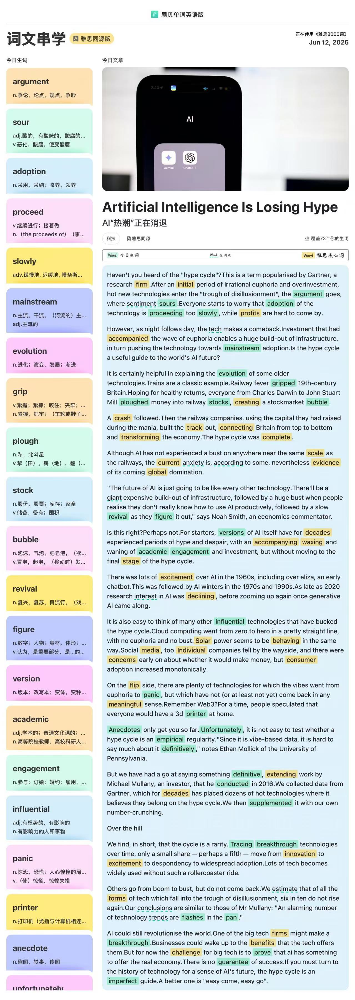

hype cycle 炒作周期

a term popularised 普及的术语

the argument goes 争论继续

an initial period of 初始阶段

irratianal euphoria and overinvestment 非理性乐观与过度投资

trough of disillusionment 低谷期

sentiment sours 情绪低落（市场情绪变得悲观或负面）

adoption of the technology 采用该技术

as night follows day 黑夜追随白昼

the tech makes a comeback 这项技术终将东山再起

accompany the wave of euphoria  伴随着兴奋的浪潮

a huge build-out of infrastructure 大规模基础设施的建设

in turn 这反过而

fever gripped 狂热（形容某种情绪或现象在某个地方或群体中广泛传播或盛行）

ploughed into 投入

stockmarket bubble 股市泡沫

A crash followed 崩溃紧随其后

during the mania 在躁狂期间

build the track out 修建轨道

transform the economy 改变经济格局

experienced a bust 经历了破产

a gaint expensive build-out of infrastructure 大规模、高成本的基建设施建设

a slow revival 缓慢的复苏

figure it out 了解它

economics commentator 经济评论家

for starters 作为开端

academic engagement and investment 学术界的关注度和投资热度

final stage 最终阶段

research interest in AI was declining 研究 AI 兴趣正在降低

zoom up 上升

influential technologies 重要的技术

buck the hype cycle 打破炒作周期

straight line  直线

with no euphoria and no bust 没有兴奋，也没有崩溃

solar power 太阳能发电

fell by the wayside 半途而废

individual companies 一些公司

adoption increased monotonically 接受能力稳步上升

on the flip side 另一方面

any meaningful sense 任何有意义的感觉

anecdotes only get you so far 传闻不能让走的太远

an empirical regularity 经验规律

something definitive 明确的东西. definitively adv.结论性地

over the hill 度过危机

move from innovation to excitement to despondency to widespread adoption 经历从创新、热浪、低谷到最后广泛应用

rollercoaster ride 大起大落

there is no guarantee of success 成功并非能保证