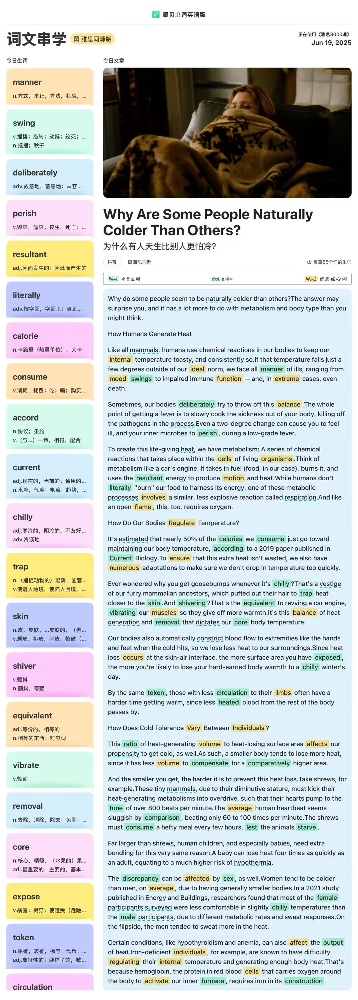

naturally adv.自然地

metabolism n.新陈代谢

body type 体型

mammals n.哺乳动物

chemical reactions 化学反应

internal temperature toasty 体内温度舒适

outside of our ideal norm 偏离我们的理想标准

all manner of ills 各式各样的疾病

ranging from ... to ...  范围从 ... 到 ... 

mood swings 情绪起伏

impaired immune function 免疫功能受损

extreme case 极端情况

deliberately  adv.故意地

throw off 摆脱

kill off 扼杀

the whole point of  整个要点

microbes n.微生物

a low-grade fever 轻微发烧

takes place 发生

within the cells of living organisms 生物体的细胞内

burns  n.v. 燃烧

resultant adj.因此而产生的

don't literally 不是字面意义上，不是正真的

harness its energy 利用其能量

respiartion  n.呼吸

regulate temperature 调控温度

calories n.卡路里

go toward 走向

numerous adaptations 多种适应

ever wondered 有没有想过

goosebump n.鸡皮疙瘩  goose n.鹅 bump v.n.碰撞

vestige n.残留部分、遗迹

furry mammalian ancestors 长毛的哺乳类祖先

puffed out  hair 蓬松的头发

trap heat 困住热量

shiver v.颤抖（寒冷引起的）

revving v.快速运转

vibrate muscle 振动肌肉

give off 发出

it's this balance of heat generation and removal that dictates our core body temperature

这种热量生成和排除的平衡决定了我们身体核心温度。

removal

dictates

constrict blood flow 限制血流量

surroundings  n.环境

extremities n.(人的)肢体；尽头  extremities like the hands and feet 

by the same token 由于同样原因

circulation n.循环；血液循环

less circulation to their limbs 四肢血液循环减少

affect our propensity to get cold 影响我们倾向寒冷

compensate for 补偿

since it has less volume to compensate for a comparatively higher area 

因为它具有较小的体积来补偿相对较高的面积

tiny mammals 微小的哺乳动物

diminutive stature 身材矮小

by comparison 比较起来

into overdrive 大幅提升

hearts pump to the tune of over 心脏随着节奏跳动

sluggish adj.行动迟缓的

a hefty meal 丰盛的饭菜

equate v.同等看待

hypothermia n.低温症

sweat n.v.出汗、流汗

slightly chilly 略微寒冷

on the flipside 在另一方面

certain conditions 在一定条件下

iron-deficient individuals 缺铁性贫血的个体

protein n.蛋白质

