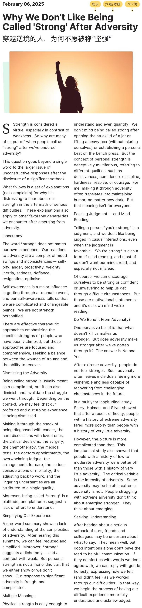

strength is considered a virtue  力量被视为一种美德

in contrast to  与... 对比

put off 拖延；反感

endured adversity 忍耐困境

the disclosure of 披露

significant setback 重大挫折

go beyond 超过

explanations  n.解释，说明

complaints n.抱怨

distress n.窘迫；痛苦

in the aftermath of serious difficulties 在严重困难之后

in the aftermath  事后

aftermath 后果

apply to 适用于

other favorable generalities 其他有利的概括

- favorable adj.有利的
- generalities n.概括的话；一般性；普遍性
- encounter v.遭遇

emerge from 出现

- emerge v.出现

a complex of mood swings and inconsistencies self-pity, anger,proactivity,weighty inertia,sadness,difiance,resignation,optimism

- inconsistency 不一致；矛盾
- self-pity 自怜
- proactivity 主动积极
- weighty inertia 消极懒惰
- defiance n.反抗
- resignation n.顺从；辞职
- optimism n.乐观主义

in get through a traumatic event 度过创伤事件中

we are complicate and changeable beings 我们是复杂多变的存在

we are not strength personified 我们不是坚强的化身

effective therapeutic approaches 有效的治疗方法

victimize v.受害

these approaches are focused  and comprehensive 这些方法是集中和全面的

the wounds of trauma  创伤的伤口

dismissing the adversity 无视逆境

as a compliment 作为赞美

it can also diminish and invalidate the struggle we went through  它也会削弱和否定我们所经历的斗争

- invalidate v.无效
- invalid adj.无效的

depending on the context,we may feel that our profund and disturbing experience is being dismissed.取决于不同情况下，我们可能会感觉到自己深刻和痛苦的经历被忽视了。

- profund adj.深远的
- disturbing adj.令人不安的

Making it through the shock of being diagnosed with cancer, the hard discussions with love ones, the critical decisions, the surgery, the chemotherapy, the medical tests, the doctors appointments, the overwhelming fatigue, the arrangements for care, the serious consideration of mortality, the adjusting back to work, and the lingering uncertainties are all attributed to a single quality。

- 从被诊断患癌的震惊，到与亲人艰难的对话，到作出艰难的决定，经历手术和化疗，医疗检查，医生就诊，过度疲劳，安排护理，对死亡的认真思考，重新适应工作生活，以及挥之不去的不确定性都被归结为单一的品质。

platitudes suggest a lack of effort to understand. 老生常谈表明缺少努力去理解。

A one-word summary shows a lack of understanding of the complexities of adversity. 一句话总结反映对逆境的复杂性缺少认知。

dichotomy n.一分为二

Personal strength is not monolithic trait that we either show or we don't show.

- 个人的内在力量并不是非黑即白的，不是我们要么完全拥有要么完全没有的单一品质。

Physical strength is easy enough to understand and even quantify.

- 身体的力量不难理解甚至可以用数字衡量。

open the stuck lid of a jar 打开卡住的罐子盖

lift a heavy box 抬起一个沉重的箱子

bench press 卧推

extreme adversity fared 遭遇了极端的逆境

especially not misread 尤其是不要误读

unwavering adj.坚定不移的

difficult  circumstances 困难的情形

motivational statements 激励性的陈述

Do we benefit from adversity？我们能从逆境中受益吗？

one pervasive belief 一种普遍的信念

The answer is No and Yes.答案既不确定也不否定。

Such adversity often leaves individuals feeling more vulnerable and less capable of recovering from challenging circumstances in the future.

- 这种逆境经常让个体感觉更加脆弱，并且削弱未来来自挑战情景的恢复能力。

The critical variable is the intensity of adversity.关键因素在于逆境的强度。

good intentions alone don't pave the road to helpful communication.仅有好意并不能铺就道路去有效沟通
