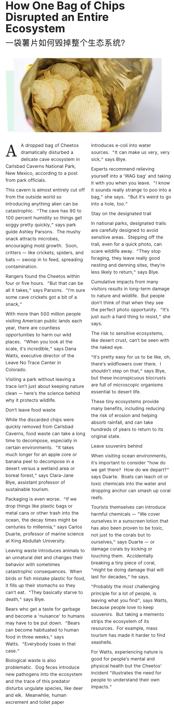

A dropped bag of Chips dramatically distributed a delicate cave ecosystem.

一袋掉落的薯片严重地干扰了脆弱的洞穴生态系统。

This cavern is almost entirely cut off from the outside world so introducing anything alien be catastrophic.

这个洞穴几乎整个切断了外面世界，所以引入任何外来都将引起毁灭性打击。

executive director 执行董事

Visiting a park without leaving a trace isn't just about keeping nature clean - here's the science behind why it protects wildlife.

参观公园没有留下痕迹不仅仅保持自然干净，这也有科学依据为什么它能保护野生动物。

- without leaving a trace 没有留下痕迹
- science behind 科学依据 behind 做介词表示支持，在...都后面

Don't leave food waste 

不要留下食物垃圾

"It takes much longer for an apple core or banana peel to decompose in a desert versus a wetland area or boreal forest,"says Clara-Jane Blye, assistant professor of sustainable tourism.

苹果核或香蕉皮在沙漠中分解将消耗更长的时间，相比于湿地和北方森林。可持续旅游助手教授说。

leave souvenirs behind 留下纪念品

leave ... behind 不带，留下