[【万字长文解析】我如何戒掉了刷手机的坏习惯｜No.072『福格行为模型』_哔哩哔哩_bilibili](https://www.bilibili.com/video/BV13h4y1Y7cU/?spm_id_from=333.1007.top_right_bar_window_history.content.click&vd_source=ec278794de0ffb1a0b2ecb85da63c11a)

[用户心理学-福格行为模型 - 知乎 (zhihu.com)](https://zhuanlan.zhihu.com/p/187072132)

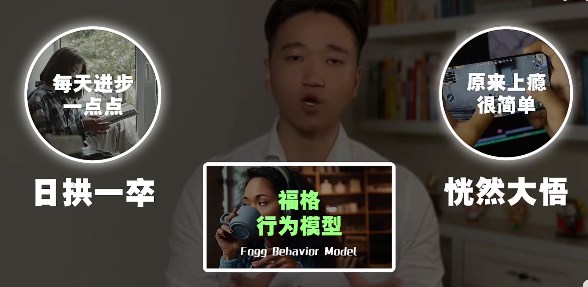

行为只会在动机，能力，提示同时出现的时候，缺一不可。

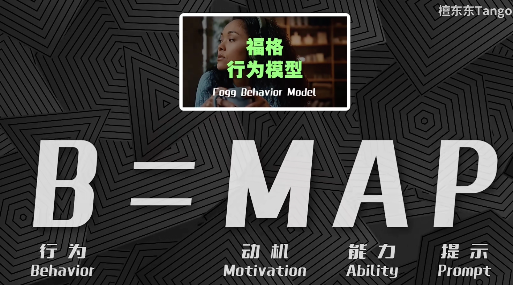

购买瑞幸的行为

动机：昨晚没睡好，需要提神

能力：咖啡便宜，自提方便

提示：瑞幸给你发券，消息提醒

所以瑞幸把店开在写字楼的一楼大厅，为什么瑞幸订单90%来自微信小程序和APP

因为瑞幸把提示做到最高频，把拿咖啡做到最简单，这就养成了我们要喝咖啡的习惯。

B = MAP

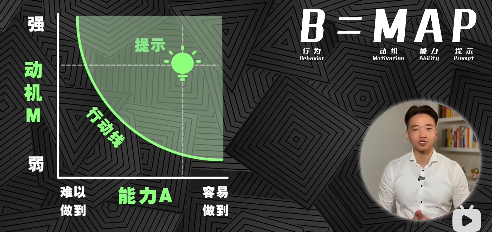

只有动机和能力在行动线以上，且得到行为提示的时候，行为才会发生。

通过这个图我们可以直观的感受到动力和能力是持续的行为变量，一直都有只是程度不同，但是提示这个因素要么有要么没有。

比如

- 帮老婆拿快递，有这个能力也有这个动机，但是老婆不提醒就不会去做。
- 做视频求赞，你觉得视频做的还可以，对你有帮助。有这个能力，也有这个动机。提示是当UP提示你点个赞。

根据这个图我们可以得出结论

- 没有提示任何行为都不会发生
- 动机越强，行为就越有可能做到
- 行为越容易，就越有可能养成习惯

比如

- 每天去公司顺便拿一杯咖啡很容易做到。

提问：

​	如果你期望的行为没有发生，怎么办？如何排查问题

- 有没有这个提示，有没有这个能力，有没有这个动机。先从最容易的提示入手，动机反而不是特别重要。

通过这个行为模型，我们可以养成好习惯，戒掉坏习惯，设计集体行为。

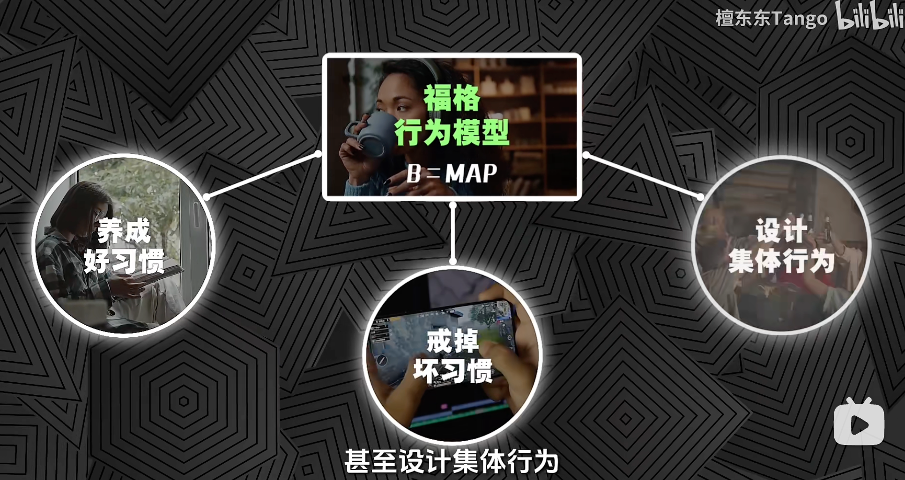

举例

- 养成好习惯：定闹钟让我去吃钙片
- 戒掉坏习惯：如何不让我睡懒觉？晚上喝很多水憋一泡尿？

动机

> 完成某个行为的欲望，如果欲望很持久就是愿望了。但是实现愿望光有行为是不行的，还需要动机。动机是为了实现愿望的黄金行为。

1.动机不足行为就不会发生

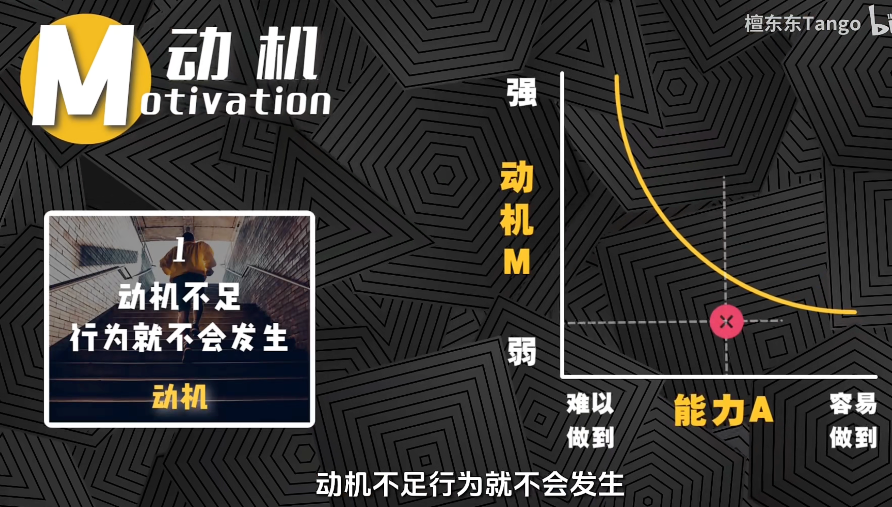

2.动机在最顶峰的时候就会迅速的回落，建议在动机最高涨的时候立即行动。

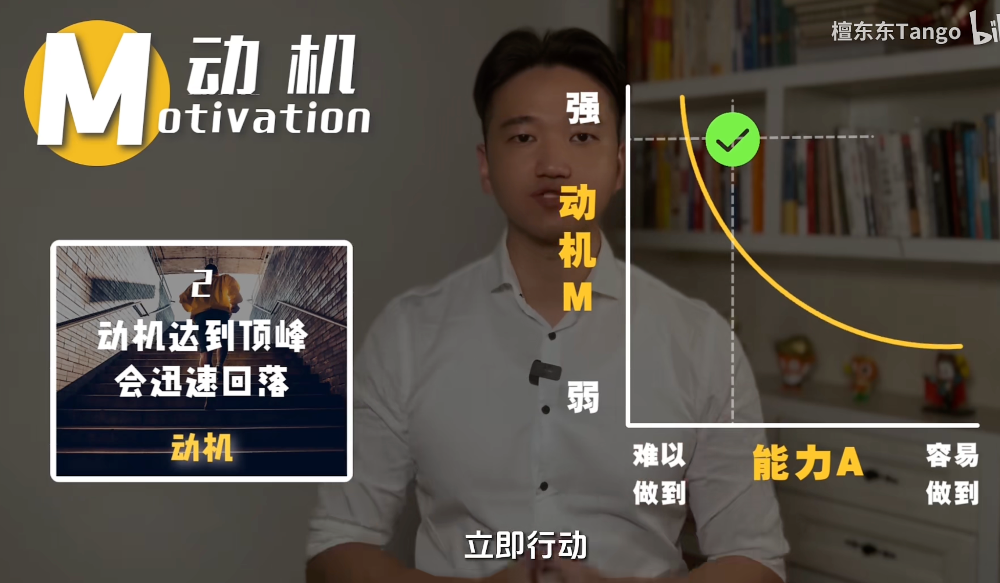

哪怕三分钟热度也要趁热打铁，因为过段时间动机下降，就会降到行为线以下，这个行为就不会去做了。

万事开头难，事情做着做着就简单了。下次我的动机变弱了，但是我的能力变强了，整体还在行动线以上，行为还是会发生。

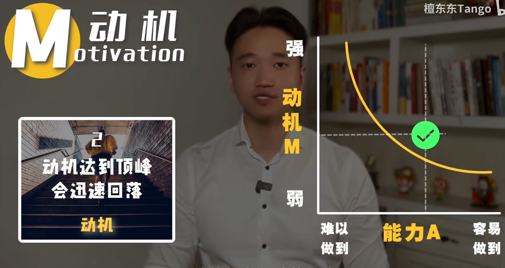

> 举例：做产品也一样，激发了用户动机之后，最好能让用户快速的实现行为闭环，不要等，这个卖保险的很擅长。

得到APP例子

3.仅凭动机是无法实现长期改变的。

- 想增重就能增重吗，想戒烟就能戒烟吗？

行为模型中最不靠谱的就是行为动机，有增重的动机但是不能支撑我长期的运动，控制饮食，早睡早起。

我们还需要依靠自己的能力找到合适的行为，然后叠加提示养成习惯，才有可能实现长期的改变。

有动机到现实我们需要行为，可能是很多行为。

员工有学习的动机，想升职加薪，就会愿意周末加班。

有动机不一定有行动，周末出去玩的动机肯定比学习的动机强。

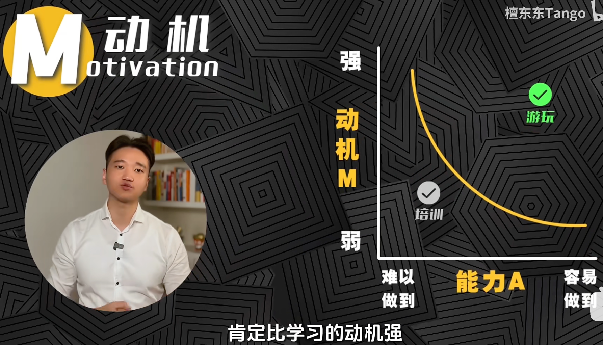

有动机也不一定按照我们想的行为去做。相比于周末无聊的线下培训，我们上下班路上听书，看视频课，在家里看书， 请厉害的人吃饭进行一对一的交流。有很多行为可以去替代培训。所以找到动机和愿望之间的我们乐意做的黄金行为最重要。

列出我们在规律健身中需要做的行为，

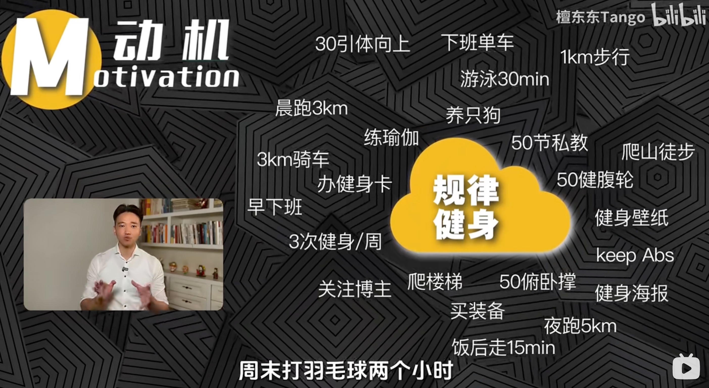

从几十个行为中找到黄金行为。

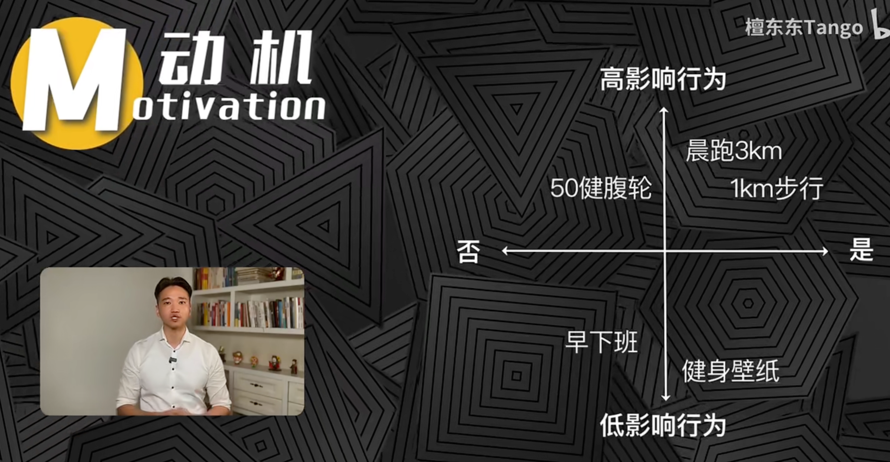

持久改变的关键在于匹配内心真实想做的事情。如果一个人在很累的情况下还能去做，还能做到就非常匹配，这就是一个黄金行为。

聚焦我们能做到的就是黄金行为。

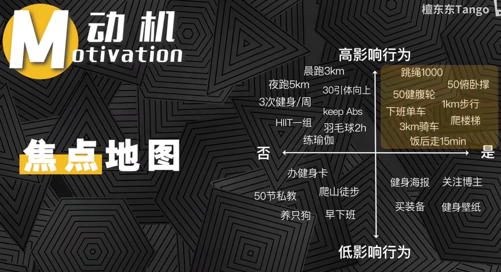

对我们这些聚焦行为进行行为设计

一些低影响，马上能做到的立马做了，其他的行为都可以忘记了。

研究动机就是为了用焦点地图去找到匹配自己的黄金行为。然后就是能力这个因素。

虽然动机不可靠，但是能力可靠。行为越容易就越有可能成为习惯，研究能力的目的就是调整能力值，让行为变得很容易做到。

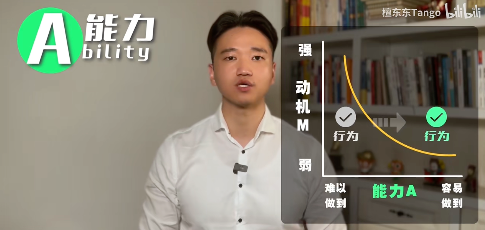

每天做50个俯卧撑，很难做到，但是每天做1个俯卧撑则很容易做到。

从简单的事情开始改变行为。

做一个事情能力的强弱和我们的时间，资金，体力，脑力，日程都有关系，这五个因素组成了我的能力链条，最弱的一环决定了我的能力强度。

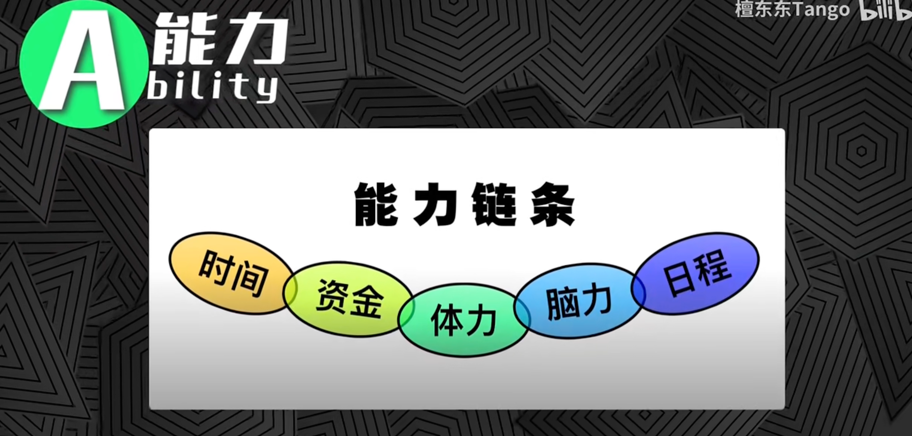

没时间，没资金，没体力，没脑力，没日程都会影响我的行动。哪怕是十分钟的俯卧撑，十分钟虽然不长，但是消费体力。所以我们要想办法把事情变得简单，做起来毫不费力才有可能坚持。

让一个事情变得简单有三种方法：

1.提升自己的能力，能力强了行为就变简单了。动机一直有，能力也允许，再多几次提示。

2.利用工具和资源，以前做科研一天一个英文文献很难，现在借助GPT这个工具就很简单。

3.让行为变得微小，这也是道家思想。天下大事必作于细，天下难事必作于易。大事化小是智慧。

​	

让行为变得简单还有两种方法：入门步骤和缩小规模

入门步骤是如果想出门跑步，那就先穿上跑鞋，后面的动作就自然而然做下去了。入门步骤厉害的地方就是能让我们零阻力起步。万事开头难，那我们就让开头变得简单。

缩小规模是指晨跑3km，那就先定小目标，先100米。想做100个俯卧撑，那我们就先做一个。缩小到极小的规模，小到我们不可能失败。

只有三种情况会让我们持久改变：经历顿悟、改变环境、小处下手。

经历顿悟，改变环境都很难，从小处下手很容易，只要让你行为变得很容易做到，即使动机很弱，也能轻易的在行动线上面发生。

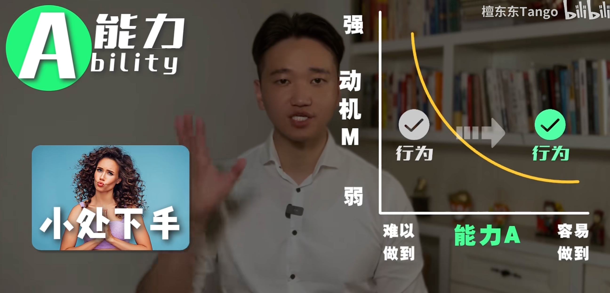

想完成大习惯，就先从微小的习惯入手。微习惯可以利用碎片化时间。每天100个俯卧撑哪有那个时间，但是每天一个俯卧撑随便就做掉了。并且微习惯不依赖任何动机和意志力。

这方面抖音和腾讯都很擅长，一个视频十几秒，并且下滑就是下一条视频，根本就不需要啥意志力和东西，并且碎片化的时间也可以刷视频，慢慢我们就无法自拔了。

以前我们打游戏，LOL和魔兽，都是需要电脑才可以玩，并且 操作复杂，时间久，动不动就一个小时。现在王者荣耀，十几分钟一把，等饭的时间就一把打完了。让打游戏这个事情变得简单，并且女玩家变多，男玩家炫技的动机增强了。动机很强，很容易做到，并且有人提示你上线，怎么能不沉迷游戏。

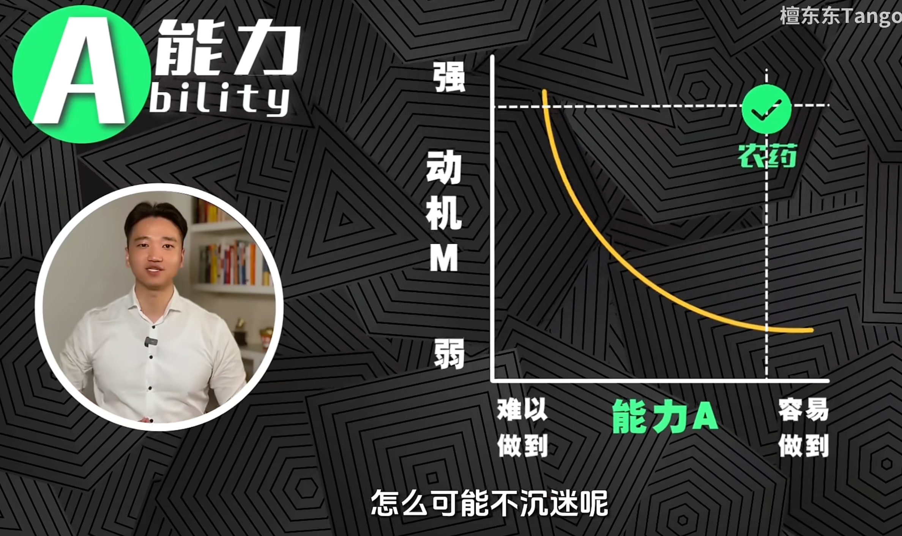

研究能力这个因素就是为了让行为简单到能够随时到轻易的做到。只有简单的东西才会持久，大道至简。只要足够简单，行为就能发生，改变才会发生。真想养成好习惯，别一开始就动用意志力跟自己较劲。

先从微习惯开始，把每天睡前读书半小时，改成睡前读书一分钟。

第三个因素是提示：动机，能力一直都在，但是提示要么有，要么没有。没有提示，那么行为肯定就不会发生。你有跑步的东西，也有跑步的能力，但是周末没有提醒是不会起身跑步的。如果在阳台上看到有人跑步，你看到自己的跑鞋，看到提示才有会可能出门去跑步。

看到提示的作用就是告诉你，立刻，马上，去行动。

行为设计的关键就是设计好提示，让行为立刻发生。

一种提示就是情景提示：身边的任何都可以是提示。APP通知，邮箱提醒，闹钟提醒，便利贴。

把健腹轮放在入门的门口，进门就可以看到，时时刻刻提醒我用它锻炼腹肌，这种提示不是最好的，更好的提示是行动提示。把已有的，固化的行动作为你下一个行动的提示。

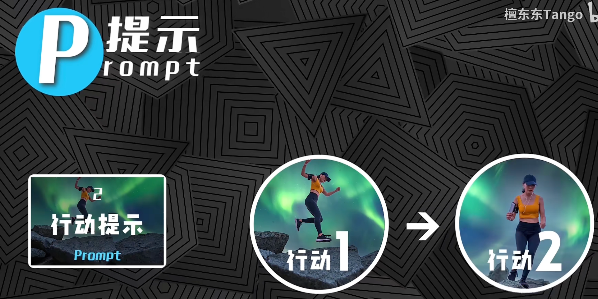

在。。。之后我会。。。

1. 早上出门关好门后我会打开得到APP听书。#听书学习的习惯
2. 地铁出站之后我会点一杯咖啡。#喝咖啡的习惯
3. 到了公司登陆聊天软件之后，我会把手机放在笔记本下面。#专注的习惯
4. 吃完午饭坐回工位之后，我会带上眼罩。#午休的习惯
5. 上完厕所之后，我会喝一大杯水。#多喝水的习惯
6. 下班关闭电脑之后，我会写下明天必做的3件事  情。#做计划的习惯
7. 到家换好鞋之后，我会做几个健腹轮。#健身的习惯

那些已经存在且肯定会发生的动作，是最佳的行为提示。福格把它称为行为锚点。在锚点之后开始你的新习惯，这个是培养习惯的诀窍。不管是多么散漫随性的人。都有固定的锚点可以利用。再为新习惯找锚点的时候，要尽可能的匹配合适，有两个思考角度。

1. 匹配物理位置。新习惯和锚点在同一个地方发生，比如关闭电脑之后写下明天要做的三件事。
2. 匹配频率。是一天一次还是一天多次，还是多天一次。比如上完厕所喝水，这个是一天多次。如果下班之后做健腹轮，这个是一天一次。

锚点事锚下最后要做的事情。如果是下班之后写下明天要做的三件事就太笼统了，要锁定到下班后的最后一个动作，关闭电脑。回家之后做健腹轮精确到换好鞋之后做健腹轮。

一定要是上一个动作结束，下一个动作开始，才是好的锚点提示。

如果现在你想养成健身的好习惯，就可以开始设计我的行为了。

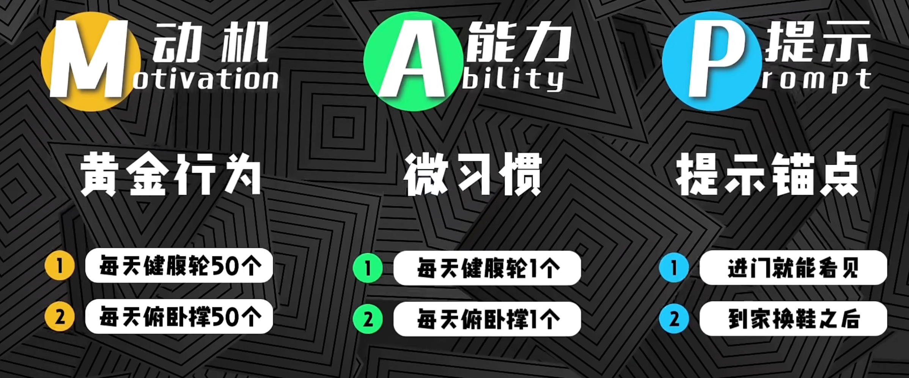

每天回家换好鞋开始做一个健腹轮，一个俯卧撑，每天健身的习惯就这么轻松的启动了，你已经从细微处慢慢改变自己了，肯定能完成，也很容易坚持。命运的齿轮开始慢慢的转动。

我们会有的疑惑，每天做一个健腹轮，会有效果吗。别着急，剩下的交给时间，习惯会慢慢长大，习惯也会慢慢繁殖。

如果不是微习惯启动，一开始要求自己每天做健腹轮50个，俯卧撑50个，妥妥会失败。因为第一天有多猛后面就有多废。肌肉会酸痛3-4天刚开始就结束了。刚办卡的健身房新手也是这样的。如果是微习惯启动就不一样了，你的肌肉不可能酸痛，绝不会影响第二天继续保持。然后习惯就会像植物一样，开始按照自己的速度长大繁殖。微习惯长大，好理解。每次都做一个，做着做着就变成了2个，5个，10个，20个。但是长大也会有边界，茶树不可能长到杨树这么高。健腹轮这个习惯的边界可能就是50个了，超过50个就要动用意志力逼自己一把，这就会削弱习惯的动机就没意思了，一定要慢慢长大。平时8点起床突然要我6点钟起床，硬着头皮也只能坚持3天，但是大概率会失败。把每天起床的时间往前拨5分钟，不到一个月也能养成6点钟起床的习惯。

微习惯不仅能长大还能繁殖，就是一个习惯可以繁殖成多个习惯。从刷牙到最后的早餐，繁殖出了5个微习惯。微习惯启动，每次都能成功，成功就会带来喜悦，也会跟容易坚持。

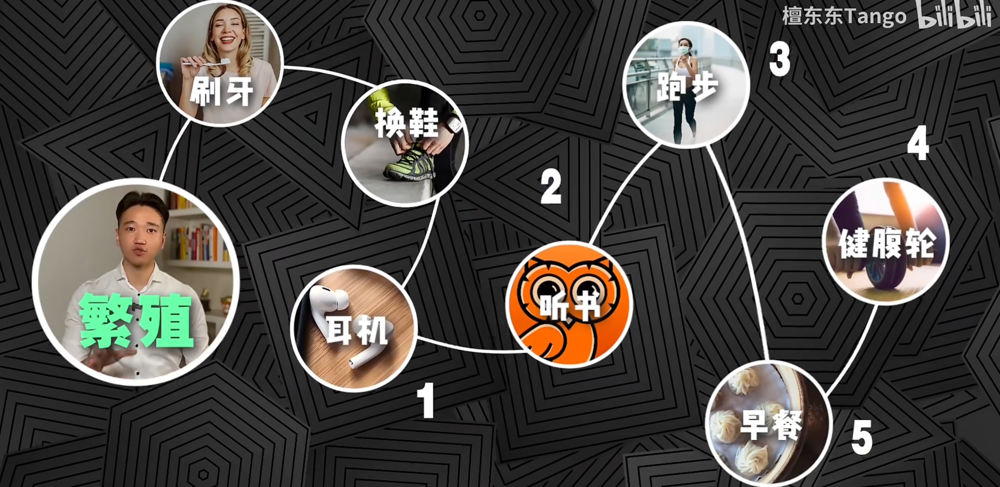

举例：会想作者每天4点半起床跑步3km，坚持了66天最终还是失败了。动机也有，能力也够，提示也做了。把每天跑步要做的速干衣放在飘窗上，起床睁眼就能看到，然后立马换到。而且坚持66天还是失败了。深入研究福格模型之后梳理失败的原因。

1. 没有从微习惯开始。每天4点半起床真的很费劲，并且下雨天直接放弃了。如果是微习惯下雨天肯定不会放弃，打着伞出去走100米就算成功了，肯定不会放弃。
2. 早起的习惯，跑步3km两个很难的行为加在一起，存粹是 通过意志力，将行为称在行为线之上。

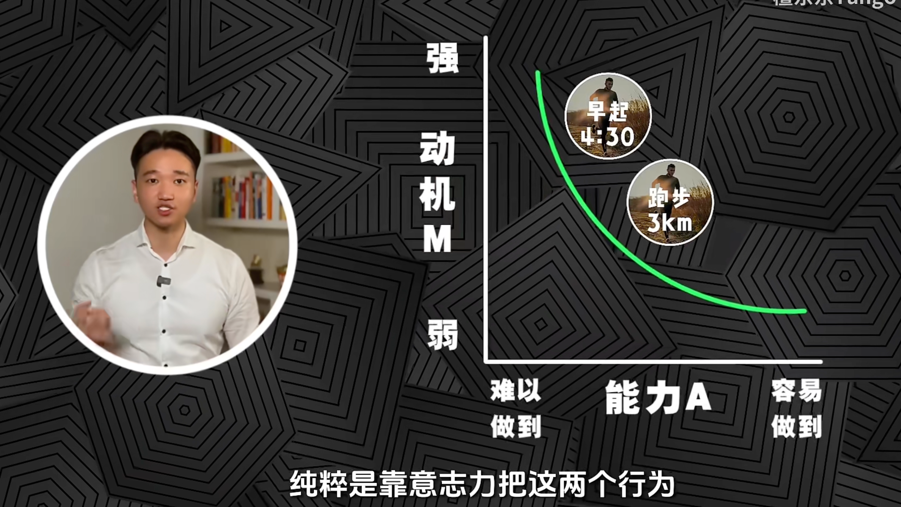

失败的原因有两个

1. 没有从微习惯开始就很难坚持，如果从每天早起五分钟，每天走100米慢慢增加。我相信66天之后还能坚持。
2. 有坏习惯影响。睡前刷手机刷到大半夜。直接导致第二天起床失败。

如果通过福格模型将刷手机的坏习惯戒掉。

好习惯和坏习惯其实没有本质的区别。都是动机能力提示三个要素共同作用的结果。

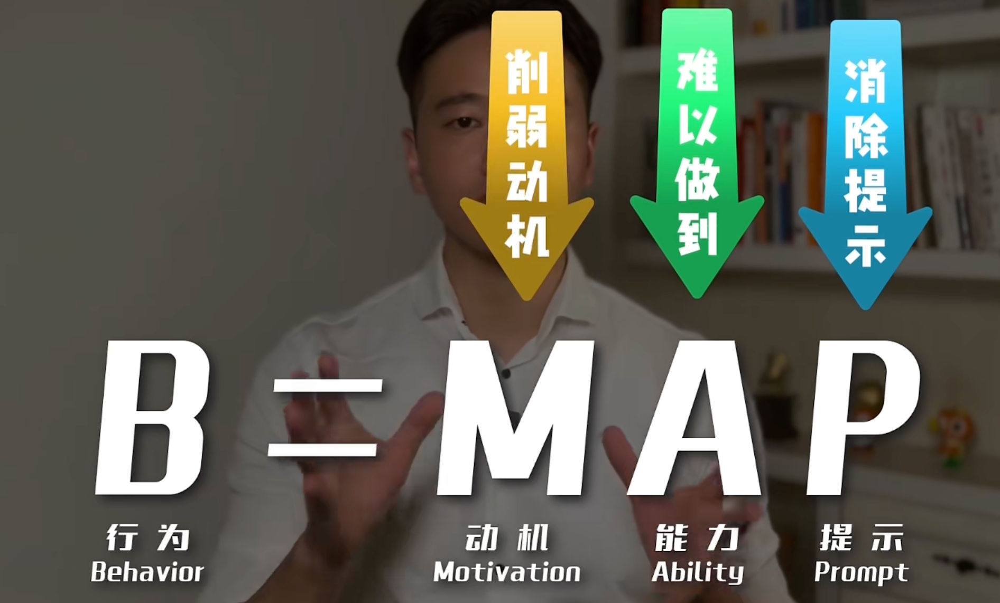

- 消除提示，手机本身就是提示，手机的铃声和亮屏也是提示，APP图标是提示，应用提醒也是提示，消除他们。让我们看不到手机，来消除手机对我们的影响。
-  调整能力值。让坏习惯更难做到，APP限额。
- 削弱玩手机动机。让手机变成灰度模式。手机的色彩消失了，生活的色彩回来了。

也可以通过能力链条来设计。

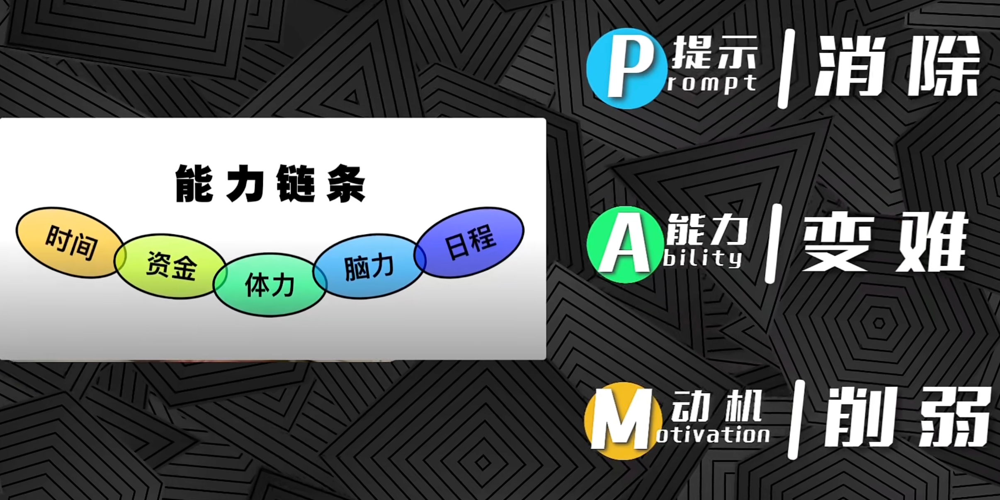

不在冰箱里面屯冰淇淋，想吃就要出门。

戒掉睡懒觉的习惯，可以养条狗，每天出门遛狗的行程是躲不掉的，必须起来。

利用福格模型养成群体习惯。比如你是团队的领导，希望团队开会的时候更加高效，尤其是大家发言的时候，能够结构化的组织语言，说重点。而不是东拉西扯一大堆没用的东西。怎么样培养大家结构化发言的习惯呢。

通过动机能力和提示来举例：动机都有，高效开完会，不浪费时间。能力需要简单的辅导一下。

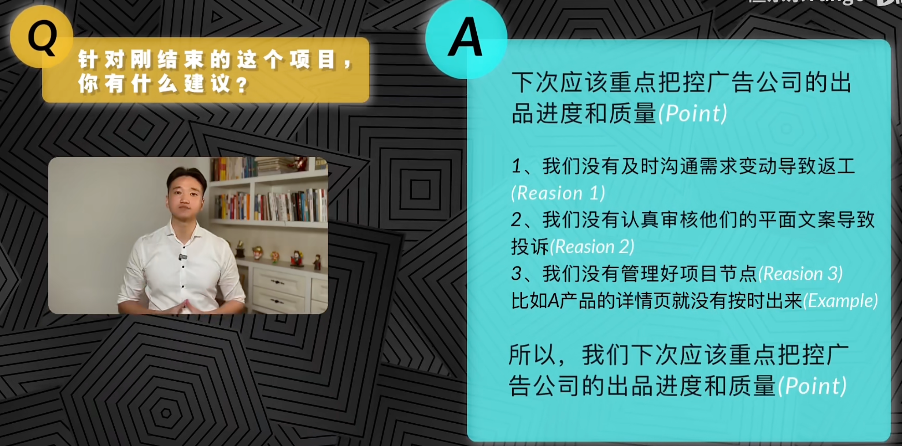

提示，在会议室上解释PERP的用法。不管是开会面谈汇报工作写报告，都提示用这个方法。大家都养成了这样的好习惯。

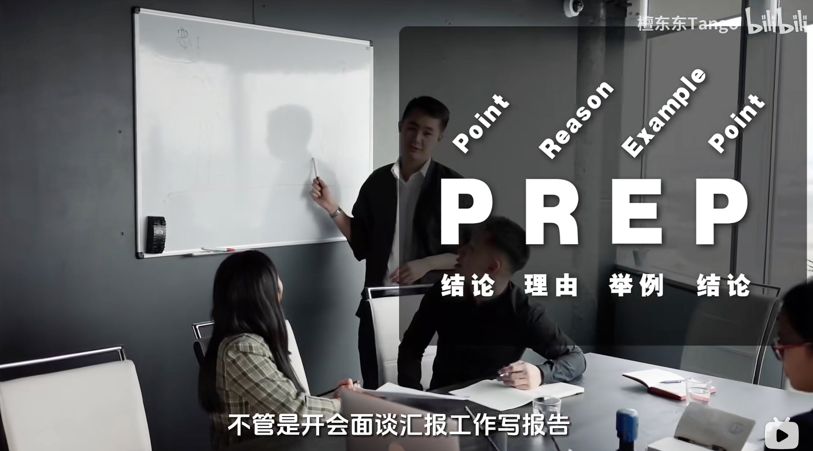

群体行为一样可以通过福格模型来设计，所以有些不专业的管理者，只顾着提要求，一味的强调主观能动性，不管下属的能力，也不积极的给提示，甚至有时候还故意让下属去悟。

最后我们通过福格模型来解释一下我们熟悉的社会群里模型。你就会发现一切都会很合理，解决问题的办法也很清晰。

第一个现象，游泳健身发传单肯定没用。

提示：小蜜蜂发传单肯定不是一个好的提示，不是提示我要去健身要去管理身材，而是提示我要花钱，要花很多钱。

能力：花3000块办一个健身卡，不是花30块买一个奶茶，很难的。

动机：就算路人有减肥塑形的动机，未必非要去健身房。骑车，瑜伽，跑步，游泳，居家都是可以的。

所以有些聪明的健身房玖搞了免费健身，先交3000块钱，如果一年健身超过100次就全额退款。提升消费者动机，不仅能减肥还能占便宜。还有健身房推出了按月付费。按次付费。这些都是降低难度，让行为更容易发生。在提示层面，让健身教练穿上显身材的衣服去周边写字楼的餐馆吃饭。在潜在客户面前提示他们。

为什么现在年轻人不谈恋爱不结婚不生小孩。

B = M A P 任何行为只发生于动机能力提示。三个要素同时出现，缺一不可。