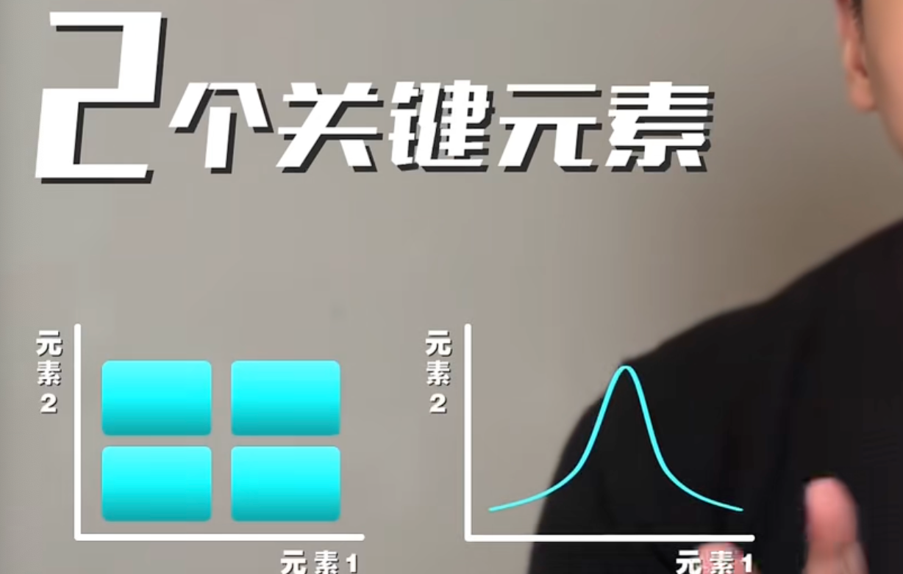
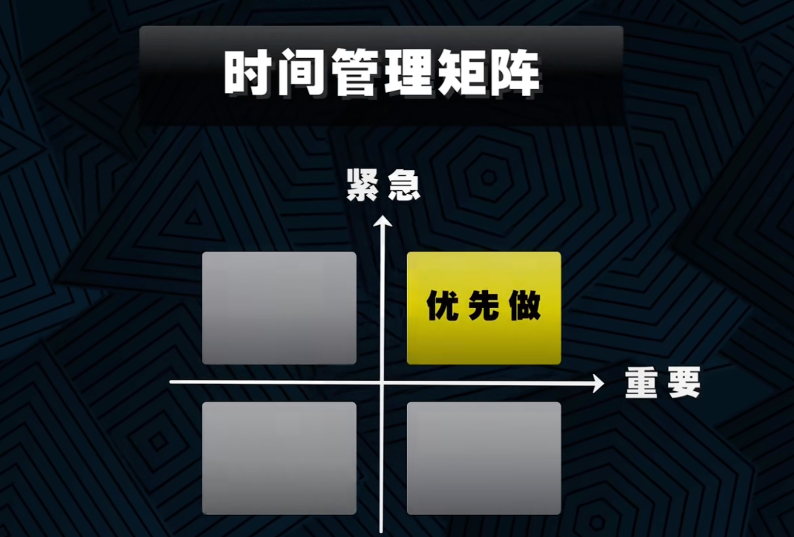
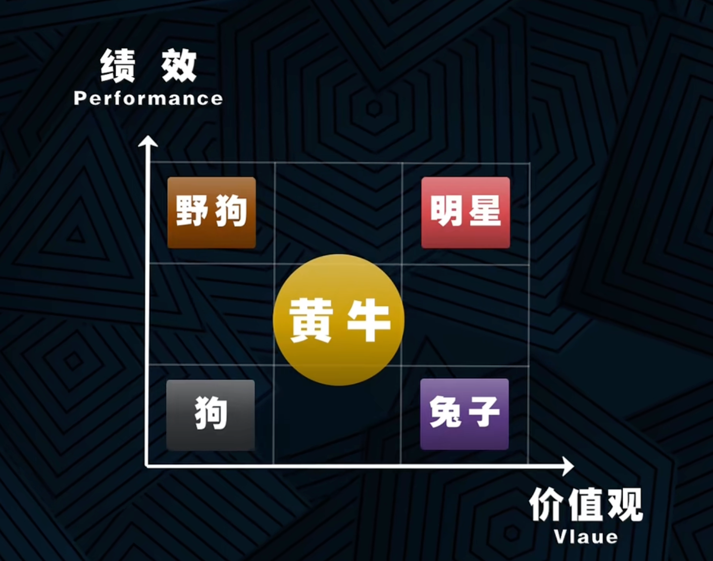
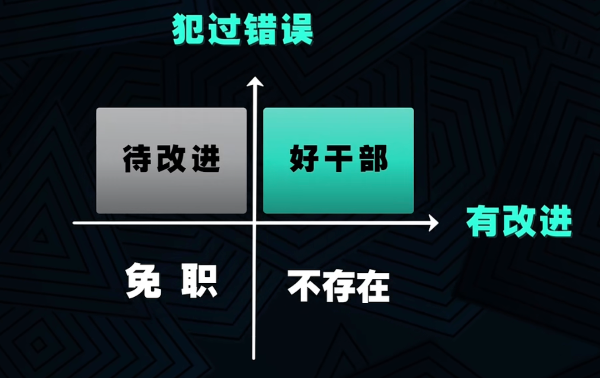
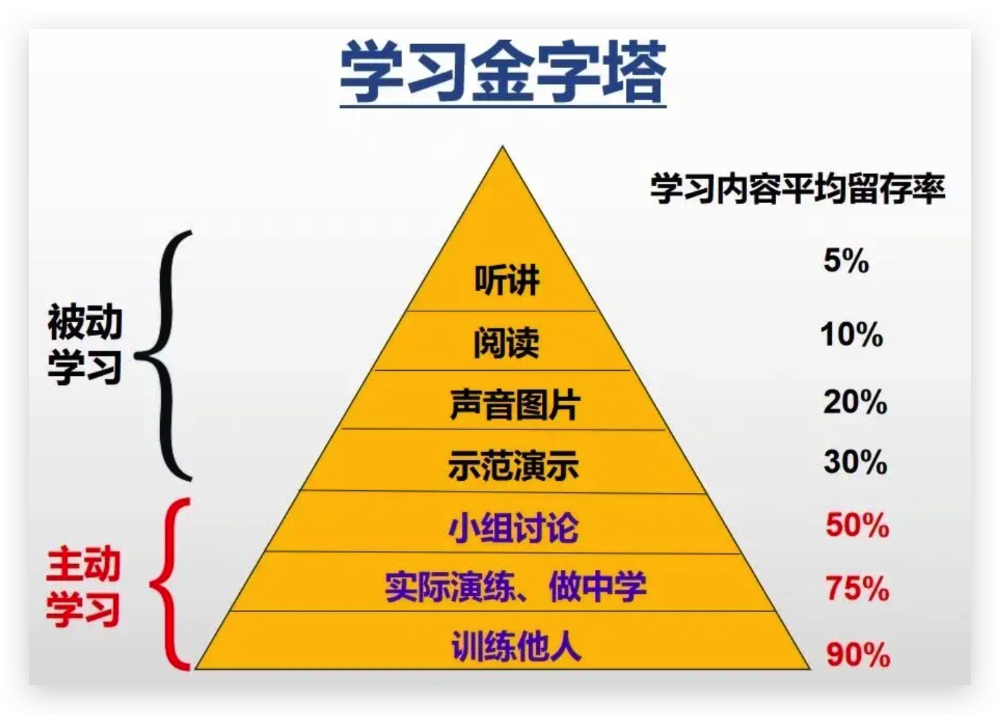

[//]: # ([【结构化思考】因为平庸，我才努力点满这项奇技。]&#40;https://www.bilibili.com/video/BV16c411U77h?spm_id_from=333.1245.0.0&#41;)

[//]: # ()
[//]: # (关键、矩阵、案例、要素、知识、产品、复盘、路径、绩效、结构化思考、思考结构、模型思维、搜索技术、思考逻辑、逻辑结构、销售业绩、附加价值、思维导图)

[//]: # ()
[//]: # ()
[//]: # ()
[//]: # (文字记录:)

[//]: # ()
[//]: # (00:00 )

[//]: # ()
[//]: # (我曾经去过一家理发店， Tony 老师只专心理发，不跟你尬聊，也不忽悠你充钱烫染。但是他在墙上贴了一个发型理念的标语，碱结构需要烫，形状需要染，完美需要。太有说服力了，要求不高，你就随便捡一下。要搞造型那就烫，追求完美那就染，客户一看就懂了。像这种结构化的表达，非常的有说服力，胜过托尼老师的半天啰嗦。)

[//]: # ()
[//]: # ()
[//]: # ()
[//]: # (00:30 )

[//]: # ()
[//]: # (麦肯锡有句名言，没有结构，你的观点站不住脚，就是你通过结构化思考分析之后得出的结论会更有说服力。比如说这些帮你思考，帮你解决问题的结构化模型熟悉吗？有表达的、写作的、学习的、思考的、分析的、开会的、决策的、管理的，太多了。芒格先生生前非常推崇多模型思维，脑子里要掌握多个模型，因为每一个模型都是解决特定问题的钥匙。这个视频依旧很长，但是能帮你练就结构化思考的能力。这个学校里不教，成长路上却极其重要的能力，能够让你的思考表达行动有逻辑、有章法、有套路，解决问题更有效率。)

[//]: # ()
[//]: # ()
[//]: # ()
[//]: # (01:10 )

[//]: # ()
[//]: # (那到底什么是结构化思考？先别管那些复杂的概念，简单说，结构化思考就是给你的思考过程套一个逻辑结构，这个结构就是你的思考脉络。我们思考是为了解决问题，对吧？通常来说，复杂问题的解决路径是这样的，第一步我们先提出问题，然后再去发现真问题，再去分析问题，然后提出解决方案，再落实行动，最后总结复盘，这是一个完整的闭环，这当中通过结构化思考分析问题，能够起到刚举目张四两拨千斤的效果。)

[//]: # ()
[//]: # ()
[//]: # ()
[//]: # (01:43 )

[//]: # ()
[//]: # (那整套完整的路径我们后面再详说。我们先搞清楚什么是结构化思考，到底怎么思考？又有哪些常见的结构化思考？它不是空想，它是对一个问题的关键元素进行思考。怎么样才算成功？你有你的看法，你觉得成功的关键要素是才能加运气。但是稻盛和夫认为，人生成功等于思维方式乘以能力乘以热情。那你们选取的关键元素不同？爱因斯坦衡量自负程度只选了一个关键元素，知识 EGO 等于 1 除以knowledge，这是他评判一个人是否自负的模型。再比如，如何建立信任，麦肯锡选的关键要素是资质、能力、可靠性、亲近程度，还有自我利益取向，直接用一个公式就表达了。)

[//]: # ()
[//]: # ()
[//]: # ()
[//]: # (02:31 )

[//]: # ()
[//]: # (还有如何测评一个人的性格，有的人选 MBTI 16 型人格，有的选九型人格，有的选大五人格。模型考量的关键元素是不一样的，怎么盘点员工的优劣，有的公司选择绩效和价值观来盘，有的公司选择绩效和潜力来盘。选取的关键元素不同，采用的结构不同，那思考的逻辑就不同，之后得到的洞察和方案肯定也是不同的。关键元素的数量一个两个多个都可以思考，结构上层次循环矩阵要素，并列公式等等都可以。所以结构化思考structured， thinking 前面还要加个关键要素，basic， element 首字母组合在一起刚好是best，很好记。)

[//]: # ()
[//]: # ()
[//]: # ()
[//]: # (03:15 )

[//]: # ()
[//]: # (这当中结构其实不怎么难，常见的结构也就那么几种，但难的是选取哪个或者哪几个关键元素。这个是体现道行的，如果问你交什么朋友对自己有好处，你可能会说，当官的有钱的脑子好的。孔子就说义者三，有值，有量有多文。这个当中道行就不一样了。我也是后来才发现，跟身边的那些高手学习什么案例、故事、经验、技巧都不是核心，学他思考问题的逻辑就是他的关键要素和思考结构最有用。接下来我就从关键要素的数量逐步讲解对应的思考结构。)

[//]: # ()
[//]: # ()
[//]: # ()
[//]: # (03:55 )

[//]: # ()
[//]: # (如果只有一个关键要素，怎么形成结构分两种情况，一个就是一分为几，还有一个是一共几集，一分为几就是基于这个关键要素，我们切成几份，没有先后大小高低、强弱程度之分，就是单纯的切成几份，不切也行。比如说孔子的无道，一以贯之就是马斯克的第一性原理就是大道至简是对的，但是不够精细，也不是很方便的指导我们的日常工作，所以更多的还是得切。)

[//]: # ()
[//]: # ()
[//]: # ()
[//]: # (04:26 )

[//]: # ()
[//]: # (关键要素一分为二，现金流分为开源和节流，矛盾分为内部矛盾和外部矛盾，热量控制分为管住嘴和迈开腿。关键要素一分为三，企业用人渠道有哪些？ 3B 模型 by 外部招聘 build 内部培养 borrow 人力外包项目利益相关方甲方乙方第三方员工培训有哪些方式？自己搞，请进来送出去公司的业务对象ToB， to c， to g 这些都是一分为三，如果是一分为四，方向，东西南北，东移，南蛮西戎北地 360 度人才评估角度，自己评上司评下属评同事评读书方法有四，不求甚解，观其大略。)

[//]: # ()
[//]: # ()
[//]: # ()
[//]: # (05:12 )

[//]: # ()
[//]: # (熟读金丝主题阅读垃圾分四类，可回收有害餐除其他平民分四类，涉农工商其他性别 l GPT 基本情感，喜怒哀乐。市场竞争结构分四种，完全竞争，垄断竞争寡头垄断，完全垄断。组织文化的四种类型，部落文化创新文化市场文化等级文化。解决冲突的四种办法，竞争包容妥协合作四种教养方式，权威型，专断型，放纵型，忽视型。那这些都是一分为四，一分为五，金木水火土五种地形，高原平原，丘陵，三地盆地。还有基于五大感觉的营销策略，视觉、听觉、嗅觉、味觉、触觉这些是一分为五，一分为六顶思考帽，蓝白黄黑绿红六大写作冲突类型，人对自然人对社会人对技术人对超自然人对自我。丹尼戈尔曼的六种领导风格，指令型、愿景型、亲和型、民主型、领跑型，还有辅导型。)

[//]: # ()
[//]: # ()
[//]: # ()
[//]: # (06:19 )

[//]: # ()
[//]: # (以上都是一分为几的举例，只选取一个关键元素，一个思考角度进行切分，那一般来说一分为三，还有一分为四会比较常见一点。然后是一共几级，有先后、大小、高低、强弱的程度之分，一般都是三级起步。孔子按照材质高低把人分为上中下三等，中人以上可以与上演，中人以下不可与上演。)

[//]: # ()
[//]: # ()
[//]: # ()
[//]: # (06:44 )

[//]: # ()
[//]: # (企业的业务结构，核心业务，成长业务，还有新兴业务。从治病的时机看医术高低，上宫治未病，中宫治已病，下宫治莫病。小老板做事，中老板做事，大老板做事。经济分析的宏观就是国家、区域、中观、市场、行业、微观企业。个人还有个人能力。三和模型，从外到内是知识、技能，还有才干学习的过程。手破离问题，员工怎么处理？按先后顺序， TRF 模型，train，先培训，remove，再调岗，fire，最后辞退任正非。推行变革，先僵化，后优化，再固化。)

[//]: # ()
[//]: # ()
[//]: # ()
[//]: # (07:24 )

[//]: # ()
[//]: # (这是一共三级。四级孙子兵法有余，上兵伐谋，其次伐交，其次伐兵，其下攻城。职场的同事关系也分为四级，职业共同体、利益共同体、事业共同体、命运共同体。你的人际关系远近，从内到外也可以分为四级， 10 个能借你钱的人， 30 个常打交道的人， 60 个熟悉的人，还有其他人。企业生命周期，初创、成长、成熟、衰退、复盘四步法，回顾目标评估结果，分析原因，总结经验。 5 级马斯洛需求理论，项目管理的五个阶段，启动、规划、执行、监控、关闭。还有大家熟知的六西格玛的改进流程， DMAIC define 定义， measure 测量， analyze 分析， improve 提升 control 控制 6 级布鲁姆学习认知目标分级，记忆理解，应用分析评价创造 7 级学习效果。)

[//]: # ()
[//]: # ()
[//]: # ()
[//]: # (08:20 )

[//]: # ()
[//]: # (金字塔上课听讲效果最差，以教为学效果最好。那这些情况也是只选择一个思考角度，然后有不同程度的分级，其中比较常见的就是按照时间流程划分的， 3- 5 级也会多一点，分太多也不好记，也不太好操作，那综上是一个关键元素的结构化思考，一分为几和一共几集，你应该掌握了。然后就是两个关键元素的情况，这里也分两类情况，一种是常见的线性二维矩阵，还有一种就是非线性的图示矩阵。类的模型可就太多了，我们最熟悉的时间管理矩阵，把事件根据重要、紧急两个维度进行划分，分为四个象限，优先做重要紧急的事情。还有我们很熟悉的人才盘点模型，比如说阿里就选择绩效和价值观两个维度来评价员工的整体表现，如果是绩效和价值观都非常优秀的，那这个是明星员工，技校和价值观都还行的，是黄牛，任劳任怨好用，其他的还有野狗、兔子。阿里的用人准则就是捧民心，杀野狗，青兔子，用黄牛。)

[//]: # ()
[//]: # ()
[//]: # ()
[//]: # (09:30 )

[//]: # ()
[//]: # (为什么说这类矩阵模型是线性的？因为这一类矩阵是有明显的线性指向的，通常是指向右上角。比如说阿里的这个模型也是动态的，关民生，就说昨天的成就是今天的起点，要求就会越来越高。也就是说这个模型它要整体的往右上角线行移动。两个关键元素的矩阵，有的是 2 * 2 的矩阵，有的是 3 * 3 的矩阵，还有一些变体，那这些都行，这个不是关键，最关键的就是你选择哪两个关键元素。同样是盘点员工，你选择学历和在职时间可以吗？当然也可以，就是指导意义不大，因为学历和在职时间它不是关键元素。)

[//]: # ()
[//]: # ()
[//]: # ()
[//]: # (10:11 )

[//]: # ()
[//]: # (任正非有一句有点难以理解的话，对，既没有犯过错误，又没有改进的干部，可以就地免职。这句话背后其实就是一个二维举证。考量干部有两个角度，是否犯过错误，是否有改进。犯过错的有改进的干部才是好干部。犯过错的，没改进的，那就待改进，那没犯过错误，但是有改进的干部不好意思，不存在这种干部要想持续进步，一定要尝试创新。犯错的任正非这句话的意思很明确，不怕干部犯错，怕的是没有改进，那这样一来，队伍里面最终就会剩下两类人，犯错。改进的还有犯了错待改进的。)

[//]: # ()
[//]: # ()
[//]: # ()
[//]: # (10:52 )

[//]: # ()
[//]: # (市面上非常流行的二维矩阵，都是经过管理学者咨询公司，他们深刻洞察实践之后的模型，这些模型的两个关键元素是确实能说明问题的，比如说风险管理矩阵发生概率和影响程度，通过这两个因素来对风险进行优先级的管理。波士顿矩阵也是通过考虑市场增长率和市场份额来区分企业的产品或者业务单元。如果是高增长率、高市占率的产品就是明星产品，是高增长率但是低市占率的产品，那这个就是问题。产品低增长率，但是高市占率，这个属于现金牛产品。低增长率和低市占率，那这个属于售狗产品。这么一区分就很直观，方便决策。)

[//]: # ()
[//]: # ()
[//]: # ()
[//]: # (11:34 )

[//]: # ()
[//]: # (我们的先贤语录里面也有举证，学而不思则罔，思而不学则怠，那最好是又学又思。那另外的两个关键元素就是非线性矩阵的情况，比如说常见的正态分布对数正态分布还密率分布、指数型增长、 u 型、倒 u 型、 m 型、 k 型等等，这些奇怪的形状模型都是。比如说我们熟悉的二八法则，还有互联网的长尾模型，这个就属于密律分布。)

[//]: # ()
[//]: # ()
[//]: # ()
[//]: # (11:59 )

[//]: # ()
[//]: # (1992 年弘玑电脑董事长施振荣提出来的微笑曲线模型就是一个 u 型模型，横轴是产品的价值链，从研发到组装制造再到销售，纵轴是附加价值。他说，企业要注重增加附加价值，在研发端和销售端发力，就能够创造。像技术、专利还有品牌溢价的这些附加价值，中间组装和制造，它的附加价值是比较低的。还有摩根大通的经济学家说，疫情之后经济会呈现 k 型复苏。)

[//]: # ()
[//]: # ()
[//]: # ()
[//]: # (12:30 )

[//]: # ()
[//]: # (什么叫 k 型？就是两极分化，富的更富，穷的更穷。两个关键元素的结构化思考很常见，它的特点就是简单，代表着它的解释力很强。别小看一个正态分布，就这一个模型值得花一个小时展开讲，因为它能解释很多问题。那关于模型，我们还有一个共性的认知，就是当你预测一件事情的时候，你希望这个模型越复杂越好，但是当你要解释一件事情的时候，你就希望这个模型越简单越好。)

[//]: # ()
[//]: # ()
[//]: # ()
[//]: # (12:59 )

[//]: # ()
[//]: # (两个关键元素的模型就这么个特点，功夫一横一竖，大道至简，具体的后面我们再结合案例再去详说。这里先不赘述，继续推进三个及以上的关键元素的结构化思考。两个元素我们可以进行二维矩阵的分析，三个元素就不合适了，因为三维立体太复杂了，所以三个及以上的关键元素，这个时候大部分是归纳总结的要素组合。比如三环理论战略、3C、杨三角子爵 4 营销4P、钻石4C、零售优势多快好省、PDCA、人才管理的选域用流设计思原则、购买行为的 AIDA 法则、企业文化建设的洋葱模型，目标管理的 smart 法则、演讲五元素波特 5 例、大五人格模型、六顶思考帽、高效能人设的七个习惯等等都属于这一类。)

[//]: # ()
[//]: # ()
[//]: # ()
[//]: # (13:52 )

[//]: # ()
[//]: # (多个元素的归纳，有些就是单纯的并列，有的会有一些逻辑关系交集对比先后分层循环等等。比如说循环再造的 3R 模型reduce，减量化reduce，再利用 recycle 再循环，这个就是纯并列。三环理论元素之间有交集，社群运营三进一反、林彪打仗四快一慢。这些元素之间有对比。)

[//]: # ()
[//]: # ()
[//]: # ()
[//]: # (14:17 )

[//]: # ()
[//]: # (客户购买行为模型 AIDA 有先后先注意attention，然后有兴趣interest，再有购买欲望desire，最后发生购买行为action。企业文化洋葱模型有分层，从内到外，理念层、制度层、行为层、物质层， PDCA 有循环。)

[//]: # ()
[//]: # ()
[//]: # ()
[//]: # (14:35 )

[//]: # ()
[//]: # (多个关键元素之间还有一种结构的组合方式是公式，麦肯锡新人公式，稻盛和夫的人生成功公式，团队的业绩公式。睡眠等于动力加节律减阻力。用户价值等于新体验减旧体验再减去替换成本，品牌等于价值乘以人数乘以频次复刻行为模型 b 等于 map 等等不同的元素用简单的数学运算表现出其中的逻辑关系，直观易懂。有些公式它是一些高手的个人心法，有一些是学者的严谨论证，但都是有结构的思考，很有参考价值。)

[//]: # ()
[//]: # ()
[//]: # ()
[//]: # (15:11 )

[//]: # ()
[//]: # (好关键元素的结构化思考，到底是选择几个关键元素，套用什么结构去思考？介绍完了，也同步介绍了很多个结构的案例，现在你对结构化思考已经有了初步的体感。接下来我们直接进入实际的应用场景，工作、学习、生活当中都有很多可以直接用的结构化思考模型。当你面临特定场景的需求，你需要思考如何解释、分析、决策、计划、管理、评估、表达、学习、研究、组织等等，你都可以用结构化思考。还记得在搜索技术里面，我们讲过，你想做的事情， 99.99% 别人都做过，而且做得比你好。我们只需要搜出来学习改良。特定场景的结构化思考也是一样的。有现成的我们就直接先拿来用，别重复的造轮子，然后我们再去思考如何改良和自创。)

[//]: # ()
[//]: # ()
[//]: # ()
[//]: # (16:03 )

[//]: # ()
[//]: # (能被你知道或者搜到的模型，都是经过验证且被广泛应用传播的。比如你想夸奖同事今天的新打扮，你可以说，哇，你今天这身真好看，贼有气质，平平无奇。你也可以用 SCP 模型，从细节、 specific 比较、compare、赋能于人、 empower 这三个角度来夸Lisa。你今天这身是 U2 的冬季新款，这个是细节，穿在你身上比他们家橱窗的模特还好看。这个是对比，你真的很有审美，很会搭配。这个是赋能于人，那 Lisa 听完之后那叫一个满足， SCP 模型很好用，屡试不爽。)

[//]: # ()
[//]: # ()
[//]: # ()
[//]: # (16:40 )

[//]: # ()
[//]: # (SCP 的思考结构是三个关键元素归纳，如果你思考如何带教刚刚校招的新人，有个带教新人的六步法，我说你听，帮新人建立认知，你说我听，判断新人是否理解。我做你看，从防观摩时机操作，我带你做，一起完成任务。你做我看，开始独立操作，但是从方指导，最后是你自己做，就是能独立完成任务了。用这 6 步法，拿几件事情练一遍，攻克几个核心的技能点，就算带教完成了，带教路径清晰明了。)

[//]: # ()
[//]: # ()
[//]: # ()
[//]: # (17:13 )

[//]: # ()
[//]: # (带教六步法是一个关键元素，分 6 级。再比如，你想找到自己的职业优势，你可以用 sin 模型去发掘那些，自己很容易做成功，很擅长做之前很期待，情不自禁的想做的时候求知欲很强，很专注，成长很快，做完之后又很有成就感、满足感的事情，那这些就是你的优势。)

[//]: # ()
[//]: # ()
[//]: # ()
[//]: # (17:35 )

[//]: # ()
[//]: # (sign 模型是四个关键元素归纳，你想做好自己的知识管理，实现更好的个人精进。有个 IPO 模型，以解决问题为导向，输入问题，解决问题，输出产品。知识管理的顶层一定是一个需要解决的好问题，比如说怎么快速了解一个行业，那这个是输入问题，然后你就要去整合各路知识去解决这个问题，可能用到了搜索技术，也可能用到了ChatGPT，然后你就把这个问题解决了。)

[//]: # ()
[//]: # ()
[//]: # ()
[//]: # (18:05 )

[//]: # ()
[//]: # (最后记得输出一个产品，那最简单的就是做一份思维导图，把你的解决路径、方法、妙招整理出来，或者说写一份 PPT 跟团队的成员共享一下，或者说写篇文章发到公众号，或者做个视频分享到 b 站也可以。这个就是输出产品，而且这个产品是你自己的知识晶体，你通过这么一整套的 IPO 的逻辑，你才真正的高效的实现了自己的知识管理。那 IPO 模型是三个关键元素归纳。再比如你写广告文案没有灵感， 3M 模型可以参考， more user use more expensive 香飘飘奶茶每年卖出 3 亿多杯波司登畅销全球 72 国。)

[//]: # ()
[//]: # ()
[//]: # ()
[//]: # (18:50 )

[//]: # ()
[//]: # (这个是 more user，希望更多的人选择它，每天一瓶旺仔牛奶，我好快乐哦，两粒一起脚踩最好。这个是 use more，希望你用的更多，不是所有牛奶都叫特仑舒，这个是 more expensive，就是想卖得更贵。 3M 模型三个关键元素归纳，怎么实现新的业绩突破？安索夫矩阵可以帮你。老产品卖给老客户已经遇到瓶颈了，那接下来怎么办？是开发新产品卖给老客户，还是拿着老产品去开发新客户？还是说直接开新地图，专门为新客户开发新的产品？我们想想大江的产品线，它走的是哪条路？茅台又在走哪条路？安索夫矩阵两个关键元素矩阵，你想知道浑水基金一般选择哪些公司做空？他们有一个 3L 模型选择做空对象，第一个 l 是large，公司够大。第二个 l 是Liquid，股票的流动性够高。第三个 l 是lying，公司有欺诈行为。)

[//]: # ()
[//]: # ()
[//]: # ()
[//]: # (19:48 )

[//]: # ()
[//]: # (3L 模型三个关键元素归纳好了不说了，单个模型的例子举得够多了，每一个结构化的模型都是解决特定问题的一把钥匙，但是有些情况你只用一个模型，一把钥匙是不够的，你还得组合使用。比如你想做好一场演讲，你可以组合使用三个模型演讲五元素， 3V 模型，还有 55387 模型演讲五元素说的是你的演讲构成，里面最好包括金句、案例、数据、比方、幽默这五个元素。然后就是从你要传递给观众的 3V 进行打磨。)

[//]: # ()
[//]: # ()
[//]: # ()
[//]: # (20:23 )

[//]: # ()
[//]: # (visual 视觉 VOCAL 听觉 VERBAL 语言， 3V 的重要性是不一样的，视觉形象、肢体动作它占到了 55% 38% 是语气、语调，语数， 7% 才是具体的文字内容。那这个就是55387，用这三个模型组合使用胜算更大一点。要想做好项目管理，仅仅知道项目管理的五大流程组是不够的。五大流程组启动规划、执行、监控、关闭，颗粒度还是太粗了。启动阶段，你可以调用 open 模型分析一下这个项目你希望实现的愿望wish，然后是项目结束或者成功之后能有什么产出，就是outcome，那过程中可能会遇到哪些障碍？obstacle，然后才考虑制定计划plan，那到了制定计划的时候，你就可以调用 PDCA 了。)

[//]: # ()
[//]: # ()
[//]: # ()
[//]: # (21:12 )

[//]: # ()
[//]: # (其实 PDCA 刚好是可以和五大流程组后面的四个元素一一对应的。做计划的时候，你还可以用 smart 法则明确量化项目的目标，然后用 OK r 管理工具把项目的目标拆解为关键结果，再调用 5W2H 模型，把内容细化，过程中及时做好阶段性的复盘总结。可以用复盘四步法回顾目标，评估结果，分析原因，总结经验。)

[//]: # ()
[//]: # ()
[//]: # ()
[//]: # (21:38 )

[//]: # ()
[//]: # (如果是大的项目更加复杂，那涉及到沟通、开会、绩效评估，还有资源的使用等等，也有很多的模型，那这里就不展开讲了。以上的应用举例，你就会发现，每一个模型都是解决某个特定的问题，不可能放之四海而皆准，所以才要组合使用，就像武功招式，有连招，有组合计。关于结构化的模型，有句话是这么说的，所有的模型都是错的，但是每一个模型又都是有用的，因为每个模型都有局限性，但它又的确能解决具体的问题。再进一步，有些时候，如果你觉得有些模型它不是很完善，你还可以对它进行改良，甚至可以自创经典的营销 4P 模型， product price， place promotion，那营销人都得掌握。后来 4P 扩展到了营销 7P 增加了人员，participant，有形展示， physical evidence，还有过程管理 process management。)

[//]: # ()
[//]: # ()
[//]: # ()
[//]: # (22:32 )

[//]: # ()
[//]: # (前面说的演讲， 3V 模型，我用它指导知识博主口播视频生产的时候明显感觉不够用，还得再加一个 v value 价值知识视频没有价值，就算画面很好，声情并茂，用词华丽都是虚的。所以我就把 3V 扩充为4V，用来指导我自己的视频创作。对于结构化模型的应用，优先是用现成的，我们不重复造轮子，然后再试着改良，最后才考虑自己创造。但是在创造之前，你得先搞清楚选用哪些关键元素，套用什么结构，就是。 Basic elements, structures. 看到这的里面，我相信你肯定都已经会。我曾经一直在思考，到底什么样的团队才是好团队。后来我自创了一个二维矩阵模型，一个维度看领导能不能开好会。这个反应是这个领导的角色分析能力，开会开不明白的，一般都是没有章法，弄不临清的，管理能力很差的。还有一个维度是看团队成员能不能到点下班，这个反映的是团队的执行能力，老是加班，要么能力差，要么老返工，要么就是太压榨了。领导能开好会，员工能到顶下班，这样的团队肯定是好团队，高效还有战斗力。)

[//]: # ()
[//]: # ()
[//]: # ()
[//]: # (23:46 )

[//]: # ()
[//]: # (我年初开发了一门适合知识博主的剪辑教程，我只用 9 节课， 9 个案例，把所有的剪辑知识点从入门到熟练都整合到一起了。那 9 节课怎么结构化的设计？我采取的结构就是二维矩阵，一个元素是作品的复杂度，就是用了哪些种类的素材，英式图文用了哪些，还有需要协同哪些软件。那第二个就是作品的原创度，从零原创到部分原创，再到原创案例，难度一点点增加，循序渐进。有兴趣可以去我的 b 站主页看一下。其他的原创模型案例可以参考我的模型合集，里面第 13 个 SPI 模型，还有第 41 个结构化设计会议模型，这两个都是我自创的。如果你要搞一个英文首字母组合的模型，像 smart star 之类的，那分享两个小妙招。一个就是想单词想不出来的时候，你就可以问GPT，以某个字母开头的代表某某意思的单词，给我整几个，他就会告诉你。第二个就是用首字母组合单词的时候，你可能也不会想不了那么多单词。那这个时候有个专门的主持网站，你可以把字母输进去，它就会自动帮你组合特定长度的单词，这两个妙招能帮你节省不少时间。)

[//]: # ()
[//]: # ()
[//]: # ()
[//]: # (24:58 )

[//]: # ()
[//]: # (结构化思考的模型掌握到这，你肯定有一个疑惑，西方的模型和中国的模型哪家强？好像平时见到的都是西方的，像营销4P斯、 what PDCA、波士顿矩阵、安索夫矩阵、安西森豪外矩阵等等。那中国难道说只有三纲五常、三从四德、天地君金师吗？当然不是，其实我们的俗语、成语、冷语当中有很多的模型中西方是异曲同工的，比如美国人搞了个艾森豪威尔组成，就这个时间管理组成，按照重要和紧急两个元素区分事情。我们一句话总结就是事有轻重缓急。这个模型的精髓就是重要不紧急的事情做多了，重要紧急的事情就少了，意思就是重要的事情得提前做。)

[//]: # ()
[//]: # ()
[//]: # ()
[//]: # (25:41 )

[//]: # ()
[//]: # (那我们有个成语，人无远虑，必有近忧。美国人还搞了一个 SKU view 矩阵，用来盘点人才，分别从能力和态度两个维度去考核。那我们有个成语叫德才兼备，就是毛主席说的又红又专，德才兼备，提拔使用，有德无才培养使用有才无德，限制使用。西方管理学界还有一个有名的 grow 模型，基于目标分析现状，作出选择，采取行动。这个就是我们的田忌赛马，西方有 SWOT PEST 分析，我们有孙子兵法有五十七计，还有因时因地，因人质疑，几千年前就完，剩下的还有每日三省无声子爵士，勿异、勿避、勿孤我。君子有九思道，天地将法守正，出击、风铃火山。这些都是模型英雄所见略同，高手多有模型。当你思考如何解决特定场景的需求时，有很多现成的结构化模型，你可以直接用，或者组合使用，或者改良使用，也可以自创。)

[//]: # ()
[//]: # ()
[//]: # ()
[//]: # (26:41 )

[//]: # ()
[//]: # (记住这个best，结构化思考就是基于关键元素，有逻辑结构的思考方法。我们再回到这个解决问题的一般路径上来，提出问题，发现真问题，分析问题，然后提出解决方案，落实行动。总结复盘，前三步是结构问题，后三步是解决问题。结构化思考主要是在第三步发挥作用。有了结构化思考，你分析问题不再是瞎琢磨，你是有逻辑有框架的，也会更全面、更透彻。遇到任何问题，你知道挖掘关键元素，然后套用不同的思考结构。熟练掌握了结构化思考能力之后，你的提问能力也会显著提高，大概率就直接问出了真问题。其实发现真问题的过程就是不同的思考结构互相碰撞，然后进一步追问的过程。分析问题的时候，思考结构不同，那得出的解决方案一般也会有偏差，但是大概率综合之后，就能发现最好的答案。)

[//]: # ()
[//]: # ()
[//]: # ()
[//]: # (27:38 )

[//]: # ()
[//]: # (举个例子，你是浙江区域的销售负责人，公司把你们明年的业务指标上调50%，你们怎么办？然后你就拉着下面的 8 大骨干开会讨论。 a 经理的思考结构是安索夫矩阵分析之后，明年就两条路，第一条就是继续深耕浙江市场，提高市占率，第二条就是维持老客户基本盘并开发新产品。 b 经理的思考结果是，团队总业绩等于销售人数乘以平均业绩，所以他提议明年再招 10 个新人。 c 经理的思考结构是，销售业绩等于线索数量乘以各级销售漏斗的转化率，再乘以平均客单价。所以 c 经理的建议是增加线索投入，提升有效线索到邀约客户的转化率，然后进行产品升级。涨价。递经历的思考逻辑是，销售业绩等于销售人数乘以 250 天，然后除以平均成交周期再乘以客单价。那 d 经理的建议是，引入 CM 系统，提高商机的识别效率，还有客户的管理效率，优化报价和合同审批流程，打通线上签约的途径，全面降低成交周期。 e 经理的思考逻辑是，销售业绩等于能力乘以意愿，一方面要提升销售的提报能力，一方面要修改绩效激励的方案，提升销售的意愿。 f 经理的思考逻辑是，我们的业绩等于浙江市场的总规模，乘以括号e，减去 x 公司的市占率，再减去 y 公司的市占率。 f 经理认同 b 经理招新人的建议，但是他建议直接定向挖列x、 y 两家公司的销售骨干，从而转化他们的客户纪经理的思考逻辑是，销售业绩等于续约加转介绍加拓新。那他的建议就是把当前的续约率从 75% 提升到85%，能节省大量的资源投入，然后再增加老客户的激励措施，把转介绍搞上去。)

[//]: # ()
[//]: # ()
[//]: # ()
[//]: # (29:35 )

[//]: # ()
[//]: # (h 经理的思考逻辑是经典的营销4P，他觉得我们的产品还是要升级，要开拓公司层面的战略合作渠道，广告投放效率要再优化一下，可以整合一些大 v 的资源。所以不同的思考结构得出的方案是不一样的，但是不管怎么样，一定要有结构。还是开头那句话，没有结构你的观点就站不住脚，你张嘴就说明年我们要涨价，凭什么？领导找人开会，就是希望大家贡献智慧，带着脑子去开会，那经过结构化思考的发言，肯定比胡乱琢磨的发言质量更高，更有说服力，这是为什么？高效的开会一定要在会前通知大家要讨论的议题，因为结构化思考是需要时间琢磨的，这个临时想是很难的，你向别人请教问题也是一样的，得到答案之后多问一句。)

[//]: # ()
[//]: # ()
[//]: # ()
[//]: # (30:23 )

[//]: # ()
[//]: # (唉，这个很有意思，你是怎么想到的，你看他怎么回，你能说的清楚的你就认真考量，说不清楚的你就不用太当真。这个倒不是说他敷衍你，有可能就是考虑的时间不够。还有一个关于我自己的鲜活例子，就是我自己作为知识博主，到底是做长视频还是做短视频的问题。那视频的长还是短不是关键要素，它只是呈现的结果。我是这么考虑的，视频博主生产内容外在的因素，有声有色，有料有材我都不沾。内核因素在我看来要么就是有用的，像信息资讯、观点洞察、知识技能、情绪安荡、美景欣赏都有用，要么就是共情的哭笑怒忧愁。)

[//]: # ()
[//]: # ()
[//]: # ()
[//]: # (31:05 )

[//]: # ()
[//]: # (共情的路子肯定很受欢迎，涨粉很快我是知道的，我有一个朋友做全球各种创意煽情的短片的搬运，没有什么技术难度，就是去国外的社交媒体和视频平台下载视频，然后再发到视频号上面，涨粉很快，三个月就涨了 100 多万粉丝。搬运的活大家都能做，但是原创的话就很难了，搞笑煽情对我来说都很难，我也不想通过视频去传播愤怒、忧虑和仇恨，那我只有选择有用。信息资讯同质化很严重，不差我一个观点，洞察太容易抬杠撕逼，情绪消耗比较大，毕竟观点就像屁眼，每个人都有一个，还都嫌别人的臭，情绪安放，我不会美景欣赏，那就是旅行。)

[//]: # ()
[//]: # ()
[//]: # ()
[//]: # (31:49 )

[//]: # ()
[//]: # (博主对拍摄的内容，视频剪辑的能力，还有硬件的设备要求太高了，我不合适，最终就只能选择知识技能的分享，这个是只要你愿意分享，擅长总结，终身学习，是可以做一辈子的，挺好。然后就是套用 4V 模型去提高播放量，完播率，播粉笔赞，粉笔点赞、收藏、转发这些数据，但是前面的 3V 终究是锦上添花，最关键的还是第四个 b value。后来我想明白了，做芝士视频就是拿碗盛饭，碗可大可小，可精美可粗糙，但就是不能碎了，就没有价值。观众可以碎片化的学习，但是博主不能碎片化的交付。观众可以一碗饭分三顿吃，但是博主你不能分三次喂，你得盛满一碗，一次端出来，碗里是干饭还是稀饭，那博主可以自己控制，但不能太水。)

[//]: # ()
[//]: # ()
[//]: # ()
[//]: # (32:42 )

[//]: # ()
[//]: # (后来我再构思我的视频内容，两个维度，完整交付还是零税交付，长期有用还是短期有用？这个就构成了一个二维取证，投入主要精力做完整交付，长期有用的视频，比如说这条视频，那这类视频时长短不了，会有长期有用但是零碎交付的情况吗？有，就是把长视频切碎了，然后发短视频平台，但是我不是说把碗摔了，而是大碗换小碗，一个小时的视频拆成几分钟十几分钟的视频，主要是因为有些平台它不让发 15 分钟以上的，没办法，只能换小碗。就算短期有用，如果做，我也尽量做完整交付了。比如说 ChatGPT 的功能更新，那我不会录一条口播告诉大家这个更新的消息，我宁愿多花点时间结合案例，把功能的细节以及能解决什么问题说清楚。)

[//]: # ()
[//]: # ()
[//]: # ()
[//]: # (33:32 )

[//]: # ()
[//]: # (短期有用，零碎交付我就不做了，很多最热点的一次性播报就是这类的，大批的博主在做，不差我一个。长期有用还是短期有用？这个长短的标准怎么判断？我的标准是一年，一年之后你再回过头来看我的这条视频依旧有用。这碗饭还热乎李子柒的视频，还有我喜欢的摄影登山博主 lynx 的视频，都是一样的，长期有用。我时常把他们几年前的视频翻出来，我觉得很好，这个是我自己做知识博主的过程中的一些思考、实践和判断。那这两个案例都是用结构化的思考结构问题，有句话是这么说的，问题本身不是问题，叠加了错误的解决方案才会成为问题。结构化思考帮你多角度的把问题解构清楚，进而得出的解决方案，肯定能更好的帮你解决问题。)

[//]: # ()
[//]: # ()
[//]: # ()
[//]: # (34:23 )

[//]: # ()
[//]: # (最后我们再聊聊平时怎么学习积累应用结构化思考。学习途径有很多，第一个就是把这条视频再看一遍，里面提到的结构化的模型也都去了解一下功能和局限分别是什么，然后再跟别人讲一遍，就是传授给他人。这个就是费曼学习法，以教为学，也是学习金字塔里面说的最快的学习方式，当然了，我这条视频只是框架性的，通识性的，还远远不够。)

[//]: # ()
[//]: # ()
[//]: # ()
[//]: # (34:51 )

[//]: # ()
[//]: # (第二个就是你要向你所在行业的高手学习，可以肯定的是，高手都有自己的模型，那是他用的最顺手的，磨的最锋利的解牛刀，多向他请教肯定会有启发。第三个是跟 GPT 学，现在不管学什么东西， GPT 肯定是绕不过去的。 GPT 首先适合穷举，扫盲，直接让他给你推荐某某行业或者领域的应用模型，让他不停的穷举，你肯定能发现新大陆的。我认为一个行业记住 100 个概念，吃透 20 个模型，请教 5 个大神，基本上你就可以算入门了。)

[//]: # ()
[//]: # ()
[//]: # ()
[//]: # (35:24 )

[//]: # ()
[//]: # (第四个就是看书学喽，书还是要看的，这些都是学习结构化思考和模型的好书，金字塔原理是必看的，职场写作写报告最常用的就是金字塔结构。麦肯锡方法就是教你怎么用结构化思考解决问题。巨人的工具集合了各路大牛的工具，聪明人的魔法箱直接给你 68 个好用的工具。)

[//]: # ()
[//]: # ()
[//]: # ()
[//]: # (35:46 )

[//]: # ()
[//]: # (从查理宝典，查理芒格老先生生前非常推崇多模型思维浏览，极简管理学非常棒，他说学管理就是学模型思维，里面还有很多高级的数学建模。这本书最后再看，然后是怎么积累好记性不如烂笔头，当然是记笔记了。高效的方法是打标签，你可以选择类似 Flora 这种笔记平台，直接建一个模型的标签，遇到了就记一笔，阶段性的在专题的整理。如果你选择电子书平台，那看书的时候以 g 笔记也可以打一个模型的标签，比如说我这里模型标签下面就 300 多个模型积累，最好参考前面讲过的这个 IPO 的模型，进行专题化的积累。比如说这周我们就研究口头表达相关的结构化思考模型，下周咱们再研究写作表达相关的，然后画个脑图整合一下，这个就是IPO。)

[//]: # ()
[//]: # ()
[//]: # ()
[//]: # (36:37 )

[//]: # ()
[//]: # (如果把时间拉长，几年之后，我希望你积累的常用工具能够形成这样的规模，通用的，你所在行业的以及管理类的，从大学生到总监会有自己的一套模型工具箱，那也是极好的。然后是怎么应用？第一个就是在工作学习当中利用相关的工具搜索技术。那些视频里面我们讲过一个思路，就是先在线后软件，最后是插件。在线工具里面有一个mirror，你可以参考它。这里面有很多的模板，尤其是头脑风暴，流程图，还有策略计划这几大类里面有大量的结构化思考的参考模板。软件就是思维导图了， Mini manager x mind 幕布，甚至飞书钉钉里面自带的脑图工具都是可以的。用脑图的好处就是当你的思绪混乱的时候，你可以先不管什么结构，把零碎的想法都用自由主题列出来，然后再去慢慢的归类找结构，这个比你空想要快多了，结构化思考的时候，借助脑图事半功倍。)

[//]: # ()
[//]: # ()
[//]: # ()
[//]: # (37:36 )

[//]: # ()
[//]: # (最后说插件还得是 s light，重点讲的是它里面的图示，模板图示不是随便选的，它是完全适配你的思考结构的，还记得 best 吗？几个关键元素的结构化思考，点击右上角的筛选，先选结构是列表还是流程还是循环或者矩阵。比如你要的是一个流程结构分五个阶段，那数量就选5，筛选出来的就是 5 段流程图示。然后选一个你喜欢的，直接插入到 PPT 里面，再改改文字就好了。切换成棱锥结构也行，列表结构也可以，这个才是结构化的表达。)

[//]: # ()
[//]: # ()
[//]: # ()
[//]: # (38:15 )

[//]: # ()
[//]: # (只有学会了结构化的思考，才能真正认识到 s lab 有多香，初级选手都是用它的免费模板。另一个应用的思路就是拿实际问题来实战解构它，用不同的结构解构它。多给自己一些思路，比如说关于你自己的知识管理，你也可以试着给自己创造一个适合自己的模型出来，期待你的分享。总结一下，我这条视频的稿子也是一样的，有大结构也有小结构。先从最微观的，什么是结构化思考，就是best，不同数量关键元素的结构化思考。然后到终端的特定场景需求下应用结构化思考，可以直接用，可以组合用，可以改良，可以创造。)

[//]: # ()
[//]: # ()
[//]: # ()
[//]: # (38:57 )

[//]: # ()
[//]: # (然后再到宏观一点解决问题的一般路径，用结构化思考结构问题，解决问题。最后关于结构化思考这项能力怎么学习积累应用，这个就是它的完整结构。有了这个结构之后，我讲解的也更有条理，你看完之后也更容易记住。我梳理文稿结构的时间是我写稿时间的两倍还多，当我选择要完整交付的时候，结构最重要，好了，结构化思考我就交付给你了，希望你也能收获自己的解牛刀，遇事不慌，刀磨锃亮。欢迎点赞、关注、投币转发，谢谢，再见。)

[//]: # ()
[//]: # (什么是结构化思考)

[//]: # (----------------)

[//]: # ()
[//]: # (开头：一家理发店Tony老师只专心理发，不和你聊天，也不忽悠你充钱烫染，但是他在墙上贴了一个发型理念的标语。)

[//]: # ()
[//]: # (> 发型理念)

[//]: # (>)

[//]: # (> 剪：结构需要)

[//]: # (>)

[//]: # (> 烫：形状需要)

[//]: # (>)

[//]: # (> 染：完美需要)

[//]: # ()
[//]: # (太有说服力了，客户一看就懂，这种结构型的表达十分具有说服力，胜过Tony老师的半天啰嗦。)

[//]: # ()
[//]: # ()
[//]: # ()
[//]: # (> 麦肯锡有句名言：没有结构，你的观点站不住脚。)

[//]: # ()
[//]: # (通过结构化思考分析之后得出的结论更有说服力。)

[//]: # ()
[//]: # ()
[//]: # ()
[//]: # (比如这些帮我解决问题的结构化模型，有表达的，写作的，学习的，思考的，分析的，开会的，决策的，管理的，太多了。)

[//]: # ()
[//]: # (![image-20231224194753857]&#40;assets/image-20231224194753857.png&#41;)

[//]: # ()
[//]: # ()
[//]: # ()
[//]: # (芒格先生生前推崇多模型思维，因为每一个模型都是掌握特定问题的钥匙。 )

[//]: # ()
[//]: # ()
[//]: # ()
[//]: # (![image-20231224195018094]&#40;assets/image-20231224195018094.png&#41;)

[//]: # ()
[//]: # (结构化思考能让你的思考，表达，行动有逻辑，有章法，有套路。)

[//]: # ()
[//]: # (![image-20231224195046731]&#40;assets/image-20231224195046731.png&#41;)

[//]: # ()
[//]: # ()
[//]: # ()
[//]: # (结构化思考就是给你的思考过程，套一个逻辑结构。这个结构就是我的思考脉络。)

[//]: # ()
[//]: # (解决问题的一般路径，通过结构化思考能够起到纲举目张，四两拨千斤的效果)

[//]: # ()
[//]: # (![image-20231224195306403]&#40;assets/image-20231224195306403.png&#41;)

[//]: # ()
[//]: # ()
[//]: # ()
[//]: # (我们需要先搞清楚什么是结构化思考？到底怎么思考？有哪些常见的结构？)

[//]: # ()
[//]: # ()
[//]: # ()
[//]: # (什么是结构化思考？)

[//]: # ()
[//]: # (对问题的关键元素进行结构化思考。如何才能成功，每个人都有每个人的思考。我觉得成功的关键要素是才能加运气。)

[//]: # ()
[//]: # (![image-20231224195641803]&#40;assets/image-20231224195641803.png&#41;)

[//]: # ()
[//]: # (但是稻盛和夫认为)

[//]: # ()
[//]: # (![image-20231224195710627]&#40;assets/image-20231224195710627.png&#41;)

[//]: # ()
[//]: # (如何建立信任)

[//]: # ()
[//]: # (![image-20231224195859533]&#40;assets/image-20231224195859533.png&#41;)

[//]: # ()
[//]: # (如何测评一个人性格)

[//]: # ()
[//]: # (有人选择MBTI十六型人格，有人选九型人格，有人选大五人格，考量的关键元素是不一样的。)

[//]: # ()
[//]: # (如何考量员工的优劣：有的公司选择绩效和价值观来盘，有的公司选择绩效和潜力来盘。)

[//]: # ()
[//]: # (选取的关键元素不同，采用的结构不同，那思考的逻辑就不同。)

[//]: # ()
[//]: # ()
[//]: # ()
[//]: # (BEST理论 )

[//]: # ()
[//]: # (![image-20231224200317951]&#40;assets/image-20231224200317951.png&#41;)

[//]: # ()
[//]: # ()
[//]: # ()
[//]: # (如果问你交什么朋友对自己有好处，你可能会说当官的有钱的脑子好的。)

[//]: # ()
[//]: # (孔子就说：益者三友，友直，友谅，友多闻。)

[//]: # ()
[//]: # (与正直的人交朋友，与诚信的人交朋友，与知识广博的人交朋友，是有益的。)

[//]: # ()
[//]: # ()
[//]: # ()
[//]: # (结构化思考详解)

[//]: # (--------------)

[//]: # ()
[//]: # (### 一个关键元素)

[//]: # ()
[//]: # (1个关键元素如何形成结构，分两种情况，一分为几，一共几级。)

[//]: # ()
[//]: # (一分为几是关键要素切成几分，没有先后大小高低强弱程度之分，就是单纯的切成几份。不切也行，比如说孔子的吾道一以贯之，就是马斯克的第一性原理，大道至简。)

[//]: # ()
[//]: # (一分为二：现金流分为开源和节流；矛盾分为内部矛盾和外部矛盾；热量控制分为管住嘴和迈开腿；)

[//]: # ()
[//]: # (一分为三：企业用人3B原则，Buy外部招聘，Build内部培养，Borrow人力外包；项目利益相关分，甲方，乙方，第三方。)

[//]: # ()
[//]: # (一分为四：360评估角度，自己评，上司评，下属评，同事评；读书方法，不求甚解，观其大略，熟读精思，主题阅读；)

[//]: # ()
[//]: # ()
[//]: # ()
[//]: # (一共几级，友先后大小高低强弱的程度之分；一般分为三级。)

[//]: # ()
[//]: # (孔子把人分为上中下三等。)

[//]: # ()
[//]: # (![image-20231224201919219]&#40;assets/image-20231224201919219.png&#41;)

[//]: # ()
[//]: # (企业业务结构：核心业务，成长业务，新型业务。)

[//]: # ()
[//]: # (中医医生高低：上工治未病，中工治已病，下工治末病。)

[//]: # ()
[//]: # (老板分级：小老板做事，中老板做市，大老板做势。)

[//]: # ()
[//]: # (经济分析三层次：宏观国家区域，中观市场行业，微观企业个人。)

[//]: # ()
[//]: # (能力三核模型：从外到内是知识，技能，才干。)

[//]: # ()
[//]: # (员工优化TRF：培训Train，调岗Remove，辞退Fire。)

[//]: # ()
[//]: # (任正非推行变革：先僵化，后优化，在固化。 )

[//]: # ()
[//]: # ()
[//]: # ()
[//]: # (分为四级)

[//]: # ()
[//]: # (职场关系模型：职业共同体，利益共同体，事业共同体，命运共同体。)

[//]: # ()
[//]: # (人际关系远近：10个借钱的人，30个常打交道的人，60个熟悉的人，其他人)

[//]: # ()
[//]: # (企业生命周期：初创，成长，成熟，衰退。)

[//]: # ()
[//]: # (复盘4步法：评估目标，评估结果，分析原因，总结经验)

[//]: # ()
[//]: # ()
[//]: # ()
[//]: # (分为五级)

[//]: # ()
[//]: # (![image-20231224210428951]&#40;assets/image-20231224210428951.png&#41;)

[//]: # ()
[//]: # (项目管理的五个阶段)

[//]: # ()
[//]: # (![image-20231224210445291]&#40;assets/image-20231224210445291.png&#41;)

[//]: # ()
[//]: # (布鲁姆学习认知目标分级)

[//]: # ()
[//]: # (![image-20231224210550175]&#40;assets/image-20231224210550175.png&#41;)

[//]: # ()
[//]: # (学习效果金字塔)

[//]: # ()
[//]: # (![image-20231224210821088]&#40;assets/image-20231224210821088.png&#41;)

[//]: # ()
[//]: # ()
[//]: # ()
[//]: # (### 两个关键元素)

[//]: # ()
[//]: # (二维矩阵和非线性图示。)

[//]: # ()
[//]: # ()

[//]: # ()
[//]: # ()
[//]: # ()
[//]: # (#### 二维矩阵)

[//]: # ()
[//]: # (时间管理矩阵)

[//]: # ()
[//]: # ()

[//]: # ()
[//]: # ()
[//]: # ()
[//]: # (人才盘点模型)

[//]: # ()
[//]: # ()

[//]: # ()
[//]: # (阿里用人准则：捧明星，用黄牛，杀野狗，清兔子。)

[//]: # ()
[//]: # ()
[//]: # ()
[//]: # (任正非说过：“对即没有犯过错误也没有改进的干部，可以就地免职。”这其实就是一个二维矩阵。 )

[//]: # ()
[//]: # ()

[//]: # ()
[//]: # ()
[//]: # ()
[//]: # (风险管理矩阵：发生概率和影响程度，通过这两个元素来对风险进行优先级的管理。)

[//]: # ()
[//]: # (![image-20231224212134958]&#40;assets/image-20231224212134958.png&#41;)

[//]: # ()
[//]: # (波斯顿矩阵：通过市场增长率和市场份额来区分企业的产品 )

[//]: # ()
[//]: # (![image-20231224212247611]&#40;assets/image-20231224212247611.png&#41;)

[//]: # ()
[//]: # ()
[//]: # ()
[//]: # (#### 非线性图形)

[//]: # ()
[//]: # (微笑曲线)

[//]: # ()
[//]: # (![image-20231224212412774]&#40;assets/image-20231224212412774.png&#41;)

[//]: # ()
[//]: # (疫情之后经济会呈现K型复苏：两极分化)

[//]: # ()
[//]: # (![image-20231224212516681]&#40;assets/image-20231224212516681.png&#41;)

[//]: # ()
[//]: # ()
[//]: # ()
[//]: # (当你预测一件事情的时候，你的模型越复杂越好；)

[//]: # ()
[//]: # (当你解释一件事情的时候，你的模型越简单越好；)

[//]: # ()
[//]: # ()
[//]: # ()
[//]: # (### 三个关键元素)

[//]: # ()
[//]: # (三个及以上元素就不适用于图像展示了，太复杂。大部分是归纳总结的要素组合。引入集合概念。)

[//]: # ()
[//]: # (#### 归纳组合)

[//]: # ()
[//]: # (三环理论，战略3C，杨三角，营销4P，砖石4C，零售优势，人才管理，购买行为的AIDA法则。)

[//]: # ()
[//]: # (#### 数学公式)

[//]: # ()
[//]: # ()
[//]: # ()
[//]: # (![image-20231224212941829]&#40;assets/image-20231224212941829.png&#41;)

[//]: # ()
[//]: # ()
[//]: # ()
[//]: # (特定场景应用)

[//]: # (------------)

[//]: # ()
[//]: # (###   案例一：SCP万能夸奖模型)

[//]: # ()
[//]: # (![image-20231224213814975]&#40;assets/image-20231224213814975.png&#41;)

[//]: # ()
[//]: # (### 案例二：带教新人六步法)

[//]: # ()
[//]: # (1.我说你听，帮新人建立认知)

[//]: # ()
[//]: # (2.你说我听，判断新人是否理解)

[//]: # ()
[//]: # (3.我做你看，从旁观摩实际操作)

[//]: # ()
[//]: # (4.我带你做，一起完成任务)

[//]: # ()
[//]: # (5.你做我看，开始独立操作，但在旁指导)

[//]: # ()
[//]: # (6.你自己做，能独立完成任务。)

[//]: # ()
[//]: # (拿着六步骤，带新人做几个任务，就算任务完成了。一个关键元素分成六级。)

[//]: # ()
[//]: # ()
[//]: # ()
[//]: # (### 案例三：SIGN模型发掘优势)

[//]: # ()
[//]: # (Sign模型)

[//]: # ()
[//]: # (Success：成功擅长)

[//]: # ()
[//]: # (Instinct：直觉想做)

[//]: # ()
[//]: # (Grow：成长很快)

[//]: # ()
[//]: # (Need：满足需求)

[//]: # ()
[//]: # (这属于四元素归纳)

[//]: # ()
[//]: # ()
[//]: # ()
[//]: # (### 案例四：知识管理IPO模型)

[//]: # ()
[//]: # ( ![image-20231224214529103]&#40;assets/image-20231224214529103.png&#41;)

[//]: # ()
[//]: # (做一个思维导图，把你的解决路径方法妙招整理出来，写一个文章到公众号，写一个PPT分享到团队，做一个视频分享到B站，这就是做一个产品。通过这一套流程才真正的实现了自己的知识管理。)

[//]: # ()
[//]: # (三个元素归纳。 )

[//]: # ()
[//]: # ()
[//]: # ()
[//]: # (### 案例五：广告文案3M模型)

[//]: # ()
[//]: # (3M模型)

[//]: # ()
[//]: # (More users 更多人用；use More 用的更多，More expensive 更贵)

[//]: # ()
[//]: # (香飘飘，一年卖出三亿多杯；波司登畅销全球72国；不是所有牛奶都叫特仑苏。)

[//]: # ()
[//]: # (三个元素归纳)

[//]: # ()
[//]: # ()
[//]: # ()
[//]: # (### 案例六：安索夫矩阵)

[//]: # ()
[//]: # (如何实现新的业绩突破)

[//]: # ()
[//]: # (![image-20231224215038973]&#40;assets/image-20231224215038973.png&#41;)

[//]: # ()
[//]: # (老产品卖给老客户已经遇到瓶颈了，接下来怎么办？开发新产品卖给老客户，还是拿着老产品开发新客户，还是直接开新地图，为新客户开发新的产品。)

[//]: # ()
[//]: # (我们想想大疆走的是哪条路，茅台又再走哪条路。)

[//]: # ()
[//]: # (两个关键元素矩阵)

[//]: # ()
[//]: # ()
[//]: # ()
[//]: # (### 案例七：浑水做空3L模型)

[//]: # ()
[//]: # (3L模型：Large 公司够大，Liquid 流动性够高，Lying 欺诈行为。)

[//]: # ()
[//]: # (三元素归纳)

[//]: # ()
[//]: # ()
[//]: # ()
[//]: # ()
[//]: # ()
[//]: # (每个结构化的模型都是解决特定问题的一把钥匙。有些情况，你只用一个模型一把钥匙是不够的，还需要组合使用。)

[//]: # ()
[//]: # (如果你想做好一个演讲，你需要用到三个模型)

[//]: # ()
[//]: # ( 演讲五元素，3V模型，55-38-7)

[//]: # ()
[//]: # (演讲五元素指的是你的演讲里面最好包括：金句，案例，数据，比方，幽默)

[//]: # ()
[//]: # (3V模型：Visual视觉  55%，Volcal听觉  38%，Verbal语言 7% )

[//]: # ()
[//]: # (![image-20231224220000505]&#40;assets/image-20231224220000505.png&#41;)

[//]: # ()
[//]: # ()
[//]: # ()
[//]: # ()
[//]: # ()
[//]: # (做好一个项目仅仅只知道项目管理的五大流程是不够的，颗粒度太粗了。)

[//]: # ()
[//]: # (![image-20231224220910325]&#40;assets/image-20231224220910325.png&#41;)

[//]: # ()
[//]: # ()
[//]: # ()
[//]: # (1-启动阶段)

[//]: # ()
[//]: # (WOOP模型)

[//]: # ()
[//]: # (Wish愿望，Outcome 产出，Obstacle 障碍，Plan 计划；)

[//]: # ()
[//]: # (2-规划阶段)

[//]: # ()
[//]: # (PDCA)

[//]: # ()
[//]: # (Plan 规划，Do 执行，Check 监控，Act 关闭)

[//]: # ()
[//]: # (SMART法则)

[//]: # ()
[//]: # (Specific 具体，Measurable 可测量，Attainable 可实现，Relevant 相关，Time-bound 时限)

[//]: # ()
[//]: # (然后通过OKR把项目的目标拆解为关键结果)

[//]: # ()
[//]: # (调用5W2H模型把内容细化)

[//]: # ()
[//]: # (Why 为什么做，What 做什么，Who 谁来做，When 何时做，Where 何地做，How 怎么做，How much 多少钱。)

[//]: # ()
[//]: # (复盘四步法)

[//]: # ()
[//]: # (回顾目标，评估结果，分析原因，总结经验。)

[//]: # ()
[//]: # ()
[//]: # ()
[//]: # (因为每个模型都有局限性，所以我们需要将模型组合使用，有一句话说的是：所有的模型都是错的，但是每一个模型又都是有用的。)

[//]: # ()
[//]: # ()
[//]: # ()
[//]: # (可以在原有的模型上进行改良，自创。)

[//]: # ()
[//]: # (比如：营销4P模型)

[//]: # ()
[//]: # (Product 产品，Price 渠道，Place 渠道 Promotion 促销)

[//]: # ()
[//]: # (4P扩展到营销7P，新增了Participant 人员，Physical evidence 有形展示，Process management 过程管理。)

[//]: # ()
[//]: # ()
[//]: # ()
[//]: # (3V模型 改良为4V模型)

[//]: # ()
[//]: # (Visual 视觉，Volcal 听觉，Verbal 语言，Value 价值)

[//]: # ()
[//]: # ()
[//]: # ()
[//]: # ()
[//]: # ()
[//]: # (解决问题一般路径)

[//]: # (----------------)

[//]: # ()
[//]: # (![image-20231224222354522]&#40;assets/image-20231224222354522.png&#41;)

[//]: # ()
[//]: # ()
[//]: # ()
[//]: # (记住这个best，结构化思考就是基于关键元素，有逻辑结构的思考方法。我们再回到这个解决问题的一般路径上来，提出问题，发现真问题，分析问题，然后提出解决方案，落实行动。总结复盘，前三步是结构问题，后三步是解决问题。结构化思考主要是在第三步发挥作用。有了结构化思考，你分析问题不再是瞎琢磨，你是有逻辑有框架的，也会更全面、更透彻。遇到任何问题，你知道挖掘关键元素，然后套用不同的思考结构。熟练掌握了结构化思考能力之后，你的提问能力也会显著提高，大概率就直接问出了真问题。其实发现真问题的过程就是不同的思考结构互相碰撞，然后进一步追问的过程。分析问题的时候，思考结构不同，那得出的解决方案一般也会有偏差，但是大概率综合之后，就能发现最好的答案。)

[//]: # ()
[//]: # ()
[//]: # ()
[//]: # (![image-20231226234906648]&#40;assets/image-20231226234906648.png&#41;)

[//]: # ()
[//]: # (举个例子，你是浙江区域的销售负责人，公司把你们明年的业务指标上调50%，你们怎么办？然后你就拉着下面的 8 大骨干开会讨论。)

[//]: # ()
[//]: # ( a 经理的思考结构是安索夫矩阵分析之后，明年就两条路，第一条就是继续深耕浙江市场，提高市占率，第二条就是维持老客户基本盘并开发新产品。)

[//]: # ()
[//]: # (![image-20231226235017132]&#40;assets/image-20231226235017132.png&#41;)

[//]: # ()
[//]: # (b 经理的思考结果是，团队总业绩等于销售人数乘以平均业绩，所以他提议明年再招 10 个新人。 )

[//]: # ()
[//]: # (![image-20231226235036630]&#40;assets/image-20231226235036630.png&#41;)

[//]: # ()
[//]: # (c 经理的思考结构是，销售业绩等于线索数量乘以各级销售漏斗的转化率，再乘以平均客单价。所以 c 经理的建议是增加线索投入，提升有效线索到邀约客户的转化率，然后进行产品升级。涨价。递经历的思考逻辑是，销售业绩等于销售人数乘以 250 天，然后除以平均成交周期再乘以客单价。)

[//]: # ()
[//]: # (![image-20231226235056978]&#40;assets/image-20231226235056978.png&#41;)

[//]: # ()
[//]: # ( d 经理的建议是，引入 CM 系统，提高商机的识别效率，还有客户的管理效率，优化报价和合同审批流程，打通线上签约的途径，全面降低成交周期。 )

[//]: # ()
[//]: # (![image-20231226235215198]&#40;assets/image-20231226235215198.png&#41;)

[//]: # ()
[//]: # (e 经理的思考逻辑是，销售业绩等于能力乘以意愿，一方面要提升销售的提报能力，一方面要修改绩效激励的方案，提升销售的意愿。)

[//]: # ()
[//]: # (![image-20231226235239364]&#40;assets/image-20231226235239364.png&#41;)

[//]: # ()
[//]: # ( f 经理的思考逻辑是，我们的业绩等于浙江市场的总规模，乘以括号e，减去 x 公司的市占率，再减去 y 公司的市占率。 f 经理认同 b 经理招新人的建议，但是他建议直接定向挖列x、 y 两家公司的销售骨干，从而转化他们的客户。)

[//]: # ()
[//]: # (![image-20231226235302200]&#40;assets/image-20231226235302200.png&#41;)

[//]: # ()
[//]: # (G纪经理的思考逻辑是，销售业绩等于续约加转介绍加拓新。那他的建议就是把当前的续约率从 75% 提升到85%，能节省大量的资源投入，然后再增加老客户的激励措施，把转介绍搞上去。)

[//]: # ()
[//]: # (![image-20231227000213053]&#40;assets/image-20231227000213053.png&#41;)

[//]: # ()
[//]: # (h 经理的思考逻辑是经典的营销4P，他觉得我们的产品还是要升级，要开拓公司层面的战略合作渠道，广告投放效率要再优化一下，可以整合一些大 v 的资源。)

[//]: # ()
[//]: # (![image-20231227000256172]&#40;assets/image-20231227000256172.png&#41;)

[//]: # ()
[//]: # (所以不同的思考结构得出的方案是不一样的，但是不管怎么样，一定要有结构。还是开头那句话，没有结构你的观点就站不住脚，你张嘴就说明年我们要涨价，凭什么？领导找人开会，就是希望大家贡献智慧，带着脑子去开会，那经过结构化思考的发言，肯定比胡乱琢磨的发言质量更高，更有说服力，这是为什么？)

[//]: # ()
[//]: # (![image-20231227000335688]&#40;assets/image-20231227000335688.png&#41;)

[//]: # ()
[//]: # (高效的开会一定要在会前通知大家要讨论的议题，因为结构化思考是需要时间琢磨的，这个临时想是很难的，你向别人请教问题也是一样的，得到答案之后多问一句。)

[//]: # ()
[//]: # (![image-20231227000405557]&#40;assets/image-20231227000405557.png&#41;)

[//]: # ()
[//]: # (唉，这个很有意思，你是怎么想到的，你看他怎么回，你能说的清楚的你就认真考量，说不清楚的你就不用太当真。这个倒不是说他敷衍你，有可能就是考虑的时间不够。)

[//]: # ()
[//]: # ()
[//]: # ()
[//]: # (![image-20231227000445307]&#40;assets/image-20231227000445307.png&#41;)

[//]: # ()
[//]: # (还有一个关于我自己的鲜活例子，就是我自己作为知识博主，到底是做长视频还是做短视频的问题。那视频的长还是短不是关键要素，它只是呈现的结果。)

[//]: # ()
[//]: # (我是这么考虑的，视频博主生产内容外在的因素，有声有色，有料有材我都不沾。)

[//]: # ()
[//]: # (![image-20231227000523353]&#40;assets/image-20231227000523353.png&#41;)

[//]: # ()
[//]: # (内核因素在我看来要么就是有用的，像信息资讯、观点洞察、知识技能、情绪安荡、美景欣赏都有用，要么就是共情的哭笑怒忧愁。)

[//]: # ()
[//]: # (![image-20231227000558412]&#40;assets/image-20231227000558412.png&#41;)

[//]: # ()
[//]: # (共情的路子肯定很受欢迎，涨粉很快我是知道的，我有一个朋友做全球各种创意煽情的短片的搬运，没有什么技术难度，就是去国外的社交媒体和视频平台下载视频，然后再发到视频号上面，涨粉很快，三个月就涨了 100 多万粉丝。搬运的活大家都能做，但是原创的话就很难了，搞笑煽情对我来说都很难，我也不想通过视频去传播愤怒、忧虑和仇恨，那我只有选择有用。信息资讯同质化很严重，不差我一个观点，洞察太容易抬杠撕逼，情绪消耗比较大，)

[//]: # ()
[//]: # (毕竟观点就像屁眼，每个人都有一个，还都嫌别人的臭，)

[//]: # ()
[//]: # (![image-20231227000703230]&#40;assets/image-20231227000703230.png&#41;)

[//]: # ()
[//]: # (情绪安放，我不会美景欣赏，那就是旅行。博主对拍摄的内容，视频剪辑的能力，还有硬件的设备要求太高了，我不合适，最终就只能选择知识技能的分享，这个是只要你愿意分享，擅长总结，终身学习，是可以做一辈子的，挺好。)

[//]: # ()
[//]: # (![image-20231227000742429]&#40;assets/image-20231227000742429.png&#41;)

[//]: # ()
[//]: # (然后就是套用 4V 模型去提高播放量，完播率，播粉笔赞，粉笔点赞、收藏、转发这些数据，但是前面的 3V 终究是锦上添花，最关键的还是第四个 value。后来我想明白了，做知识视频就是拿碗盛饭，碗可大可小，可精美可粗糙，但就是不能碎了，就没有价值。观众可以碎片化的学习，但是博主不能碎片化的交付。观众可以一碗饭分三顿吃，但是博主你不能分三次喂，你得盛满一碗，一次端出来，碗里是干饭还是稀饭，那博主可以自己控制，但不能太水。)

[//]: # ()
[//]: # (![image-20231227000937335]&#40;assets/image-20231227000937335.png&#41;)

[//]: # ()
[//]: # (后来我再构思我的视频内容，两个维度，完整交付还是零税交付，长期有用还是短期有用？这个就构成了一个二维矩阵，投入主要精力做完整交付，长期有用的视频，比如说这条视频，那这类视频时长短不了，会有长期有用但是零碎交付的情况吗？有，就是把长视频切碎了，然后发短视频平台，但是我不是说把碗摔了，而是大碗换小碗，一个小时的视频拆成几分钟十几分钟的视频，主要是因为有些平台它不让发 15 分钟以上的，没办法，只能换小碗。就算短期有用，如果做，我也尽量做完整交付了。比如ChatGPT 的功能更新，那我不会录一条口播告诉大家这个更新的消息，我宁愿多花点时间结合案例，把功能的细节以及能解决什么问题说清楚。短期有用，零碎交付我就不做了，很多最热点的一次性播报就是这类的，大批的博主在做，不差我一个。长期有用还是短期有用？这个长短的标准怎么判断？)

[//]: # ()
[//]: # (我的标准是一年，一年之后你再回过头来看我的这条视频依旧有用。这碗饭还热乎李子柒的视频，还有我喜欢的摄影登山博主 lynx 的视频，都是一样的，长期有用。我时常把他们几年前的视频翻出来，我觉得很好。)

[//]: # ()
[//]: # (这个是我自己做知识博主的过程中的一些思考、实践和判断。那这两个案例都是用结构化的思考结构问题，有句话是这么说的，问题本身不是问题，叠加了错误的解决方案才会成为问题。结构化思考帮你多角度的把问题解构清楚，进而得出的解决方案，肯定能更好的帮你解决问题。)

[//]: # ()
[//]: # ()
[//]: # ()
[//]: # (学习积累)

[//]: # (--------)

[//]: # ()
[//]: # (最后我们再聊聊平时怎么学习积累应用结构化思考。学习途径有很多，)

[//]: # ()
[//]: # (![image-20231227001112205]&#40;assets/image-20231227001112205.png&#41;)

[//]: # ()
[//]: # (第一个就是把这条视频再看一遍，里面提到的结构化的模型也都去了解一下功能和局限分别是什么，然后再跟别人讲一遍，就是传授给他人。这个就是费曼学习法，以教为学，也是学习金字塔里面说的最快的学习方式，当然了，我这条视频只是框架性的，通识性的，还远远不够。)

[//]: # ()
[//]: # ()

[//]: # ()
[//]: # (![image-20231227001411122]&#40;assets/image-20231227001411122.png&#41;)

[//]: # ()
[//]: # (第二个就是你要向你所在行业的高手学习，可以肯定的是，高手都有自己的模型，那是他用的最顺手的，磨的最锋利的解牛刀，多向他请教肯定会有启发。)

[//]: # ()
[//]: # (![image-20231227001446058]&#40;assets/image-20231227001446058.png&#41;)

[//]: # ()
[//]: # (第三个是跟 GPT 学，现在不管学什么东西， GPT 肯定是绕不过去的。 GPT 首先适合穷举，扫盲，直接让他给你推荐某某行业或者领域的应用模型，让他不停的穷举，你肯定能发现新大陆的。我认为一个行业记住 100 个概念，吃透 20 个模型，请教 5 个大神，基本上你就可以算入门了。)

[//]: # ()
[//]: # (![image-20231227001517487]&#40;assets/image-20231227001517487.png&#41;)

[//]: # ()
[//]: # (第四个就是看书学喽，书还是要看的，这些都是学习结构化思考和模型的好书，金字塔原理是必看的，职场写作写报告最常用的就是金字塔结构。麦肯锡方法就是教你怎么用结构化思考解决问题。巨人的工具集合了各路大牛的工具，聪明人的魔法箱直接给你 68 个好用的工具。从查理宝典，查理芒格老先生生前非常推崇多模型思维浏览，极简管理学非常棒，他说学管理就是学模型思维，里面还有很多高级的数学建模，这本书最后再看。)

[//]: # ()
[//]: # (![image-20231227001621956]&#40;assets/image-20231227001621956.png&#41;)

[//]: # ()
[//]: # (然后是怎么积累好记性不如烂笔头，当然是记笔记了。高效的方法是打标签，你可以选择类似 Flora 这种笔记平台，直接建一个模型的标签，遇到了就记一笔，阶段性的在专题的整理。如果你选择电子书平台，那看书的时候记笔记也可以打一个模型的标签，比如说我这里模型标签下面就 300 多个模型。)

[//]: # ()
[//]: # (![image-20231227001736506]&#40;assets/image-20231227001736506.png&#41;)

[//]: # ()
[//]: # (积累最好参考前面讲过的这个 IPO 的模型，进行专题化的积累。比如说这周我们就研究口头表达相关的结构化思考模型，下周咱们再研究写作表达相关的，然后画个脑图整合一下，这个就是IPO。)

[//]: # ()
[//]: # (![image-20231227001805686]&#40;assets/image-20231227001805686.png&#41;)

[//]: # ()
[//]: # (如果把时间拉长，几年之后，我希望你积累的常用工具能够形成这样的规模，通用的，你所在行业的以及管理类的，从大学生到总监会有自己的一套模型工具箱，那也是极好的。)

[//]: # ()
[//]: # (![image-20231227001829919]&#40;assets/image-20231227001829919.png&#41;)

[//]: # ()
[//]: # ()
[//]: # ()
[//]: # (![image-20231227001853738]&#40;assets/image-20231227001853738.png&#41;)

[//]: # ()
[//]: # (然后是怎么应用？第一个就是在工作学习当中利用相关的工具搜索技术。那些视频里面我们讲过一个思路，就是先在线后软件，最后是插件。在线工具里面有一个mirror，你可以参考它。这里面有很多的模板，尤其是头脑风暴，流程图，还有策略计划这几大类里面有大量的结构化思考的参考模板。)

[//]: # ()
[//]: # (![image-20231227001928585]&#40;assets/image-20231227001928585.png&#41;)

[//]: # ()
[//]: # (软件就是思维导图了， Mini manager x mind 幕布，甚至飞书钉钉里面自带的脑图工具都是可以的。用脑图的好处就是当你的思绪混乱的时候，你可以先不管什么结构，把零碎的想法都用自由主题列出来，然后再去慢慢的归类找结构，这个比你空想要快多了，结构化思考的时候，借助脑图事半功倍。)

[//]: # ()
[//]: # (最后说插件还得是 iSlide，重点讲的是它里面的图示，模板图示不是随便选的，它是完全适配你的思考结构的，)

[//]: # ()
[//]: # (![image-20231227002043970]&#40;assets/image-20231227002043970.png&#41;)

[//]: # ()
[//]: # (还记得 best 吗？几个关键元素的结构化思考，点击右上角的筛选，先选结构是列表还是流程还是循环或者矩阵。比如你要的是一个流程结构分五个阶段，那数量就选5，筛选出来的就是 5 段流程图示。)

[//]: # ()
[//]: # (![image-20231227002103084]&#40;assets/image-20231227002103084.png&#41;)

[//]: # ()
[//]: # (然后选一个你喜欢的，直接插入到 PPT 里面，再改改文字就好了。切换成棱锥结构也行，列表结构也可以，这个才是结构化的表达。只有学会了结构化的思考，才能真正认识到iSlide有多香，初级选手都是用它的免费模板。)

[//]: # ()
[//]: # (![image-20231227002147273]&#40;assets/image-20231227002147273.png&#41;)

[//]: # ()
[//]: # (另一个应用的思路就是拿实际问题来实战解构它，用不同的结构解构它。多给自己一些思路，比如说关于你自己的知识管理，你也可以试着给自己创造一个适合自己的模型出来，期待你的分享。)

[//]: # ()
[//]: # (![image-20231227002221822]&#40;assets/image-20231227002221822.png&#41;)

[//]: # ()
[//]: # (总结一下，我这条视频的稿子也是一样的，有大结构也有小结构。)

[//]: # ()
[//]: # (先从最微观的，什么是结构化思考，就是best，不同数量关键元素的结构化思考。)

[//]: # ()
[//]: # (然后到中观的特定场景需求下应用结构化思考，可以直接用，可以组合用，可以改良，可以创造。)

[//]: # ()
[//]: # (然后再到宏观一点解决问题的一般路径，用结构化思考结构问题，解决问题。)

[//]: # ()
[//]: # (最后关于结构化思考这项能力怎么学习积累应用，这个就是它的完整结构。)

[//]: # ()
[//]: # (有了这个结构之后，我讲解的也更有条理，你看完之后也更容易记住。我梳理文稿结构的时间是我写稿时间的两倍还多，当我选择要完整交付的时候，结构最重要，好了，结构化思考我就交付给你了，希望你也能收获自己的解牛刀，遇事不慌，刀磨锃亮。欢迎点赞、关注、投币转发，谢谢，再见。)

[//]: # ()
